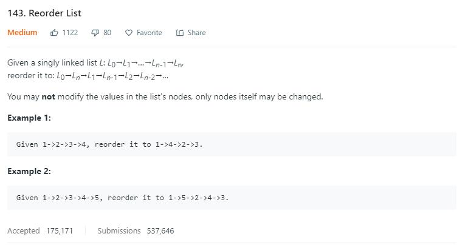

> 原文链接: https://leetcode-cn.com/problems/reorder-list


## 英文原文
<div><p>You are given the head of a singly linked-list. The list can be represented as:</p>

<pre>
L<sub>0</sub> &rarr; L<sub>1</sub> &rarr; &hellip; &rarr; L<sub>n - 1</sub> &rarr; L<sub>n</sub>
</pre>

<p><em>Reorder the list to be on the following form:</em></p>

<pre>
L<sub>0</sub> &rarr; L<sub>n</sub> &rarr; L<sub>1</sub> &rarr; L<sub>n - 1</sub> &rarr; L<sub>2</sub> &rarr; L<sub>n - 2</sub> &rarr; &hellip;
</pre>

<p>You may not modify the values in the list&#39;s nodes. Only nodes themselves may be changed.</p>

<p>&nbsp;</p>
<p><strong>Example 1:</strong></p>

<pre>
<strong>Input:</strong> head = [1,2,3,4]
<strong>Output:</strong> [1,4,2,3]
</pre>

<p><strong>Example 2:</strong></p>

<pre>
<strong>Input:</strong> head = [1,2,3,4,5]
<strong>Output:</strong> [1,5,2,4,3]
</pre>

<p>&nbsp;</p>
<p><strong>Constraints:</strong></p>

<ul>
	<li>The number of nodes in the list is in the range <code>[1, 5 * 10<sup>4</sup>]</code>.</li>
	<li><code>1 &lt;= Node.val &lt;= 1000</code></li>
</ul>
</div>

## 中文题目
<div><p>给定一个单链表 <code>L</code><em> </em>的头节点 <code>head</code> ，单链表 <code>L</code> 表示为：</p>

<pre>
L<sub>0</sub> → L<sub>1</sub> → … → L<sub>n - 1</sub> → L<sub>n</sub>
</pre>

<p>请将其重新排列后变为：</p>

<pre>
L<sub>0</sub> → L<sub>n</sub> → L<sub>1</sub> → L<sub>n - 1</sub> → L<sub>2</sub> → L<sub>n - 2</sub> → …</pre>

<p>不能只是单纯的改变节点内部的值，而是需要实际的进行节点交换。</p>

<p>&nbsp;</p>

<p><strong>示例 1：</strong></p>

<p></p>

<pre>
<strong>输入：</strong>head = [1,2,3,4]
<strong>输出：</strong>[1,4,2,3]</pre>

<p><strong>示例 2：</strong></p>

<p></p>

<pre>
<strong>输入：</strong>head = [1,2,3,4,5]
<strong>输出：</strong>[1,5,2,4,3]</pre>

<p>&nbsp;</p>

<p><strong>提示：</strong></p>

<ul>
	<li>链表的长度范围为 <code>[1, 5 * 10<sup>4</sup>]</code></li>
	<li><code>1 &lt;= node.val &lt;= 1000</code></li>
</ul>
</div>

## 通过代码
<RecoDemo>
</RecoDemo>


## 高赞题解
# 题目描述（中等难度）



给一个链表，然后依次头尾头尾头尾取元素，组成新的链表。

# 解法一 存储

链表的缺点就是不能随机存储，当我们想取末尾元素的时候，只能从头遍历一遍，很耗费时间。第二次取末尾元素的时候，又得遍历一遍。

所以先来个简单粗暴的想法，把链表存储到线性表中，然后用双指针依次从头尾取元素即可。

```java
public void reorderList(ListNode head) {
    if (head == null) {
        return;
    }
    //存到 list 中去
    List<ListNode> list = new ArrayList<>();
    while (head != null) {
        list.add(head);
        head = head.next;
    }
    //头尾指针依次取元素
    int i = 0, j = list.size() - 1;
    while (i < j) {
        list.get(i).next = list.get(j);
        i++;
        //偶数个节点的情况，会提前相遇
        if (i == j) {
            break;
        }
        list.get(j).next = list.get(i);
        j--;
    }
    list.get(i).next = null;
}
```

# 解法二 递归

参考 [这里](https://leetcode.com/problems/reorder-list/discuss/45113/Share-a-consise-recursive-solution-in-C%2B%2B)。

解法一中也说到了，我们的问题就是取尾元素的时候，需要遍历一遍链表。

如果我们的递归函数能够返回当前头元素对应的尾元素，并且将头元素和尾元素之间的链表按要求完成，那就变得简单了。


如上图，我们只需要将 `head` 指向 `tail`，`tail` 指向处理完的链表头即可。


然后我们把之前的 `tail.next` 返回就是外层 `head`  对应的 `tail` 了。

递归出口的话，如果只有一个节点，那么我们只需要将 `head.next` 返回。

```java
if (len == 1) {
    ListNode outTail = head.next;
    head.next = null;
    return outTail;
}
```

如果是两个节点，我们需要将 `head.next.next` 返回。

```java
if (len == 2) {
    ListNode outTail = head.next.next;
    head.next.next = null;
    return outTail;
}
```

然后总体的代码就是下边的样子

```java
public void reorderList(ListNode head) {

    if (head == null || head.next == null || head.next.next == null) {
        return;
    }
    int len = 0;
    ListNode h = head;
    //求出节点数
    while (h != null) {
        len++;
        h = h.next;
    }

    reorderListHelper(head, len);
}

private ListNode reorderListHelper(ListNode head, int len) {
    if (len == 1) {
        ListNode outTail = head.next;
        head.next = null;
        return outTail;
    }
    if (len == 2) {
        ListNode outTail = head.next.next;
        head.next.next = null;
        return outTail;
    }
    //得到对应的尾节点，并且将头结点和尾节点之间的链表通过递归处理
    ListNode tail = reorderListHelper(head.next, len - 2);
    ListNode subHead = head.next;//中间链表的头结点
    head.next = tail;
    ListNode outTail = tail.next;  //上一层 head 对应的 tail
    tail.next = subHead;
    return outTail;
}
```

# 解法三

参考 [这里](https://leetcode.com/problems/reorder-list/discuss/44992/Java-solution-with-3-steps)，主要是利用到一头一尾取元素的特性。

主要是三步，举个例子。

```java
1 -> 2 -> 3 -> 4 -> 5 -> 6
第一步，将链表平均分成两半
1 -> 2 -> 3
4 -> 5 -> 6
    
第二步，将第二个链表逆序
1 -> 2 -> 3
6 -> 5 -> 4
    
第三步，依次连接两个链表
1 -> 6 -> 2 -> 5 -> 3 -> 4
```

第一步找中点的话，可以应用 [19 题](https://leetcode.wang/leetCode-19-Remov-Nth-Node-From-End-of-List.html) 的方法，快慢指针。快指针一次走两步，慢指针一次走一步，当快指针走到终点的话，慢指针会刚好到中点。如果节点个数是偶数的话，`slow` 走到的是左端点，利用这一点，我们可以把奇数和偶数的情况合并，不需要分开考虑。

第二步链表逆序的话，在 [第 2 题](https://leetcode.wang/leetCode-2-Add-Two-Numbers.html) 讨论过了，有迭代和递归的两种方式，迭代的话主要利用两个指针，依次逆转。

第三步的话就很简单了，两个指针分别向后移动就可以。

```java
public void reorderList(ListNode head) {
    if (head == null || head.next == null || head.next.next == null) {
        return;
    }
    //找中点，链表分成两个
    ListNode slow = head;
    ListNode fast = head;
    while (fast.next != null && fast.next.next != null) {
        slow = slow.next;
        fast = fast.next.next;
    }

    ListNode newHead = slow.next;
    slow.next = null;
    
    //第二个链表倒置
    newHead = reverseList(newHead);
    
    //链表节点依次连接
    while (newHead != null) {
        ListNode temp = newHead.next;
        newHead.next = head.next;
        head.next = newHead;
        head = newHead.next;
        newHead = temp;
    }

}

private ListNode reverseList(ListNode head) {
    if (head == null) {
        return null;
    }
    ListNode tail = head;
    head = head.next;

    tail.next = null;

    while (head != null) {
        ListNode temp = head.next;
        head.next = tail;
        tail = head;
        head = temp;
    }

    return tail;
}
```

# 总

解法一利用空间去存储就很简单了，解法二递归的思想也很经典，自己也想了很久，看到作者的思路才恍然大悟，判断当前 `length` 定义递归出口很巧妙。解法三主要就是对题目的理解，关键就是利用一头一尾取元素的特性。


## 统计信息
| 通过次数 | 提交次数 | AC比率 |
| :------: | :------: | :------: |
|    138166    |    221411    |   62.4%   |

## 提交历史
| 提交时间 | 提交结果 | 执行时间 |  内存消耗  | 语言 |
| :------: | :------: | :------: | :--------: | :--------: |
