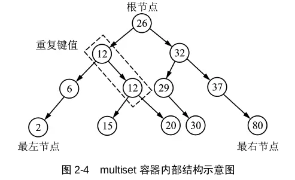

> 原文链接: https://leetcode-cn.com/problems/longest-continuous-subarray-with-absolute-diff-less-than-or-equal-to-limit


## 英文原文
<div><p>Given an array of integers <code>nums</code> and an integer <code>limit</code>, return the size of the longest <strong>non-empty</strong> subarray such that the absolute difference between any two elements of this subarray is less than or equal to <code>limit</code><em>.</em></p>

<p>&nbsp;</p>
<p><strong>Example 1:</strong></p>

<pre>
<strong>Input:</strong> nums = [8,2,4,7], limit = 4
<strong>Output:</strong> 2 
<strong>Explanation:</strong> All subarrays are: 
[8] with maximum absolute diff |8-8| = 0 &lt;= 4.
[8,2] with maximum absolute diff |8-2| = 6 &gt; 4. 
[8,2,4] with maximum absolute diff |8-2| = 6 &gt; 4.
[8,2,4,7] with maximum absolute diff |8-2| = 6 &gt; 4.
[2] with maximum absolute diff |2-2| = 0 &lt;= 4.
[2,4] with maximum absolute diff |2-4| = 2 &lt;= 4.
[2,4,7] with maximum absolute diff |2-7| = 5 &gt; 4.
[4] with maximum absolute diff |4-4| = 0 &lt;= 4.
[4,7] with maximum absolute diff |4-7| = 3 &lt;= 4.
[7] with maximum absolute diff |7-7| = 0 &lt;= 4. 
Therefore, the size of the longest subarray is 2.
</pre>

<p><strong>Example 2:</strong></p>

<pre>
<strong>Input:</strong> nums = [10,1,2,4,7,2], limit = 5
<strong>Output:</strong> 4 
<strong>Explanation:</strong> The subarray [2,4,7,2] is the longest since the maximum absolute diff is |2-7| = 5 &lt;= 5.
</pre>

<p><strong>Example 3:</strong></p>

<pre>
<strong>Input:</strong> nums = [4,2,2,2,4,4,2,2], limit = 0
<strong>Output:</strong> 3
</pre>

<p>&nbsp;</p>
<p><strong>Constraints:</strong></p>

<ul>
	<li><code>1 &lt;= nums.length &lt;= 10<sup>5</sup></code></li>
	<li><code>1 &lt;= nums[i] &lt;= 10<sup>9</sup></code></li>
	<li><code>0 &lt;= limit &lt;= 10<sup>9</sup></code></li>
</ul>
</div>

## 中文题目
<div><p>给你一个整数数组 <code>nums</code> ，和一个表示限制的整数 <code>limit</code>，请你返回最长连续子数组的长度，该子数组中的任意两个元素之间的绝对差必须小于或者等于 <code>limit</code><em> 。</em></p>

<p>如果不存在满足条件的子数组，则返回 <code>0</code> 。</p>

<p>&nbsp;</p>

<p><strong>示例 1：</strong></p>

<pre><strong>输入：</strong>nums = [8,2,4,7], limit = 4
<strong>输出：</strong>2 
<strong>解释：</strong>所有子数组如下：
[8] 最大绝对差 |8-8| = 0 &lt;= 4.
[8,2] 最大绝对差 |8-2| = 6 &gt; 4. 
[8,2,4] 最大绝对差 |8-2| = 6 &gt; 4.
[8,2,4,7] 最大绝对差 |8-2| = 6 &gt; 4.
[2] 最大绝对差 |2-2| = 0 &lt;= 4.
[2,4] 最大绝对差 |2-4| = 2 &lt;= 4.
[2,4,7] 最大绝对差 |2-7| = 5 &gt; 4.
[4] 最大绝对差 |4-4| = 0 &lt;= 4.
[4,7] 最大绝对差 |4-7| = 3 &lt;= 4.
[7] 最大绝对差 |7-7| = 0 &lt;= 4. 
因此，满足题意的最长子数组的长度为 2 。
</pre>

<p><strong>示例 2：</strong></p>

<pre><strong>输入：</strong>nums = [10,1,2,4,7,2], limit = 5
<strong>输出：</strong>4 
<strong>解释：</strong>满足题意的最长子数组是 [2,4,7,2]，其最大绝对差 |2-7| = 5 &lt;= 5 。
</pre>

<p><strong>示例 3：</strong></p>

<pre><strong>输入：</strong>nums = [4,2,2,2,4,4,2,2], limit = 0
<strong>输出：</strong>3
</pre>

<p>&nbsp;</p>

<p><strong>提示：</strong></p>

<ul>
	<li><code>1 &lt;= nums.length &lt;= 10^5</code></li>
	<li><code>1 &lt;= nums[i] &lt;= 10^9</code></li>
	<li><code>0 &lt;= limit &lt;= 10^9</code></li>
</ul>
</div>

## 通过代码
<RecoDemo>
</RecoDemo>


## 高赞题解

各位题友大家好！ 今天是 **[@负雪明烛](/u/fuxuemingzhu/)** 坚持日更的第 **28** 天。今天力扣上的每日一题是「[1438. 绝对差不超过限制的最长连续子数组](https://leetcode-cn.com/problems/longest-continuous-subarray-with-absolute-diff-less-than-or-equal-to-limit/)」。

# 解题思路


- **题意**：求一个最长的子数组，该子数组内的最大值和最小值的差不超过 $limit$。


本题是求最大连续子区间，可以使用**滑动窗口**方法。滑动窗口的限制条件是：窗口内最大值和最小值的差不超过 $limit$。

可以使用我多次分享的滑动窗口模板解决，模板请见[分享滑动窗口模板，秒杀滑动窗口问题](https://leetcode-cn.com/problems/max-consecutive-ones-iii/solution/fen-xiang-hua-dong-chuang-kou-mo-ban-mia-f76z/)。


本题最大的难点在于**快速地求滑动窗口内的最大值和最小值**，类似题目如 [480. 滑动窗口中位数](https://leetcode-cn.com/problems/sliding-window-median/solution/xuan-ze-he-gua-de-shu-ju-jie-gou-zhe-ti-muyt4/)。


如果遍历求滑动窗口内的最大值和最小值，时间复杂度是 $O(k)$，肯定会超时。降低时间复杂度的一个绝招就是增加空间复杂度：**利用更好的数据结构**。是的，我们的目的是快速让一组数据有序，那就寻找一个**内部是有序的数据结构**呗！下面我分语言讲解一下常见的内部有序的数据结构。


- 在 **C++** 中 set/multiset/map 内部元素是有序的，它们都基于红黑树实现。其中 set 会对元素去重，而 multiset 可以有重复元素，map 是 key 有序的哈希表。
- 在 **Java** 中 TreeSet 是有序的去重集合，TreeMap 是 key 有序的哈希表，它们也是基于红黑树实现的。
- 在 **Python** 中 sortedcontainers  实现了有序的容器。


下面这个图是 C++ 的 multiset 内部结构示意图（Java 的 TreeSet 也类似，但没有重复元素），它是个**平衡二叉搜索树(BST)**，插入元素时会自动调整二叉树，使得每个子树根节点的键值大于左子树所有节点的键值，同时保证根节点左右子树的高度相等。这样二叉树高度最小，检索速度最快。它的中序遍历是有序的，另外它也允许出现重复的值。





本题要点：

- 本题需要保存滑动窗口内的所有元素（可能含有重复元素），可以使用的 C++ 的 multiset/map 与 Java 中的 TreeMap。
- 当频繁的插入和删除元素时，multiset/map 和 TreeMap 等有序的数据结构能够在在 $O(log(k))$  的时间复杂度内调整 BST，从而维护结构的有序性。
- multiset 和 TreeMap 都提供了获取第一个元素和最后一个元素的函数，也就能在 $O(1)$ 的时间内获取滑动窗口内最小值和最大值。


# 代码


有了非常高效的数据结构，做这个题已经不难了。我下面的代码演示了用 C++ 的 multiset/map 和 Java 的 TreeMap 解决本题。

- 使用 $left$ 和 $right$ 两个指针，分别指向滑动窗口的左右边界；定义 multiset 保存滑动窗口的所有元素；
- $right$ **主动**右移：$right$ 指针每次移动一步，把 $A[right]$ 放入滑动窗口；
- $left$ **被动**右移：判断此时窗口内最大值和最小值的差，如果大于 $limit$，则 $left$ 指针被迫右移，直至窗口内最大值和最小值的差小于等于 $limit$ 为止；$left$ 每次右移之前，需要把 $A[left]$ 从 multiset 中减去一次。
- 滑动窗口长度的最大值就是所求。


C++ 代码使用 multiset，Python 使用 SortedList 的代码如下。

```C++ []
class Solution {
public:
    int longestSubarray(vector<int>& nums, int limit) {
        multiset<int> st;
        int left = 0, right = 0;
        int res = 0;
        while (right < nums.size()) {
            st.insert(nums[right]);
            while (*st.rbegin() - *st.begin() > limit) {
                st.erase(st.find(nums[left]));
                left ++;
            }
            res = max(res, right - left + 1);
            right ++;
        }
        return res;
    }
};
```

```Python []
class Solution:
    def longestSubarray(self, nums: List[int], limit: int) -> int:
        from sortedcontainers import SortedList
        s = SortedList()
        left, right = 0, 0
        res = 0
        while right < len(nums):
            s.add(nums[right])
            while s[-1] - s[0] > limit:
                s.remove(nums[left])
                left += 1
            res = max(res, right - left + 1)
            right += 1
        return res
```

类似的，使用 C++ 的 map 以及 Java 的 TreeMap 保存滑动窗口元素出现次数，代码如下：


```C++ []
class Solution {
public:
    int longestSubarray(vector<int>& nums, int limit) {
        map<int, int> m;
        int left = 0, right = 0;
        int res = 0;
        while (right < nums.size()) {
            m[nums[right]] ++;
            while (m.rbegin()->first - m.begin()->first > limit) {
                m[nums[left]] --;
                if (m[nums[left]] == 0)
                    m.erase(nums[left]);
                left ++;
            }
            res = max(res, right - left + 1);
            right ++;
        }
        return res;
    }
};
```
```Java []
class Solution {
    public int longestSubarray(int[] nums, int limit) {
        TreeMap<Integer, Integer> m = new TreeMap<>();
        int left = 0, right = 0;
        int res = 0;
        while (right < nums.length) {
            m.put(nums[right], m.getOrDefault(nums[right], 0) + 1);
            while (m.lastKey() - m.firstKey() > limit) {
                m.put(nums[left], m.get(nums[left]) - 1);
                if (m.get(nums[left]) == 0) {
                    m.remove(nums[left]);
                }
                left ++;
            }
            res = Math.max(res, right - left + 1);
            right ++;
        }
        return res;
    }
}
```


- 时间复杂度：$O(N*log(N))$，每个元素遍历一次，新元素插入红黑树的调整时间为 $O(log(N))$；
- 空间复杂度：$O(N)$。

# 刷题心得


本题的重点在于快速求滑动窗口内的最大值和最小值。常见的方法有：


- 使用 multiset、TreeMap等数据结构；
- 单调递增队列或者单调递减队列；


-----

参考资料：
- [力扣官方题解](https://leetcode-cn.com/problems/longest-continuous-subarray-with-absolute-diff-less-than-or-equal-to-limit/solution/jue-dui-chai-bu-chao-guo-xian-zhi-de-zui-5bki/)
- [滑动窗口 + map / multiset](https://leetcode-cn.com/problems/longest-continuous-subarray-with-absolute-diff-less-than-or-equal-to-limit/solution/longest-continuous-subarray-by-ikaruga/)


OK，以上就是 [@负雪明烛](https://leetcode-cn.com/u/fuxuemingzhu/) 写的今天题解的全部内容了，如果你觉得有帮助的话，**求赞、求关注、求收藏**。如果有疑问的话，请在下面评论，我会及时解答。


**关注我**，你将不会错过我的精彩动画题解、面试题分享、组队刷题活动，进入主页 [@负雪明烛](https://leetcode-cn.com/u/fuxuemingzhu/) 右侧有刷题组织，从此刷题不再孤单。


祝大家牛年大吉！AC 多多，Offer 多多！我们明天再见！

## 统计信息
| 通过次数 | 提交次数 | AC比率 |
| :------: | :------: | :------: |
|    33843    |    70181    |   48.2%   |

## 提交历史
| 提交时间 | 提交结果 | 执行时间 |  内存消耗  | 语言 |
| :------: | :------: | :------: | :--------: | :--------: |
