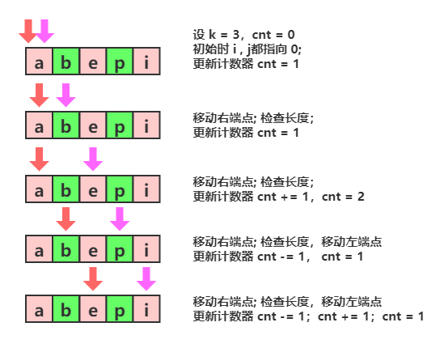

> 原文链接: https://leetcode-cn.com/problems/maximum-number-of-vowels-in-a-substring-of-given-length


## 英文原文
<div><p>Given a string <code>s</code> and an integer <code>k</code>.</p>

<p>Return <em>the maximum number of vowel letters</em> in any substring of <code>s</code>&nbsp;with&nbsp;length <code>k</code>.</p>

<p><strong>Vowel letters</strong> in&nbsp;English are&nbsp;(a, e, i, o, u).</p>

<p>&nbsp;</p>
<p><strong>Example 1:</strong></p>

<pre>
<strong>Input:</strong> s = &quot;abciiidef&quot;, k = 3
<strong>Output:</strong> 3
<strong>Explanation:</strong> The substring &quot;iii&quot; contains 3 vowel letters.
</pre>

<p><strong>Example 2:</strong></p>

<pre>
<strong>Input:</strong> s = &quot;aeiou&quot;, k = 2
<strong>Output:</strong> 2
<strong>Explanation:</strong> Any substring of length 2 contains 2 vowels.
</pre>

<p><strong>Example 3:</strong></p>

<pre>
<strong>Input:</strong> s = &quot;leetcode&quot;, k = 3
<strong>Output:</strong> 2
<strong>Explanation:</strong> &quot;lee&quot;, &quot;eet&quot; and &quot;ode&quot; contain 2 vowels.
</pre>

<p><strong>Example 4:</strong></p>

<pre>
<strong>Input:</strong> s = &quot;rhythms&quot;, k = 4
<strong>Output:</strong> 0
<strong>Explanation:</strong> We can see that s doesn&#39;t have any vowel letters.
</pre>

<p><strong>Example 5:</strong></p>

<pre>
<strong>Input:</strong> s = &quot;tryhard&quot;, k = 4
<strong>Output:</strong> 1
</pre>

<p>&nbsp;</p>
<p><strong>Constraints:</strong></p>

<ul>
	<li><code>1 &lt;= s.length &lt;= 10^5</code></li>
	<li><code>s</code>&nbsp;consists of lowercase English letters.</li>
	<li><code>1 &lt;= k &lt;= s.length</code></li>
</ul></div>

## 中文题目
<div><p>给你字符串 <code>s</code> 和整数 <code>k</code> 。</p>

<p>请返回字符串 <code>s</code> 中长度为 <code>k</code> 的单个子字符串中可能包含的最大元音字母数。</p>

<p>英文中的 <strong>元音字母 </strong>为（<code>a</code>, <code>e</code>, <code>i</code>, <code>o</code>, <code>u</code>）。</p>

<p>&nbsp;</p>

<p><strong>示例 1：</strong></p>

<pre><strong>输入：</strong>s = &quot;abciiidef&quot;, k = 3
<strong>输出：</strong>3
<strong>解释：</strong>子字符串 &quot;iii&quot; 包含 3 个元音字母。
</pre>

<p><strong>示例 2：</strong></p>

<pre><strong>输入：</strong>s = &quot;aeiou&quot;, k = 2
<strong>输出：</strong>2
<strong>解释：</strong>任意长度为 2 的子字符串都包含 2 个元音字母。
</pre>

<p><strong>示例 3：</strong></p>

<pre><strong>输入：</strong>s = &quot;leetcode&quot;, k = 3
<strong>输出：</strong>2
<strong>解释：</strong>&quot;lee&quot;、&quot;eet&quot; 和 &quot;ode&quot; 都包含 2 个元音字母。
</pre>

<p><strong>示例 4：</strong></p>

<pre><strong>输入：</strong>s = &quot;rhythms&quot;, k = 4
<strong>输出：</strong>0
<strong>解释：</strong>字符串 s 中不含任何元音字母。
</pre>

<p><strong>示例 5：</strong></p>

<pre><strong>输入：</strong>s = &quot;tryhard&quot;, k = 4
<strong>输出：</strong>1
</pre>

<p>&nbsp;</p>

<p><strong>提示：</strong></p>

<ul>
	<li><code>1 &lt;= s.length &lt;= 10^5</code></li>
	<li><code>s</code> 由小写英文字母组成</li>
	<li><code>1 &lt;= k &lt;= s.length</code></li>
</ul>
</div>

## 通过代码
<RecoDemo>
</RecoDemo>


## 高赞题解
* 知识点：滑动窗口
* 时间复杂度：O(n)；n 为 s.size()。

从 0 到 n-1 枚举 i 作为滑动窗口的右端点。初始时，滑动窗口的左端点 j 为 0，当窗口的大小，即 i-j+1 > k 时，向左移动左端点，即 ++j。
对于每个确定的窗口 [j, i]，需要维护元音的数量，当一次移动后，只需O(1)检查s[i+1]，s[j+1]就可以获得窗口[j+1, i+1] 中的元音数量。

```cpp
class Solution {
public:
    int check(char c) {
        if(c == 'a' || c == 'e' || c == 'i' || c == 'o' || c == 'u') {
            return 1;
        }
        return 0;
    } 
    int maxVowels(string s, int k) {
        int cnt = 0, anw = 0;
        //移动右端点 i
        for(int i = 0; i < s.size(); i++) {
            cnt += check(s[i]);
            //窗口超过 k 了，
            if(i >= k) {
            //从窗口中移除s[j], j = i-k
                cnt -= check(s[i-k]);
            }
            // 更新下最大值
            anw = max(anw, cnt);
        }
        return anw;
    }
};
```
# 如果感觉有点意思，可以关注👏[HelloNebula](../images/maximum-number-of-vowels-in-a-substring-of-given-length-1.jpg)👏
* **分享周赛题解**
* **分享计算机专业课知识**
* **分享C++相关岗位面试题**
* **分享专业书籍PDF**

## 统计信息
| 通过次数 | 提交次数 | AC比率 |
| :------: | :------: | :------: |
|    14700    |    28019    |   52.5%   |

## 提交历史
| 提交时间 | 提交结果 | 执行时间 |  内存消耗  | 语言 |
| :------: | :------: | :------: | :--------: | :--------: |
