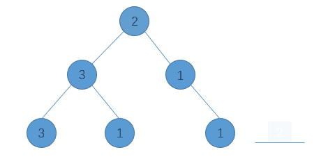

> 原文链接: https://leetcode-cn.com/problems/pseudo-palindromic-paths-in-a-binary-tree


## 英文原文
<div><p>Given a binary tree where node values are digits from 1 to 9. A path in the binary tree is said to be <strong>pseudo-palindromic</strong> if at least one permutation of the node values in the path is a palindrome.</p>

<p><em>Return the number of <strong>pseudo-palindromic</strong> paths going from the root node to leaf nodes.</em></p>

<p>&nbsp;</p>
<p><strong>Example 1:</strong></p>

<p></p>

<pre>
<strong>Input:</strong> root = [2,3,1,3,1,null,1]
<strong>Output:</strong> 2 
<strong>Explanation:</strong> The figure above represents the given binary tree. There are three paths going from the root node to leaf nodes: the red path [2,3,3], the green path [2,1,1], and the path [2,3,1]. Among these paths only red path and green path are pseudo-palindromic paths since the red path [2,3,3] can be rearranged in [3,2,3] (palindrome) and the green path [2,1,1] can be rearranged in [1,2,1] (palindrome).
</pre>

<p><strong>Example 2:</strong></p>

<p><strong></strong></p>

<pre>
<strong>Input:</strong> root = [2,1,1,1,3,null,null,null,null,null,1]
<strong>Output:</strong> 1 
<strong>Explanation:</strong> The figure above represents the given binary tree. There are three paths going from the root node to leaf nodes: the green path [2,1,1], the path [2,1,3,1], and the path [2,1]. Among these paths only the green path is pseudo-palindromic since [2,1,1] can be rearranged in [1,2,1] (palindrome).
</pre>

<p><strong>Example 3:</strong></p>

<pre>
<strong>Input:</strong> root = [9]
<strong>Output:</strong> 1
</pre>

<p>&nbsp;</p>
<p><strong>Constraints:</strong></p>

<ul>
	<li>The number of nodes in the tree is in the range <code>[1, 10<sup>5</sup>]</code>.</li>
	<li><code>1 &lt;= Node.val &lt;= 9</code></li>
</ul>
</div>

## 中文题目
<div><p>给你一棵二叉树，每个节点的值为 1 到 9 。我们称二叉树中的一条路径是 「<strong>伪回文</strong>」的，当它满足：路径经过的所有节点值的排列中，存在一个回文序列。</p>

<p>请你返回从根到叶子节点的所有路径中&nbsp;<strong>伪回文&nbsp;</strong>路径的数目。</p>

<p>&nbsp;</p>

<p><strong>示例 1：</strong></p>

<p></p>

<pre><strong>输入：</strong>root = [2,3,1,3,1,null,1]
<strong>输出：</strong>2 
<strong>解释：</strong>上图为给定的二叉树。总共有 3 条从根到叶子的路径：红色路径 [2,3,3] ，绿色路径 [2,1,1] 和路径 [2,3,1] 。
     在这些路径中，只有红色和绿色的路径是伪回文路径，因为红色路径 [2,3,3] 存在回文排列 [3,2,3] ，绿色路径 [2,1,1] 存在回文排列 [1,2,1] 。
</pre>

<p><strong>示例 2：</strong></p>

<p><strong></strong></p>

<pre><strong>输入：</strong>root = [2,1,1,1,3,null,null,null,null,null,1]
<strong>输出：</strong>1 
<strong>解释：</strong>上图为给定二叉树。总共有 3 条从根到叶子的路径：绿色路径 [2,1,1] ，路径 [2,1,3,1] 和路径 [2,1] 。
     这些路径中只有绿色路径是伪回文路径，因为 [2,1,1] 存在回文排列 [1,2,1] 。
</pre>

<p><strong>示例 3：</strong></p>

<pre><strong>输入：</strong>root = [9]
<strong>输出：</strong>1
</pre>

<p>&nbsp;</p>

<p><strong>提示：</strong></p>

<ul>
	<li>给定二叉树的节点数目在&nbsp;<code>1</code>&nbsp;到&nbsp;<code>10^5</code>&nbsp;之间。</li>
	<li>节点值在&nbsp;<code>1</code> 到&nbsp;<code>9</code>&nbsp;之间。</li>
</ul>
</div>

## 通过代码
<RecoDemo>
</RecoDemo>


## 高赞题解
* 知识点：深度优先遍历
* 时间复杂度：O(n)；n 为树中结点数量。

如果集合中所有元素的某种排列是回文串，那么集合中**最多有一种元素出现了奇数次**。
那么题目就变成了统计所有根节点到叶子结点的路径中，符合上述特点的路径数量。
可以使用DFS完成上述统计，在DFS过程中使用一个计数器统计根节点到当前栈顶结点的路径中每个元素的出现次数：
* 当一个新节点放到栈顶时，更新计数器。
* 当一个结点从栈中弹出时，更新计数器。
* 特别的，当新节点为叶子节点时，检查计数器并更新答案。

计数器可以用 std::map, std::unordered_map 实现。鉴于元素取值范围为 [0,9]，也可以直接使用数组实现。

```cpp
/**
 * Definition for a binary tree node.
 * struct TreeNode {
 *     int val;
 *     TreeNode *left;
 *     TreeNode *right;
 *     TreeNode() : val(0), left(nullptr), right(nullptr) {}
 *     TreeNode(int x) : val(x), left(nullptr), right(nullptr) {}
 *     TreeNode(int x, TreeNode *left, TreeNode *right) : val(x), left(left), right(right) {}
 * };
 */
class Solution {
public:
    int check(int *cnt) {
        int odd = 0;
        for(int i = 0; i <= 9; i++) {
            if(cnt[i]&1) {
                odd++;
            }
        }
        if(odd <= 1) {
            return 1;
        }
        return 0;
    }
    int dfs(TreeNode *root, int *cnt) {
        if(root == nullptr) {
            return 0;
        }
        cnt[root->val] ++;
        if(root->left == nullptr && root->right == nullptr) {
            int anw = check(cnt);
            cnt[root->val]--;
            return anw;
        }
        int anw = 0;
        if(root->left != nullptr) {
            anw += dfs(root->left, cnt);
        }
        if(root->right != nullptr) {
            anw += dfs(root->right, cnt);
        }
        cnt[root->val] --;
        return anw;
    }
    int pseudoPalindromicPaths (TreeNode* root) {
        int cnt[10] = {0};
        return dfs(root, cnt);
    }
};
```
# 如果感觉有点意思，可以关注👏[HelloNebula](../images/pseudo-palindromic-paths-in-a-binary-tree-1.jpg)👏
* **分享周赛题解**
* **分享计算机专业课知识**
* **分享C++相关岗位面试题**
* **分享专业书籍PDF**

## 统计信息
| 通过次数 | 提交次数 | AC比率 |
| :------: | :------: | :------: |
|    8264    |    13121    |   63.0%   |

## 提交历史
| 提交时间 | 提交结果 | 执行时间 |  内存消耗  | 语言 |
| :------: | :------: | :------: | :--------: | :--------: |
