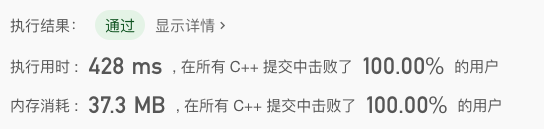
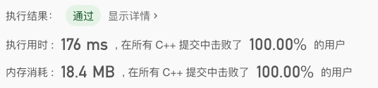

> 原文链接: https://leetcode-cn.com/problems/check-if-a-string-contains-all-binary-codes-of-size-k


## 英文原文
<div><p>Given a binary string <code>s</code> and an integer <code>k</code>.</p>

<p>Return <code>true</code> <em>if every binary code of length</em> <code>k</code> <em>is a substring of</em> <code>s</code>. Otherwise, return <code>false</code>.</p>

<p>&nbsp;</p>
<p><strong>Example 1:</strong></p>

<pre>
<strong>Input:</strong> s = &quot;00110110&quot;, k = 2
<strong>Output:</strong> true
<strong>Explanation:</strong> The binary codes of length 2 are &quot;00&quot;, &quot;01&quot;, &quot;10&quot; and &quot;11&quot;. They can be all found as substrings at indicies 0, 1, 3 and 2 respectively.
</pre>

<p><strong>Example 2:</strong></p>

<pre>
<strong>Input:</strong> s = &quot;00110&quot;, k = 2
<strong>Output:</strong> true
</pre>

<p><strong>Example 3:</strong></p>

<pre>
<strong>Input:</strong> s = &quot;0110&quot;, k = 1
<strong>Output:</strong> true
<strong>Explanation:</strong> The binary codes of length 1 are &quot;0&quot; and &quot;1&quot;, it is clear that both exist as a substring. 
</pre>

<p><strong>Example 4:</strong></p>

<pre>
<strong>Input:</strong> s = &quot;0110&quot;, k = 2
<strong>Output:</strong> false
<strong>Explanation:</strong> The binary code &quot;00&quot; is of length 2 and doesn&#39;t exist in the array.
</pre>

<p><strong>Example 5:</strong></p>

<pre>
<strong>Input:</strong> s = &quot;0000000001011100&quot;, k = 4
<strong>Output:</strong> false
</pre>

<p>&nbsp;</p>
<p><strong>Constraints:</strong></p>

<ul>
	<li><code>1 &lt;= s.length &lt;= 5 * 10<sup>5</sup></code></li>
	<li><code>s[i]</code> is either <code>&#39;0&#39;</code> or <code>&#39;1&#39;</code>.</li>
	<li><code>1 &lt;= k &lt;= 20</code></li>
</ul>
</div>

## 中文题目
<div><p>给你一个二进制字符串 <code>s</code> 和一个整数 <code>k</code> 。</p>

<p>如果所有长度为 <code>k</code> 的二进制字符串都是 <code>s</code> 的子串，请返回 <code>true</code> ，否则请返回 <code>false</code> 。</p>

<p> </p>

<p><strong>示例 1：</strong></p>

<pre>
<strong>输入：</strong>s = "00110110", k = 2
<strong>输出：</strong>true
<strong>解释：</strong>长度为 2 的二进制串包括 "00"，"01"，"10" 和 "11"。它们分别是 s 中下标为 0，1，3，2 开始的长度为 2 的子串。
</pre>

<p><strong>示例 2：</strong></p>

<pre>
<strong>输入：</strong>s = "00110", k = 2
<strong>输出：</strong>true
</pre>

<p><strong>示例 3：</strong></p>

<pre>
<strong>输入：</strong>s = "0110", k = 1
<strong>输出：</strong>true
<strong>解释：</strong>长度为 1 的二进制串包括 "0" 和 "1"，显然它们都是 s 的子串。
</pre>

<p><strong>示例 4：</strong></p>

<pre>
<strong>输入：</strong>s = "0110", k = 2
<strong>输出：</strong>false
<strong>解释：</strong>长度为 2 的二进制串 "00" 没有出现在 s 中。
</pre>

<p><strong>示例 5：</strong></p>

<pre>
<strong>输入：</strong>s = "0000000001011100", k = 4
<strong>输出：</strong>false
</pre>

<p> </p>

<p><strong>提示：</strong></p>

<ul>
	<li><code>1 <= s.length <= 5 * 10<sup>5</sup></code></li>
	<li><code>s[i]</code> 不是<code>'0'</code> 就是 <code>'1'</code></li>
	<li><code>1 <= k <= 20</code></li>
</ul>
</div>

## 通过代码
<RecoDemo>
</RecoDemo>


## 高赞题解
大多数题解，都是在哈希表中存储字符串。类似如下的代码：

```
class Solution {
public:
    bool hasAllCodes(string s, int k) {

        unordered_set<string> set;
        for(int i = 0; i + k <= s.size(); i ++) set.insert(s.substr(i, k));
        return set.size() == (1 << k);
    }
};
```

但其实，这样做，因为哈希表中存的是长度为 k 的子串。每次计算子串的哈希值，是需要 O(k) 的时间的。所以这个算法真正的复杂度是 O(|s| * k)

我提交的数据是这样的：


---

这个问题可以优化，我们可以使用滑动窗口的思想，每次把长度为 k 的子串所对应的整数计算出来。之后，每次窗口向前移动，子串最高位丢掉一个字符；最低位添加一个字符，使用 O(1) 的时间即可计算出新的数字。同时，哈希表中存储的是整型，复杂度才是真正的 O(1)。整体算法复杂度是 O(|s|)的。

```
class Solution {
public:
    bool hasAllCodes(string s, int k) {

        if(k > s.size()) return 0;

        int cur = 0;
        for(int i = 0; i < k - 1; i ++)
            cur = 2 * cur + (s[i] == '1');

        unordered_set<int> set;
        for(int i = k - 1; i < s.size(); i ++){
            cur = cur * 2 + (s[i] == '1');
            set.insert(cur);
            cur &= ~(1 << (k - 1));
        }
        return set.size() == (1 << k);
    }
};
```

上面的代码在 leetcode 上测试，时间快一倍，空间消耗也更少。




---

最后，如果使用整型，我们就可以不再使用哈希表了，直接把数组当哈希表用，索引即是 key。这样，性能又能提升一倍。

```
class Solution {
public:
    bool hasAllCodes(string s, int k) {

        if(k > s.size()) return 0;

        int cur = 0;
        for(int i = 0; i < k - 1; i ++)
            cur = 2 * cur + (s[i] == '1');

        vector<bool> used(1 << k, false);
        for(int i = k - 1; i < s.size(); i ++){
            cur = cur * 2 + (s[i] == '1');
            used[cur] = true;
            cur &= ~(1 << (k - 1));
        }
        
        for(int e: used) if(!e) return false;
        return true;
    }
};
```



---

觉得有帮助请点赞哇！


## 统计信息
| 通过次数 | 提交次数 | AC比率 |
| :------: | :------: | :------: |
|    6180    |    12227    |   50.5%   |

## 提交历史
| 提交时间 | 提交结果 | 执行时间 |  内存消耗  | 语言 |
| :------: | :------: | :------: | :--------: | :--------: |
