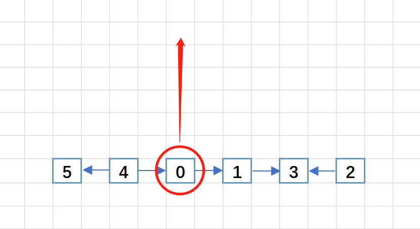
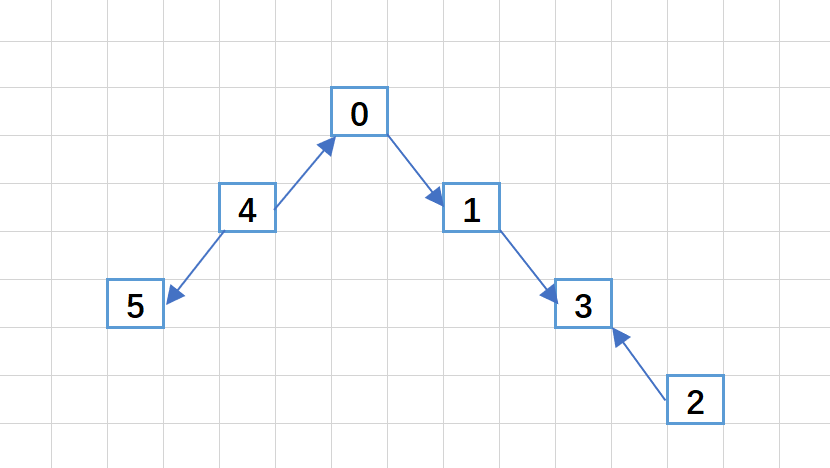
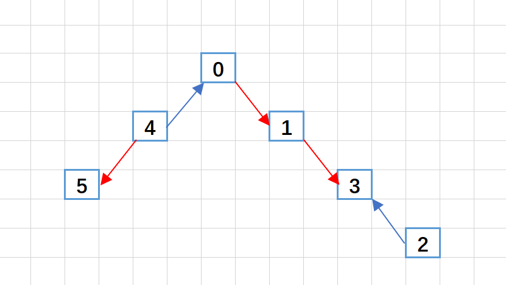

> 原文链接: https://leetcode-cn.com/problems/reorder-routes-to-make-all-paths-lead-to-the-city-zero


## 英文原文
<div><p>There are <code>n</code> cities numbered from <code>0</code> to <code>n - 1</code> and <code>n - 1</code> roads such that there is only one way to travel between two different cities (this network form a tree). Last year, The ministry of transport decided to orient the roads in one direction because they are too narrow.</p>

<p>Roads are represented by <code>connections</code> where <code>connections[i] = [a<sub>i</sub>, b<sub>i</sub>]</code> represents a road from city <code>a<sub>i</sub></code> to city <code>b<sub>i</sub></code>.</p>

<p>This year, there will be a big event in the capital (city <code>0</code>), and many people want to travel to this city.</p>

<p>Your task consists of reorienting some roads such that each city can visit the city <code>0</code>. Return the <strong>minimum</strong> number of edges changed.</p>

<p>It&#39;s <strong>guaranteed</strong> that each city can reach city <code>0</code> after reorder.</p>

<p>&nbsp;</p>
<p><strong>Example 1:</strong></p>

<pre>
<strong>Input:</strong> n = 6, connections = [[0,1],[1,3],[2,3],[4,0],[4,5]]
<strong>Output:</strong> 3
<strong>Explanation: </strong>Change the direction of edges show in red such that each node can reach the node 0 (capital).
</pre>

<p><strong>Example 2:</strong></p>

<pre>
<strong>Input:</strong> n = 5, connections = [[1,0],[1,2],[3,2],[3,4]]
<strong>Output:</strong> 2
<strong>Explanation: </strong>Change the direction of edges show in red such that each node can reach the node 0 (capital).
</pre>

<p><strong>Example 3:</strong></p>

<pre>
<strong>Input:</strong> n = 3, connections = [[1,0],[2,0]]
<strong>Output:</strong> 0
</pre>

<p>&nbsp;</p>
<p><strong>Constraints:</strong></p>

<ul>
	<li><code>2 &lt;= n &lt;= 5 * 10<sup>4</sup></code></li>
	<li><code>connections.length == n - 1</code></li>
	<li><code>connections[i].length == 2</code></li>
	<li><code>0 &lt;= a<sub>i</sub>, b<sub>i</sub> &lt;= n - 1</code></li>
	<li><code>a<sub>i</sub> != b<sub>i</sub></code></li>
</ul>
</div>

## 中文题目
<div><p><code>n</code> 座城市，从 <code>0</code> 到 <code>n-1</code> 编号，其间共有 <code>n-1</code> 条路线。因此，要想在两座不同城市之间旅行只有唯一一条路线可供选择（路线网形成一颗树）。去年，交通运输部决定重新规划路线，以改变交通拥堵的状况。</p>

<p>路线用 <code>connections</code> 表示，其中 <code>connections[i] = [a, b]</code> 表示从城市 <code>a</code> 到 <code>b</code> 的一条有向路线。</p>

<p>今年，城市 0 将会举办一场大型比赛，很多游客都想前往城市 0 。</p>

<p>请你帮助重新规划路线方向，使每个城市都可以访问城市 0 。返回需要变更方向的最小路线数。</p>

<p>题目数据 <strong>保证</strong> 每个城市在重新规划路线方向后都能到达城市 0 。</p>

<p>&nbsp;</p>

<p><strong>示例 1：</strong></p>

<p><strong></strong></p>

<pre><strong>输入：</strong>n = 6, connections = [[0,1],[1,3],[2,3],[4,0],[4,5]]
<strong>输出：</strong>3
<strong>解释：</strong>更改以红色显示的路线的方向，使每个城市都可以到达城市 0 。</pre>

<p><strong>示例 2：</strong></p>

<p><strong></strong></p>

<pre><strong>输入：</strong>n = 5, connections = [[1,0],[1,2],[3,2],[3,4]]
<strong>输出：</strong>2
<strong>解释：</strong>更改以红色显示的路线的方向，使每个城市都可以到达城市 0 。</pre>

<p><strong>示例 3：</strong></p>

<pre><strong>输入：</strong>n = 3, connections = [[1,0],[2,0]]
<strong>输出：</strong>0
</pre>

<p>&nbsp;</p>

<p><strong>提示：</strong></p>

<ul>
	<li><code>2 &lt;= n &lt;= 5 * 10^4</code></li>
	<li><code>connections.length == n-1</code></li>
	<li><code>connections[i].length == 2</code></li>
	<li><code>0 &lt;= connections[i][0], connections[i][1] &lt;= n-1</code></li>
	<li><code>connections[i][0] != connections[i][1]</code></li>
</ul>
</div>

## 通过代码
<RecoDemo>
</RecoDemo>


## 高赞题解
### 思路
1. n 个城市，n-1 条路，路线网形成一颗树
2. 都要去往城市 0
3. 路线不能改，只能改方向
4. 实际上就是以 0 为根节点的树，往下联通时，捋一遍方向
5. 操作
    1. 将路线的数据整理至 `vector<vector<int>> conn_idx`
    2. 使用 `vector<bool> vi` 标记路线是否被访问过
    3. 将城市丢到 `queue<int> que` 里 bfs
    4. 找出方向错的路线，加入答案

### 图解
```
输入：n = 6, connections = [[0,1],[1,3],[2,3],[4,0],[4,5]]
输出：3
```


以 0 为根节点


提起来变成一棵树（本来就是一棵树）


将方向错了的边更改过来（计数）

### 答题
```C++ []
    int minReorder(int n, vector<vector<int>>& connections) {
        vector<vector<int>> conn_idx(n, vector<int>());
        for (int i = 0; i < connections.size(); i++) {
            conn_idx[connections[i][0]].push_back(i);
            conn_idx[connections[i][1]].push_back(i);
        }

        vector<bool> vi(connections.size(), false);
        int ans = 0;
        queue<int> que;
        que.push(0);

        while (!que.empty()) {
            auto q = que.front();
            que.pop();

            for (auto idx : conn_idx[q]) {
                if (vi[idx]) continue;
                vi[idx] = true;

                int a = connections[idx][0];
                int b = connections[idx][1];
                ans += (a == q);
                a = (a == q) ? b : a;
                que.push(a);
            }
        }
        return ans;
    }
```


### 致谢
感谢您的观看，希望对您有帮助，欢迎热烈的交流！  

**如果感觉还不错就点个赞吧~**

在 [我的力扣个人主页](https://leetcode-cn.com/u/ikaruga/) 中有我使用的做题助手项目链接，帮助我收集整理题目，可以方便的 `visual studio` 调试，欢迎关注，star


## 统计信息
| 通过次数 | 提交次数 | AC比率 |
| :------: | :------: | :------: |
|    6630    |    13663    |   48.5%   |

## 提交历史
| 提交时间 | 提交结果 | 执行时间 |  内存消耗  | 语言 |
| :------: | :------: | :------: | :--------: | :--------: |
