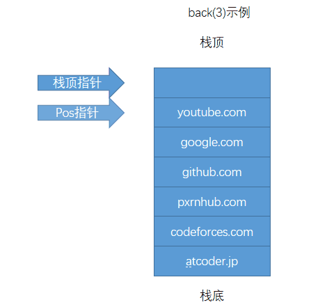
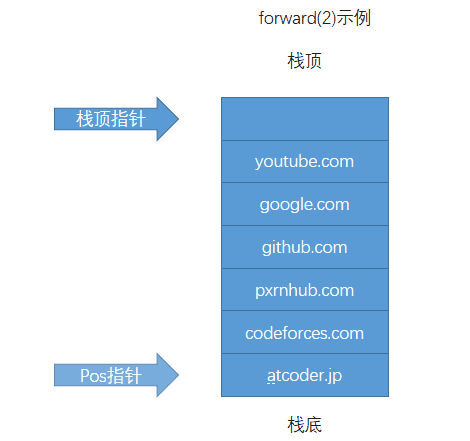
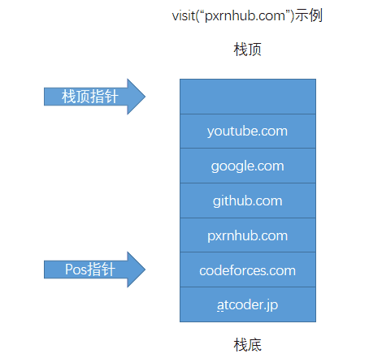

> 原文链接: https://leetcode-cn.com/problems/design-browser-history


## 英文原文
<div><p>You have a <strong>browser</strong> of one tab where you start on the <code>homepage</code> and you can visit another <code>url</code>, get back in the history number of <code>steps</code> or move forward in the history number of <code>steps</code>.</p>

<p>Implement the <code>BrowserHistory</code> class:</p>

<ul>
	<li><code>BrowserHistory(string homepage)</code> Initializes the object with the <code>homepage</code>&nbsp;of the browser.</li>
	<li><code>void visit(string url)</code>&nbsp;Visits&nbsp;<code>url</code> from the current page. It clears up all the forward history.</li>
	<li><code>string back(int steps)</code>&nbsp;Move <code>steps</code> back in history. If you can only return <code>x</code> steps in the history and <code>steps &gt; x</code>, you will&nbsp;return only <code>x</code> steps. Return the current <code>url</code>&nbsp;after moving back in history <strong>at most</strong> <code>steps</code>.</li>
	<li><code>string forward(int steps)</code>&nbsp;Move <code>steps</code> forward in history. If you can only forward <code>x</code> steps in the history and <code>steps &gt; x</code>, you will&nbsp;forward only&nbsp;<code>x</code> steps. Return the current <code>url</code>&nbsp;after forwarding in history <strong>at most</strong> <code>steps</code>.</li>
</ul>

<p>&nbsp;</p>
<p><strong>Example:</strong></p>

<pre>
<b>Input:</b>
[&quot;BrowserHistory&quot;,&quot;visit&quot;,&quot;visit&quot;,&quot;visit&quot;,&quot;back&quot;,&quot;back&quot;,&quot;forward&quot;,&quot;visit&quot;,&quot;forward&quot;,&quot;back&quot;,&quot;back&quot;]
[[&quot;leetcode.com&quot;],[&quot;google.com&quot;],[&quot;facebook.com&quot;],[&quot;youtube.com&quot;],[1],[1],[1],[&quot;linkedin.com&quot;],[2],[2],[7]]
<b>Output:</b>
[null,null,null,null,&quot;facebook.com&quot;,&quot;google.com&quot;,&quot;facebook.com&quot;,null,&quot;linkedin.com&quot;,&quot;google.com&quot;,&quot;leetcode.com&quot;]

<b>Explanation:</b>
BrowserHistory browserHistory = new BrowserHistory(&quot;leetcode.com&quot;);
browserHistory.visit(&quot;google.com&quot;);       // You are in &quot;leetcode.com&quot;. Visit &quot;google.com&quot;
browserHistory.visit(&quot;facebook.com&quot;);     // You are in &quot;google.com&quot;. Visit &quot;facebook.com&quot;
browserHistory.visit(&quot;youtube.com&quot;);      // You are in &quot;facebook.com&quot;. Visit &quot;youtube.com&quot;
browserHistory.back(1);                   // You are in &quot;youtube.com&quot;, move back to &quot;facebook.com&quot; return &quot;facebook.com&quot;
browserHistory.back(1);                   // You are in &quot;facebook.com&quot;, move back to &quot;google.com&quot; return &quot;google.com&quot;
browserHistory.forward(1);                // You are in &quot;google.com&quot;, move forward to &quot;facebook.com&quot; return &quot;facebook.com&quot;
browserHistory.visit(&quot;linkedin.com&quot;);     // You are in &quot;facebook.com&quot;. Visit &quot;linkedin.com&quot;
browserHistory.forward(2);                // You are in &quot;linkedin.com&quot;, you cannot move forward any steps.
browserHistory.back(2);                   // You are in &quot;linkedin.com&quot;, move back two steps to &quot;facebook.com&quot; then to &quot;google.com&quot;. return &quot;google.com&quot;
browserHistory.back(7);                   // You are in &quot;google.com&quot;, you can move back only one step to &quot;leetcode.com&quot;. return &quot;leetcode.com&quot;
</pre>

<p>&nbsp;</p>
<p><strong>Constraints:</strong></p>

<ul>
	<li><code>1 &lt;= homepage.length &lt;= 20</code></li>
	<li><code>1 &lt;= url.length &lt;= 20</code></li>
	<li><code>1 &lt;= steps &lt;= 100</code></li>
	<li><code>homepage</code> and <code>url</code> consist of&nbsp; &#39;.&#39; or lower case English letters.</li>
	<li>At most <code>5000</code>&nbsp;calls will be made to <code>visit</code>, <code>back</code>, and <code>forward</code>.</li>
</ul>
</div>

## 中文题目
<div><p>你有一个只支持单个标签页的 <strong>浏览器</strong>&nbsp;，最开始你浏览的网页是&nbsp;<code>homepage</code>&nbsp;，你可以访问其他的网站&nbsp;<code>url</code>&nbsp;，也可以在浏览历史中后退&nbsp;<code>steps</code>&nbsp;步或前进&nbsp;<code>steps</code>&nbsp;步。</p>

<p>请你实现&nbsp;<code>BrowserHistory</code> 类：</p>

<ul>
	<li><code>BrowserHistory(string homepage)</code>&nbsp;，用&nbsp;<code>homepage</code>&nbsp;初始化浏览器类。</li>
	<li><code>void visit(string url)</code>&nbsp;从当前页跳转访问 <code>url</code> 对应的页面&nbsp;&nbsp;。执行此操作会把浏览历史前进的记录全部删除。</li>
	<li><code>string back(int steps)</code>&nbsp;在浏览历史中后退&nbsp;<code>steps</code>&nbsp;步。如果你只能在浏览历史中后退至多&nbsp;<code>x</code> 步且&nbsp;<code>steps &gt; x</code>&nbsp;，那么你只后退&nbsp;<code>x</code>&nbsp;步。请返回后退 <strong>至多</strong> <code>steps</code>&nbsp;步以后的&nbsp;<code>url</code>&nbsp;。</li>
	<li><code>string forward(int steps)</code>&nbsp;在浏览历史中前进&nbsp;<code>steps</code>&nbsp;步。如果你只能在浏览历史中前进至多&nbsp;<code>x</code>&nbsp;步且&nbsp;<code>steps &gt; x</code>&nbsp;，那么你只前进 <code>x</code>&nbsp;步。请返回前进&nbsp;<strong>至多</strong>&nbsp;<code>steps</code>步以后的 <code>url</code>&nbsp;。</li>
</ul>

<p>&nbsp;</p>

<p><strong>示例：</strong></p>

<pre><strong>输入：</strong>
[&quot;BrowserHistory&quot;,&quot;visit&quot;,&quot;visit&quot;,&quot;visit&quot;,&quot;back&quot;,&quot;back&quot;,&quot;forward&quot;,&quot;visit&quot;,&quot;forward&quot;,&quot;back&quot;,&quot;back&quot;]
[[&quot;leetcode.com&quot;],[&quot;google.com&quot;],[&quot;facebook.com&quot;],[&quot;youtube.com&quot;],[1],[1],[1],[&quot;linkedin.com&quot;],[2],[2],[7]]
<strong>输出：</strong>
[null,null,null,null,&quot;facebook.com&quot;,&quot;google.com&quot;,&quot;facebook.com&quot;,null,&quot;linkedin.com&quot;,&quot;google.com&quot;,&quot;leetcode.com&quot;]

<strong>解释：</strong>
BrowserHistory browserHistory = new BrowserHistory(&quot;leetcode.com&quot;);
browserHistory.visit(&quot;google.com&quot;);       // 你原本在浏览 &quot;leetcode.com&quot; 。访问 &quot;google.com&quot;
browserHistory.visit(&quot;facebook.com&quot;);     // 你原本在浏览 &quot;google.com&quot; 。访问 &quot;facebook.com&quot;
browserHistory.visit(&quot;youtube.com&quot;);      // 你原本在浏览 &quot;facebook.com&quot; 。访问 &quot;youtube.com&quot;
browserHistory.back(1);                   // 你原本在浏览 &quot;youtube.com&quot; ，后退到 &quot;facebook.com&quot; 并返回 &quot;facebook.com&quot;
browserHistory.back(1);                   // 你原本在浏览 &quot;facebook.com&quot; ，后退到 &quot;google.com&quot; 并返回 &quot;google.com&quot;
browserHistory.forward(1);                // 你原本在浏览 &quot;google.com&quot; ，前进到 &quot;facebook.com&quot; 并返回 &quot;facebook.com&quot;
browserHistory.visit(&quot;linkedin.com&quot;);     // 你原本在浏览 &quot;facebook.com&quot; 。 访问 &quot;linkedin.com&quot;
browserHistory.forward(2);                // 你原本在浏览 &quot;linkedin.com&quot; ，你无法前进任何步数。
browserHistory.back(2);                   // 你原本在浏览 &quot;linkedin.com&quot; ，后退两步依次先到 &quot;facebook.com&quot; ，然后到 &quot;google.com&quot; ，并返回 &quot;google.com&quot;
browserHistory.back(7);                   // 你原本在浏览 &quot;google.com&quot;， 你只能后退一步到 &quot;leetcode.com&quot; ，并返回 &quot;leetcode.com&quot;
</pre>

<p>&nbsp;</p>

<p><strong>提示：</strong></p>

<ul>
	<li><code>1 &lt;= homepage.length &lt;= 20</code></li>
	<li><code>1 &lt;= url.length &lt;= 20</code></li>
	<li><code>1 &lt;= steps &lt;= 100</code></li>
	<li><code>homepage</code> 和&nbsp;<code>url</code>&nbsp;都只包含&nbsp;&#39;.&#39; 或者小写英文字母。</li>
	<li>最多调用&nbsp;<code>5000</code>&nbsp;次&nbsp;<code>visit</code>，&nbsp;<code>back</code>&nbsp;和&nbsp;<code>forward</code>&nbsp;函数。</li>
</ul>
</div>

## 通过代码
<RecoDemo>
</RecoDemo>


## 高赞题解
* 知识点：栈
* 时间复杂度：O(n)，n 为操作次数

使用一个栈记录浏览历史，使用一个 pos 记录当前网页在栈中的位置。每次 back 和 forward 操作都只更新 pos 。因为visit操作会把浏览历史前进的记录全部删除，所以每次 visit 先根据 pos 更新下栈顶指针，然后再将 url 入栈。
可以先看图在看代码~





```cpp
class BrowserHistory {
public:
    int pos;
    int top;
    string history[5001];
    BrowserHistory(string homepage) : pos(-1), top(0) {
        visit(homepage);
    }
    
    void visit(string url) {
        pos ++;
        top = pos;
        history[top++] = url;
    }
    
    string back(int steps) {
        if(steps > pos) {
            steps = pos;
        }
        pos -= steps;
        return history[pos];
    }
    
    string forward(int steps) {
        steps = min(steps, top - pos - 1);
        pos += steps;
        return history[pos];
    }
};
```
# 如果感觉有点意思，可以关注👏[HelloNebula](../images/design-browser-history-3.jpg)👏
* **分享周赛题解**
* **分享计算机专业课知识**
* **分享C++相关岗位面试题**
* **分享专业书籍PDF**

## 统计信息
| 通过次数 | 提交次数 | AC比率 |
| :------: | :------: | :------: |
|    9093    |    14677    |   62.0%   |

## 提交历史
| 提交时间 | 提交结果 | 执行时间 |  内存消耗  | 语言 |
| :------: | :------: | :------: | :--------: | :--------: |
