> 原文链接: https://leetcode-cn.com/problems/avoid-flood-in-the-city


## 英文原文
<div><p>Your country has an infinite number of lakes. Initially, all the lakes are empty, but when it rains over the <code>nth</code> lake, the <code>nth</code> lake becomes full of water. If it rains over a lake which is <strong>full of water</strong>, there will be a <strong>flood</strong>. Your goal is to avoid the flood in any lake.</p>

<p>Given an integer array <code>rains</code> where:</p>

<ul>
	<li><code>rains[i] &gt; 0</code> means there will be rains over the <code>rains[i]</code> lake.</li>
	<li><code>rains[i] == 0</code> means there are no rains this day and you can choose <strong>one lake</strong> this day and <strong>dry it</strong>.</li>
</ul>

<p>Return <em>an array <code>ans</code></em> where:</p>

<ul>
	<li><code>ans.length == rains.length</code></li>
	<li><code>ans[i] == -1</code> if <code>rains[i] &gt; 0</code>.</li>
	<li><code>ans[i]</code> is the lake you choose to dry in the <code>ith</code> day&nbsp;if <code>rains[i] == 0</code>.</li>
</ul>

<p>If there are multiple valid answers return <strong>any</strong> of them. If it is impossible to avoid flood return <strong>an empty array</strong>.</p>

<p>Notice that if you chose to dry a full lake, it becomes empty, but if you chose to dry an empty lake, nothing changes. (see example 4)</p>

<p>&nbsp;</p>
<p><strong>Example 1:</strong></p>

<pre>
<strong>Input:</strong> rains = [1,2,3,4]
<strong>Output:</strong> [-1,-1,-1,-1]
<strong>Explanation:</strong> After the first day full lakes are [1]
After the second day full lakes are [1,2]
After the third day full lakes are [1,2,3]
After the fourth day full lakes are [1,2,3,4]
There&#39;s no day to dry any lake and there is no flood in any lake.
</pre>

<p><strong>Example 2:</strong></p>

<pre>
<strong>Input:</strong> rains = [1,2,0,0,2,1]
<strong>Output:</strong> [-1,-1,2,1,-1,-1]
<strong>Explanation:</strong> After the first day full lakes are [1]
After the second day full lakes are [1,2]
After the third day, we dry lake 2. Full lakes are [1]
After the fourth day, we dry lake 1. There is no full lakes.
After the fifth day, full lakes are [2].
After the sixth day, full lakes are [1,2].
It is easy that this scenario is flood-free. [-1,-1,1,2,-1,-1] is another acceptable scenario.
</pre>

<p><strong>Example 3:</strong></p>

<pre>
<strong>Input:</strong> rains = [1,2,0,1,2]
<strong>Output:</strong> []
<strong>Explanation:</strong> After the second day, full lakes are  [1,2]. We have to dry one lake in the third day.
After that, it will rain over lakes [1,2]. It&#39;s easy to prove that no matter which lake you choose to dry in the 3rd day, the other one will flood.
</pre>

<p><strong>Example 4:</strong></p>

<pre>
<strong>Input:</strong> rains = [69,0,0,0,69]
<strong>Output:</strong> [-1,69,1,1,-1]
<strong>Explanation:</strong> Any solution on one of the forms [-1,69,x,y,-1], [-1,x,69,y,-1] or [-1,x,y,69,-1] is acceptable where 1 &lt;= x,y &lt;= 10^9
</pre>

<p><strong>Example 5:</strong></p>

<pre>
<strong>Input:</strong> rains = [10,20,20]
<strong>Output:</strong> []
<strong>Explanation:</strong> It will rain over lake 20 two consecutive days. There is no chance to dry any lake.
</pre>

<p>&nbsp;</p>
<p><strong>Constraints:</strong></p>

<ul>
	<li><code>1 &lt;= rains.length &lt;= 10<sup>5</sup></code></li>
	<li><code>0 &lt;= rains[i] &lt;= 10<sup>9</sup></code></li>
</ul>
</div>

## 中文题目
<div><p>你的国家有无数个湖泊，所有湖泊一开始都是空的。当第 <code>n</code>&nbsp;个湖泊下雨的时候，如果第 <code>n</code>&nbsp;个湖泊是空的，那么它就会装满水，否则这个湖泊会发生洪水。你的目标是避免任意一个湖泊发生洪水。</p>

<p>给你一个整数数组&nbsp;<code>rains</code>&nbsp;，其中：</p>

<ul>
	<li><code>rains[i] &gt; 0</code>&nbsp;表示第 <code>i</code>&nbsp;天时，第 <code>rains[i]</code>&nbsp;个湖泊会下雨。</li>
	<li><code>rains[i] == 0</code>&nbsp;表示第 <code>i</code>&nbsp;天没有湖泊会下雨，你可以选择 <strong>一个</strong>&nbsp;湖泊并 <strong>抽干</strong>&nbsp;这个湖泊的水。</li>
</ul>

<p>请返回一个数组<em>&nbsp;</em><code>ans</code>&nbsp;，满足：</p>

<ul>
	<li><code>ans.length == rains.length</code></li>
	<li>如果&nbsp;<code>rains[i] &gt; 0</code> ，那么<code>ans[i] == -1</code>&nbsp;。</li>
	<li>如果&nbsp;<code>rains[i] == 0</code>&nbsp;，<code>ans[i]</code>&nbsp;是你第&nbsp;<code>i</code>&nbsp;天选择抽干的湖泊。</li>
</ul>

<p>如果有多种可行解，请返回它们中的 <strong>任意一个</strong>&nbsp;。如果没办法阻止洪水，请返回一个 <strong>空的数组</strong>&nbsp;。</p>

<p>请注意，如果你选择抽干一个装满水的湖泊，它会变成一个空的湖泊。但如果你选择抽干一个空的湖泊，那么将无事发生（详情请看示例 4）。</p>

<p>&nbsp;</p>

<p><strong>示例 1：</strong></p>

<pre><strong>输入：</strong>rains = [1,2,3,4]
<strong>输出：</strong>[-1,-1,-1,-1]
<strong>解释：</strong>第一天后，装满水的湖泊包括 [1]
第二天后，装满水的湖泊包括 [1,2]
第三天后，装满水的湖泊包括 [1,2,3]
第四天后，装满水的湖泊包括 [1,2,3,4]
没有哪一天你可以抽干任何湖泊的水，也没有湖泊会发生洪水。
</pre>

<p><strong>示例 2：</strong></p>

<pre><strong>输入：</strong>rains = [1,2,0,0,2,1]
<strong>输出：</strong>[-1,-1,2,1,-1,-1]
<strong>解释：</strong>第一天后，装满水的湖泊包括 [1]
第二天后，装满水的湖泊包括 [1,2]
第三天后，我们抽干湖泊 2 。所以剩下装满水的湖泊包括 [1]
第四天后，我们抽干湖泊 1 。所以暂时没有装满水的湖泊了。
第五天后，装满水的湖泊包括 [2]。
第六天后，装满水的湖泊包括 [1,2]。
可以看出，这个方案下不会有洪水发生。同时， [-1,-1,1,2,-1,-1] 也是另一个可行的没有洪水的方案。
</pre>

<p><strong>示例 3：</strong></p>

<pre><strong>输入：</strong>rains = [1,2,0,1,2]
<strong>输出：</strong>[]
<strong>解释：</strong>第二天后，装满水的湖泊包括 [1,2]。我们可以在第三天抽干一个湖泊的水。
但第三天后，湖泊 1 和 2 都会再次下雨，所以不管我们第三天抽干哪个湖泊的水，另一个湖泊都会发生洪水。
</pre>

<p><strong>示例 4：</strong></p>

<pre><strong>输入：</strong>rains = [69,0,0,0,69]
<strong>输出：</strong>[-1,69,1,1,-1]
<strong>解释：</strong>任何形如 [-1,69,x,y,-1], [-1,x,69,y,-1] 或者 [-1,x,y,69,-1] 都是可行的解，其中 1 &lt;= x,y &lt;= 10^9
</pre>

<p><strong>示例 5：</strong></p>

<pre><strong>输入：</strong>rains = [10,20,20]
<strong>输出：</strong>[]
<strong>解释：</strong>由于湖泊 20 会连续下 2 天的雨，所以没有没有办法阻止洪水。
</pre>

<p>&nbsp;</p>

<p><strong>提示：</strong></p>

<ul>
	<li><code>1 &lt;= rains.length &lt;= 10^5</code></li>
	<li><code>0 &lt;= rains[i] &lt;= 10^9</code></li>
</ul>
</div>

## 通过代码
<RecoDemo>
</RecoDemo>


## 高赞题解
### 解题思路：
1. 将晴天的日期全部记录到 `set<int> zero` 中
2. 使用 `unordered_map<int, int> water` 来记录每个湖泊上一次下雨的日期
3. 遇到晴天时先不用管抽哪个湖
4. 当下雨时，湖泊已经水满了时，我们可以查询到上次下雨的日期
5. 通过这个日期在晴天记录中查找对应的晴天日期
    51. 在有序数据中查找，用二分啦
6. 如果找到了，就可以使用那一天抽水，找不到就不可避免的洪水了

### 答题
```C++ []
    vector<int> avoidFlood(vector<int>& rains) {
        vector<int> ans(rains.size(), 1);
        unordered_map<int, int> water;
        set<int> zero;

        for (int i = 0; i < rains.size(); i++) {
            int r = rains[i];

            if (r == 0) {
                zero.insert(i);
                continue;
            }

            if (water.count(r) != 0) {
                auto it = zero.lower_bound(water[r]);
                if (it == zero.end()) return {};
                ans[*it] = r;
                zero.erase(it);
            }
            water[r] = i;
            ans[i] = -1;
        }

        return ans;
    }    
```

### 模拟
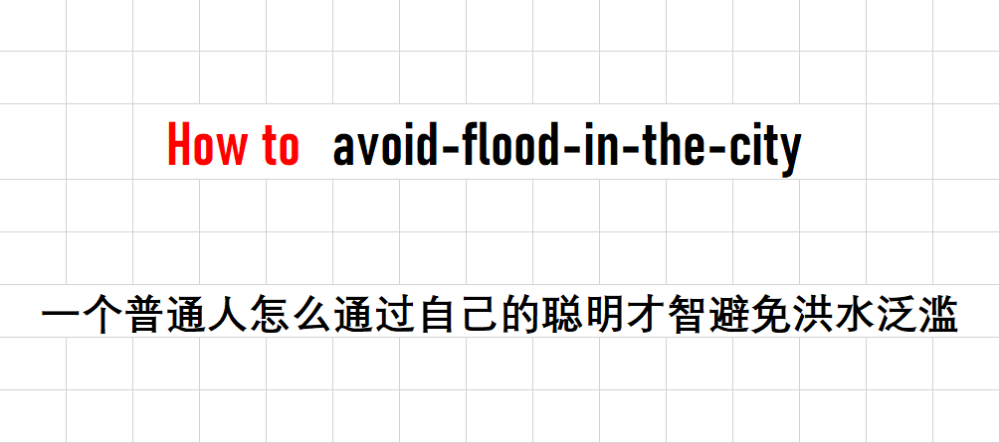

<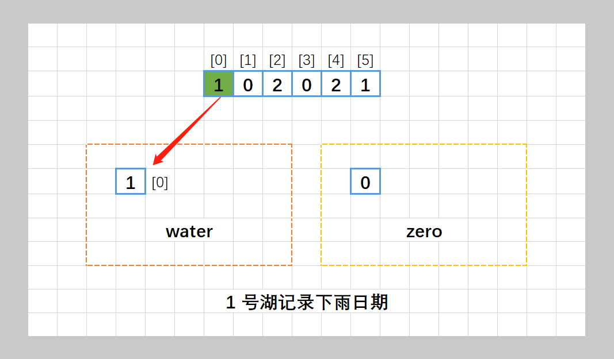,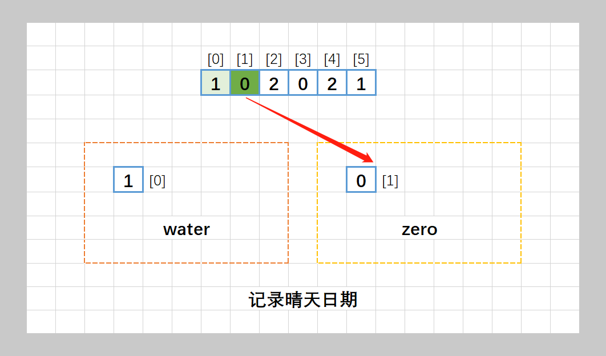,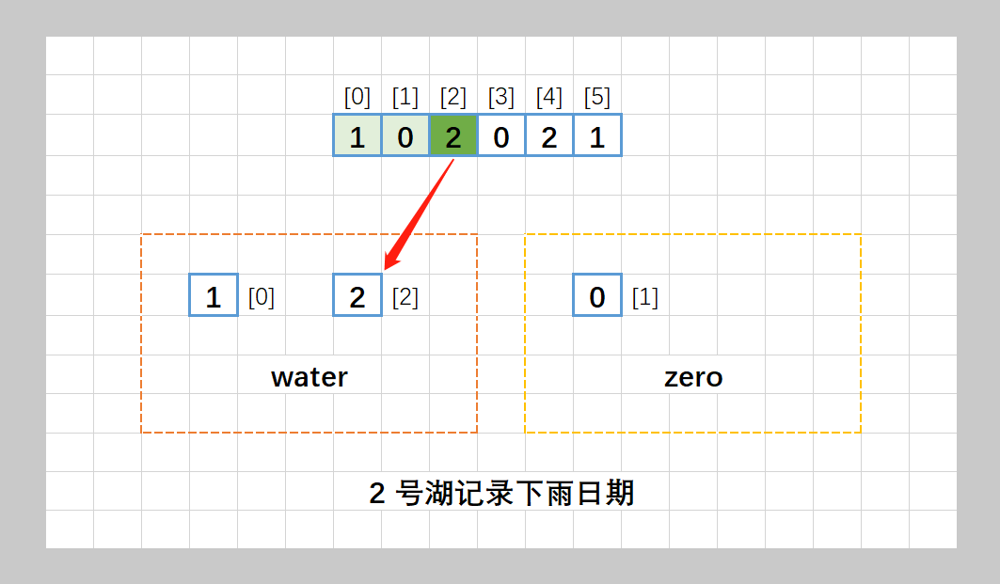,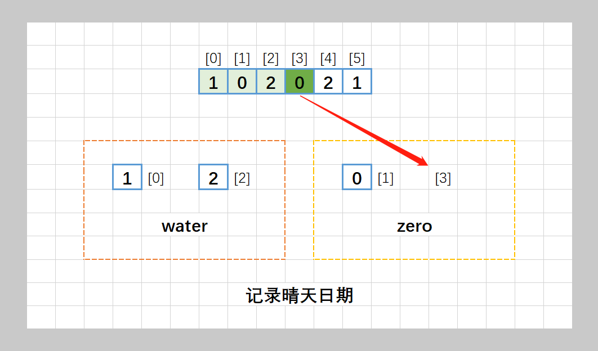,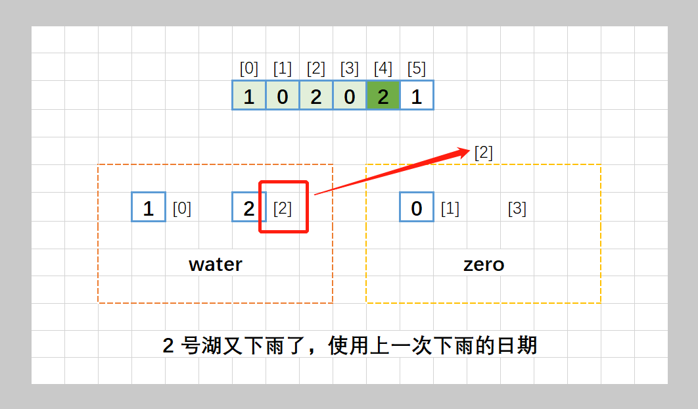,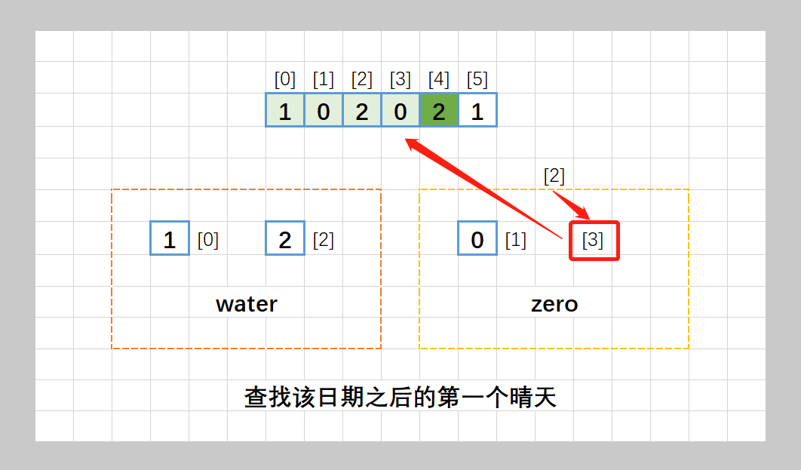,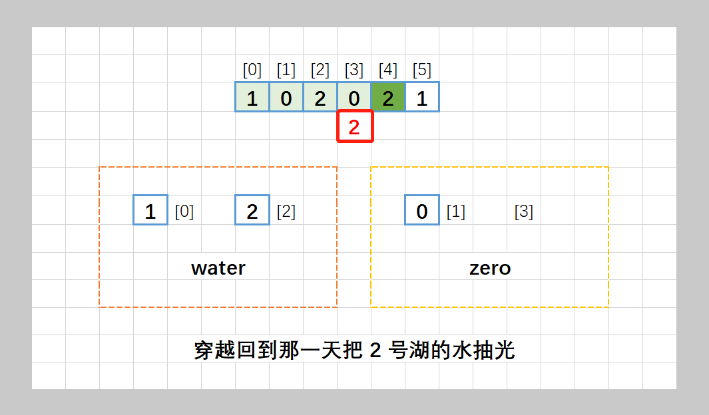,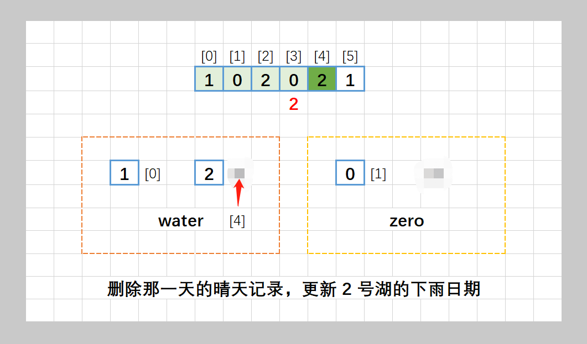,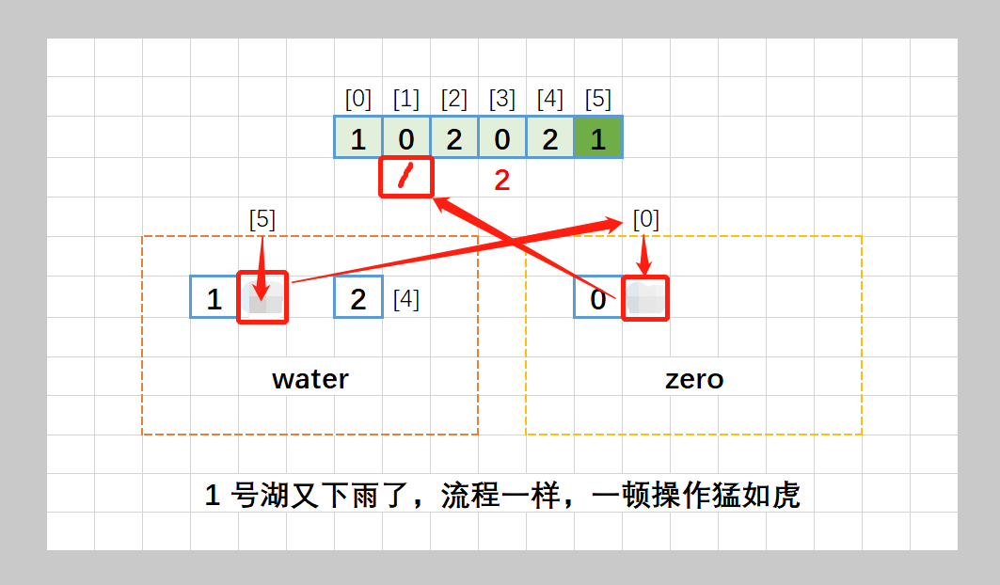,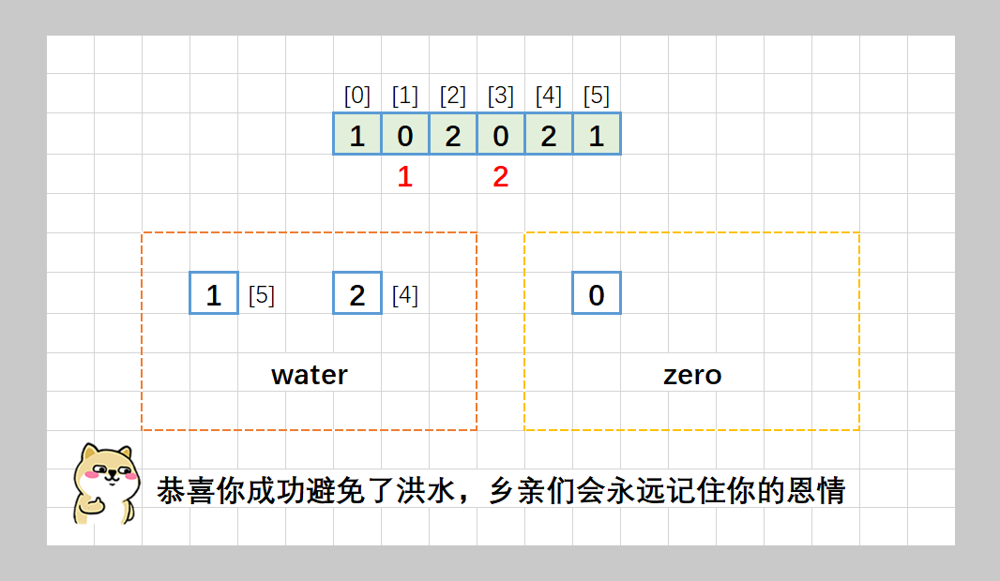>


### 致谢

感谢您的观看，希望对您有帮助，欢迎热烈的交流！  

**如果感觉还不错就点个赞吧~**


## 统计信息
| 通过次数 | 提交次数 | AC比率 |
| :------: | :------: | :------: |
|    7787    |    32300    |   24.1%   |

## 提交历史
| 提交时间 | 提交结果 | 执行时间 |  内存消耗  | 语言 |
| :------: | :------: | :------: | :--------: | :--------: |
