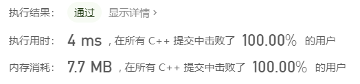

> 原文链接: https://leetcode-cn.com/problems/range-sum-of-sorted-subarray-sums


## 英文原文
<div><p>You are given the array <code>nums</code> consisting of <code>n</code> positive integers. You computed the sum of all non-empty continuous subarrays from the array and then sorted them in non-decreasing order, creating a new array of <code>n * (n + 1) / 2</code> numbers.</p>

<p><em>Return the sum of the numbers from index </em><code>left</code><em> to index </em><code>right</code> (<strong>indexed from 1</strong>)<em>, inclusive, in the new array. </em>Since the answer can be a huge number return it modulo <code>10<sup>9</sup> + 7</code>.</p>

<p>&nbsp;</p>
<p><strong>Example 1:</strong></p>

<pre>
<strong>Input:</strong> nums = [1,2,3,4], n = 4, left = 1, right = 5
<strong>Output:</strong> 13 
<strong>Explanation:</strong> All subarray sums are 1, 3, 6, 10, 2, 5, 9, 3, 7, 4. After sorting them in non-decreasing order we have the new array [1, 2, 3, 3, 4, 5, 6, 7, 9, 10]. The sum of the numbers from index le = 1 to ri = 5 is 1 + 2 + 3 + 3 + 4 = 13. 
</pre>

<p><strong>Example 2:</strong></p>

<pre>
<strong>Input:</strong> nums = [1,2,3,4], n = 4, left = 3, right = 4
<strong>Output:</strong> 6
<strong>Explanation:</strong> The given array is the same as example 1. We have the new array [1, 2, 3, 3, 4, 5, 6, 7, 9, 10]. The sum of the numbers from index le = 3 to ri = 4 is 3 + 3 = 6.
</pre>

<p><strong>Example 3:</strong></p>

<pre>
<strong>Input:</strong> nums = [1,2,3,4], n = 4, left = 1, right = 10
<strong>Output:</strong> 50
</pre>

<p>&nbsp;</p>
<p><strong>Constraints:</strong></p>

<ul>
	<li><code>n == nums.length</code></li>
	<li><code>1 &lt;= nums.length &lt;= 1000</code></li>
	<li><code>1 &lt;= nums[i] &lt;= 100</code></li>
	<li><code>1 &lt;= left &lt;= right &lt;= n * (n + 1) / 2</code></li>
</ul>
</div>

## 中文题目
<div><p>给你一个数组&nbsp;<code>nums</code>&nbsp;，它包含&nbsp;<code>n</code>&nbsp;个正整数。你需要计算所有非空连续子数组的和，并将它们按升序排序，得到一个新的包含&nbsp;<code>n * (n + 1) / 2</code>&nbsp;个数字的数组。</p>

<p>请你返回在新数组中下标为<em>&nbsp;</em><code>left</code>&nbsp;到&nbsp;<code>right</code> <strong>（下标从 1 开始）</strong>的所有数字和（包括左右端点）。由于答案可能很大，请你将它对 10^9 + 7 取模后返回。</p>

<p>&nbsp;</p>

<p><strong>示例 1：</strong></p>

<pre>
<strong>输入：</strong>nums = [1,2,3,4], n = 4, left = 1, right = 5
<strong>输出：</strong>13 
<strong>解释：</strong>所有的子数组和为 1, 3, 6, 10, 2, 5, 9, 3, 7, 4 。将它们升序排序后，我们得到新的数组 [1, 2, 3, 3, 4, 5, 6, 7, 9, 10] 。下标从 le = 1 到 ri = 5 的和为 1 + 2 + 3 + 3 + 4 = 13 。
</pre>

<p><strong>示例 2：</strong></p>

<pre>
<strong>输入：</strong>nums = [1,2,3,4], n = 4, left = 3, right = 4
<strong>输出：</strong>6
<strong>解释：</strong>给定数组与示例 1 一样，所以新数组为 [1, 2, 3, 3, 4, 5, 6, 7, 9, 10] 。下标从 le = 3 到 ri = 4 的和为 3 + 3 = 6 。
</pre>

<p><strong>示例 3：</strong></p>

<pre>
<strong>输入：</strong>nums = [1,2,3,4], n = 4, left = 1, right = 10
<strong>输出：</strong>50
</pre>

<p>&nbsp;</p>

<p><strong>提示：</strong></p>

<ul>
	<li><code>1 &lt;= nums.length &lt;= 10^3</code></li>
	<li><code>nums.length == n</code></li>
	<li><code>1 &lt;= nums[i] &lt;= 100</code></li>
	<li><code>1 &lt;= left &lt;= right&nbsp;&lt;= n * (n + 1) / 2</code></li>
</ul>
</div>

## 通过代码
<RecoDemo>
</RecoDemo>


## 高赞题解
#### 相关题目
[378. 有序矩阵中第 K 小的元素](https://leetcode-cn.com/problems/kth-smallest-element-in-a-sorted-matrix/)
[719. 找出第 k 小的距离对](https://leetcode-cn.com/problems/find-k-th-smallest-pair-distance/)

#### 解题思路
1. **找出排序后数组的第 $k$ 小的元素。**
    至于如何找出，可以参考第 378 题 和 719 题的思路。为此我们首先构造出一个二维有序矩阵。
    定义矩阵的元素 $A(i,j)$：原数组 $nums$ 的从第 $i$ 个元素到第 $j$ 个元素（下标从 1 开始）的和。
    例如：关于题目中的示例 $[1,2,3,4]$，可以构造出如下的矩阵:
    $$\begin{matrix} 1 & 3 & 6 & 10 \\  & 2 & 5 & 9 \\ & & 3 & 7 \\ & & & 4 \end{matrix}$$
    **注意：** 当 $j < i$ 时，矩阵中是没有元素的。
    显然，这个矩阵 **关于列号 $j$ 递增、关于行号 $i$ 递减。** 因此我们可以用类似 378 题的思路（二分+双指针）来求排序后数组的第 $k$ 小元素。
    下面是由 $[1,2,3,4,5,6,7,8,9,10]$ 构造出的矩阵的色阶图。假设我们要找所有的 $val < 20$ 的元素数量，我们只需要沿着图中的线走一遍即可。
    
    
    > **提示：** 解题时，我们不需要完整地构造出矩阵，我们只需要随时知道 $A(i,j)$ 即可。为了求出 $A(i,j)$，我们首先求出原数组的前缀和 $sums$，然后根据定义，$A(i,j) = sums[j] - sums[i-1]$。（代码中 $i$ 的下标从 $0$ 开始，因此写成了 $sums[j] - sums[i]$）。

2. **求出排序后数组的前 $k$ 项和。**
    需要考虑一个细节：数组中的第 $k$ 小的元素可能有多个，比如 $...a,a,x,x,[x],x,c,d...$，第 k 小元素为 $x$。
    这时的思路是：先求所有 **严格小于 $x$** 的元素和 $S$ 和 元素个数 $cnt$，然后再求等于 $x$ 的部分。

    为求出元素和 $S$， 我们先构造 "前缀和的前缀和" （即首行元素的前缀和 $ssums$）以供参考。
    以示例 $[1,2,3,4]$ 所构造出的矩阵为例，
    $$\begin{matrix} \textbf{ssums}: & \textbf{1} & \textbf{4} & \textbf{10} & \textbf{20} \\ array:& 1 & 3 & 6 & 10 \\ &→ & \textbf{[2} & \textbf{5]} & 9 \\ && & 3 & 7 \\ && & & 4 \end{matrix}$$
    假设我们需要求矩阵的第 $2$ 行的第 $2 \sim 3$ 列 (下标从 $1$ 开始) 的元素和。
    可以看出规律：**待求元素** $2,5$ 和 **首行元素** $3,6$ 相比，都差了一个 $1$。
    因此，我们可以先求出 **首行** 的对应元素的和，然后再减去 $1 \times 元素的个数$：
    $$\begin{aligned} res &= (ssums[3] - ssums[1]) - (3-2+1)\times sums[1] \\ &= (10-1) - 2  \\&= 7. \end{aligned} $$
    推广到一般情况，求出矩阵中的第 $m$ 行的第 $a \sim b$ 列元素的和（下标从 $1$ 开始）的公式为：
    $$res = (ssums[b] - ssums[a-1]) - (b-a+1) \times sums[m-1].$$

    然后等于 $x$ 的部分呢？这部分答案是 $(k - cnt) \times x$。
    最后的答案就是 $S + (k - cnt) \times x$。
    > 为了避免溢出，答案和中间结果用 long (64位) 来存储。

3. **算出答案。**
我们定义 $F(x)$ 为排序后数组的前 $x$ 项和。根据定义，题目的答案就是 $F(right) - F(left-1)$。
    > 不要忘记取模 1e9 + 7。

#### 代码


```cpp
class Solution {
public:
    int getCnt(long sums[], int n, int x) {
        int res = 0;
        for(int i = 0, p = 1; i < n; ++i) {
            while(p <= n && sums[p] - sums[i] <= x)
                ++p;
            res += p-1-i;
        }
        return res;
    }
    int getKth(long sums[], int n, int idx) {
        int l = 0, r = 1e5;
        while(l < r) {
            int mid = (l + r) / 2, cnt = getCnt(sums, n, mid);
            if(cnt < idx)
                l = mid + 1;
            else
                r = mid;
        }
        return l;
    }
    long F(long sums[], long ssums[], int n, int x) {
        long num = getKth(sums, n, x), res = 0, cnt = 0;
        for(int i = 0, p = 1; i < n; ++i) {
            while(p <= n && sums[p] - sums[i] < num)
                ++p;
            // 这里, 需要求出矩阵的第 i+1 行的第 i+1 ~ p-1 (下标从 1 开始)个数字的和
            // 带入公式，有 m = i+1, a = i+1, b = p-1, 得
            // res = ssums[b] - ssums[a-1] + (b-a+1)*sums[m-1]
            //     = ssums[(p-1)] - ssums[(i+1)-1] - (((p-1)-(i+1))+1)*sums[(i+1)-1]
            //     = ssums[p-1] - ssums[i] - (p-i-1)*sums[i].
            res += ssums[p-1] - ssums[i] - sums[i] * ((long)(p-1-i));
            cnt += p-1-i;
        }
        return res + (x-cnt)*num;
    }
    int rangeSum(vector<int>& nums, int n, int left, int right) {
        long sums[n+1]; // 前缀和
        sums[0] = 0;
        for(int i = 0; i < n; ++i)
            sums[i+1] = sums[i] + nums[i];

        long ssums[n+1]; // 前缀和的前缀和
        ssums[0] = 0;
        for(int i = 0; i < n; ++i)
            ssums[i+1] = ssums[i] + sums[i+1];
        
        return (F(sums, ssums, n, right) - F(sums, ssums, n, left-1)) % ((long)(1e9 + 7));
    }
};
```

## 统计信息
| 通过次数 | 提交次数 | AC比率 |
| :------: | :------: | :------: |
|    6298    |    11387    |   55.3%   |

## 提交历史
| 提交时间 | 提交结果 | 执行时间 |  内存消耗  | 语言 |
| :------: | :------: | :------: | :--------: | :--------: |
