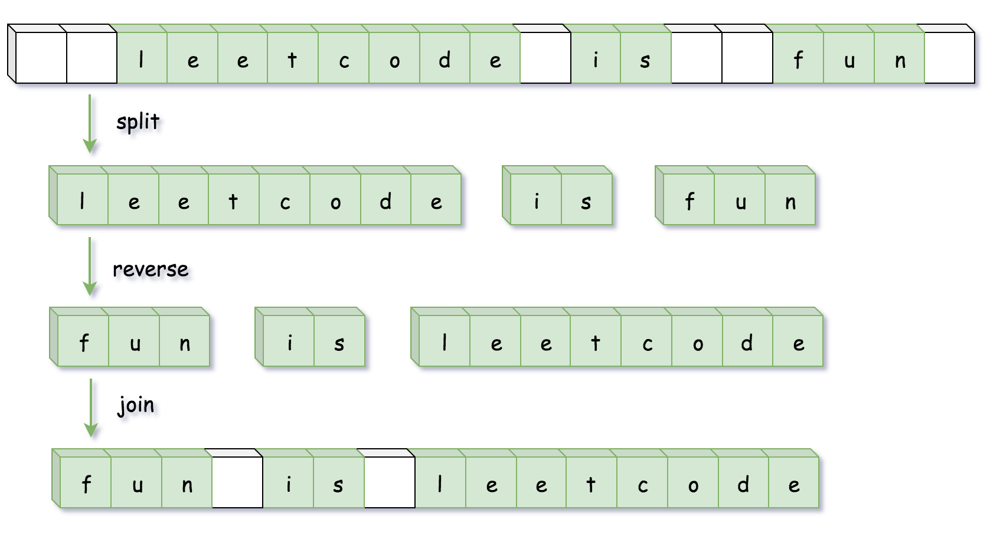
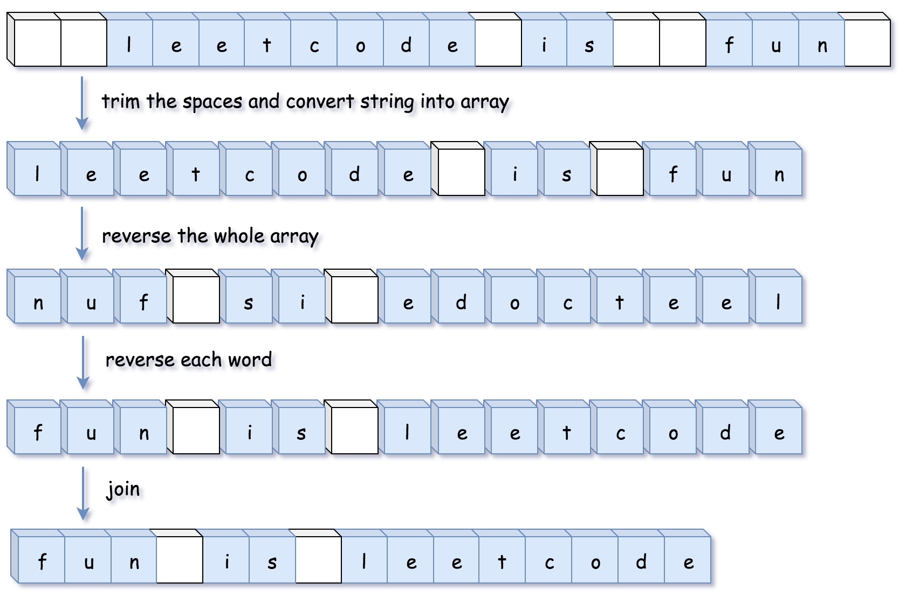
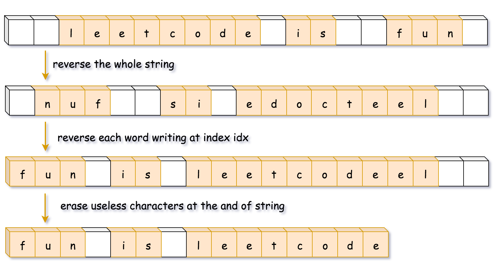
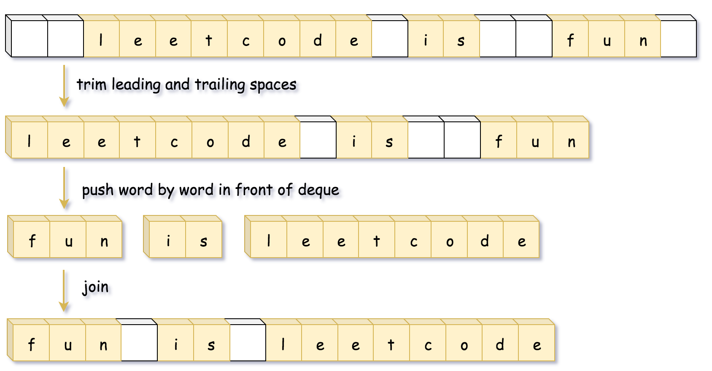

> 原文链接: https://leetcode-cn.com/problems/reverse-words-in-a-string


## 英文原文
<div><p>Given an input string <code>s</code>, reverse the order of the <strong>words</strong>.</p>

<p>A <strong>word</strong> is defined as a sequence of non-space characters. The <strong>words</strong> in <code>s</code> will be separated by at least one space.</p>

<p>Return <em>a string of the words in reverse order concatenated by a single space.</em></p>

<p><b>Note</b> that <code>s</code> may contain leading or trailing spaces or multiple spaces between two words. The returned string should only have a single space separating the words. Do not include any extra spaces.</p>

<p>&nbsp;</p>
<p><strong>Example 1:</strong></p>

<pre>
<strong>Input:</strong> s = &quot;the sky is blue&quot;
<strong>Output:</strong> &quot;blue is sky the&quot;
</pre>

<p><strong>Example 2:</strong></p>

<pre>
<strong>Input:</strong> s = &quot;  hello world  &quot;
<strong>Output:</strong> &quot;world hello&quot;
<strong>Explanation:</strong> Your reversed string should not contain leading or trailing spaces.
</pre>

<p><strong>Example 3:</strong></p>

<pre>
<strong>Input:</strong> s = &quot;a good   example&quot;
<strong>Output:</strong> &quot;example good a&quot;
<strong>Explanation:</strong> You need to reduce multiple spaces between two words to a single space in the reversed string.
</pre>

<p><strong>Example 4:</strong></p>

<pre>
<strong>Input:</strong> s = &quot;  Bob    Loves  Alice   &quot;
<strong>Output:</strong> &quot;Alice Loves Bob&quot;
</pre>

<p><strong>Example 5:</strong></p>

<pre>
<strong>Input:</strong> s = &quot;Alice does not even like bob&quot;
<strong>Output:</strong> &quot;bob like even not does Alice&quot;
</pre>

<p>&nbsp;</p>
<p><strong>Constraints:</strong></p>

<ul>
	<li><code>1 &lt;= s.length &lt;= 10<sup>4</sup></code></li>
	<li><code>s</code> contains English letters (upper-case and lower-case), digits, and spaces <code>&#39; &#39;</code>.</li>
	<li>There is <strong>at least one</strong> word in <code>s</code>.</li>
</ul>

<p>&nbsp;</p>
<p><b data-stringify-type="bold">Follow-up:&nbsp;</b>If the string data type is mutable in your language, can&nbsp;you solve it&nbsp;<b data-stringify-type="bold">in-place</b>&nbsp;with&nbsp;<code data-stringify-type="code">O(1)</code>&nbsp;extra space?</p>
</div>

## 中文题目
<div><p>给你一个字符串 <code>s</code> ，逐个翻转字符串中的所有 <strong>单词</strong> 。</p>

<p><strong>单词</strong> 是由非空格字符组成的字符串。<code>s</code> 中使用至少一个空格将字符串中的 <strong>单词</strong> 分隔开。</p>

<p>请你返回一个翻转 <code>s</code> 中单词顺序并用单个空格相连的字符串。</p>

<p><strong>说明：</strong></p>

<ul>
	<li>输入字符串 <code>s</code> 可以在前面、后面或者单词间包含多余的空格。</li>
	<li>翻转后单词间应当仅用一个空格分隔。</li>
	<li>翻转后的字符串中不应包含额外的空格。</li>
</ul>

<p> </p>

<p><strong>示例 1：</strong></p>

<pre>
<strong>输入：</strong>s = "<code>the sky is blue</code>"
<strong>输出：</strong>"<code>blue is sky the</code>"
</pre>

<p><strong>示例 2：</strong></p>

<pre>
<strong>输入：</strong>s = "  hello world  "
<strong>输出：</strong>"world hello"
<strong>解释：</strong>输入字符串可以在前面或者后面包含多余的空格，但是翻转后的字符不能包括。
</pre>

<p><strong>示例 3：</strong></p>

<pre>
<strong>输入：</strong>s = "a good   example"
<strong>输出：</strong>"example good a"
<strong>解释：</strong>如果两个单词间有多余的空格，将翻转后单词间的空格减少到只含一个。
</pre>

<p><strong>示例 4：</strong></p>

<pre>
<strong>输入：</strong>s = "  Bob    Loves  Alice   "
<strong>输出：</strong>"Alice Loves Bob"
</pre>

<p><strong>示例 5：</strong></p>

<pre>
<strong>输入：</strong>s = "Alice does not even like bob"
<strong>输出：</strong>"bob like even not does Alice"
</pre>

<p> </p>

<p><strong>提示：</strong></p>

<ul>
	<li><code>1 <= s.length <= 10<sup>4</sup></code></li>
	<li><code>s</code> 包含英文大小写字母、数字和空格 <code>' '</code></li>
	<li><code>s</code> 中 <strong>至少存在一个</strong> 单词</li>
</ul>

<ul>
</ul>

<p> </p>

<p><strong>进阶：</strong></p>

<ul>
	<li>请尝试使用 <code><em>O</em>(1)</code> 额外空间复杂度的原地解法。</li>
</ul>
</div>

## 通过代码
<RecoDemo>
</RecoDemo>


## 高赞题解
### 📺 视频题解  


### 📖 文字题解

#### 方法一：使用语言特性

**思路和算法**

很多语言对字符串提供了 `split`（拆分），`reverse`（翻转）和 `join`（连接）等方法，因此我们可以简单的调用内置的 API 完成操作：

1. 使用 `split` 将字符串按空格分割成字符串数组；
2. 使用 `reverse` 将字符串数组进行反转；
3. 使用 `join` 方法将字符串数组拼成一个字符串。



```Python [sol1-Python3]
class Solution:
    def reverseWords(self, s: str) -> str:
        return " ".join(reversed(s.split()))
```

```Java [sol1-Java]
class Solution {
    public String reverseWords(String s) {
        // 除去开头和末尾的空白字符
        s = s.trim();
        // 正则匹配连续的空白字符作为分隔符分割
        List<String> wordList = Arrays.asList(s.split("\\s+"));
        Collections.reverse(wordList);
        return String.join(" ", wordList);
    }
}
```
```JavaScript [sol1-JavaScript]
var reverseWords = function(s) {
    return s.trim().split(/\s+/).reverse().join(' ');
};
```

**复杂度分析**

* 时间复杂度：$O(n)$，其中 $n$ 为输入字符串的长度。

* 空间复杂度：$O(n)$，用来存储字符串分割之后的结果。

#### 方法二：自行编写对应的函数

**思路和算法**

我们也可以不使用语言中的 API，而是自己编写对应的函数。在不同语言中，这些函数实现是不一样的，主要的差别是有些语言的字符串不可变（如 Java 和 Python)，有些语言的字符串可变（如 C++)。

对于字符串不可变的语言，首先得把字符串转化成其他可变的数据结构，同时还需要在转化的过程中去除空格。



对于字符串可变的语言，就不需要再额外开辟空间了，直接在字符串上原地实现。在这种情况下，反转字符和去除空格可以一起完成。



```Python [sol2-Python3]
class Solution:
    def trim_spaces(self, s: str) -> list:
        left, right = 0, len(s) - 1
        # 去掉字符串开头的空白字符
        while left <= right and s[left] == ' ':
            left += 1
        
        # 去掉字符串末尾的空白字符
        while left <= right and s[right] == ' ':
            right -= 1
        
        # 将字符串间多余的空白字符去除
        output = []
        while left <= right:
            if s[left] != ' ':
                output.append(s[left])
            elif output[-1] != ' ':
                output.append(s[left])
            left += 1
        
        return output
            
    def reverse(self, l: list, left: int, right: int) -> None:
        while left < right:
            l[left], l[right] = l[right], l[left]
            left, right = left + 1, right - 1
            
    def reverse_each_word(self, l: list) -> None:
        n = len(l)
        start = end = 0
        
        while start < n:
            # 循环至单词的末尾
            while end < n and l[end] != ' ':
                end += 1
            # 翻转单词
            self.reverse(l, start, end - 1)
            # 更新start，去找下一个单词
            start = end + 1
            end += 1
                
    def reverseWords(self, s: str) -> str:
        l = self.trim_spaces(s)
        
        # 翻转字符串
        self.reverse(l, 0, len(l) - 1)
        
        # 翻转每个单词
        self.reverse_each_word(l)
        
        return ''.join(l)
```

```Java [sol2-Java]
class Solution {
    public String reverseWords(String s) {
        StringBuilder sb = trimSpaces(s);

        // 翻转字符串
        reverse(sb, 0, sb.length() - 1);

        // 翻转每个单词
        reverseEachWord(sb);

        return sb.toString();
    }

    public StringBuilder trimSpaces(String s) {
        int left = 0, right = s.length() - 1;
        // 去掉字符串开头的空白字符
        while (left <= right && s.charAt(left) == ' ') {
            ++left;
        }

        // 去掉字符串末尾的空白字符
        while (left <= right && s.charAt(right) == ' ') {
            --right;
        }

        // 将字符串间多余的空白字符去除
        StringBuilder sb = new StringBuilder();
        while (left <= right) {
            char c = s.charAt(left);

            if (c != ' ') {
                sb.append(c);
            } else if (sb.charAt(sb.length() - 1) != ' ') {
                sb.append(c);
            }

            ++left;
        }
        return sb;
    }

    public void reverse(StringBuilder sb, int left, int right) {
        while (left < right) {
            char tmp = sb.charAt(left);
            sb.setCharAt(left++, sb.charAt(right));
            sb.setCharAt(right--, tmp);
        }
    }

    public void reverseEachWord(StringBuilder sb) {
        int n = sb.length();
        int start = 0, end = 0;

        while (start < n) {
            // 循环至单词的末尾
            while (end < n && sb.charAt(end) != ' ') {
                ++end;
            }
            // 翻转单词
            reverse(sb, start, end - 1);
            // 更新start，去找下一个单词
            start = end + 1;
            ++end;
        }
    }
}
```

```C++ [sol2-C++]
class Solution {
public:
    string reverseWords(string s) {
        // 反转整个字符串
        reverse(s.begin(), s.end());

        int n = s.size();
        int idx = 0;
        for (int start = 0; start < n; ++start) {
            if (s[start] != ' ') {
                // 填一个空白字符然后将idx移动到下一个单词的开头位置
                if (idx != 0) s[idx++] = ' ';

                // 循环遍历至单词的末尾
                int end = start;
                while (end < n && s[end] != ' ') s[idx++] = s[end++];

                // 反转整个单词
                reverse(s.begin() + idx - (end - start), s.begin() + idx);

                // 更新start，去找下一个单词
                start = end;
            }
        }
        s.erase(s.begin() + idx, s.end());
        return s;
    }
};
```

**复杂度分析**

* 时间复杂度：$O(n)$，其中 $n$ 为输入字符串的长度。

* 空间复杂度：`Java` 和 `Python` 的方法需要 $O(n)$ 的空间来存储字符串，而 `C++` 方法只需要 $O(1)$ 的额外空间来存放若干变量。

#### 方法三：双端队列

**思路和算法**

由于双端队列支持从队列头部插入的方法，因此我们可以沿着字符串一个一个单词处理，然后将单词压入队列的头部，再将队列转成字符串即可。



```Python [sol3-Python3]
class Solution:
    def reverseWords(self, s: str) -> str:
        left, right = 0, len(s) - 1
        # 去掉字符串开头的空白字符
        while left <= right and s[left] == ' ':
            left += 1
        
        # 去掉字符串末尾的空白字符
        while left <= right and s[right] == ' ':
            right -= 1
            
        d, word = collections.deque(), []
        # 将单词 push 到队列的头部
        while left <= right:
            if s[left] == ' ' and word:
                d.appendleft(''.join(word))
                word = []
            elif s[left] != ' ':
                word.append(s[left])
            left += 1
        d.appendleft(''.join(word))
        
        return ' '.join(d)
```

```Java [sol3-Java]
class Solution {
    public String reverseWords(String s) {
        int left = 0, right = s.length() - 1;
        // 去掉字符串开头的空白字符
        while (left <= right && s.charAt(left) == ' ') {
            ++left;
        }

        // 去掉字符串末尾的空白字符
        while (left <= right && s.charAt(right) == ' ') {
            --right;
        }

        Deque<String> d = new ArrayDeque<String>();
        StringBuilder word = new StringBuilder();
        
        while (left <= right) {
            char c = s.charAt(left);
            if ((word.length() != 0) && (c == ' ')) {
                // 将单词 push 到队列的头部
                d.offerFirst(word.toString());
                word.setLength(0);
            } else if (c != ' ') {
                word.append(c);
            }
            ++left;
        }
        d.offerFirst(word.toString());

        return String.join(" ", d);
    }
}
```

```C++ [sol3-C++]
class Solution {
public:
    string reverseWords(string s) {
        int left = 0, right = s.size() - 1;
        // 去掉字符串开头的空白字符
        while (left <= right && s[left] == ' ') ++left;

        // 去掉字符串末尾的空白字符
        while (left <= right && s[right] == ' ') --right;

        deque<string> d;
        string word;

        while (left <= right) {
            char c = s[left];
            if (word.size() && c == ' ') {
                // 将单词 push 到队列的头部
                d.push_front(move(word));
                word = "";
            }
            else if (c != ' ') {
                word += c;
            }
            ++left;
        }
        d.push_front(move(word));
        
        string ans;
        while (!d.empty()) {
            ans += d.front();
            d.pop_front();
            if (!d.empty()) ans += ' ';
        }
        return ans;
    }
};
```

**复杂度分析**

* 时间复杂度：$O(n)$，其中 $n$ 为输入字符串的长度。

* 空间复杂度：$O(n)$，双端队列存储单词需要 $O(n)$ 的空间。

## 统计信息
| 通过次数 | 提交次数 | AC比率 |
| :------: | :------: | :------: |
|    184489    |    378016    |   48.8%   |

## 提交历史
| 提交时间 | 提交结果 | 执行时间 |  内存消耗  | 语言 |
| :------: | :------: | :------: | :--------: | :--------: |


## 相似题目
|                             题目                             | 难度 |
| :----------------------------------------------------------: | :---------: |
| [翻转字符串里的单词 II](https://leetcode-cn.com/problems/reverse-words-in-a-string-ii/) | 中等|
