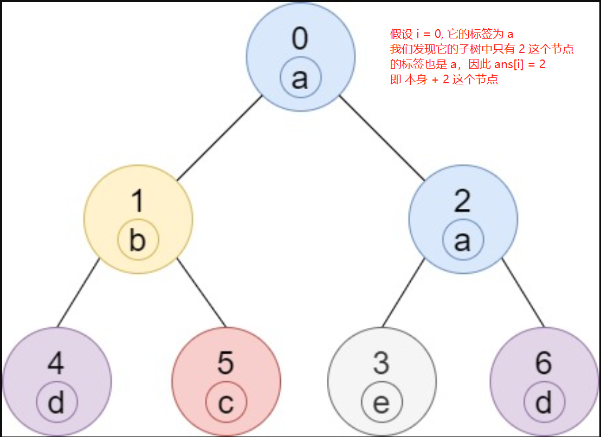
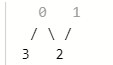
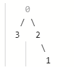

> 原文链接: https://leetcode-cn.com/problems/number-of-nodes-in-the-sub-tree-with-the-same-label


## 英文原文
<div><p>Given a tree (i.e. a connected, undirected graph that has no cycles) consisting of <code>n</code> nodes numbered from <code>0</code> to <code>n - 1</code> and exactly <code>n - 1</code> <code>edges</code>. The <strong>root</strong> of the tree is the node <code>0</code>, and each node of the tree has <strong>a label</strong> which is a lower-case character given in the string <code>labels</code> (i.e. The node with the number <code>i</code> has the label <code>labels[i]</code>).</p>

<p>The <code>edges</code> array is given on the form <code>edges[i] = [a<sub>i</sub>, b<sub>i</sub>]</code>, which means there is an edge between nodes <code>a<sub>i</sub></code> and <code>b<sub>i</sub></code> in the tree.</p>

<p>Return <em>an array of size <code>n</code></em> where <code>ans[i]</code> is the number of nodes in the subtree of the&nbsp;<code>i<sup>th</sup></code>&nbsp;node which have the same label as node <code>i</code>.</p>

<p>A&nbsp;subtree&nbsp;of a tree&nbsp;<code>T</code> is the tree consisting of a node in <code>T</code> and all of its descendant&nbsp;nodes.</p>

<p>&nbsp;</p>
<p><strong>Example 1:</strong></p>

<pre>
<strong>Input:</strong> n = 7, edges = [[0,1],[0,2],[1,4],[1,5],[2,3],[2,6]], labels = &quot;abaedcd&quot;
<strong>Output:</strong> [2,1,1,1,1,1,1]
<strong>Explanation:</strong> Node 0 has label &#39;a&#39; and its sub-tree has node 2 with label &#39;a&#39; as well, thus the answer is 2. Notice that any node is part of its sub-tree.
Node 1 has a label &#39;b&#39;. The sub-tree of node 1 contains nodes 1,4 and 5, as nodes 4 and 5 have different labels than node 1, the answer is just 1 (the node itself).
</pre>

<p><strong>Example 2:</strong></p>

<pre>
<strong>Input:</strong> n = 4, edges = [[0,1],[1,2],[0,3]], labels = &quot;bbbb&quot;
<strong>Output:</strong> [4,2,1,1]
<strong>Explanation:</strong> The sub-tree of node 2 contains only node 2, so the answer is 1.
The sub-tree of node 3 contains only node 3, so the answer is 1.
The sub-tree of node 1 contains nodes 1 and 2, both have label &#39;b&#39;, thus the answer is 2.
The sub-tree of node 0 contains nodes 0, 1, 2 and 3, all with label &#39;b&#39;, thus the answer is 4.
</pre>

<p><strong>Example 3:</strong></p>

<pre>
<strong>Input:</strong> n = 5, edges = [[0,1],[0,2],[1,3],[0,4]], labels = &quot;aabab&quot;
<strong>Output:</strong> [3,2,1,1,1]
</pre>

<p><strong>Example 4:</strong></p>

<pre>
<strong>Input:</strong> n = 6, edges = [[0,1],[0,2],[1,3],[3,4],[4,5]], labels = &quot;cbabaa&quot;
<strong>Output:</strong> [1,2,1,1,2,1]
</pre>

<p><strong>Example 5:</strong></p>

<pre>
<strong>Input:</strong> n = 7, edges = [[0,1],[1,2],[2,3],[3,4],[4,5],[5,6]], labels = &quot;aaabaaa&quot;
<strong>Output:</strong> [6,5,4,1,3,2,1]
</pre>

<p>&nbsp;</p>
<p><strong>Constraints:</strong></p>

<ul>
	<li><code>1 &lt;= n &lt;= 10^5</code></li>
	<li><code>edges.length == n - 1</code></li>
	<li><code>edges[i].length == 2</code></li>
	<li><code>0 &lt;= a<sub>i</sub>,&nbsp;b<sub>i</sub> &lt; n</code></li>
	<li><code>a<sub>i</sub> !=&nbsp;b<sub>i</sub></code></li>
	<li><code>labels.length == n</code></li>
	<li><code>labels</code> is consisting of only of lower-case English letters.</li>
</ul></div>

## 中文题目
<div><p>给你一棵树（即，一个连通的无环无向图），这棵树由编号从 <code>0</code>&nbsp; 到 <code>n - 1</code> 的 n 个节点组成，且恰好有 <code>n - 1</code> 条 <code>edges</code> 。树的根节点为节点 <code>0</code> ，树上的每一个节点都有一个标签，也就是字符串 <code>labels</code> 中的一个小写字符（编号为 <code>i</code> 的 节点的标签就是 <code>labels[i]</code> ）</p>

<p>边数组 <code>edges</code> 以 <code>edges[i] = [a<sub>i</sub>, b<sub>i</sub>]</code> 的形式给出，该格式表示节点 <code>a<sub>i</sub></code> 和 <code>b<sub>i</sub></code> 之间存在一条边。</p>

<p>返回一个大小为 <em><code>n</code></em> 的数组，其中 <code>ans[i]</code> 表示第 <code>i</code> 个节点的子树中与节点 <code>i</code> 标签相同的节点数。</p>

<p>树 <code>T</code> 中的子树是由 <code>T</code> 中的某个节点及其所有后代节点组成的树。</p>

<p>&nbsp;</p>

<p><strong>示例 1：</strong></p>

<p></p>

<pre><strong>输入：</strong>n = 7, edges = [[0,1],[0,2],[1,4],[1,5],[2,3],[2,6]], labels = &quot;abaedcd&quot;
<strong>输出：</strong>[2,1,1,1,1,1,1]
<strong>解释：</strong>节点 0 的标签为 &#39;a&#39; ，以 &#39;a&#39; 为根节点的子树中，节点 2 的标签也是 &#39;a&#39; ，因此答案为 2 。注意树中的每个节点都是这棵子树的一部分。
节点 1 的标签为 &#39;b&#39; ，节点 1 的子树包含节点 1、4 和 5，但是节点 4、5 的标签与节点 1 不同，故而答案为 1（即，该节点本身）。
</pre>

<p><strong>示例 2：</strong></p>

<p></p>

<pre><strong>输入：</strong>n = 4, edges = [[0,1],[1,2],[0,3]], labels = &quot;bbbb&quot;
<strong>输出：</strong>[4,2,1,1]
<strong>解释：</strong>节点 2 的子树中只有节点 2 ，所以答案为 1 。
节点 3 的子树中只有节点 3 ，所以答案为 1 。
节点 1 的子树中包含节点 1 和 2 ，标签都是 &#39;b&#39; ，因此答案为 2 。
节点 0 的子树中包含节点 0、1、2 和 3，标签都是 &#39;b&#39;，因此答案为 4 。
</pre>

<p><strong>示例 3：</strong></p>

<p></p>

<pre><strong>输入：</strong>n = 5, edges = [[0,1],[0,2],[1,3],[0,4]], labels = &quot;aabab&quot;
<strong>输出：</strong>[3,2,1,1,1]
</pre>

<p><strong>示例 4：</strong></p>

<pre><strong>输入：</strong>n = 6, edges = [[0,1],[0,2],[1,3],[3,4],[4,5]], labels = &quot;cbabaa&quot;
<strong>输出：</strong>[1,2,1,1,2,1]
</pre>

<p><strong>示例 5：</strong></p>

<pre><strong>输入：</strong>n = 7, edges = [[0,1],[1,2],[2,3],[3,4],[4,5],[5,6]], labels = &quot;aaabaaa&quot;
<strong>输出：</strong>[6,5,4,1,3,2,1]
</pre>

<p>&nbsp;</p>

<p><strong>提示：</strong></p>

<ul>
	<li><code>1 &lt;= n &lt;= 10^5</code></li>
	<li><code>edges.length == n - 1</code></li>
	<li><code>edges[i].length == 2</code></li>
	<li><code>0 &lt;= a<sub>i</sub>,&nbsp;b<sub>i</sub> &lt; n</code></li>
	<li><code>a<sub>i</sub> !=&nbsp;b<sub>i</sub></code></li>
	<li><code>labels.length == n</code></li>
	<li><code>labels</code> 仅由小写英文字母组成</li>
</ul>
</div>

## 通过代码
<RecoDemo>
</RecoDemo>


## 高赞题解
### 题目说明
给你一棵树, 但实际上一个连通的无环无向图，注意，**这是一个无向图，可以看做以 0 作为根节点的树（后面有个错误，就是关于 0 是根节点这个问题）**

以某个点 i 为根节点，得到 i 的子树中与 i 具有相同标签的子树个数


由于我们需要知道子树的情况，再将子树情况返回给根节点，因此我们使用后序遍历，将子树处理完，将所有的子节点的所有标签 组成数组 返回给根节点

由于只存在 26 个字母，因此我们可以使用一个 26 大小的 int 型数组存储标签

上图的 4 节点，它是叶子节点，因此它的子树加上它所有存在的标签结果是
```java
a b c d e f g h i j k l m n o p q r s t u v w x y z
0 0 0 1 0 0 0 0 0 0 0 0 0 0 0 0 0 0 0 0 0 0 0 0 0 0
```
将这个数组返回给 1 节点

上图的 5 节点，它是叶子节点，因此它的子树加上它所有存在的标签结果是
```java
a b c d e f g h i j k l m n o p q r s t u v w x y z
0 0 1 0 0 0 0 0 0 0 0 0 0 0 0 0 0 0 0 0 0 0 0 0 0 0
```
将这个数组返回给 1 节点

比如上图的 1 节点，我们接收它的子节点，即 4 和 5 返回的数组，综合它们的结果，然后加上自身标签，得到的数组就是 
```java
a b c d e f g h i j k l m n o p q r s t u v w x y z
0 1 1 1 0 0 0 0 0 0 0 0 0 0 0 0 0 0 0 0 0 0 0 0 0 0
```
将这个数组，返回给 1 的父节点 0
### 代码
```java
class Solution {
    public int[] countSubTrees(int n, int[][] edges, String labels) {
        /*
            后序遍历
        */
        List<Integer>[] points = new List[n];
        for(int i = 0; i < n; i++){
            points[i] = new ArrayList<>();
        }
        //记录某个节点的子节点
        for(int[] p : edges){
            //单向添加，只需要知道某个节点的子节点即可
            points[p[0]].add(p[1]);
        }

        //记录每个节点对应的标签
        int[] ls = new int[n];
        for(int i = 0; i < n; i++){
            ls[i] = labels.charAt(i) - 'a';
        }

        res = new int[n];
        //0 是根节点，从 0 出发
        dfs(0, points, ls);
        return res;
    }
    int[] res;
    private int[] dfs(int i, List<Integer>[] points, int[] ls){
        int[] curLs = new int[26];
        //自身标签数 + 1
        curLs[ls[i]]++;
        for(int child : points[i]){
            int[] childLs = dfs(child, points, ls);
            for(int k = 0; k < 26; k++){
                curLs[k] += childLs[k];
            }
        }
        res[i] = curLs[ls[i]];
        //将标签结果返回给父节点
        return curLs;
    }
}
```
### 错误产生
当然，本来以为上面可以过了，不过出现了这么一个用例
```java
输入：
4
[[0,2],[0,3],[1,2]]
"aeed"
输出：
[1,0,1,1]
预期：
[1,1,2,1]
```


我们可以看出，它的图形是这样的

即这样看的话， 2 存在两个父节点，0 和 1，我们上面只添加了每个节点的子节点，然后默认一个节点只有一个父节点，从 0 开始 dfs
所以导致 1 节点对应的结果为 0,因为我们没有遍历到 1

然后继续修改代码，不再只是遍历 0 号节点，而是遍历所有节点
当某个节点的结果为 0 时，表示它没有遍历过（因为如果遍历过了，那么结果至少为 1，即它本身）
```java
for(int i = 0; i < n; i++){
    if(res[i] == 0){
        dfs(i, points, ls);
    }
}
```

但还是错在原来那个用例
```java
输入：
4
[[0,2],[0,3],[1,2]]
"aeed"
输出：
[1,2,1,1]
预期：
[1,1,2,1]
```

这次 1 节点 和 2 节点的结果反了， 节点 2 的结果为 2， 而 节点 1 的结果为 1
这表示 2 是把 1 当作子节点的，即


因此，我们不能再单单按照 [1, 2] 的顺序将 1 当作 2 的父节点
题目说的无向图的意思就出来了，[1, 2] 不意味着 1 是 2 的父节点，而是存在一条连通的路
这里是 0 能到 2，所以我们应该从 2 出发，真正的路径是 2 -> 1
因此，我们需要进行双向添加
```java
for(int[] p : edges){
    points[p[0]].add(p[1]);
    points[p[1]].add(p[0]);
}
```

使用一个 visited 数组，记录遍历过程中判断节点是否已经遍历过

### 最终代码
```java
class Solution {
    public int[] countSubTrees(int n, int[][] edges, String labels) {
        /*
            后序遍历
        */
        List<Integer>[] points = new List[n];
        for(int i = 0; i < n; i++){
            points[i] = new ArrayList<>();
        }
        for(int[] p : edges){
            points[p[0]].add(p[1]);
            points[p[1]].add(p[0]);
        }

        int[] ls = new int[n];
        for(int i = 0; i < n; i++){
            ls[i] = labels.charAt(i) - 'a';
        }

        res = new int[n];
        visited = new boolean[n];
        visited[0] = true;
        dfs(0, points, ls);
        return res;
    }
    int[] res;
    boolean[] visited;
    private int[] dfs(int i, List<Integer>[] points, int[] ls){
        int[] curLs = new int[26];
        //添加自身节点
        curLs[ls[i]]++;
        for(int child : points[i]){
            /*
                判断是否已经遍历过该节点，如果遍历过，那么跳过
                因为这是无向图, 1 可以到 2，2 也可以到 1，因此，当 1 到 2 的时候，我们需要记录 1 已经访问
                这样，从 2 出发，就不会再到 1 了
            */
            if(visited[child]){
                continue;
            }
            visited[child] = true;
            int[] childLs = dfs(child, points, ls);
            for(int k = 0; k < 26; k++){
                curLs[k] += childLs[k];
            }
        }
        res[i] = curLs[ls[i]];
        return curLs;
    }
}
```


## 统计信息
| 通过次数 | 提交次数 | AC比率 |
| :------: | :------: | :------: |
|    5628    |    18784    |   30.0%   |

## 提交历史
| 提交时间 | 提交结果 | 执行时间 |  内存消耗  | 语言 |
| :------: | :------: | :------: | :--------: | :--------: |
