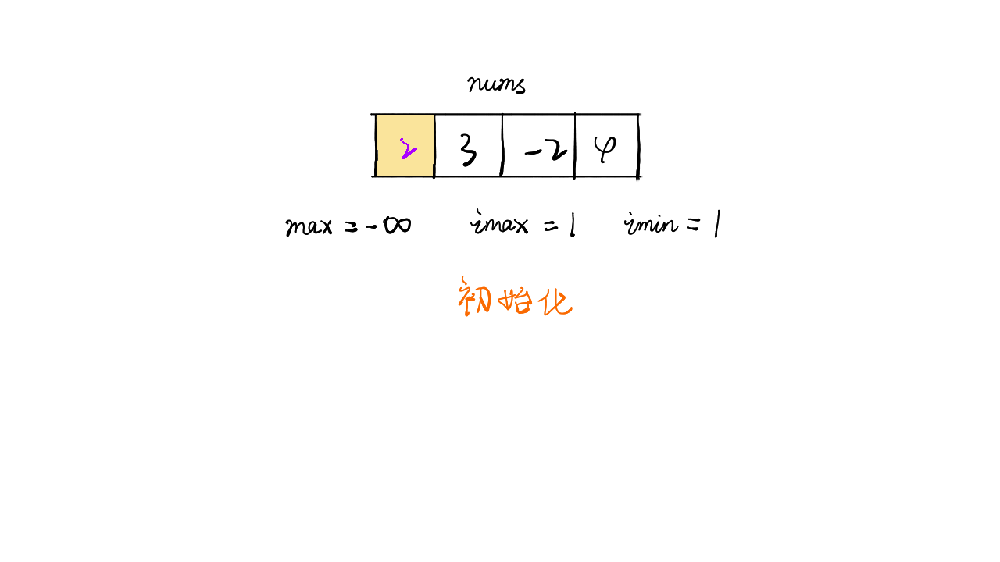
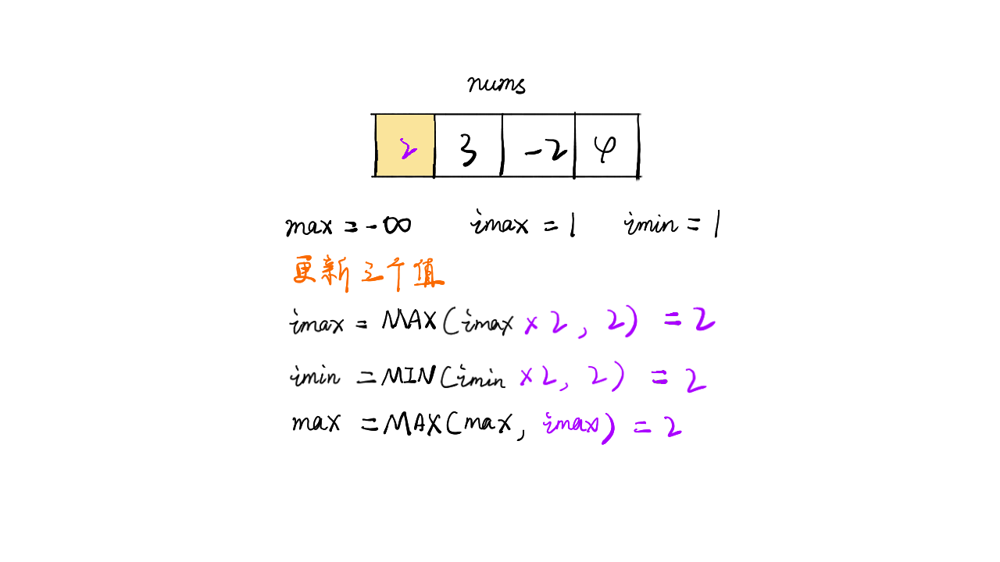
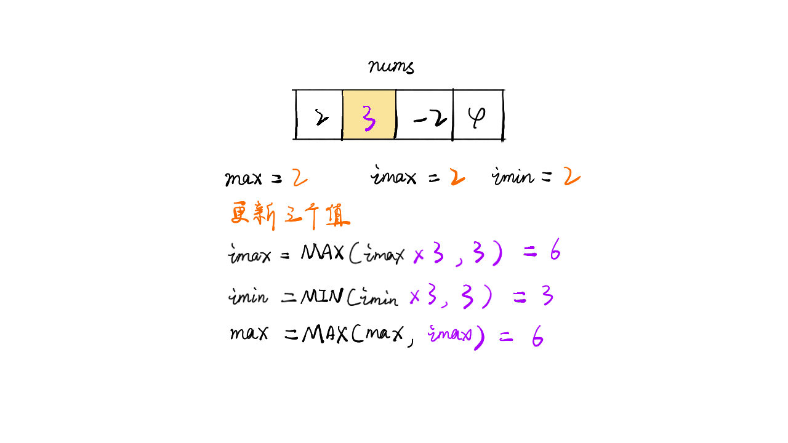
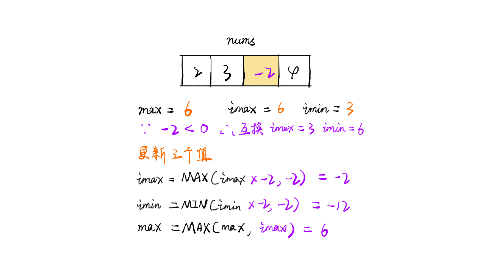
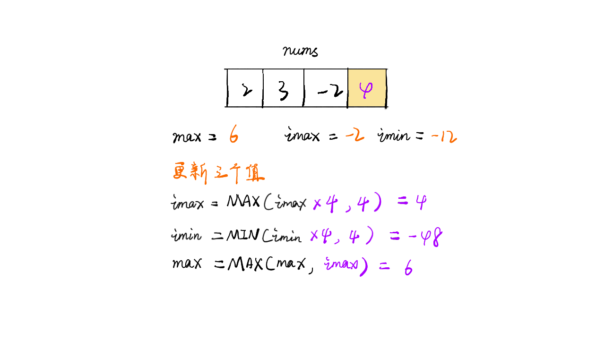
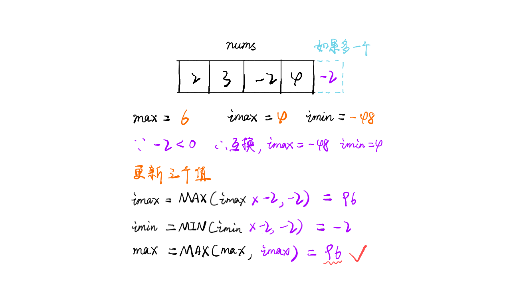

> 原文链接: https://leetcode-cn.com/problems/maximum-product-subarray


## 英文原文
<div><p>Given an integer array <code>nums</code>, find a contiguous non-empty subarray within the array that has the largest product, and return <em>the product</em>.</p>

<p>It is <strong>guaranteed</strong> that the answer will fit in a <strong>32-bit</strong> integer.</p>

<p>A <strong>subarray</strong> is a contiguous subsequence of the array.</p>

<p>&nbsp;</p>
<p><strong>Example 1:</strong></p>

<pre>
<strong>Input:</strong> nums = [2,3,-2,4]
<strong>Output:</strong> 6
<strong>Explanation:</strong> [2,3] has the largest product 6.
</pre>

<p><strong>Example 2:</strong></p>

<pre>
<strong>Input:</strong> nums = [-2,0,-1]
<strong>Output:</strong> 0
<strong>Explanation:</strong> The result cannot be 2, because [-2,-1] is not a subarray.
</pre>

<p>&nbsp;</p>
<p><strong>Constraints:</strong></p>

<ul>
	<li><code>1 &lt;= nums.length &lt;= 2 * 10<sup>4</sup></code></li>
	<li><code>-10 &lt;= nums[i] &lt;= 10</code></li>
	<li>The product of any prefix or suffix of <code>nums</code> is <strong>guaranteed</strong> to fit in a <strong>32-bit</strong> integer.</li>
</ul>
</div>

## 中文题目
<div><p>给你一个整数数组 <code>nums</code>&nbsp;，请你找出数组中乘积最大的连续子数组（该子数组中至少包含一个数字），并返回该子数组所对应的乘积。</p>

<p>&nbsp;</p>

<p><strong>示例 1:</strong></p>

<pre><strong>输入:</strong> [2,3,-2,4]
<strong>输出:</strong> <code>6</code>
<strong>解释:</strong>&nbsp;子数组 [2,3] 有最大乘积 6。
</pre>

<p><strong>示例 2:</strong></p>

<pre><strong>输入:</strong> [-2,0,-1]
<strong>输出:</strong> 0
<strong>解释:</strong>&nbsp;结果不能为 2, 因为 [-2,-1] 不是子数组。</pre>
</div>

## 通过代码
<RecoDemo>
</RecoDemo>


## 高赞题解
### 解题思路

- 标签：动态规划
- 遍历数组时计算当前最大值，不断更新
- 令imax为当前最大值，则当前最大值为 `imax = max(imax * nums[i], nums[i])`
- 由于存在负数，那么会导致最大的变最小的，最小的变最大的。因此还需要维护当前最小值imin，`imin = min(imin * nums[i], nums[i])`
- 当负数出现时则imax与imin进行交换再进行下一步计算
- 时间复杂度：$O(n)$


### 代码

```java
class Solution {
    public int maxProduct(int[] nums) {
        int max = Integer.MIN_VALUE, imax = 1, imin = 1;
        for(int i=0; i<nums.length; i++){
            if(nums[i] < 0){ 
              int tmp = imax;
              imax = imin;
              imin = tmp;
            }
            imax = Math.max(imax*nums[i], nums[i]);
            imin = Math.min(imin*nums[i], nums[i]);
            
            max = Math.max(max, imax);
        }
        return max;
    }
}
```

### 画解


<,,,,,,>

点击我的头像加关注，和我一起打卡天天算法

想看大鹏画解更多高频面试题，欢迎阅读大鹏的 LeetBook：[《画解剑指 Offer 》](https://leetcode-cn.com/leetbook/detail/illustrate-lcof/)，O(∩_∩)O

## 统计信息
| 通过次数 | 提交次数 | AC比率 |
| :------: | :------: | :------: |
|    200236    |    474392    |   42.2%   |

## 提交历史
| 提交时间 | 提交结果 | 执行时间 |  内存消耗  | 语言 |
| :------: | :------: | :------: | :--------: | :--------: |


## 相似题目
|                             题目                             | 难度 |
| :----------------------------------------------------------: | :---------: |
| [最大子数组和](https://leetcode-cn.com/problems/maximum-subarray/) | 简单|
| [打家劫舍](https://leetcode-cn.com/problems/house-robber/) | 中等|
| [除自身以外数组的乘积](https://leetcode-cn.com/problems/product-of-array-except-self/) | 中等|
| [三个数的最大乘积](https://leetcode-cn.com/problems/maximum-product-of-three-numbers/) | 简单|
| [乘积小于K的子数组](https://leetcode-cn.com/problems/subarray-product-less-than-k/) | 中等|
