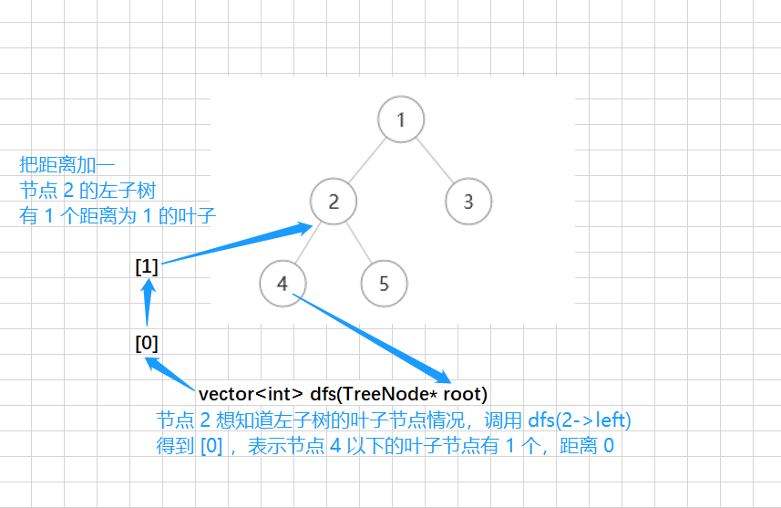
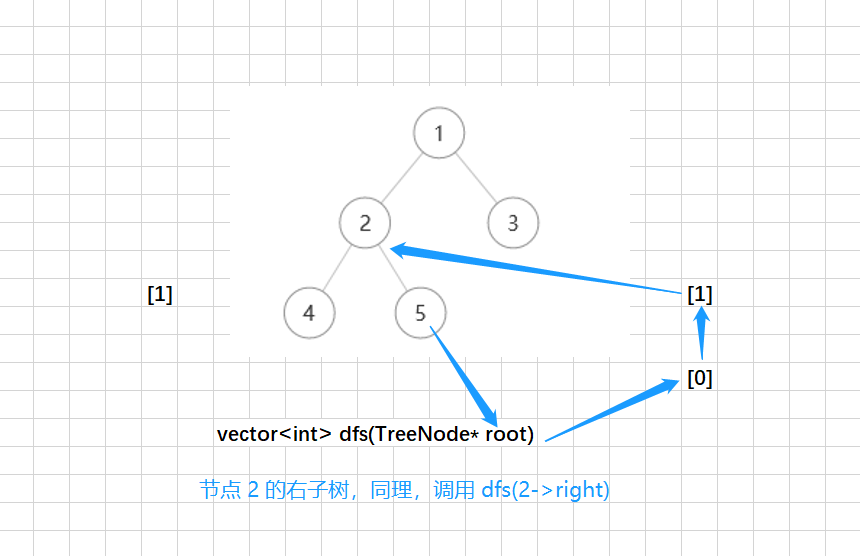
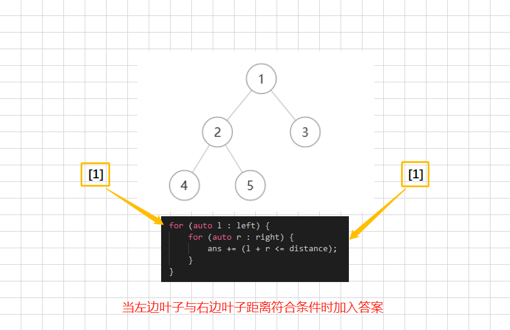
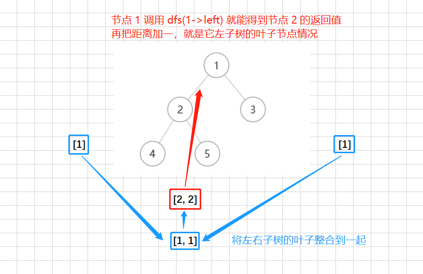

> 原文链接: https://leetcode-cn.com/problems/number-of-good-leaf-nodes-pairs


## 英文原文
<div><p>Given the <code>root</code> of a binary tree and an integer <code>distance</code>. A pair of two different <strong>leaf</strong> nodes of a binary tree is said to be good if the length of <strong>the shortest path</strong> between them is less than or equal to <code>distance</code>.</p>

<p>Return <em>the number of good leaf node pairs</em> in the tree.</p>

<p>&nbsp;</p>
<p><strong>Example 1:</strong></p>

<pre>
<strong>Input:</strong> root = [1,2,3,null,4], distance = 3
<strong>Output:</strong> 1
<strong>Explanation:</strong> The leaf nodes of the tree are 3 and 4 and the length of the shortest path between them is 3. This is the only good pair.
</pre>

<p><strong>Example 2:</strong></p>

<pre>
<strong>Input:</strong> root = [1,2,3,4,5,6,7], distance = 3
<strong>Output:</strong> 2
<strong>Explanation:</strong> The good pairs are [4,5] and [6,7] with shortest path = 2. The pair [4,6] is not good because the length of ther shortest path between them is 4.
</pre>

<p><strong>Example 3:</strong></p>

<pre>
<strong>Input:</strong> root = [7,1,4,6,null,5,3,null,null,null,null,null,2], distance = 3
<strong>Output:</strong> 1
<strong>Explanation:</strong> The only good pair is [2,5].
</pre>

<p><strong>Example 4:</strong></p>

<pre>
<strong>Input:</strong> root = [100], distance = 1
<strong>Output:</strong> 0
</pre>

<p><strong>Example 5:</strong></p>

<pre>
<strong>Input:</strong> root = [1,1,1], distance = 2
<strong>Output:</strong> 1
</pre>

<p>&nbsp;</p>
<p><strong>Constraints:</strong></p>

<ul>
	<li>The number of nodes in the&nbsp;<code>tree</code>&nbsp;is in the range&nbsp;<code>[1, 2^10].</code></li>
	<li>Each node&#39;s value is between&nbsp;<code>[1, 100]</code>.</li>
	<li><code>1 &lt;= distance &lt;= 10</code></li>
</ul></div>

## 中文题目
<div><p>给你二叉树的根节点 <code>root</code> 和一个整数 <code>distance</code> 。</p>

<p>如果二叉树中两个 <strong>叶</strong> 节点之间的 <strong>最短路径长度</strong> 小于或者等于 <code>distance</code> ，那它们就可以构成一组 <strong>好叶子节点对</strong> 。</p>

<p>返回树中 <strong>好叶子节点对的数量</strong> 。</p>

<p>&nbsp;</p>

<p><strong>示例 1：</strong></p>

<p>&nbsp;</p>

<p></p>

<pre><strong>输入：</strong>root = [1,2,3,null,4], distance = 3
<strong>输出：</strong>1
<strong>解释：</strong>树的叶节点是 3 和 4 ，它们之间的最短路径的长度是 3 。这是唯一的好叶子节点对。
</pre>

<p><strong>示例 2：</strong></p>

<p></p>

<pre><strong>输入：</strong>root = [1,2,3,4,5,6,7], distance = 3
<strong>输出：</strong>2
<strong>解释：</strong>好叶子节点对为 [4,5] 和 [6,7] ，最短路径长度都是 2 。但是叶子节点对 [4,6] 不满足要求，因为它们之间的最短路径长度为 4 。
</pre>

<p><strong>示例 3：</strong></p>

<pre><strong>输入：</strong>root = [7,1,4,6,null,5,3,null,null,null,null,null,2], distance = 3
<strong>输出：</strong>1
<strong>解释：</strong>唯一的好叶子节点对是 [2,5] 。
</pre>

<p><strong>示例 4：</strong></p>

<pre><strong>输入：</strong>root = [100], distance = 1
<strong>输出：</strong>0
</pre>

<p><strong>示例 5：</strong></p>

<pre><strong>输入：</strong>root = [1,1,1], distance = 2
<strong>输出：</strong>1
</pre>

<p>&nbsp;</p>

<p><strong>提示：</strong></p>

<ul>
	<li><code>tree</code> 的节点数在 <code>[1, 2^10]</code> 范围内。</li>
	<li>每个节点的值都在 <code>[1, 100]</code> 之间。</li>
	<li><code>1 &lt;= distance &lt;= 10</code></li>
</ul>
</div>

## 通过代码
<RecoDemo>
</RecoDemo>


## 高赞题解
### 思路
1. `root->val` 没用，父节点和子节点的距离是 $1$ 
2. 对树后序遍历 ，需要返回这个节点到其下方所有叶子节点的距离
3. 这样就可以将这个节点的左子树所有叶子节点和右子树所有叶子节点都凑个对
4. 然后将所有叶子节点不超过距离的弄到一起返回

### 图解
<,,,>


### 答题
```C++ []
class Solution {
public:
    int countPairs(TreeNode* root, int distance) {
        int ans = 0;
        dfs(root, distance, ans);
        return ans;
    }

    vector<int> dfs(TreeNode* root, int distance, int& ans) {
        if (root == nullptr) return {};
        if (root->left == nullptr && root->right == nullptr) return { 0 };

        vector<int> ret;
        auto left = dfs(root->left, distance, ans);
        for (auto& e : left) {
            if (++e > distance) continue;
            ret.push_back(e);
        }
        auto right = dfs(root->right, distance, ans);
        for (auto& e : right) {
            if (++e > distance) continue;
            ret.push_back(e);
        }

        for (auto l : left) {
            for (auto r : right) {
                ans += (l + r <= distance);
            }
        }

        return ret;
    }
};
```

### 致谢

感谢您的观看，希望对您有帮助，欢迎热烈的交流！  

## 统计信息
| 通过次数 | 提交次数 | AC比率 |
| :------: | :------: | :------: |
|    8983    |    15741    |   57.1%   |

## 提交历史
| 提交时间 | 提交结果 | 执行时间 |  内存消耗  | 语言 |
| :------: | :------: | :------: | :--------: | :--------: |
