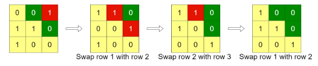

> 原文链接: https://leetcode-cn.com/problems/minimum-swaps-to-arrange-a-binary-grid


## 英文原文
<div><p>Given an <code>n x n</code> binary <code>grid</code>, in one step you can choose two <strong>adjacent rows</strong> of the grid and swap them.</p>

<p>A grid is said to be <strong>valid</strong> if all the cells above the main diagonal are <strong>zeros</strong>.</p>

<p>Return <em>the minimum number of steps</em> needed to make the grid valid, or <strong>-1</strong> if the grid cannot be valid.</p>

<p>The main diagonal of a grid is the diagonal that starts at cell <code>(1, 1)</code> and ends at cell <code>(n, n)</code>.</p>

<p>&nbsp;</p>
<p><strong>Example 1:</strong></p>

<pre>
<strong>Input:</strong> grid = [[0,0,1],[1,1,0],[1,0,0]]
<strong>Output:</strong> 3
</pre>

<p><strong>Example 2:</strong></p>

<pre>
<strong>Input:</strong> grid = [[0,1,1,0],[0,1,1,0],[0,1,1,0],[0,1,1,0]]
<strong>Output:</strong> -1
<strong>Explanation:</strong> All rows are similar, swaps have no effect on the grid.
</pre>

<p><strong>Example 3:</strong></p>

<pre>
<strong>Input:</strong> grid = [[1,0,0],[1,1,0],[1,1,1]]
<strong>Output:</strong> 0
</pre>

<p>&nbsp;</p>
<p><strong>Constraints:</strong></p>

<ul>
	<li><code>n == grid.length</code> <code>== grid[i].length</code></li>
	<li><code>1 &lt;= n &lt;= 200</code></li>
	<li><code>grid[i][j]</code> is either <code>0</code> or <code>1</code></li>
</ul>
</div>

## 中文题目
<div><p>给你一个&nbsp;<code>n&nbsp;x n</code>&nbsp;的二进制网格&nbsp;<code>grid</code>，每一次操作中，你可以选择网格的&nbsp;<strong>相邻两行</strong>&nbsp;进行交换。</p>

<p>一个符合要求的网格需要满足主对角线以上的格子全部都是 <strong>0</strong>&nbsp;。</p>

<p>请你返回使网格满足要求的最少操作次数，如果无法使网格符合要求，请你返回 <strong>-1</strong>&nbsp;。</p>

<p>主对角线指的是从&nbsp;<code>(1, 1)</code>&nbsp;到&nbsp;<code>(n, n)</code>&nbsp;的这些格子。</p>

<p>&nbsp;</p>

<p><strong>示例 1：</strong></p>

<p></p>

<pre><strong>输入：</strong>grid = [[0,0,1],[1,1,0],[1,0,0]]
<strong>输出：</strong>3
</pre>

<p><strong>示例 2：</strong></p>

<p></p>

<pre><strong>输入：</strong>grid = [[0,1,1,0],[0,1,1,0],[0,1,1,0],[0,1,1,0]]
<strong>输出：</strong>-1
<strong>解释：</strong>所有行都是一样的，交换相邻行无法使网格符合要求。
</pre>

<p><strong>示例 3：</strong></p>

<p></p>

<pre><strong>输入：</strong>grid = [[1,0,0],[1,1,0],[1,1,1]]
<strong>输出：</strong>0
</pre>

<p>&nbsp;</p>

<p><strong>提示：</strong></p>

<ul>
	<li><code>n == grid.length</code></li>
	<li><code>n == grid[i].length</code></li>
	<li><code>1 &lt;= n&nbsp;&lt;= 200</code></li>
	<li><code>grid[i][j]</code>&nbsp;要么是&nbsp;<code>0</code>&nbsp;要么是&nbsp;<code>1</code>&nbsp;。</li>
</ul>
</div>

## 通过代码
<RecoDemo>
</RecoDemo>


## 高赞题解
### 解题思路：
这道题看似花里胡哨，转换一下类似一道排序。
<br>


要想实现对角线以上格子全是 $0$，那么我们只需要记录，每一行从后往前遍历，连续0的个数。
并且，（假设是 `n x n` 网格）
- 第一行是后缀 $0$必须大于等于 `n - 1`
- 第二行后缀 $0$ 必须大于等于 `n - 2` 
- ……
- 0
发现了这个规律之后，我们就可以根据贪心来找数了。


**贪心的思路：**
- 从第一行开始，如果该行的后缀 $0$ 满足条件，那么直接跳过进入下一行（因为需要的后缀 $0$ 个数是从大到小的顺序，所以不必担心前面的会抢后面的）
- 如果该行后缀 $0$ 个数不满足条件，那么就往下遍历找到**最先**（**贪心，这是最小次数**）**满足条件的行**，一行一行换上来，记录交换的次数（因为题目条件是只能相邻行之间交换，即使换的途中，中间某一行出现了符合的情况，若其上一行不满足后缀 $0$ 个数，我们还是得移动）
- 如果找不到满足条件的后缀0，那么就返回 `-1`。
<br>
```C++ []
class Solution {
public:
    int minSwaps(vector<vector<int>>& grid) {
        int n = grid.size(); //网格规模
        vector<int> a; //记录每一行后缀0个数的数组
        for(int i = 0; i < n; i++)
        {
            int count = 0;
            for(int j = n - 1; j >= 0; j--)
            {
                if(grid[i][j] == 0) count++; //数每一行的后缀0
                else break;
            }
            a.push_back(count); 
        }
        int count = 0; //交换次数
        for(int i = 0; i < n - 1; i++)
        {
            if(a[i] >= n - i - 1) continue;//满足条件，该行直接跳过
            else{//不满足条件
                int j = i; //用新参数遍历找满足条件的后缀0
                for(; j < n; j++)
                {
                    if(a[j] >= n - i - 1) break;
                }
                if(j == n) return -1; //找不到，直接返回-1
                for(; j > i; j--) //找到了最先满足条件的后缀0个数 
                {
                    swap(a[j], a[j - 1]); //每一行交换上去
                    count++; //记录交换次数
                }
            }
        }
        return count;
    }
};
```




## 统计信息
| 通过次数 | 提交次数 | AC比率 |
| :------: | :------: | :------: |
|    4193    |    9470    |   44.3%   |

## 提交历史
| 提交时间 | 提交结果 | 执行时间 |  内存消耗  | 语言 |
| :------: | :------: | :------: | :--------: | :--------: |
