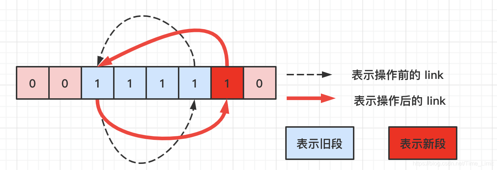
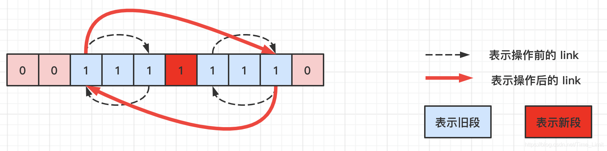

> 原文链接: https://leetcode-cn.com/problems/find-latest-group-of-size-m


## 英文原文
<div><p>Given an array <code>arr</code> that represents a permutation of numbers from <code>1</code> to <code>n</code>.</p>

<p>You have a binary string of size <code>n</code> that initially has all its bits set to zero. At each step <code>i</code> (assuming both the binary string and <code>arr</code> are 1-indexed) from <code>1</code> to <code>n</code>, the bit at position <code>arr[i]</code> is set to <code>1</code>.</p>

<p>You are also given an integer <code>m</code>. Find the latest step at which there exists a group of ones of length <code>m</code>. A group of ones is a contiguous substring of <code>1</code>&#39;s such that it cannot be extended in either direction.</p>

<p>Return <em>the latest step at which there exists a group of ones of length <strong>exactly</strong></em> <code>m</code>. <em>If no such group exists, return</em> <code>-1</code>.</p>

<p>&nbsp;</p>
<p><strong>Example 1:</strong></p>

<pre>
<strong>Input:</strong> arr = [3,5,1,2,4], m = 1
<strong>Output:</strong> 4
<strong>Explanation:
</strong>Step 1: &quot;00<u>1</u>00&quot;, groups: [&quot;1&quot;]
Step 2: &quot;0010<u>1</u>&quot;, groups: [&quot;1&quot;, &quot;1&quot;]
Step 3: &quot;<u>1</u>0101&quot;, groups: [&quot;1&quot;, &quot;1&quot;, &quot;1&quot;]
Step 4: &quot;1<u>1</u>101&quot;, groups: [&quot;111&quot;, &quot;1&quot;]
Step 5: &quot;111<u>1</u>1&quot;, groups: [&quot;11111&quot;]
The latest step at which there exists a group of size 1 is step 4.</pre>

<p><strong>Example 2:</strong></p>

<pre>
<strong>Input:</strong> arr = [3,1,5,4,2], m = 2
<strong>Output:</strong> -1
<strong>Explanation:
</strong>Step 1: &quot;00<u>1</u>00&quot;, groups: [&quot;1&quot;]
Step 2: &quot;<u>1</u>0100&quot;, groups: [&quot;1&quot;, &quot;1&quot;]
Step 3: &quot;1010<u>1</u>&quot;, groups: [&quot;1&quot;, &quot;1&quot;, &quot;1&quot;]
Step 4: &quot;101<u>1</u>1&quot;, groups: [&quot;1&quot;, &quot;111&quot;]
Step 5: &quot;1<u>1</u>111&quot;, groups: [&quot;11111&quot;]
No group of size 2 exists during any step.
</pre>

<p><strong>Example 3:</strong></p>

<pre>
<strong>Input:</strong> arr = [1], m = 1
<strong>Output:</strong> 1
</pre>

<p><strong>Example 4:</strong></p>

<pre>
<strong>Input:</strong> arr = [2,1], m = 2
<strong>Output:</strong> 2
</pre>

<p>&nbsp;</p>
<p><strong>Constraints:</strong></p>

<ul>
	<li><code>n == arr.length</code></li>
	<li><code>1 &lt;= m &lt;= n &lt;= 10<sup>5</sup></code></li>
	<li><code>1 &lt;= arr[i] &lt;= n</code></li>
	<li>All integers in <code>arr</code> are <strong>distinct</strong>.</li>
</ul>
</div>

## 中文题目
<div><p>给你一个数组 <code>arr</code> ，该数组表示一个从 <code>1</code> 到 <code>n</code> 的数字排列。有一个长度为 <code>n</code> 的二进制字符串，该字符串上的所有位最初都设置为 <code>0</code> 。</p>

<p>在从 <code>1</code> 到 <code>n</code> 的每个步骤 <code>i</code> 中（假设二进制字符串和 <code>arr</code> 都是从 <code>1</code> 开始索引的情况下），二进制字符串上位于位置 <code>arr[i]</code> 的位将会设为 <code>1</code> 。</p>

<p>给你一个整数 <code>m</code> ，请你找出二进制字符串上存在长度为 <code>m</code> 的一组 <code>1</code> 的最后步骤。一组 <code>1</code> 是一个连续的、由 <code>1</code> 组成的子串，且左右两边不再有可以延伸的 <code>1</code> 。</p>

<p>返回存在长度 <strong>恰好</strong> 为 <code>m</code> 的 <strong>一组 <code>1</code>&nbsp;</strong> 的最后步骤。如果不存在这样的步骤，请返回 <code>-1</code> 。</p>

<p>&nbsp;</p>

<p><strong>示例 1：</strong></p>

<pre><strong>输入：</strong>arr = [3,5,1,2,4], m = 1
<strong>输出：</strong>4
<strong>解释：
</strong>步骤 1：&quot;00<strong>1</strong>00&quot;，由 1 构成的组：[&quot;1&quot;]
步骤 2：&quot;0010<strong>1</strong>&quot;，由 1 构成的组：[&quot;1&quot;, &quot;1&quot;]
步骤 3：&quot;<strong>1</strong>0101&quot;，由 1 构成的组：[&quot;1&quot;, &quot;1&quot;, &quot;1&quot;]
步骤 4：&quot;1<strong>1</strong>101&quot;，由 1 构成的组：[&quot;111&quot;, &quot;1&quot;]
步骤 5：&quot;111<strong>1</strong>1&quot;，由 1 构成的组：[&quot;11111&quot;]
存在长度为 1 的一组 1 的最后步骤是步骤 4 。</pre>

<p><strong>示例 2：</strong></p>

<pre><strong>输入：</strong>arr = [3,1,5,4,2], m = 2
<strong>输出：</strong>-1
<strong>解释：
</strong>步骤 1：&quot;00<strong>1</strong>00&quot;，由 1 构成的组：[&quot;1&quot;]
步骤 2：&quot;<strong>1</strong>0100&quot;，由 1 构成的组：[&quot;1&quot;, &quot;1&quot;]
步骤 3：&quot;1010<strong>1</strong>&quot;，由 1 构成的组：[&quot;1&quot;, &quot;1&quot;, &quot;1&quot;]
步骤 4：&quot;101<strong>1</strong>1&quot;，由 1 构成的组：[&quot;1&quot;, &quot;111&quot;]
步骤 5：&quot;1<strong>1</strong>111&quot;，由 1 构成的组：[&quot;11111&quot;]
不管是哪一步骤都无法形成长度为 2 的一组 1 。
</pre>

<p><strong>示例 3：</strong></p>

<pre><strong>输入：</strong>arr = [1], m = 1
<strong>输出：</strong>1
</pre>

<p><strong>示例 4：</strong></p>

<pre><strong>输入：</strong>arr = [2,1], m = 2
<strong>输出：</strong>2
</pre>

<p>&nbsp;</p>

<p><strong>提示：</strong></p>

<ul>
	<li><code>n == arr.length</code></li>
	<li><code>1 &lt;= n &lt;= 10^5</code></li>
	<li><code>1 &lt;= arr[i] &lt;= n</code></li>
	<li><code>arr</code> 中的所有整数 <strong>互不相同</strong></li>
	<li><code>1 &lt;= m&nbsp;&lt;= arr.length</code></li>
</ul>
</div>

## 通过代码
<RecoDemo>
</RecoDemo>


## 高赞题解
#### 解题思路：
每操作一次，新增的 1 可能会有如下三种情况：
* 左右都是 0。此时该位置作为 **新增段独立存在**。
* 仅有左边或者右边。此时该位置 **会将某个旧段的长度加 1**。
* 左右都是 1。此时 **该位置会将两个旧段合并成一个新段**。

我们现在维护一个字典 M，M 的 key 表示段的长度，value 表示在字符串中，长度为 key 的段的数量。初始时，M 中无记录。接下来，让我们看下上述三种情况分别对 M 造成了哪些变化。

* 情况一：新增了一个长度为 1 的段。`M[1] += 1`。
* 情况二：删除一个长度为 L 的段，增加一个长度为 L+1的段。`M[L] -= 1；M[L+1] += 1`；
* 情况三：删除两个长度分别为 X，Y 的段，增加一个长度为 `X+Y+1` 的段。
`M[X] -= 1；M[Y] -= 1；M[X+Y+1] += 1`；

然后记录一下 **最后一次使 `M[m]` 不为零的操作** 即可。

另外，还有一个重要问题，**如何确定被删除段的长度呢**？

设有一个数组 link，当 `arr[i]` 为某个段的端点时，`link[i]` 才有意义，其值代表另一个端点的位置。

接下来，上述三种情况如何更新 `link`。
* 情况一：因为长度为 1，所以 `link[i] = i`；
* 情况二：加入新增点成为某个旧段的右端点；
则被删段长度为 `(i-1) - link[i-1] + 1`；`link[link[i-1]] = i`，`link[i] = link[i-1]`。
为左端点时同理，机智的老铁们可自行推导。


* 情况三：左删除段长度为：`(i-1) - link[i-1] + 1`；
有删除段长度为：`link(i+1) - (i+1) + 1`；
更新：`link[link[i-1]]`, `link[link[i+1]] = link[i+1]`, `link[i-1]`。



另外，实现时根本不需要 M，因为我们只关心长度为 m 的段的数量~。
```C++ []
int link[100001] = {0};

class Solution {
public:
    int findLatestStep(vector<int>& arr, int m) {
        int cnt = 0;
        memset(link, -1, sizeof(link));
        int anw = -1;
        for(int i = 0; i < arr.size(); i++) {
            int pos = arr[i] - 1;
            link[pos] = pos;
            int L = pos, R = pos;
            if(0 < pos && link[pos-1] != -1) {
                if(pos-1 - link[pos-1] + 1 == m) {
                    cnt--;
                }
                L = link[pos-1];
            }
            if(pos+1 < arr.size() && link[pos+1] != -1) {
                if(link[pos+1] - (pos+1) + 1 == m) {
                    cnt--;
                }
                R = link[pos+1];
            }
            
            link[L] = R;
            link[R] = L;
            
            if(R-L+1 == m) {
                cnt++;
            }
            if(cnt > 0) {
                anw = i+1;
            }
        }
        return anw;
    }
};
```


## 统计信息
| 通过次数 | 提交次数 | AC比率 |
| :------: | :------: | :------: |
|    4323    |    13932    |   31.0%   |

## 提交历史
| 提交时间 | 提交结果 | 执行时间 |  内存消耗  | 语言 |
| :------: | :------: | :------: | :--------: | :--------: |
