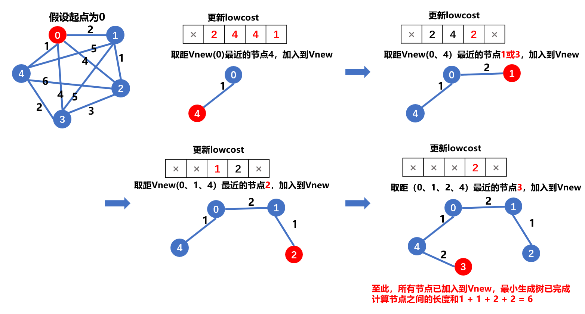
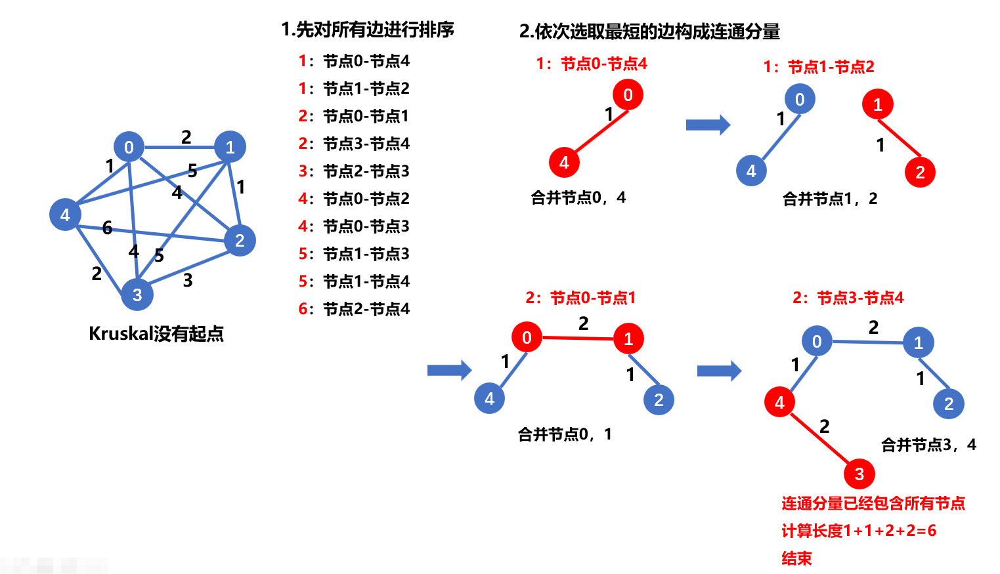

> 原文链接: https://leetcode-cn.com/problems/min-cost-to-connect-all-points


## 英文原文
<div><p>You are given an array&nbsp;<code>points</code>&nbsp;representing integer coordinates of some points on a 2D-plane, where <code>points[i] = [x<sub>i</sub>, y<sub>i</sub>]</code>.</p>

<p>The cost of connecting two points <code>[x<sub>i</sub>, y<sub>i</sub>]</code> and <code>[x<sub>j</sub>, y<sub>j</sub>]</code> is the <strong>manhattan distance</strong> between them:&nbsp;<code>|x<sub>i</sub> - x<sub>j</sub>| + |y<sub>i</sub> - y<sub>j</sub>|</code>, where <code>|val|</code> denotes the absolute value of&nbsp;<code>val</code>.</p>

<p>Return&nbsp;<em>the minimum cost to make all points connected.</em> All points are connected if there is <strong>exactly one</strong> simple path between any two points.</p>

<p>&nbsp;</p>
<p><strong>Example 1:</strong></p>

<p></p>

<pre>
<strong>Input:</strong> points = [[0,0],[2,2],[3,10],[5,2],[7,0]]
<strong>Output:</strong> 20
<strong>Explanation:
</strong>
We can connect the points as shown above to get the minimum cost of 20.
Notice that there is a unique path between every pair of points.
</pre>

<p><strong>Example 2:</strong></p>

<pre>
<strong>Input:</strong> points = [[3,12],[-2,5],[-4,1]]
<strong>Output:</strong> 18
</pre>

<p><strong>Example 3:</strong></p>

<pre>
<strong>Input:</strong> points = [[0,0],[1,1],[1,0],[-1,1]]
<strong>Output:</strong> 4
</pre>

<p><strong>Example 4:</strong></p>

<pre>
<strong>Input:</strong> points = [[-1000000,-1000000],[1000000,1000000]]
<strong>Output:</strong> 4000000
</pre>

<p><strong>Example 5:</strong></p>

<pre>
<strong>Input:</strong> points = [[0,0]]
<strong>Output:</strong> 0
</pre>

<p>&nbsp;</p>
<p><strong>Constraints:</strong></p>

<ul>
	<li><code>1 &lt;= points.length &lt;= 1000</code></li>
	<li><code>-10<sup>6</sup>&nbsp;&lt;= x<sub>i</sub>, y<sub>i</sub> &lt;= 10<sup>6</sup></code></li>
	<li>All pairs <code>(x<sub>i</sub>, y<sub>i</sub>)</code> are distinct.</li>
</ul>
</div>

## 中文题目
<div><p>给你一个<code>points</code>&nbsp;数组，表示 2D 平面上的一些点，其中&nbsp;<code>points[i] = [x<sub>i</sub>, y<sub>i</sub>]</code>&nbsp;。</p>

<p>连接点&nbsp;<code>[x<sub>i</sub>, y<sub>i</sub>]</code> 和点&nbsp;<code>[x<sub>j</sub>, y<sub>j</sub>]</code>&nbsp;的费用为它们之间的 <strong>曼哈顿距离</strong>&nbsp;：<code>|x<sub>i</sub> - x<sub>j</sub>| + |y<sub>i</sub> - y<sub>j</sub>|</code>&nbsp;，其中&nbsp;<code>|val|</code>&nbsp;表示&nbsp;<code>val</code>&nbsp;的绝对值。</p>

<p>请你返回将所有点连接的最小总费用。只有任意两点之间 <strong>有且仅有</strong>&nbsp;一条简单路径时，才认为所有点都已连接。</p>

<p>&nbsp;</p>

<p><strong>示例 1：</strong></p>

<p></p>

<pre>
<strong>输入：</strong>points = [[0,0],[2,2],[3,10],[5,2],[7,0]]
<strong>输出：</strong>20
<strong>解释：
</strong>
我们可以按照上图所示连接所有点得到最小总费用，总费用为 20 。
注意到任意两个点之间只有唯一一条路径互相到达。
</pre>

<p><strong>示例 2：</strong></p>

<pre>
<strong>输入：</strong>points = [[3,12],[-2,5],[-4,1]]
<strong>输出：</strong>18
</pre>

<p><strong>示例 3：</strong></p>

<pre>
<strong>输入：</strong>points = [[0,0],[1,1],[1,0],[-1,1]]
<strong>输出：</strong>4
</pre>

<p><strong>示例 4：</strong></p>

<pre>
<strong>输入：</strong>points = [[-1000000,-1000000],[1000000,1000000]]
<strong>输出：</strong>4000000
</pre>

<p><strong>示例 5：</strong></p>

<pre>
<strong>输入：</strong>points = [[0,0]]
<strong>输出：</strong>0
</pre>

<p>&nbsp;</p>

<p><strong>提示：</strong></p>

<ul>
	<li><code>1 &lt;= points.length &lt;= 1000</code></li>
	<li><code>-10<sup>6</sup>&nbsp;&lt;= x<sub>i</sub>, y<sub>i</sub> &lt;= 10<sup>6</sup></code></li>
	<li>所有点&nbsp;<code>(x<sub>i</sub>, y<sub>i</sub>)</code>&nbsp;两两不同。</li>
</ul>
</div>

## 通过代码
<RecoDemo>
</RecoDemo>


## 高赞题解

连接所有点的最小费用，即最小生成树。

## 方法一： Prim算法

### Part1. 解题思路
抽象（假想:假设存在，但不存在）出两个集合，集合`V`  和集合`Vnew`

- 集合`V`保存未加入到最小生成树中的节点，最开始，所有的图节点都在集合`V`中

- 集合`Vnew`保存已经加入到最小生成树中的节点，如果一个节点加入到了最小生成树中，则将该节点加入到`Vnew`

> 说明： Vnew即最小生成树

### Part2. 数据结构
**Prim算法主要维护2个数组**

- `lowcost 数组`，表示`V`中的节点，保存`V`中每个节点离集合`Vnew`中所有节点的最短距离。如果节点已经加入到了集合`Vnew`中，则置为-1

- `v 数组`，表示`V`中节点的访问情况，最开始全部为`0`,表示未加入到`Vnew`中，若某节点加入到了集合`Vnew`中， 则将其置为`-1`

### Part3. 步骤：

> 1. 随机选择一个起点，将其加入到`Vnew`中。同时，更新此时的数组`lowcost`和数组`v`
> 2. 遍历`lowcost`，寻找`lowcost`中的最小值`min`（假设索引为 `j` ，`j`为`Vnew`中离`V`最近的点），将与索引 `j` 相对应的节点加入到`Vnew`中，并更新数组`lowcost[j]`和数组`v[j]`。
> 3. 找到lowcost中的最小值 `j` 后，此时数组`lowcost`中的所有节点都要更新，因为此时集合`Vnew`中的节点增加了，集合`V`中的节点离`Vnew`的最近距离可能会缩短。
> 4. 根据新加入集合`Vnew`中的节点`j`，更新所有的`lowcost`。
> 5. 重复步骤2,直到访问了所有的节点。

**很明显，最后需要计算的最小生成树中所有节点之间的距离之和 便是每一步迭代时求得的`lowcost`中的最小值`min`的和**

### Part4. 举例：




### Part5. 代码

```cpp
class Solution {
public:
    int prim(vector<vector<int> >& points, int start) {
        int n = points.size();
        int res = 0;
        // 1. 将points转化成邻接矩阵, 这一步可有可无
        vector<vector<int> > g(n, vector<int>(n));
        for (int i = 0; i < n; i++) {
            for (int j = i + 1; j < n; j++) {
                int dist = abs(points[i][0] - points[j][0]) + abs(points[i][1] - points[j][1]);
                g[i][j] = dist;
                g[j][i] = dist;
            }
        }
        // 记录V[i]到Vnew的最近距离
        vector<int> lowcost(n, INT_MAX);
        // 记录V[i]是否加入到了Vnew
        vector<int> v(n, -1);

        // 2. 先将start加入到Vnew
        v[start] = 0;
        for (int i = 0; i < n; i++) {
            if (i == start) continue;
            lowcost[i] = g[i][start];
        }

        // 3. 剩余n - 1个节点未加入到Vnew，遍历
        for (int i = 1; i < n; i++) {
            // 找出此时V中，离Vnew最近的点
            int minIdx = -1;
            int minVal = INT_MAX;
            for (int j = 0; j < n; j++) {
                if (v[j] == 0) continue;
                if (lowcost[j] < minVal) {
                    minIdx = j;
                    minVal = lowcost[j];
                }
            }
            
            // 将该点加入Vnew，更新lowcost和v
            res += minVal;
            v[minIdx] = 0;
            lowcost[minIdx] = -1;

            // 更新集合V中所有点的lowcost
            for (int j = 0; j < n; j++) {
                if (v[j] == -1 && g[j][minIdx] < lowcost[j]) {
                    lowcost[j] = g[j][minIdx];
                }
            }
        }
        return res;

    }
    int minCostConnectPoints(vector<vector<int>>& points) {
        return prim(points, 0);  
    }
};
```

### Part6. 分析

时间复杂度：`O(n * n)`

空间复杂度：`O(n * n)`

> 需要注意的是，这里的`Prim`算法是最常规的实现，每次寻找集合`V`中距离`Vnew`最近的点都有着`O(n)`的时间复杂度。
而在实际应用过程中，可以使用`堆`将算法的时间复杂度降低到`O(m * log(n))`, `m`是连通图的边数，本题中的`m`近似`n`的平方。 
> `Prim`算法的时间复杂度与`堆`的实现方式有关，二叉堆或者斐波拉契堆，具体未深究。


### 补充一个Prim的堆优化
```
class Solution {
public:
    int prim(vector<vector<int> >& points, int start) {
        int n = points.size();
        if (n == 0) return 0;
        int res = 0;

        // 将points转化成邻接表
        vector<vector<int> > g(n);
        for (int i = 0; i < n; i++) {
            for (int j = 0; j < n; j++) {
                if (i == j) continue;
                g[i].push_back(j);
                g[j].push_back(i);
            }
        }
        
        // 记录V[i]到Vnew的最近距离
        vector<int> lowcost(n, INT_MAX);
        // 记录V[i]是否加入到了Vnew
        vector<int> v(n, -1);

        // 格式：<距离, 下标>
        priority_queue<pair<int, int>, vector<pair<int, int> >, greater<> > pq;
        pq.push(make_pair(0, start));
        
        while (!pq.empty()) {
            auto [dist, i] = pq.top();
            pq.pop();
            if (v[i] == 0) continue;
            v[i] = 0;
            res += dist;

            for (int k = 0; k < g[i].size(); k++) {
                int j = g[i][k];
                int w = abs(points[i][0] - points[j][0]) + abs(points[i][1] - points[j][1]);
                if (v[j] == -1 && lowcost[j] > w) {
                    lowcost[j] = w;
                    pq.push(make_pair(w, j));
                }
            }
        }
        return res;

    }
    int minCostConnectPoints(vector<vector<int>>& points) {
        return prim(points, 0);  
    }
};
```


## 方法二、Kruskal（并查集)


### 前言 

如果您对并查集还不是太了解，可以看看我之前的题解[【详解并查集】](https://leetcode-cn.com/problems/most-stones-removed-with-same-row-or-column/solution/tu-jie-bing-cha-ji-by-yexiso-nbcz/)，里面有详细的解释和通用模板。

如果有任何问题，欢迎随时交流！

### Part1. 解题思路

Kruskal算法与prim算法不同：

> Prim算法是以顶点为基础（每次寻找离`Vnew`最近的顶点）；


> 而`Kruskal`算法是以 边 为基础，每次从 边 集合中寻找最小的边（不管两个顶点属于`V`还是`Vnew`），然后判断该边的两个顶点是否同源（属于同一个连通分量）。


> Kruskal需要对所有的边进行排序，然后从小到大，依次遍历每条边，同时判断每条边是否同源，如果同源，跳过；如果不同源，将两个连通分量合并，直到所有顶点属于同一个连通分量，算法结束。


看到这里，数据结构已经很明显了，没错，我们离不开**并查集**了。

### Part2. 数据结构
因为算法要求我们对所有边进行排序，同时需要知道每条边的两个端点

所以可以建立一个结构体/类，保存以上三个属性`<start,end,len>`（**这里称为点-边式**）。

其中`start`和`end`分别为两个顶点，` len`为两顶点的权值，即两点之间的距离
```
struct VP {
    int start; // 顶点1
    int end;   // 顶点2
    int len;   // 长度
};
```
### Part3. 步骤
> 1. 初始化：将图（邻接矩阵或邻接表）转换成`点-边式`，并对`点-边式`按边的长度进行排序。同时，初始化并查集（有关并查集，这里就不过多赘述，具体可以看我的题解[【并查集详解】](https://leetcode-cn.com/problems/most-stones-removed-with-same-row-or-column/solution/tu-jie-bing-cha-ji-by-yexiso-nbcz/)）。
> 2. 依次遍历所有的`点-边式`，每次取最小值。
> 3. 作如下判断：如果该`点-边式`的两个顶点同源，跳过;如果该`点-边式`的两个顶点不同源，则将这两个源（连通分量）合并
> 4. 重复步骤2,直到存在一个连通分量，包含了图中所有的节点
> 5. 算法结束

### Part4. 举例




### Part5. 代码
```
class Djset {
public:
    vector<int> parent; // 记录节点的根
    vector<int> rank;   // 记录根节点的深度（用于优化）
    vector<int> size;   // 记录每个连通分量的节点个数
    vector<int> len;    // 记录每个连通分量里的所有边长度
    int num;            // 记录节点个数
    Djset(int n): parent(n), rank(n), len(n, 0), size(n, 1), num(n) {
        for (int i = 0; i < n; i++) {
            parent[i] = i;
        }
    }

    int find(int x) {
        // 压缩方式：直接指向根节点
        if (x != parent[x]) {
            parent[x] = find(parent[x]);
        }
        return parent[x];
    }

    int merge(int x, int y, int length) {
        int rootx = find(x);
        int rooty = find(y);
        if (rootx != rooty) {
            if (rank[rootx] < rank[rooty]) {
                swap(rootx, rooty);
            }
            parent[rooty] = rootx;
            if (rank[rootx] == rank[rooty]) rank[rootx] += 1;
            // rooty的父节点设置为rootx,同时将rooty的节点数和边长度累加到rootx,
            size[rootx] += size[rooty];
            len[rootx] += len[rooty] + length;
            // 如果某个连通分量的节点数 包含了所有节点，直接返回边长度
            if (size[rootx] == num) return len[rootx];
        }
        return -1;
    }
};
struct Edge {
    int start; // 顶点1
    int end;   // 顶点2
    int len;   // 长度
};

class Solution {
public:
    int minCostConnectPoints(vector<vector<int>>& points) {
        int res = 0;
        int n = points.size();
        Djset ds(n);
        vector<Edge> edges;
        // 建立点-边式数据结构
        for (int i = 0; i < n; i++) {
            for (int j = i + 1; j < n; j++) {
                Edge edge = {i, j, abs(points[i][0] - points[j][0]) + abs(points[i][1] - points[j][1])};
                edges.emplace_back(edge);
            }
        }
        // 按边长度排序
        sort(edges.begin(), edges.end(), [](const auto& a, const auto& b) {
            return a.len < b.len;
        });

        // 连通分量合并
        for (auto& e : edges) {
           res = ds.merge(e.start, e.end, e.len);
           if (res != -1) return res;
        }
        return 0;
    }
};
```

### Part6. 分析

时间复杂度：`O(m log(m) + m α(m) )`, 排序带来了`m log(m)`的时间复杂度，并查集合并带来`m α(m)`的时间复杂度，`m`为索引对的数量,近似于`n * n`。

空间复杂度：`O(n * n)`


## 总结

> Prim算法，该算法以顶点为单元，与图中边数无关，比较适合于稠密图

> Kruskal算法，该算法以边为单元，时间主要取决于边数，比较适合于稀疏图


感谢您的观看，如有错误还请不吝指出！

## 统计信息
| 通过次数 | 提交次数 | AC比率 |
| :------: | :------: | :------: |
|    27486    |    41441    |   66.3%   |

## 提交历史
| 提交时间 | 提交结果 | 执行时间 |  内存消耗  | 语言 |
| :------: | :------: | :------: | :--------: | :--------: |
