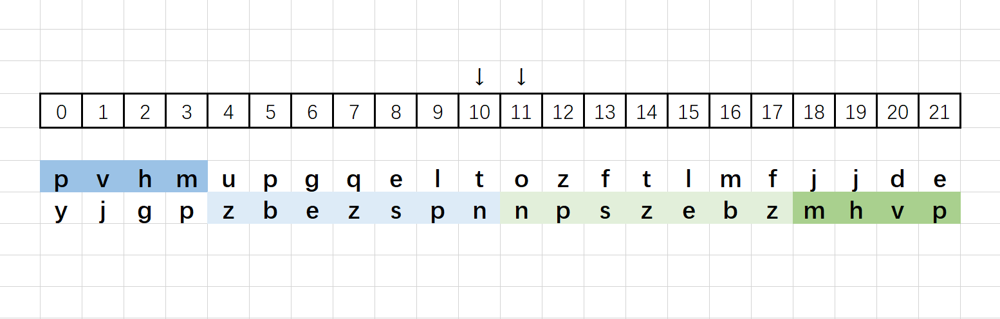

> 原文链接: https://leetcode-cn.com/problems/split-two-strings-to-make-palindrome


## 英文原文
<div><p>You are given two strings <code>a</code> and <code>b</code> of the same length. Choose an index and split both strings <strong>at the same index</strong>, splitting <code>a</code> into two strings: <code>a<sub>prefix</sub></code> and <code>a<sub>suffix</sub></code> where <code>a = a<sub>prefix</sub> + a<sub>suffix</sub></code>, and splitting <code>b</code> into two strings: <code>b<sub>prefix</sub></code> and <code>b<sub>suffix</sub></code> where <code>b = b<sub>prefix</sub> + b<sub>suffix</sub></code>. Check if <code>a<sub>prefix</sub> + b<sub>suffix</sub></code> or <code>b<sub>prefix</sub> + a<sub>suffix</sub></code> forms a palindrome.</p>

<p>When you split a string <code>s</code> into <code>s<sub>prefix</sub></code> and <code>s<sub>suffix</sub></code>, either <code>s<sub>suffix</sub></code> or <code>s<sub>prefix</sub></code> is allowed to be empty. For example, if <code>s = &quot;abc&quot;</code>, then <code>&quot;&quot; + &quot;abc&quot;</code>, <code>&quot;a&quot; + &quot;bc&quot;</code>, <code>&quot;ab&quot; + &quot;c&quot;</code> , and <code>&quot;abc&quot; + &quot;&quot;</code> are valid splits.</p>

<p>Return <code>true</code><em> if it is possible to form</em><em> a palindrome string, otherwise return </em><code>false</code>.</p>

<p><strong>Notice</strong> that&nbsp;<code>x + y</code> denotes the concatenation of strings <code>x</code> and <code>y</code>.</p>

<p>&nbsp;</p>
<p><strong>Example 1:</strong></p>

<pre>
<strong>Input:</strong> a = &quot;x&quot;, b = &quot;y&quot;
<strong>Output:</strong> true
<strong>Explaination:</strong> If either a or b are palindromes the answer is true since you can split in the following way:
a<sub>prefix</sub> = &quot;&quot;, a<sub>suffix</sub> = &quot;x&quot;
b<sub>prefix</sub> = &quot;&quot;, b<sub>suffix</sub> = &quot;y&quot;
Then, a<sub>prefix</sub> + b<sub>suffix</sub> = &quot;&quot; + &quot;y&quot; = &quot;y&quot;, which is a palindrome.
</pre>

<p><strong>Example 2:</strong></p>

<pre>
<strong>Input:</strong> a = &quot;abdef&quot;, b = &quot;fecab&quot;
<strong>Output:</strong> true
</pre>

<p><strong>Example 3:</strong></p>

<pre>
<strong>Input:</strong> a = &quot;ulacfd&quot;, b = &quot;jizalu&quot;
<strong>Output:</strong> true
<strong>Explaination:</strong> Split them at index 3:
a<sub>prefix</sub> = &quot;ula&quot;, a<sub>suffix</sub> = &quot;cfd&quot;
b<sub>prefix</sub> = &quot;jiz&quot;, b<sub>suffix</sub> = &quot;alu&quot;
Then, a<sub>prefix</sub> + b<sub>suffix</sub> = &quot;ula&quot; + &quot;alu&quot; = &quot;ulaalu&quot;, which is a palindrome.
</pre>

<p><strong>Example 4:</strong></p>

<pre>
<strong>Input:</strong> a = &quot;xbdef&quot;, b = &quot;xecab&quot;
<strong>Output:</strong> false
</pre>

<p>&nbsp;</p>
<p><strong>Constraints:</strong></p>

<ul>
	<li><code>1 &lt;= a.length, b.length &lt;= 10<sup>5</sup></code></li>
	<li><code>a.length == b.length</code></li>
	<li><code>a</code> and <code>b</code> consist of lowercase English letters</li>
</ul>
</div>

## 中文题目
<div><p>给你两个字符串 <code>a</code> 和 <code>b</code> ，它们长度相同。请你选择一个下标，将两个字符串都在 <strong>相同的下标 </strong>分割开。由 <code>a</code> 可以得到两个字符串： <code>a<sub>prefix</sub></code> 和 <code>a<sub>suffix</sub></code> ，满足 <code>a = a<sub>prefix</sub> + a<sub>suffix</sub></code><sub> </sub>，同理，由 <code>b</code> 可以得到两个字符串 <code>b<sub>prefix</sub></code> 和 <code>b<sub>suffix</sub></code> ，满足 <code>b = b<sub>prefix</sub> + b<sub>suffix</sub></code> 。请你判断 <code>a<sub>prefix</sub> + b<sub>suffix</sub></code> 或者 <code>b<sub>prefix</sub> + a<sub>suffix</sub></code> 能否构成回文串。</p>

<p>当你将一个字符串 <code>s</code> 分割成 <code>s<sub>prefix</sub></code> 和 <code>s<sub>suffix</sub></code> 时， <code>s<sub>suffix</sub></code> 或者 <code>s<sub>prefix</sub></code> 可以为空。比方说， <code>s = "abc"</code> 那么 <code>"" + "abc"</code> ， <code>"a" + "bc" </code>， <code>"ab" + "c"</code> 和 <code>"abc" + ""</code> 都是合法分割。</p>

<p>如果 <strong>能构成回文字符串</strong> ，那么请返回 <code>true</code>，否则返回<em> </em><code>false</code> 。</p>

<p><strong>注意</strong>， <code>x + y</code> 表示连接字符串 <code>x</code> 和 <code>y</code> 。</p>

<p> </p>

<p><strong>示例 1：</strong></p>

<pre>
<b>输入：</b>a = "x", b = "y"
<b>输出：</b>true
<b>解释：</b>如果 a 或者 b 是回文串，那么答案一定为 true ，因为你可以如下分割：
a<sub>prefix</sub> = "", a<sub>suffix</sub> = "x"
b<sub>prefix</sub> = "", b<sub>suffix</sub> = "y"
那么 a<sub>prefix</sub> + b<sub>suffix</sub> = "" + "y" = "y" 是回文串。
</pre>

<p><strong>示例 2：</strong></p>

<pre>
<strong>输入：</strong>a = "abdef", b = "fecab"
<strong>输出：</strong>true
</pre>

<p><strong>示例 3：</strong></p>

<pre>
<b>输入：</b>a = "ulacfd", b = "jizalu"
<b>输出：</b>true
<b>解释：</b>在下标为 3 处分割：
a<sub>prefix</sub> = "ula", a<sub>suffix</sub> = "cfd"
b<sub>prefix</sub> = "jiz", b<sub>suffix</sub> = "alu"
那么 a<sub>prefix</sub> + b<sub>suffix</sub> = "ula" + "alu" = "ulaalu" 是回文串。</pre>

<p><strong>示例 4：</strong></p>

<pre>
<strong>输入：</strong>a = "xbdef", b = "xecab"
<strong>输出：</strong>false
</pre>

<p> </p>

<p><strong>提示：</strong></p>

<ul>
	<li><code>1 <= a.length, b.length <= 10<sup>5</sup></code></li>
	<li><code>a.length == b.length</code></li>
	<li><code>a</code> 和 <code>b</code> 都只包含小写英文字母</li>
</ul>
</div>

## 通过代码
<RecoDemo>
</RecoDemo>


## 高赞题解
### 思路
1. 题目给出的字符串长度固定，可以直接使用 [中心扩展法](https://leetcode-cn.com/problems/palindromic-substrings/solution/palindromic-substrings-by-ikaruga/) 检测
    1. 由中心向两侧分别检测字符串 a 和 b
    2. 即【前 a 后 a】和【前 b 后 b】
    3. 不断扩展，直到字符不相同，中间部分都是回文串
    4. 结合下图观看，同时检测两条字符串，我们只关心回文更长的那串，具体是哪条更长不重要

2. 当不符合回文串时，有一次机会将两个字符串拼接一下
    1. 继续扩展检测，这次检测拼接后的字符串
    2. 即【前 a 后 b】和【前 b 后 a】
    3. 结合下图观看，因为拼接的字符串既有 a 也有 b，所以之前更长的是哪串都不影响

3. 当再次结束检测时
    1. 如字符再次不相同，则是匹配失败
    2. 如全部匹配，则 `left` 应该为 -1

### 图解

* 如图所示，第一次检测时，字符串 a 的中心并没有回文串，而字符串 b 有一段合法回文串
* 第二次检测时，【前 a 后 b】通过测试
* 最终，【前 a 后 b】和 b 的中心子串组合起来，就是拼接后的回文串（所有有底色的字符）

### 答题
```C++ []
class Solution {
public:
    bool checkPalindromeFormation(string a, string b) {
        int left = a.size() / 2 - 1;
        left = min(check(a, a, left), check(b, b, left));
        left = min(check(a, b, left), check(b, a, left));
        return left == -1;
    }

    int check(string str_l, string str_r, int left) {
        int right = str_l.size() - 1 - left;
        while (left >= 0 && right < str_l.size()) {
            if (str_l[left] != str_r[right]) break;
            left--;
            right++;
        }
        return left;
    }
};
```



### 致谢

感谢您的观看，希望对您有帮助，欢迎热烈的交流！  

**如果感觉还不错就点个赞吧~**

这是 [我的leetcode](https://leetcode-cn.com/u/ikaruga/) ，帮助我收集整理题目，可以方便的 `visual studio` 调试，欢迎关注，star。



## 统计信息
| 通过次数 | 提交次数 | AC比率 |
| :------: | :------: | :------: |
|    5180    |    18737    |   27.6%   |

## 提交历史
| 提交时间 | 提交结果 | 执行时间 |  内存消耗  | 语言 |
| :------: | :------: | :------: | :--------: | :--------: |
