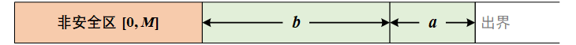
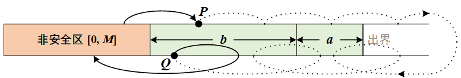

> 原文链接: https://leetcode-cn.com/problems/minimum-jumps-to-reach-home


## 英文原文
<div><p>A certain bug&#39;s home is on the x-axis at position <code>x</code>. Help them get there from position <code>0</code>.</p>

<p>The bug jumps according to the following rules:</p>

<ul>
	<li>It can jump exactly <code>a</code> positions <strong>forward</strong> (to the right).</li>
	<li>It can jump exactly <code>b</code> positions <strong>backward</strong> (to the left).</li>
	<li>It cannot jump backward twice in a row.</li>
	<li>It cannot jump to any <code>forbidden</code> positions.</li>
</ul>

<p>The bug may jump forward <strong>beyond</strong> its home, but it <strong>cannot jump</strong> to positions numbered with <strong>negative</strong> integers.</p>

<p>Given an array of integers <code>forbidden</code>, where <code>forbidden[i]</code> means that the bug cannot jump to the position <code>forbidden[i]</code>, and integers <code>a</code>, <code>b</code>, and <code>x</code>, return <em>the minimum number of jumps needed for the bug to reach its home</em>. If there is no possible sequence of jumps that lands the bug on position <code>x</code>, return <code>-1.</code></p>

<p>&nbsp;</p>
<p><strong>Example 1:</strong></p>

<pre>
<strong>Input:</strong> forbidden = [14,4,18,1,15], a = 3, b = 15, x = 9
<strong>Output:</strong> 3
<strong>Explanation:</strong> 3 jumps forward (0 -&gt; 3 -&gt; 6 -&gt; 9) will get the bug home.
</pre>

<p><strong>Example 2:</strong></p>

<pre>
<strong>Input:</strong> forbidden = [8,3,16,6,12,20], a = 15, b = 13, x = 11
<strong>Output:</strong> -1
</pre>

<p><strong>Example 3:</strong></p>

<pre>
<strong>Input:</strong> forbidden = [1,6,2,14,5,17,4], a = 16, b = 9, x = 7
<strong>Output:</strong> 2
<strong>Explanation:</strong> One jump forward (0 -&gt; 16) then one jump backward (16 -&gt; 7) will get the bug home.
</pre>

<p>&nbsp;</p>
<p><strong>Constraints:</strong></p>

<ul>
	<li><code>1 &lt;= forbidden.length &lt;= 1000</code></li>
	<li><code>1 &lt;= a, b, forbidden[i] &lt;= 2000</code></li>
	<li><code>0 &lt;= x &lt;= 2000</code></li>
	<li>All the elements in <code>forbidden</code> are distinct.</li>
	<li>Position <code>x</code> is not forbidden.</li>
</ul>
</div>

## 中文题目
<div><p>有一只跳蚤的家在数轴上的位置 <code>x</code> 处。请你帮助它从位置 <code>0</code> 出发，到达它的家。</p>

<p>跳蚤跳跃的规则如下：</p>

<ul>
	<li>它可以 <strong>往前</strong> 跳恰好 <code>a</code> 个位置（即往右跳）。</li>
	<li>它可以 <strong>往后</strong> 跳恰好 <code>b</code> 个位置（即往左跳）。</li>
	<li>它不能 <strong>连续</strong> 往后跳 <code>2</code> 次。</li>
	<li>它不能跳到任何 <code>forbidden</code> 数组中的位置。</li>
</ul>

<p>跳蚤可以往前跳 <strong>超过</strong> 它的家的位置，但是它 <strong>不能跳到负整数</strong> 的位置。</p>

<p>给你一个整数数组 <code>forbidden</code> ，其中 <code>forbidden[i]</code> 是跳蚤不能跳到的位置，同时给你整数 <code>a</code>， <code>b</code> 和 <code>x</code> ，请你返回跳蚤到家的最少跳跃次数。如果没有恰好到达 <code>x</code> 的可行方案，请你返回 <code>-1</code> 。</p>

<p> </p>

<p><strong>示例 1：</strong></p>

<pre>
<b>输入：</b>forbidden = [14,4,18,1,15], a = 3, b = 15, x = 9
<b>输出：</b>3
<b>解释：</b>往前跳 3 次（0 -> 3 -> 6 -> 9），跳蚤就到家了。
</pre>

<p><strong>示例 2：</strong></p>

<pre>
<b>输入：</b>forbidden = [8,3,16,6,12,20], a = 15, b = 13, x = 11
<b>输出：</b>-1
</pre>

<p><strong>示例 3：</strong></p>

<pre>
<b>输入：</b>forbidden = [1,6,2,14,5,17,4], a = 16, b = 9, x = 7
<b>输出：</b>2
<b>解释：</b>往前跳一次（0 -> 16），然后往回跳一次（16 -> 7），跳蚤就到家了。
</pre>

<p> </p>

<p><strong>提示：</strong></p>

<ul>
	<li><code>1 <= forbidden.length <= 1000</code></li>
	<li><code>1 <= a, b, forbidden[i] <= 2000</code></li>
	<li><code>0 <= x <= 2000</code></li>
	<li><code>forbidden</code> 中所有位置互不相同。</li>
	<li>位置 <code>x</code> 不在 <code>forbidden</code> 中。</li>
</ul>
</div>

## 通过代码
<RecoDemo>
</RecoDemo>


## 高赞题解
### 解题思路
由于我们可以超出家的位置，最短路算法可能超时，故我们需要减小搜索范围。
可以证明，**一定可以在下标 $[0,M + a + b]$ 的范围内找到最优解，$M = max(F_{i},x)$，$F_{i}$ 是各个禁止点，$x$ 是家的位置**。因为 $M,a,b \leq 2000$，也就是说搜索范围不会超过 **6000**。
***

后续证明比较繁琐，因为需要考虑许多细节问题，但意会后是很简单的：证明如果最优路径是出界的，可以调整前后跳的顺序让其不出界。（想象一条长绳子，起点和终点固定，我们嫌它太长所以把它折起来放）

**详细证明：**

**1° 如果 $a\geq b$，** 如果跳蚤超出 $M + a + b$ ，则其只能向后跳一次，然后在之后的跳跃中，将会越行越远，再也无法回来。故向左的极限是 $M+a$，无法到达家中。

**2° 证明 $a< b$ 的情况。** 
我们把整个数轴分为 $4$ 段：
- “非安全区”：$[0,M]$，长度为 $M+1$。“非安全区” 指区域内可能会有禁止点。跳蚤的起始点 $0$、家的位置 $x$ 也都在该区域。
- “安全区”：相对地，数轴的其他区域都是 “安全区”，跳蚤可以跳到 “安全区” 的任意位置。“安全区” 又可以分成 $3$ 部分：
  - “1区”：$(M,M+b]$，长度为 $b$。
  - “2区”：$(M+b,M+a+b]$，长度为 $a$。
  - “出界区”：$(M+a+b,\inf)$。



最优解是一条从 $0$ 到 $x$ 的路径。如果路径有出界的部分，则其一定是先从 “非安全区” 跳出，然后最终跳回“非安全区”，如下图所示。


设 $P$ 点为 **第一个** 从 “非安全区” 跑出的点，$Q$ 为 **倒数第二个** 仍在安全区的点（$Q$ 点将前跳一次，后跳一次返回 “非安全区”）。结合 $a < b$，易证 $P$ 点和 $Q$ 点都在 “1区”。

现在考虑路径 $P→Q$ 的中间节点。设路径 $P→Q$ 是由 $n$ 次前跳和 $m$ 次后跳组成的，我们考虑重新安排操作的顺序：若跳蚤在 “1区” 上，则向前跳; 如果跳蚤在 “2区” 上，则向后跳。
- 由于前跳的长度为 $a$，后跳的长度为 $b$，故无论跳蚤跳多少次，都跳不出如来手掌心，始终在 “1区” 或 “2区” 徘徊。
- 我们不用担心 “前跳 不够用” 或 “后跳 不够用” 的情况。
  - 当跳蚤在 “1区” 时，如果 前跳 不够用，只有后跳，那么路径的终点将会在 “非安全区”，矛盾，因为经过 $n$ 次前跳和 $m$ 次后跳后，路径终点应该是 $Q$。
  - 同理，当跳蚤在 “2区” 时，如果 后跳 不够用，那么路径的终点将会在 “出界区”，也会矛盾。
- 我们也不用担心 “两次后跳” 的情况。 因为 后跳 的长度为 $b$，而 $b > a$，故从 “2区” 进行 $1$ 次后跳即可到达 “1区”，此时根据规则，若有剩余，需要分配 前跳。

经过以上的调整，我们可以使所有的节点都落在“1区” 或 “2区” 上。


### 代码
有了上面的结论，我们可以随便用一种最短路解法来求解该问题，下面的代码是 dijkstra 的；当然也可以参考其他题解中的 BFS 解法。
```cpp
class Solution {
public:
    int minimumJumps(vector<int>& forbidden, int a, int b, int x) {
        int g = __gcd(a,b);
        if((x % g) != 0) {
            return -1;
        }
        
        int vis[6001], ban[2001];
        memset(vis, 0, sizeof(vis));
        memset(ban, 0, sizeof(ban));
        for(int v : forbidden) {
            vis[v] = 1;
            ban[v] = 1;
        }
        
        priority_queue<pair<int,int>, vector<pair<int, int>>, greater<pair<int,int>>> q;
        q.emplace(0, 0);
        
        while(q.size()) {
            auto [steps, node] = q.top();
            q.pop();
            if(a >= b && node > x) {
                continue;
            }
            if(node == x) {
                return steps;
            }
            if(!vis[node]) {
                vis[node] = 1;
                if(node + a <= 6000 && !vis[node + a]) {
                    q.emplace(steps + 1, node + a);
                }
                if(node + a - b <= 6000 && node + a - b >= 0 && !vis[node + a - b] && !(node + a <= 2000 && ban[node + a])) {
                    q.emplace(steps + 2, node + a - b);
                }
            }
        }
        return -1;
    }
};
```

## 统计信息
| 通过次数 | 提交次数 | AC比率 |
| :------: | :------: | :------: |
|    3924    |    14035    |   28.0%   |

## 提交历史
| 提交时间 | 提交结果 | 执行时间 |  内存消耗  | 语言 |
| :------: | :------: | :------: | :--------: | :--------: |
