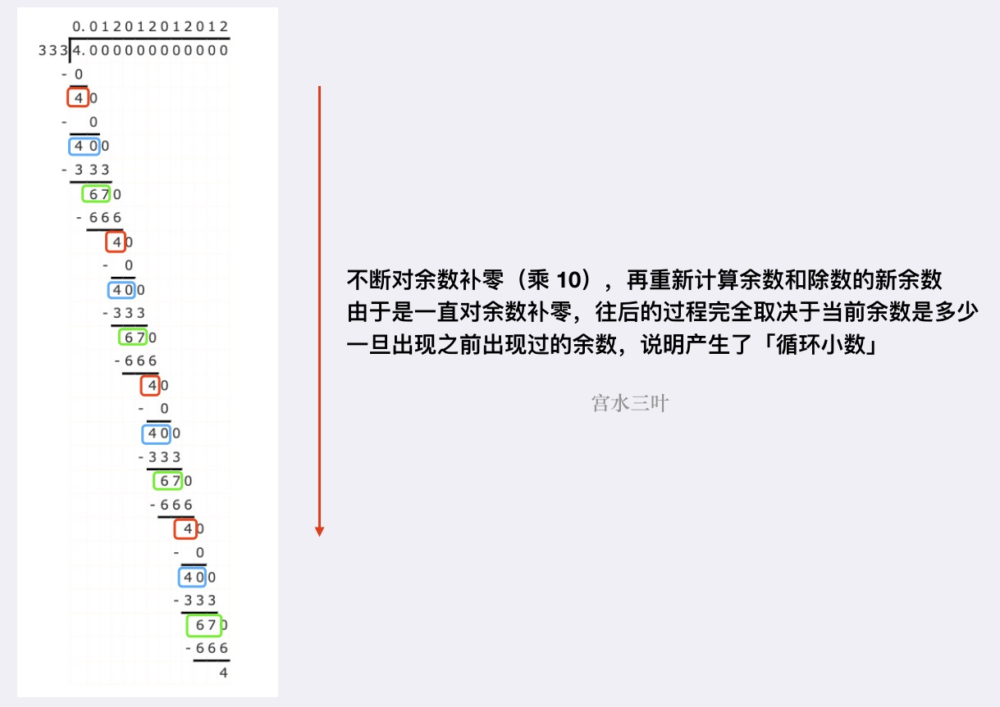

> 原文链接: https://leetcode-cn.com/problems/fraction-to-recurring-decimal


## 英文原文
<div><p>Given two integers representing the <code>numerator</code> and <code>denominator</code> of a fraction, return <em>the fraction in string format</em>.</p>

<p>If the fractional part is repeating, enclose the repeating part in parentheses.</p>

<p>If multiple answers are possible, return <strong>any of them</strong>.</p>

<p>It is <strong>guaranteed</strong> that the length of the answer string is less than <code>10<sup>4</sup></code> for all the given inputs.</p>

<p>&nbsp;</p>
<p><strong>Example 1:</strong></p>
<pre><strong>Input:</strong> numerator = 1, denominator = 2
<strong>Output:</strong> "0.5"
</pre><p><strong>Example 2:</strong></p>
<pre><strong>Input:</strong> numerator = 2, denominator = 1
<strong>Output:</strong> "2"
</pre><p><strong>Example 3:</strong></p>
<pre><strong>Input:</strong> numerator = 2, denominator = 3
<strong>Output:</strong> "0.(6)"
</pre><p><strong>Example 4:</strong></p>
<pre><strong>Input:</strong> numerator = 4, denominator = 333
<strong>Output:</strong> "0.(012)"
</pre><p><strong>Example 5:</strong></p>
<pre><strong>Input:</strong> numerator = 1, denominator = 5
<strong>Output:</strong> "0.2"
</pre>
<p>&nbsp;</p>
<p><strong>Constraints:</strong></p>

<ul>
	<li><code>-2<sup>31</sup> &lt;=&nbsp;numerator, denominator &lt;= 2<sup>31</sup> - 1</code></li>
	<li><code>denominator != 0</code></li>
</ul>
</div>

## 中文题目
<div><p>给定两个整数，分别表示分数的分子 <code>numerator</code> 和分母 <code>denominator</code>，以 <strong>字符串形式返回小数</strong> 。</p>

<p>如果小数部分为循环小数，则将循环的部分括在括号内。</p>

<p class="MachineTrans-lang-zh-CN">如果存在多个答案，只需返回 <strong>任意一个</strong> 。</p>

<p class="MachineTrans-lang-zh-CN">对于所有给定的输入，<strong>保证</strong> 答案字符串的长度小于 <code>10<sup>4</sup></code> 。</p>

<p> </p>

<p><strong>示例 1：</strong></p>

<pre>
<strong>输入：</strong>numerator = 1, denominator = 2
<strong>输出：</strong>"0.5"
</pre>

<p><strong>示例 2：</strong></p>

<pre>
<strong>输入：</strong>numerator = 2, denominator = 1
<strong>输出：</strong>"2"
</pre>

<p><strong>示例 3：</strong></p>

<pre>
<strong>输入：</strong>numerator = 2, denominator = 3
<strong>输出：</strong>"0.(6)"
</pre>

<p><strong>示例 4：</strong></p>

<pre>
<strong>输入：</strong>numerator = 4, denominator = 333
<strong>输出：</strong>"0.(012)"
</pre>

<p><strong>示例 5：</strong></p>

<pre>
<strong>输入：</strong>numerator = 1, denominator = 5
<strong>输出：</strong>"0.2"
</pre>

<p> </p>

<p><strong>提示：</strong></p>

<ul>
	<li><code>-2<sup>31</sup> <= numerator, denominator <= 2<sup>31</sup> - 1</code></li>
	<li><code>denominator != 0</code></li>
</ul>
</div>

## 通过代码
<RecoDemo>
</RecoDemo>


## 高赞题解
## 模拟

这是一道模拟 [竖式计算（除法）](https://baike.baidu.com/item/%E7%AB%96%E5%BC%8F%E8%AE%A1%E7%AE%97)的题目。

首先可以明确，两个数相除要么是「有限位小数」，要么是「无限循环小数」，而不可能是「无限不循环小数」。

然后考虑人工计算两数相除是如何进行：



这引导我们可以在模拟竖式计算（除法）过程中，使用「哈希表」记录某个余数最早在什么位置出现过，一旦出现相同余数，则将「出现位置」到「当前结尾」之间的字符串抠出来，即是「循环小数」部分。

> PS. 到这里，从人工模拟除法运算的过程，我们就可以知道「为什么不会出现“无限不循环小数”」，因为始终是对余数进行补零操作，再往下进行运算，而余数个数具有明确的上限（有限集）。所以根据抽屉原理，一直接着往下计算，最终结果要么是「出现相同余数」，要么是「余数为 $0$，运算结束」。

一些细节：

* 一个显然的条件是，如果本身两数能够整除，直接返回即可；
* 如果两个数有一个为“负数”，则最终答案为“负数”，因此可以起始先判断两数相乘是否小于 $0$，如果是，先往答案头部追加一个负号 `-`；
* 两者范围为 `int`，但计算结果可以会超过 `int` 范围，考虑 $numerator = -2^{31}$ 和 $denominator = -1$ 的情况，其结果为 $2^{31}$，超出 `int` 的范围 $[-2^{31}, 2^{31} - 1]$。因此起始需要先使用 `long` 对两个入参类型转换一下。

代码：
```Java []
class Solution {
    public String fractionToDecimal(int numerator, int denominator) {
        // 转 long 计算，防止溢出
        long a = numerator, b = denominator;
        // 如果本身能够整除，直接返回计算结果
        if (a % b == 0) return String.valueOf(a / b);
        StringBuilder sb = new StringBuilder();
        // 如果其一为负数，先追加负号
        if (a * b < 0) sb.append('-');
        a = Math.abs(a); b = Math.abs(b);
        // 计算小数点前的部分，并将余数赋值给 a
        sb.append(String.valueOf(a / b) + ".");
        a %= b;
        Map<Long, Integer> map = new HashMap<>();
        while (a != 0) {
            // 记录当前余数所在答案的位置，并继续模拟除法运算
            map.put(a, sb.length());
            a *= 10;
            sb.append(a / b);
            a %= b;
            // 如果当前余数之前出现过，则将 [出现位置 到 当前位置] 的部分抠出来（循环小数部分）
            if (map.containsKey(a)) {
                int u = map.get(a);
                return String.format("%s(%s)", sb.substring(0, u), sb.substring(u));
            }
        }
        return sb.toString();
    }
}
```
* 时间复杂度：复杂度取决于最终答案的长度，题目规定了最大长度不会超过 $10^4$，整体复杂度为 $O(M)$
* 空间复杂度：复杂度取决于最终答案的长度，题目规定了最大长度不会超过 $10^4$，整体复杂度为 $O(M)$

---

## 最后

**如果有帮助到你，请给题解点个赞和收藏，让更多的人看到 ~ ("▔□▔)/**

也欢迎你 [关注我](https://oscimg.oschina.net/oscnet/up-19688dc1af05cf8bdea43b2a863038ab9e5.png)（公主号后台回复「送书」即可参与长期看题解学算法送实体书活动）或 加入[「组队打卡」](https://leetcode-cn.com/u/ac_oier/)小群 ，提供写「证明」&「思路」的高质量题解。

所有题解已经加入 [刷题指南](https://github.com/SharingSource/LogicStack-LeetCode/wiki)，欢迎 star 哦 ~ 

## 统计信息
| 通过次数 | 提交次数 | AC比率 |
| :------: | :------: | :------: |
|    43530    |    131351    |   33.1%   |

## 提交历史
| 提交时间 | 提交结果 | 执行时间 |  内存消耗  | 语言 |
| :------: | :------: | :------: | :--------: | :--------: |
