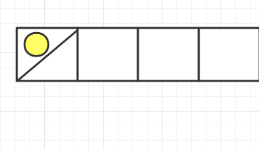
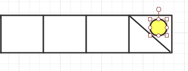
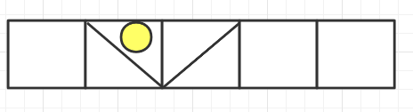
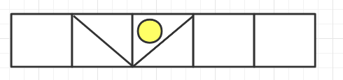
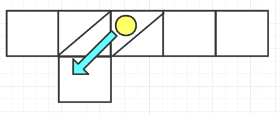
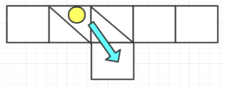
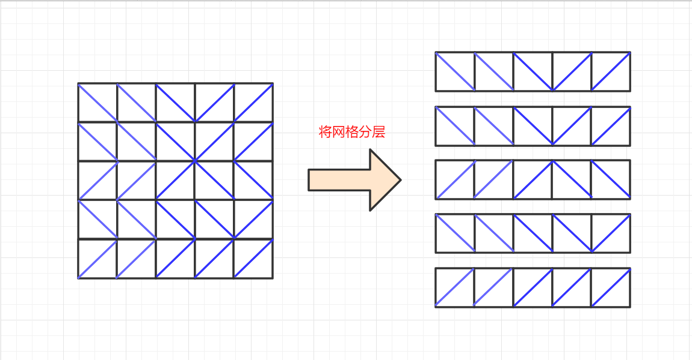
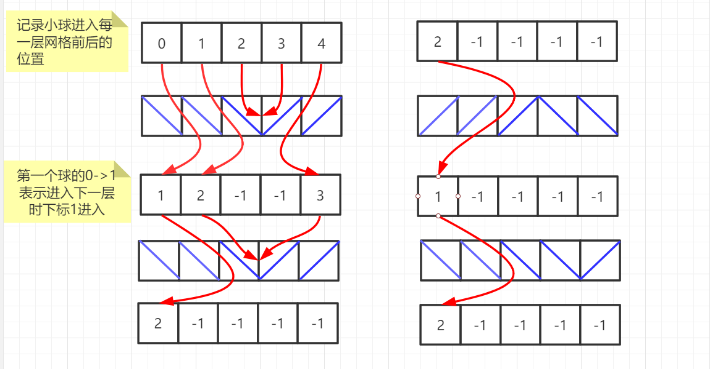
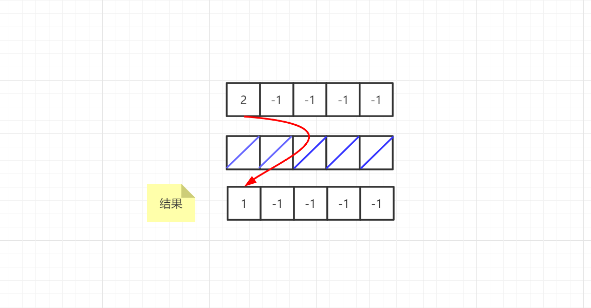

> 原文链接: https://leetcode-cn.com/problems/where-will-the-ball-fall


## 英文原文
<div><p>You have a 2-D <code>grid</code> of size <code>m x n</code> representing a box, and you have <code>n</code> balls. The box is open on the top and bottom sides.</p>

<p>Each cell in the box has a diagonal board spanning two corners of the cell that can redirect a ball to the right or to the left.</p>

<ul>
	<li>A board that redirects the ball to the right spans the top-left corner to the bottom-right corner and is represented in the grid as <code>1</code>.</li>
	<li>A board that redirects the ball to the left spans the top-right corner to the bottom-left corner and is represented in the grid as <code>-1</code>.</li>
</ul>

<p>We drop one ball at the top of each column of the box. Each ball can get stuck in the box or fall out of the bottom. A ball gets stuck if it hits a &quot;V&quot; shaped pattern between two boards or if a board redirects the ball into either wall of the box.</p>

<p>Return <em>an array </em><code>answer</code><em> of size </em><code>n</code><em> where </em><code>answer[i]</code><em> is the column that the ball falls out of at the bottom after dropping the ball from the </em><code>i<sup>th</sup></code><em> column at the top, or <code>-1</code><em> if the ball gets stuck in the box</em>.</em></p>

<p>&nbsp;</p>
<p><strong>Example 1:</strong></p>

<p><strong></strong></p>

<pre>
<strong>Input:</strong> grid = [[1,1,1,-1,-1],[1,1,1,-1,-1],[-1,-1,-1,1,1],[1,1,1,1,-1],[-1,-1,-1,-1,-1]]
<strong>Output:</strong> [1,-1,-1,-1,-1]
<strong>Explanation:</strong> This example is shown in the photo.
Ball b0 is dropped at column 0 and falls out of the box at column 1.
Ball b1 is dropped at column 1 and will get stuck in the box between column 2 and 3 and row 1.
Ball b2 is dropped at column 2 and will get stuck on the box between column 2 and 3 and row 0.
Ball b3 is dropped at column 3 and will get stuck on the box between column 2 and 3 and row 0.
Ball b4 is dropped at column 4 and will get stuck on the box between column 2 and 3 and row 1.
</pre>

<p><strong>Example 2:</strong></p>

<pre>
<strong>Input:</strong> grid = [[-1]]
<strong>Output:</strong> [-1]
<strong>Explanation:</strong> The ball gets stuck against the left wall.
</pre>

<p><strong>Example 3:</strong></p>

<pre>
<strong>Input:</strong> grid = [[1,1,1,1,1,1],[-1,-1,-1,-1,-1,-1],[1,1,1,1,1,1],[-1,-1,-1,-1,-1,-1]]
<strong>Output:</strong> [0,1,2,3,4,-1]
</pre>

<p>&nbsp;</p>
<p><strong>Constraints:</strong></p>

<ul>
	<li><code>m == grid.length</code></li>
	<li><code>n == grid[i].length</code></li>
	<li><code>1 &lt;= m, n &lt;= 100</code></li>
	<li><code>grid[i][j]</code> is <code>1</code> or <code>-1</code>.</li>
</ul>
</div>

## 中文题目
<div><p>用一个大小为 <code>m x n</code> 的二维网格 <code>grid</code> 表示一个箱子。你有 <code>n</code> 颗球。箱子的顶部和底部都是开着的。</p>

<p>箱子中的每个单元格都有一个对角线挡板，跨过单元格的两个角，可以将球导向左侧或者右侧。</p>

<ul>
	<li>将球导向右侧的挡板跨过左上角和右下角，在网格中用 <code>1</code> 表示。</li>
	<li>将球导向左侧的挡板跨过右上角和左下角，在网格中用 <code>-1</code> 表示。</li>
</ul>

<p>在箱子每一列的顶端各放一颗球。每颗球都可能卡在箱子里或从底部掉出来。如果球恰好卡在两块挡板之间的 "V" 形图案，或者被一块挡导向到箱子的任意一侧边上，就会卡住。</p>

<p>返回一个大小为 <code>n</code> 的数组 <code>answer</code> ，其中 <code>answer[i]</code> 是球放在顶部的第 <code>i</code> 列后从底部掉出来的那一列对应的下标，如果球卡在盒子里，则返回 <code>-1</code> 。</p>

<p> </p>

<p><strong>示例 1：</strong></p>

<p><strong></strong></p>

<pre>
<strong>输入：</strong>grid = [[1,1,1,-1,-1],[1,1,1,-1,-1],[-1,-1,-1,1,1],[1,1,1,1,-1],[-1,-1,-1,-1,-1]]
<strong>输出：</strong>[1,-1,-1,-1,-1]
<strong>解释：</strong>示例如图：
b0 球开始放在第 0 列上，最终从箱子底部第 1 列掉出。
b1 球开始放在第 1 列上，会卡在第 2、3 列和第 1 行之间的 "V" 形里。
b2 球开始放在第 2 列上，会卡在第 2、3 列和第 0 行之间的 "V" 形里。
b3 球开始放在第 3 列上，会卡在第 2、3 列和第 0 行之间的 "V" 形里。
b4 球开始放在第 4 列上，会卡在第 2、3 列和第 1 行之间的 "V" 形里。
</pre>

<p><strong>示例 2：</strong></p>

<pre>
<strong>输入：</strong>grid = [[-1]]
<strong>输出：</strong>[-1]
<strong>解释：</strong>球被卡在箱子左侧边上。
</pre>

<p><strong>示例 3：</strong></p>

<pre>
<strong>输入：</strong>grid = [[1,1,1,1,1,1],[-1,-1,-1,-1,-1,-1],[1,1,1,1,1,1],[-1,-1,-1,-1,-1,-1]]
<strong>输出：</strong>[0,1,2,3,4,-1]
</pre>

<p> </p>

<p><strong>提示：</strong></p>

<ul>
	<li><code>m == grid.length</code></li>
	<li><code>n == grid[i].length</code></li>
	<li><code>1 <= m, n <= 100</code></li>
	<li><code>grid[i][j]</code> 为 <code>1</code> 或 <code>-1</code></li>
</ul>
</div>

## 通过代码
<RecoDemo>
</RecoDemo>


## 高赞题解
### 解题思路
1. 考虑什么情况卡住
    1. 卡在边缘
        1. 卡左边

        2. 卡右边 


    2. 卡在中间




2. 没有卡住则可以到达下一层
    1. 左拐


    2. 右拐



## 方法一：递归
### 代码

```java
import java.util.Arrays;

class Solution {
    public int[] findBall(int[][] grid) {
        int row = grid.length;
        int col = grid[0].length;
        int[] ans = new int[col];
        for (int i = 0; i < col; i++) {
            ans[i] = out(grid, row, col, i, 0);
        }
        return ans;
    }

    private int out(int[][] grid, int row, int col, int x, int y) {
        //到达底部
        if (y == row) {
            return x;
        }

        //卡在边缘
        if (x == 0 && grid[y][x] == -1) {
            return -1;
        }
        if (x == col - 1 && grid[y][x] == 1) {
            return -1;
        }

        //卡在中间
        if (grid[y][x] == 1 && grid[y][x + 1] == -1) {
            return -1;
        }
        if (grid[y][x] == -1 && grid[y][x - 1] == 1) {
            return -1;
        }

        //到达下一层
        return out(grid, row, col, x + grid[y][x], y + 1);
    }

}
```
时间复杂度：$O(mn)$
空间复杂度：$O(n)$

## 方法二：动态规划
图解：


<,,>


小球从第一层往下掉时，每进入一层的位置都依赖于上一层掉出的位置，使用一个数组记录小球到达每一层的位置。
1. 一开始每个球在进入二维网格前的位置分别是0、1、2、3……n-1；
2. 每经过一层可以得到小球将进入的列，如果小球已经被卡住，则将列置为-1；
3. 循环所有的行，便可得到结果。

我们用 $f(x)$ 表示小球到达第x层时每个小球的下标，$f(0)$代表小球进入网格前的小球下标，我们可以列出如下式子：
$$f(0)=[0,1,2,3,……,n-1]$$
$$f(x) = f(f(x-1))$$

```java
class Solution {
    public int[] findBall(int[][] grid) {
        int row = grid.length;
        int col = grid[0].length;
        int[] ans = new int[col];

        // 默认位置
        for (int i = 0; i < col; i++) {
            ans[i] = i;
        }

        for (int i = 0; i < row; i++) {
            for (int j = 0; j < col; j++) {
                if (ans[j] == -1) {//忽略卡住的球
                    continue;
                }
                if (grid[i][ans[j]] == 1 && ans[j] + 1 < col && grid[i][ans[j] + 1] == 1) {
                    //右移
                    ans[j]++;
                } else if (grid[i][ans[j]] == -1 && ans[j] - 1 >= 0 && grid[i][ans[j] - 1] == -1) {
                    //左移
                    ans[j]--;
                } else {
                    //卡住
                    ans[j] = -1;
                }
            }
        }
        return ans;
    }
}
```
时间复杂度：$O(mn)$
空间复杂度：$O(n)$

最后再求个👍，谢谢各位大佬！


## 统计信息
| 通过次数 | 提交次数 | AC比率 |
| :------: | :------: | :------: |
|    4525    |    7661    |   59.1%   |

## 提交历史
| 提交时间 | 提交结果 | 执行时间 |  内存消耗  | 语言 |
| :------: | :------: | :------: | :--------: | :--------: |
