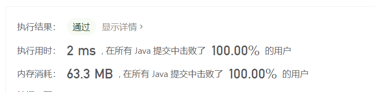

> 原文链接: https://leetcode-cn.com/problems/swapping-nodes-in-a-linked-list


## 英文原文
<div><p>You are given the <code>head</code> of a linked list, and an integer <code>k</code>.</p>

<p>Return <em>the head of the linked list after <strong>swapping</strong> the values of the </em><code>k<sup>th</sup></code> <em>node from the beginning and the </em><code>k<sup>th</sup></code> <em>node from the end (the list is <strong>1-indexed</strong>).</em></p>

<p>&nbsp;</p>
<p><strong>Example 1:</strong></p>

<pre>
<strong>Input:</strong> head = [1,2,3,4,5], k = 2
<strong>Output:</strong> [1,4,3,2,5]
</pre>

<p><strong>Example 2:</strong></p>

<pre>
<strong>Input:</strong> head = [7,9,6,6,7,8,3,0,9,5], k = 5
<strong>Output:</strong> [7,9,6,6,8,7,3,0,9,5]
</pre>

<p><strong>Example 3:</strong></p>

<pre>
<strong>Input:</strong> head = [1], k = 1
<strong>Output:</strong> [1]
</pre>

<p><strong>Example 4:</strong></p>

<pre>
<strong>Input:</strong> head = [1,2], k = 1
<strong>Output:</strong> [2,1]
</pre>

<p><strong>Example 5:</strong></p>

<pre>
<strong>Input:</strong> head = [1,2,3], k = 2
<strong>Output:</strong> [1,2,3]
</pre>

<p>&nbsp;</p>
<p><strong>Constraints:</strong></p>

<ul>
	<li>The number of nodes in the list is <code>n</code>.</li>
	<li><code>1 &lt;= k &lt;= n &lt;= 10<sup>5</sup></code></li>
	<li><code>0 &lt;= Node.val &lt;= 100</code></li>
</ul>
</div>

## 中文题目
<div><p>给你链表的头节点 <code>head</code> 和一个整数 <code>k</code> 。</p>

<p><strong>交换</strong> 链表正数第 <code>k</code> 个节点和倒数第 <code>k</code> 个节点的值后，返回链表的头节点（链表 <strong>从 1 开始索引</strong>）。</p>

<p> </p>

<p><strong>示例 1：</strong></p>

<pre>
<strong>输入：</strong>head = [1,2,3,4,5], k = 2
<strong>输出：</strong>[1,4,3,2,5]
</pre>

<p><strong>示例 2：</strong></p>

<pre>
<strong>输入：</strong>head = [7,9,6,6,7,8,3,0,9,5], k = 5
<strong>输出：</strong>[7,9,6,6,8,7,3,0,9,5]
</pre>

<p><strong>示例 3：</strong></p>

<pre>
<strong>输入：</strong>head = [1], k = 1
<strong>输出：</strong>[1]
</pre>

<p><strong>示例 4：</strong></p>

<pre>
<strong>输入：</strong>head = [1,2], k = 1
<strong>输出：</strong>[2,1]
</pre>

<p><strong>示例 5：</strong></p>

<pre>
<strong>输入：</strong>head = [1,2,3], k = 2
<strong>输出：</strong>[1,2,3]
</pre>

<p> </p>

<p><strong>提示：</strong></p>

<ul>
	<li>链表中节点的数目是 <code>n</code></li>
	<li><code>1 <= k <= n <= 10<sup>5</sup></code></li>
	<li><code>0 <= Node.val <= 100</code></li>
</ul>
</div>

## 通过代码
<RecoDemo>
</RecoDemo>


## 高赞题解
### 解题思路


声明三个节点cur、first、last全部指向head节点

利用cur从头结点开始遍历链表，
first指针移动k - 1步后定位至该链表正数第k个节点,

设链表的节点个数为nums，当first指针指向第k个节点时，
此时链表还有nums - k个节点没有遍历。

因为链表的头节点到倒数第k个节点之间的节点个数刚好也是nums - k个，
所以当遍历到正数第k个节点后，
last指针开始从head节点移动nums - k步后即指向了倒数第k个节点。


### 代码

```java
/**
 * Definition for singly-linked list.
 * public class ListNode {
 *     int val;
 *     ListNode next;
 *     ListNode() {}
 *     ListNode(int val) { this.val = val; }
 *     ListNode(int val, ListNode next) { this.val = val; this.next = next; }
 * }
 */
class Solution {
    public ListNode swapNodes(ListNode head, int k) {
        // 模拟指针，用来遍历链表
        ListNode cur = head;
        // 用来定位正数第k个节点
        ListNode first = head;
        // 用来定位倒数第k个节点
        ListNode last = head;
        // 用于节点的计数，和节点值的交换
        int count = 1;
        while (cur.next != null) {
            // 找到正数第k个节点
            if (count < k) {
                first = first.next;
            // 找到倒数第k个节点
            } else {
                last = last.next;
            }
            count++;
            cur = cur.next;
        }
        // 交换正数第k个节点和倒数第k个节点的值
        count = first.val;
        first.val = last.val;
        last.val = count;
        return head;
    }
}
```

## 统计信息
| 通过次数 | 提交次数 | AC比率 |
| :------: | :------: | :------: |
|    11796    |    18278    |   64.5%   |

## 提交历史
| 提交时间 | 提交结果 | 执行时间 |  内存消耗  | 语言 |
| :------: | :------: | :------: | :--------: | :--------: |
