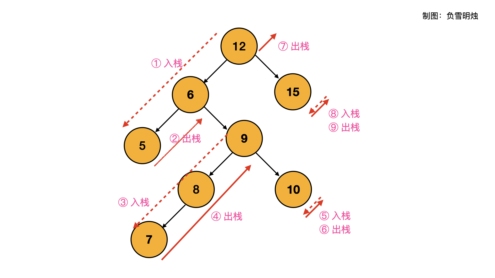

> 原文链接: https://leetcode-cn.com/problems/binary-search-tree-iterator


## 英文原文
<div><p>Implement the <code>BSTIterator</code> class that represents an iterator over the <strong><a href="https://en.wikipedia.org/wiki/Tree_traversal#In-order_(LNR)" target="_blank">in-order traversal</a></strong> of a binary search tree (BST):</p>

<ul>
	<li><code>BSTIterator(TreeNode root)</code> Initializes an object of the <code>BSTIterator</code> class. The <code>root</code> of the BST is given as part of the constructor. The pointer should be initialized to a non-existent number smaller than any element in the BST.</li>
	<li><code>boolean hasNext()</code> Returns <code>true</code> if there exists a number in the traversal to the right of the pointer, otherwise returns <code>false</code>.</li>
	<li><code>int next()</code> Moves the pointer to the right, then returns the number at the pointer.</li>
</ul>

<p>Notice that by initializing the pointer to a non-existent smallest number, the first call to <code>next()</code> will return the smallest element in the BST.</p>

<p>You may assume that <code>next()</code> calls will always be valid. That is, there will be at least a next number in the in-order traversal when <code>next()</code> is called.</p>

<p>&nbsp;</p>
<p><strong>Example 1:</strong></p>

<pre>
<strong>Input</strong>
[&quot;BSTIterator&quot;, &quot;next&quot;, &quot;next&quot;, &quot;hasNext&quot;, &quot;next&quot;, &quot;hasNext&quot;, &quot;next&quot;, &quot;hasNext&quot;, &quot;next&quot;, &quot;hasNext&quot;]
[[[7, 3, 15, null, null, 9, 20]], [], [], [], [], [], [], [], [], []]
<strong>Output</strong>
[null, 3, 7, true, 9, true, 15, true, 20, false]

<strong>Explanation</strong>
BSTIterator bSTIterator = new BSTIterator([7, 3, 15, null, null, 9, 20]);
bSTIterator.next();    // return 3
bSTIterator.next();    // return 7
bSTIterator.hasNext(); // return True
bSTIterator.next();    // return 9
bSTIterator.hasNext(); // return True
bSTIterator.next();    // return 15
bSTIterator.hasNext(); // return True
bSTIterator.next();    // return 20
bSTIterator.hasNext(); // return False
</pre>

<p>&nbsp;</p>
<p><strong>Constraints:</strong></p>

<ul>
	<li>The number of nodes in the tree is in the range <code>[1, 10<sup>5</sup>]</code>.</li>
	<li><code>0 &lt;= Node.val &lt;= 10<sup>6</sup></code></li>
	<li>At most <code>10<sup>5</sup></code> calls will be made to <code>hasNext</code>, and <code>next</code>.</li>
</ul>

<p>&nbsp;</p>
<p><strong>Follow up:</strong></p>

<ul>
	<li>Could you implement <code>next()</code> and <code>hasNext()</code> to run in average <code>O(1)</code> time and use&nbsp;<code>O(h)</code> memory, where <code>h</code> is the height of the tree?</li>
</ul>
</div>

## 中文题目
<div>实现一个二叉搜索树迭代器类<code>BSTIterator</code> ，表示一个按中序遍历二叉搜索树（BST）的迭代器：
<div class="original__bRMd">
<div>
<ul>
	<li><code>BSTIterator(TreeNode root)</code> 初始化 <code>BSTIterator</code> 类的一个对象。BST 的根节点 <code>root</code> 会作为构造函数的一部分给出。指针应初始化为一个不存在于 BST 中的数字，且该数字小于 BST 中的任何元素。</li>
	<li><code>boolean hasNext()</code> 如果向指针右侧遍历存在数字，则返回 <code>true</code> ；否则返回 <code>false</code> 。</li>
	<li><code>int next()</code>将指针向右移动，然后返回指针处的数字。</li>
</ul>

<p>注意，指针初始化为一个不存在于 BST 中的数字，所以对 <code>next()</code> 的首次调用将返回 BST 中的最小元素。</p>
</div>
</div>

<p>你可以假设 <code>next()</code> 调用总是有效的，也就是说，当调用 <code>next()</code> 时，BST 的中序遍历中至少存在一个下一个数字。</p>

<p> </p>

<p><strong>示例：</strong></p>

<pre>
<strong>输入</strong>
["BSTIterator", "next", "next", "hasNext", "next", "hasNext", "next", "hasNext", "next", "hasNext"]
[[[7, 3, 15, null, null, 9, 20]], [], [], [], [], [], [], [], [], []]
<strong>输出</strong>
[null, 3, 7, true, 9, true, 15, true, 20, false]

<strong>解释</strong>
BSTIterator bSTIterator = new BSTIterator([7, 3, 15, null, null, 9, 20]);
bSTIterator.next();    // 返回 3
bSTIterator.next();    // 返回 7
bSTIterator.hasNext(); // 返回 True
bSTIterator.next();    // 返回 9
bSTIterator.hasNext(); // 返回 True
bSTIterator.next();    // 返回 15
bSTIterator.hasNext(); // 返回 True
bSTIterator.next();    // 返回 20
bSTIterator.hasNext(); // 返回 False
</pre>

<p> </p>

<p><strong>提示：</strong></p>

<ul>
	<li>树中节点的数目在范围 <code>[1, 10<sup>5</sup>]</code> 内</li>
	<li><code>0 <= Node.val <= 10<sup>6</sup></code></li>
	<li>最多调用 <code>10<sup>5</sup></code> 次 <code>hasNext</code> 和 <code>next</code> 操作</li>
</ul>

<p> </p>

<p><strong>进阶：</strong></p>

<ul>
	<li>你可以设计一个满足下述条件的解决方案吗？<code>next()</code> 和 <code>hasNext()</code> 操作均摊时间复杂度为 <code>O(1)</code> ，并使用 <code>O(h)</code> 内存。其中 <code>h</code> 是树的高度。</li>
</ul>
</div>

## 通过代码
<RecoDemo>
</RecoDemo>


## 高赞题解
各位题友大家好！ 今天是 **[@负雪明烛](/u/fuxuemingzhu/)** 坚持日更的第 **63** 天。今天力扣上的每日一题是「[173. 二叉搜索树迭代器](https://leetcode-cn.com/problems/binary-search-tree-iterator/)」。

# 解题思路

题目给出的树是：**二叉搜索树（BST）**。二叉搜索树最重要的性质是：**二叉搜索树的中序遍历是有序的**。今天这个题目直接让我们「中序遍历」，我建议题目可以改为：实现二叉搜索树的升序迭代器。

具体到本题，我们可以有两个方法：

- 提前保存全部节点
- 迭代时计算 `next`  节点

## 方法一：提前保存全部节点


这个方法比较简单，提前把 BST 的中序遍历结果保存到一个**队列**里面，当调用 `next()` 方法的时候，就从**队列**头部弹出一个元素。


树的中序中序遍历应该是基础知识，我就不讲了。


代码如下：

```Python []
# Definition for a binary tree node.
# class TreeNode(object):
#     def __init__(self, val=0, left=None, right=None):
#         self.val = val
#         self.left = left
#         self.right = right
class BSTIterator(object):

    def __init__(self, root):
        self.queue = collections.deque()
        self.inOrder(root)
    
    def inOrder(self, root):
        if not root: return
        self.inOrder(root.left)
        self.queue.append(root.val)
        self.inOrder(root.right)

    def next(self):
        return self.queue.popleft()


    def hasNext(self):
        return len(self.queue) > 0
```


- 时间复杂度：构造函数是 $O(N)$；调用 `next()` 方法的时间复杂度是 $O(1)$。
- 空间复杂度：$O(N)$，使用了队列保存了所有元素。


## 方法二：迭代时计算 `next`  节点


在前几天的设计迭代器的每日一题中，我说过提前把所有的值遍历并且保存起来的做法并不好，不是面试官想要的。举个场景：想通过 BST 的迭代器，判断 BST 中有没有 数值x。此时哪怕 数值x 是 BST 迭代器的第一个元素，上面的方法也会先把所有的值都遍历出来，时间复杂度到了$O(N)$。


所以，设计迭代器的时候，应避免提前把所有的值都遍历出来；最好能设计成遍历过程中求 `next` 节点。那就需要用迭代方法了。


- 把**递归**转成**迭代**，基本想法就是用**栈。**
- 迭代总体思路是：**栈中只保留左节点**。


思路必须从递归的访问顺序说起：中序遍历的访问顺序是 `左子树 -> 根节点 -> 右子树` 的顺序，并且对 `左子树` 和 `右子树` 也进行递归。

结合下图，实际访问节点的顺序是：
1. 从 `根节点12` 开始一路到底遍历到所有左节点，路径保存到栈中；此时栈为 `[12, 6, 5]`。
2. 弹出栈顶节点，即 `叶子节点5` ；
2. 下一个栈顶元素是 该叶子节点 的 `根节点6`；
3. 然后把 `该新的根节点的右子树9` 一路到底遍历其所有左节点；栈为 `[12, 9, 8, 7]`。
4. 继续运行下去，直到栈为空。


中序遍历流程如下图所示：



### 发现了没有？这就是一个「单调栈」啊！


根据上面的遍历顺序，我们得出迭代的思路：

- 构造方法：一路到底，把根节点和它的所有左节点放到栈中；
- 调用 `next()` 方法：弹出栈顶的节点；
  - 如果它有右子树，则对右子树一路到底，把它和它的所有左节点放到栈中。


代码如下：

```Python []
# Definition for a binary tree node.
# class TreeNode(object):
#     def __init__(self, val=0, left=None, right=None):
#         self.val = val
#         self.left = left
#         self.right = right
class BSTIterator(object):

    def __init__(self, root):
        self.stack = []
        while root:
            self.stack.append(root)
            root = root.left

    def next(self):
        cur = self.stack.pop()
        node = cur.right
        while node:
            self.stack.append(node)
            node = node.left
        return cur.val

    def hasNext(self):
        return len(self.stack) > 0
```


- 时间复杂度：均摊复杂度是 $O(1)$，调用 `next()` 方法的时候，如果栈顶元素有右子树，则把所有右边节点即其所有左孩子全部放到了栈中，下次调用 `next()` 的时候，直接访问栈顶就可以了，均摊之后时间复杂度是 $O(1)$。
- 空间复杂度：$O(h)$，h 为数的高度，因为栈中只保留了左节点，栈中元素最多的时候，就是树的高度。


# 刷题心得


- 今天题目的迭代写法来自对递归的理解。把递归弄懂了，才可能写出这种迭代写法。
- 写完题解的这一刻，我脑子里蹦出来「**单调栈**」！我惊喜地发现，BST 的中序迭代时就是维护了一个**单调递减栈**！两种不同的数据结构，竟然神奇般地融为一体，我感觉很炸裂！


参考资料：[【LeetCode】代码模板，刷题必会](https://fuxuemingzhu.blog.csdn.net/article/details/101900729)


-----


OK，以上就是 [@负雪明烛](https://leetcode-cn.com/u/fuxuemingzhu/) 写的今天题解的全部内容了，如果你觉得有帮助的话，**求赞、求关注、求收藏**。如果有疑问的话，请在下面评论，我会及时解答。


**关注我**，你将不会错过我的精彩动画题解、面试题分享、组队刷题活动，进入主页 [@负雪明烛](https://leetcode-cn.com/u/fuxuemingzhu/) 右侧有刷题组织，从此刷题不再孤单。


祝大家牛年大吉！AC 多多，Offer 多多！我们明天再见！

## 统计信息
| 通过次数 | 提交次数 | AC比率 |
| :------: | :------: | :------: |
|    79080    |    98195    |   80.5%   |

## 提交历史
| 提交时间 | 提交结果 | 执行时间 |  内存消耗  | 语言 |
| :------: | :------: | :------: | :--------: | :--------: |


## 相似题目
|                             题目                             | 难度 |
| :----------------------------------------------------------: | :---------: |
| [二叉树的中序遍历](https://leetcode-cn.com/problems/binary-tree-inorder-traversal/) | 简单|
| [展开二维向量](https://leetcode-cn.com/problems/flatten-2d-vector/) | 中等|
| [锯齿迭代器](https://leetcode-cn.com/problems/zigzag-iterator/) | 中等|
| [窥探迭代器](https://leetcode-cn.com/problems/peeking-iterator/) | 中等|
| [二叉搜索树中的中序后继](https://leetcode-cn.com/problems/inorder-successor-in-bst/) | 中等|
