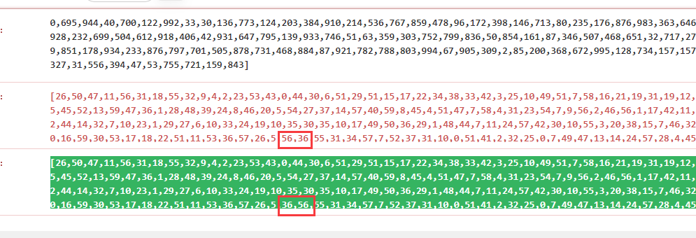

> 原文链接: https://leetcode-cn.com/problems/process-tasks-using-servers


## 英文原文
<div><p>You are given two <strong>0-indexed</strong> integer arrays <code>servers</code> and <code>tasks</code> of lengths <code>n</code>​​​​​​ and <code>m</code>​​​​​​ respectively. <code>servers[i]</code> is the <strong>weight</strong> of the <code>i<sup>​​​​​​th</sup></code>​​​​ server, and <code>tasks[j]</code> is the <strong>time needed</strong> to process the <code>j<sup>​​​​​​th</sup></code>​​​​ task <strong>in seconds</strong>.</p>

<p>Tasks are assigned to the servers using a <strong>task queue</strong>. Initially, all servers are free, and the queue is <strong>empty</strong>.</p>

<p>At second <code>j</code>, the <code>j<sup>th</sup></code> task is <strong>inserted</strong> into the queue (starting with the <code>0<sup>th</sup></code> task being inserted at second <code>0</code>). As long as there are free servers and the queue is not empty, the task in the front of the queue will be assigned to a free server with the <strong>smallest weight</strong>, and in case of a tie, it is assigned to a free server with the <strong>smallest index</strong>.</p>

<p>If there are no free servers and the queue is not empty, we wait until a server becomes free and immediately assign the next task. If multiple servers become free at the same time, then multiple tasks from the queue will be assigned <strong>in order of insertion</strong> following the weight and index priorities above.</p>

<p>A server that is assigned task <code>j</code> at second <code>t</code> will be free again at second <code>t + tasks[j]</code>.</p>

<p>Build an array <code>ans</code>​​​​ of length <code>m</code>, where <code>ans[j]</code> is the <strong>index</strong> of the server the <code>j<sup>​​​​​​th</sup></code> task will be assigned to.</p>

<p>Return <em>the array </em><code>ans</code>​​​​.</p>

<p>&nbsp;</p>
<p><strong>Example 1:</strong></p>

<pre>
<strong>Input:</strong> servers = [3,3,2], tasks = [1,2,3,2,1,2]
<strong>Output:</strong> [2,2,0,2,1,2]
<strong>Explanation: </strong>Events in chronological order go as follows:
- At second 0, task 0 is added and processed using server 2 until second 1.
- At second 1, server 2 becomes free. Task 1 is added and processed using server 2 until second 3.
- At second 2, task 2 is added and processed using server 0 until second 5.
- At second 3, server 2 becomes free. Task 3 is added and processed using server 2 until second 5.
- At second 4, task 4 is added and processed using server 1 until second 5.
- At second 5, all servers become free. Task 5 is added and processed using server 2 until second 7.</pre>

<p><strong>Example 2:</strong></p>

<pre>
<strong>Input:</strong> servers = [5,1,4,3,2], tasks = [2,1,2,4,5,2,1]
<strong>Output:</strong> [1,4,1,4,1,3,2]
<strong>Explanation: </strong>Events in chronological order go as follows: 
- At second 0, task 0 is added and processed using server 1 until second 2.
- At second 1, task 1 is added and processed using server 4 until second 2.
- At second 2, servers 1 and 4 become free. Task 2 is added and processed using server 1 until second 4. 
- At second 3, task 3 is added and processed using server 4 until second 7.
- At second 4, server 1 becomes free. Task 4 is added and processed using server 1 until second 9. 
- At second 5, task 5 is added and processed using server 3 until second 7.
- At second 6, task 6 is added and processed using server 2 until second 7.
</pre>

<p>&nbsp;</p>
<p><strong>Constraints:</strong></p>

<ul>
	<li><code>servers.length == n</code></li>
	<li><code>tasks.length == m</code></li>
	<li><code>1 &lt;= n, m &lt;= 2 * 10<sup>5</sup></code></li>
	<li><code>1 &lt;= servers[i], tasks[j] &lt;= 2 * 10<sup>5</sup></code></li>
</ul>
</div>

## 中文题目
<div><p>给你两个 <strong>下标从 0 开始</strong> 的整数数组 <code>servers</code> 和 <code>tasks</code> ，长度分别为 <code>n</code>​​​​​​ 和 <code>m</code>​​​​​​ 。<code>servers[i]</code> 是第 <code>i<sup>​​​​​​</sup></code>​​​​ 台服务器的 <strong>权重</strong> ，而 <code>tasks[j]</code> 是处理第 <code>j<sup>​​​​​​</sup></code> 项任务 <strong>所需要的时间</strong>（单位：秒）。</p>

<p>你正在运行一个仿真系统，在处理完所有任务后，该系统将会关闭。每台服务器只能同时处理一项任务。第 <code>0</code> 项任务在第 <code>0</code> 秒可以开始处理，相应地，第 <code>j</code> 项任务在第 <code>j</code> 秒可以开始处理。处理第 <code>j</code> 项任务时，你需要为它分配一台 <strong>权重最小</strong> 的空闲服务器。如果存在多台相同权重的空闲服务器，请选择 <strong>下标最小</strong> 的服务器。如果一台空闲服务器在第 <code>t</code> 秒分配到第 <code>j</code> 项任务，那么在 <code>t + tasks[j]</code> 时它将恢复空闲状态。</p>

<p>如果没有空闲服务器，则必须等待，直到出现一台空闲服务器，并 <strong>尽可能早</strong> 地处理剩余任务。 如果有多项任务等待分配，则按照 <strong>下标递增</strong> 的顺序完成分配。</p>

<p>如果同一时刻存在多台空闲服务器，可以同时将多项任务分别分配给它们。</p>

<p>构建长度为 <code>m</code> 的答案数组 <code>ans</code> ，其中 <code>ans[j]</code> 是第 <code>j</code> 项任务分配的服务器的下标。</p>

<p>返回答案数组<em> </em><code>ans</code>​​​​ 。</p>

<p> </p>

<p><strong>示例 1：</strong></p>

<pre>
<strong>输入：</strong>servers = [3,3,2], tasks = [1,2,3,2,1,2]
<strong>输出：</strong>[2,2,0,2,1,2]
<strong>解释：</strong>事件按时间顺序如下：
- 0 秒时，第 0 项任务加入到任务队列，使用第 2 台服务器处理到 1 秒。
- 1 秒时，第 2 台服务器空闲，第 1 项任务加入到任务队列，使用第 2 台服务器处理到 3 秒。
- 2 秒时，第 2 项任务加入到任务队列，使用第 0 台服务器处理到 5 秒。
- 3 秒时，第 2 台服务器空闲，第 3 项任务加入到任务队列，使用第 2 台服务器处理到 5 秒。
- 4 秒时，第 4 项任务加入到任务队列，使用第 1 台服务器处理到 5 秒。
- 5 秒时，所有服务器都空闲，第 5 项任务加入到任务队列，使用第 2 台服务器处理到 7 秒。</pre>

<p><strong>示例 2：</strong></p>

<pre>
<strong>输入：</strong>servers = [5,1,4,3,2], tasks = [2,1,2,4,5,2,1]
<strong>输出：</strong>[1,4,1,4,1,3,2]
<strong>解释：</strong>事件按时间顺序如下：
- 0 秒时，第 0 项任务加入到任务队列，使用第 1 台服务器处理到 2 秒。
- 1 秒时，第 1 项任务加入到任务队列，使用第 4 台服务器处理到 2 秒。
- 2 秒时，第 1 台和第 4 台服务器空闲，第 2 项任务加入到任务队列，使用第 1 台服务器处理到 4 秒。
- 3 秒时，第 3 项任务加入到任务队列，使用第 4 台服务器处理到 7 秒。
- 4 秒时，第 1 台服务器空闲，第 4 项任务加入到任务队列，使用第 1 台服务器处理到 9 秒。
- 5 秒时，第 5 项任务加入到任务队列，使用第 3 台服务器处理到 7 秒。
- 6 秒时，第 6 项任务加入到任务队列，使用第 2 台服务器处理到 7 秒。</pre>

<p> </p>

<p><strong>提示：</strong></p>

<ul>
	<li><code>servers.length == n</code></li>
	<li><code>tasks.length == m</code></li>
	<li><code>1 <= n, m <= 2 * 10<sup>5</sup></code></li>
	<li><code>1 <= servers[i], tasks[j] <= 2 * 10<sup>5</sup></code></li>
</ul>
</div>

## 通过代码
<RecoDemo>
</RecoDemo>


## 高赞题解
### 解题思路

8000ms 我两个优先队列为啥还是8000多..


注意问题：
1. 卡在 26/34的注意下
也就是这个case:


提示：比如当前没机器了.. 你就等，从5秒等了10秒，第十秒有机器，这时候应该把5~10的任务都扔给机器...卡在那个case是你在第10秒仅仅把第五秒的任务扔进去了。  你继续扔啊？


2. 卡在 32/34 的注意下
TLE可能是因为你 time++ 导致的...  在这之前想必你维护的只是一个优先队列
那现在需要一个数据结构动态获取 下一个空闲机器会出现的时间是啥...  所以你需要两个优先队列


### 代码

```javascript
class Heap {
	constructor(data, compare) {
		this.data = data;
		this.compare = compare;

		for (let i = (data.length >> 1) - 1; i >=0 ; i--) {
			this.heapify(i);
		}
	}
	heapify(index) {
		let target = index;
		let left = index * 2 + 1;
		let right = index * 2 + 2;
		if (left < this.data.length && this.compare(this.data[left], this.data[target])) {
			target = left;
		}
		if (right < this.data.length && this.compare(this.data[right], this.data[target])) {
			target = right;
		}
		if (target !== index) {
			this.swap(target, index);
			this.heapify(target);
		}
	}
	swap(l, r) {
		let data = this.data;
		[data[l], data[r]] = [data[r], data[l]];
	}
	push(item) {
		this.data.push(item);
		let index = this.data.length - 1;
		let father = ((index + 1) >> 1) - 1;
		while (father >= 0) {
			if (this.compare(this.data[index], this.data[father])) {
				this.swap(index, father);
				index = father;
				father = ((index + 1) >> 1) - 1;
			} else {
				break;
			}
		}
	}
	pop() {
		this.swap(0, this.data.length - 1);
		let ret = this.data.pop();
		this.heapify(0);
		return ret;
	}
}
var assignTasks = function(servers, tasks) {
	let data = [];
	for (let i = 0; i < servers.length; i++) {
		data.push({
			prioity: servers[i],
			index: i,
		});
	}
	this.heap = new Heap(data, (lower, higher) => {
		// return lower < higher;
		if (lower.prioity < higher.prioity) {
			return true;
		} else if (lower.prioity == higher.prioity && lower.index <= higher.index) {
			return true;
		} else {
			return false;
		}
	});

	this.idle = new Heap([], (lower, higher) => {
		// return lower < higher;
		if (lower.time <= higher.time) {
			return true;
		} else {
			return false;
		}
	});
	let ret = [];
	let index = 0;
	let time = 0;

	while (tasks.length !== 0) {
		while (this.idle.data.length && this.idle.data[0].time == time) {
			this.heap.push(this.idle.pop().handle);
		}
		while (this.heap.data.length && index <= time && tasks.length !== 0) {
			let tmp = tasks.shift();
			let item = this.heap.pop();

			this.idle.push({
				time: time + tmp,
				handle: item,
			})

			index++;
			ret.push(item.index);
		}
		if (this.heap.data.length) {
			time++;
		} else {
			time = this.idle.data[0].time;
		}
	}
	return ret;
};

```

## 统计信息
| 通过次数 | 提交次数 | AC比率 |
| :------: | :------: | :------: |
|    3856    |    13743    |   28.1%   |

## 提交历史
| 提交时间 | 提交结果 | 执行时间 |  内存消耗  | 语言 |
| :------: | :------: | :------: | :--------: | :--------: |
