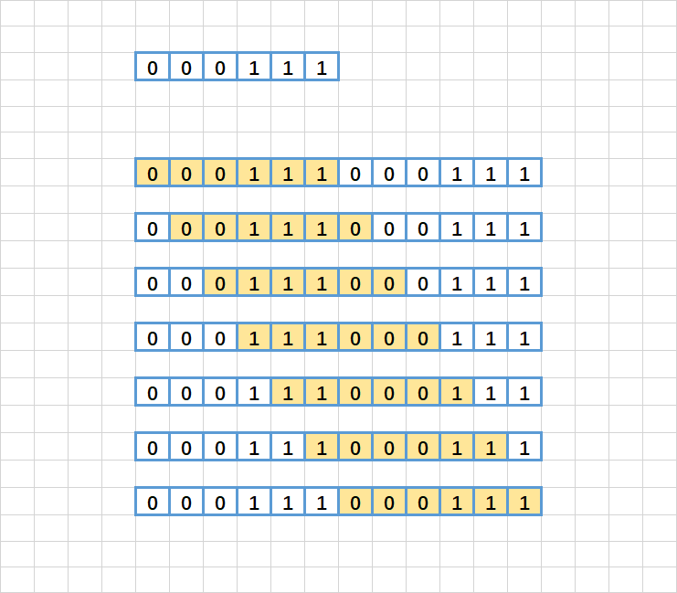
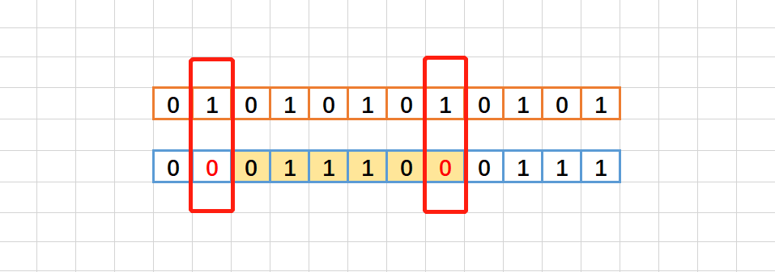
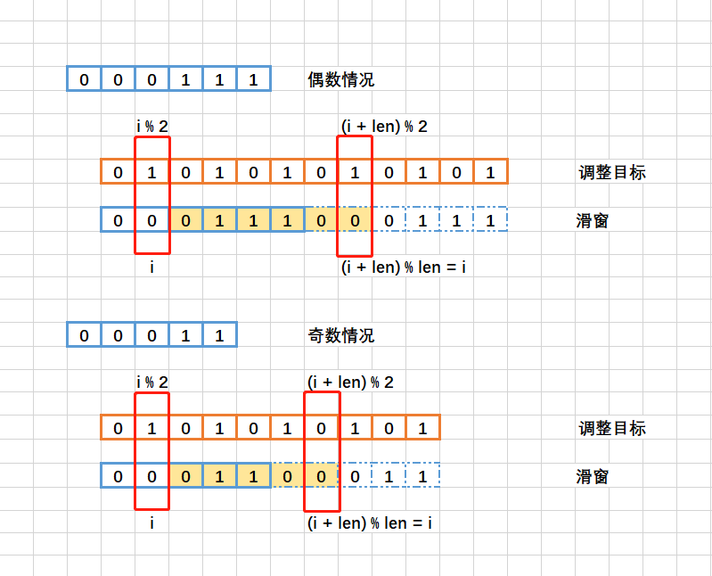

> 原文链接: https://leetcode-cn.com/problems/minimum-number-of-flips-to-make-the-binary-string-alternating


## 英文原文
<div><p>You are given a binary string <code>s</code>. You are allowed to perform two types of operations on the string in any sequence:</p>

<ul>
	<li><strong>Type-1: Remove</strong> the character at the start of the string <code>s</code> and <strong>append</strong> it to the end of the string.</li>
	<li><strong>Type-2: Pick</strong> any character in <code>s</code> and <strong>flip</strong> its value, i.e., if its value is <code>&#39;0&#39;</code> it becomes <code>&#39;1&#39;</code> and vice-versa.</li>
</ul>

<p>Return <em>the <strong>minimum</strong> number of <strong>type-2</strong> operations you need to perform</em> <em>such that </em><code>s</code> <em>becomes <strong>alternating</strong>.</em></p>

<p>The string is called <strong>alternating</strong> if no two adjacent characters are equal.</p>

<ul>
	<li>For example, the strings <code>&quot;010&quot;</code> and <code>&quot;1010&quot;</code> are alternating, while the string <code>&quot;0100&quot;</code> is not.</li>
</ul>

<p>&nbsp;</p>
<p><strong>Example 1:</strong></p>

<pre>
<strong>Input:</strong> s = &quot;111000&quot;
<strong>Output:</strong> 2
<strong>Explanation</strong>: Use the first operation two times to make s = &quot;100011&quot;.
Then, use the second operation on the third and sixth elements to make s = &quot;10<u>1</u>01<u>0</u>&quot;.
</pre>

<p><strong>Example 2:</strong></p>

<pre>
<strong>Input:</strong> s = &quot;010&quot;
<strong>Output:</strong> 0
<strong>Explanation</strong>: The string is already alternating.
</pre>

<p><strong>Example 3:</strong></p>

<pre>
<strong>Input:</strong> s = &quot;1110&quot;
<strong>Output:</strong> 1
<strong>Explanation</strong>: Use the second operation on the second element to make s = &quot;1<u>0</u>10&quot;.
</pre>

<p>&nbsp;</p>
<p><strong>Constraints:</strong></p>

<ul>
	<li><code>1 &lt;= s.length &lt;= 10<sup>5</sup></code></li>
	<li><code>s[i]</code> is either <code>&#39;0&#39;</code> or <code>&#39;1&#39;</code>.</li>
</ul>
</div>

## 中文题目
<div><p>给你一个二进制字符串 <code>s</code> 。你可以按任意顺序执行以下两种操作任意次：</p>

<ul>
	<li><strong>类型 1 ：删除</strong> 字符串 <code>s</code> 的第一个字符并将它 <strong>添加</strong> 到字符串结尾。</li>
	<li><strong>类型 2 ：选择 </strong>字符串 <code>s</code> 中任意一个字符并将该字符 <strong>反转 </strong>，也就是如果值为 <code>'0'</code> ，则反转得到 <code>'1'</code> ，反之亦然。</li>
</ul>

<p>请你返回使 <code>s</code> 变成 <strong>交替</strong> 字符串的前提下， <strong>类型 2 </strong>的 <strong>最少</strong> 操作次数 。</p>

<p>我们称一个字符串是 <strong>交替</strong> 的，需要满足任意相邻字符都不同。</p>

<ul>
	<li>比方说，字符串 <code>"010"</code> 和 <code>"1010"</code> 都是交替的，但是字符串 <code>"0100"</code> 不是。</li>
</ul>

<p> </p>

<p><strong>示例 1：</strong></p>

<pre><b>输入：</b>s = "111000"
<b>输出：</b>2
<b>解释：</b>执行第一种操作两次，得到 s = "100011" 。
然后对第三个和第六个字符执行第二种操作，得到 s = "10<strong>1</strong>01<strong>0</strong>" 。
</pre>

<p><strong>示例 2：</strong></p>

<pre><b>输入：</b>s = "010"
<b>输出：</b>0
<strong>解释：</strong>字符串已经是交替的。
</pre>

<p><strong>示例 3：</strong></p>

<pre><b>输入：</b>s = "1110"
<b>输出：</b>1
<b>解释：</b>对第二个字符执行第二种操作，得到 s = "1<strong>0</strong>10" 。
</pre>

<p> </p>

<p><strong>提示：</strong></p>

<ul>
	<li><code>1 &lt;= s.length &lt;= 10<sup>5</sup></code></li>
	<li><code>s[i]</code> 要么是 <code>'0'</code> ，要么是 <code>'1'</code> 。</li>
</ul>
</div>

## 通过代码
<RecoDemo>
</RecoDemo>


## 高赞题解
### 解题思路
1. 题意理解（不含证明）
    1. `类型 1` 和 `类型 2` 的操作顺序与最终答案无关，只与操作次数有关
    2. 按照 `01` 检测时需要修改的次数，用 `len` 减去就是按照 `10` 检测时修改的次数
2. `类型 1` 的操作，其实是头尾相接，但是先删除再添加操作开销太大，并且操作很麻烦
3. 将字符串复制一份接在后面，即可使用滑动窗口丝滑拼接
4. 滑窗时减去离开的格子，加上进来的格子，即可避免大量重复计算
5. 答案就是滑窗过程中出现的最小修改次数

### 图解																	
{:width="450px"}{:align="left"}


{:width="450px"}{:align="left"}


### 优化
感谢评论区，实际上双倍字符串，只需要概念上理解一下，我们可以直接虚拟双倍

{:width="500px"}{:align="left"}



### 答题
```C++ []
class Solution {
public:
    int minFlips(string s) {
        int len = s.size();
        string target = "01";

        int cnt = 0;
        for (int i = 0; i < len; i++) {
            cnt += (s[i] != target[i % 2]);
        }

        //s += s;
        int ans = min({ cnt, len - cnt });
        for (int i = 0; i < len; i++) {
            cnt -= (s[i] != target[i % 2]);
            cnt += (s[i] != target[(i + len) % 2]);
            ans = min({ ans, cnt, len - cnt });
        }

        return ans;
    }
};
```

### 致谢

感谢您的观看，希望对您有帮助，关注我的 [力扣个人主页](https://leetcode-cn.com/u/ikaruga/)，欢迎热烈的交流！  

## 统计信息
| 通过次数 | 提交次数 | AC比率 |
| :------: | :------: | :------: |
|    2886    |    8949    |   32.2%   |

## 提交历史
| 提交时间 | 提交结果 | 执行时间 |  内存消耗  | 语言 |
| :------: | :------: | :------: | :--------: | :--------: |
