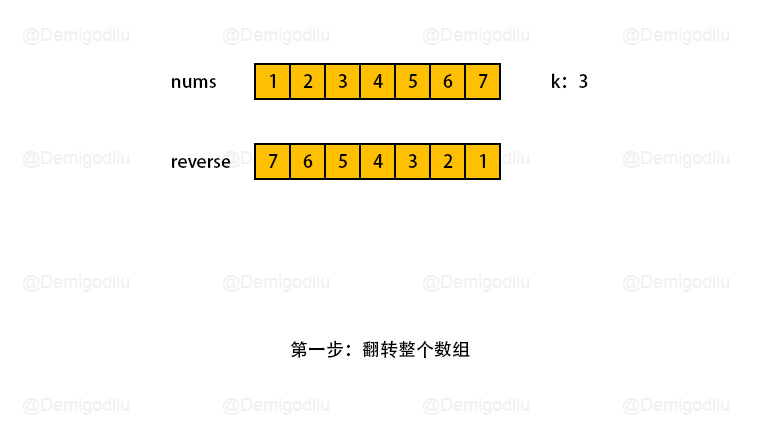
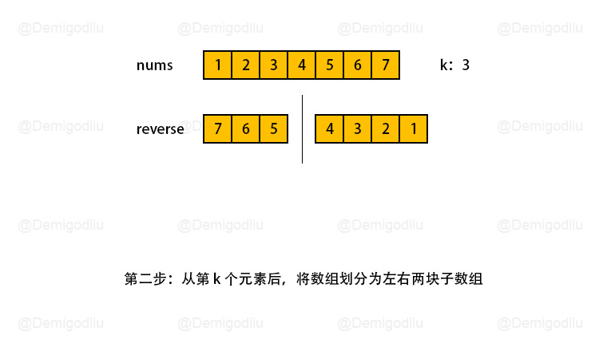
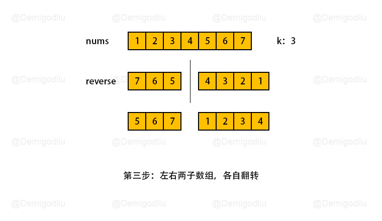

> 原文链接: https://leetcode-cn.com/problems/rotate-array


## 英文原文
<div><p>Given an array, rotate the array to the right by <code>k</code> steps, where <code>k</code> is non-negative.</p>

<p>&nbsp;</p>
<p><strong>Example 1:</strong></p>

<pre>
<strong>Input:</strong> nums = [1,2,3,4,5,6,7], k = 3
<strong>Output:</strong> [5,6,7,1,2,3,4]
<strong>Explanation:</strong>
rotate 1 steps to the right: [7,1,2,3,4,5,6]
rotate 2 steps to the right: [6,7,1,2,3,4,5]
rotate 3 steps to the right: [5,6,7,1,2,3,4]
</pre>

<p><strong>Example 2:</strong></p>

<pre>
<strong>Input:</strong> nums = [-1,-100,3,99], k = 2
<strong>Output:</strong> [3,99,-1,-100]
<strong>Explanation:</strong> 
rotate 1 steps to the right: [99,-1,-100,3]
rotate 2 steps to the right: [3,99,-1,-100]
</pre>

<p>&nbsp;</p>
<p><strong>Constraints:</strong></p>

<ul>
	<li><code>1 &lt;= nums.length &lt;= 10<sup>5</sup></code></li>
	<li><code>-2<sup>31</sup> &lt;= nums[i] &lt;= 2<sup>31</sup> - 1</code></li>
	<li><code>0 &lt;= k &lt;= 10<sup>5</sup></code></li>
</ul>

<p>&nbsp;</p>
<p><strong>Follow up:</strong></p>

<ul>
	<li>Try to come up with as many solutions as you can. There are at least <strong>three</strong> different ways to solve this problem.</li>
	<li>Could you do it in-place with <code>O(1)</code> extra space?</li>
</ul>
</div>

## 中文题目
<div><p>给你一个数组，将数组中的元素向右轮转 <code>k</code><em>&nbsp;</em>个位置，其中&nbsp;<code>k</code><em>&nbsp;</em>是非负数。</p>

<p>&nbsp;</p>

<p><strong>示例 1:</strong></p>

<pre>
<strong>输入:</strong> nums = [1,2,3,4,5,6,7], k = 3
<strong>输出:</strong> <code>[5,6,7,1,2,3,4]</code>
<strong>解释:</strong>
向右轮转 1 步: <code>[7,1,2,3,4,5,6]</code>
向右轮转 2 步: <code>[6,7,1,2,3,4,5]
</code>向右轮转 3 步: <code>[5,6,7,1,2,3,4]</code>
</pre>

<p><strong>示例&nbsp;2:</strong></p>

<pre>
<strong>输入：</strong>nums = [-1,-100,3,99], k = 2
<strong>输出：</strong>[3,99,-1,-100]
<strong>解释:</strong> 
向右轮转 1 步: [99,-1,-100,3]
向右轮转 2 步: [3,99,-1,-100]</pre>

<p>&nbsp;</p>

<p><strong>提示：</strong></p>

<ul>
	<li><code>1 &lt;= nums.length &lt;= 10<sup>5</sup></code></li>
	<li><code>-2<sup>31</sup> &lt;= nums[i] &lt;= 2<sup>31</sup> - 1</code></li>
	<li><code>0 &lt;= k &lt;= 10<sup>5</sup></code></li>
</ul>

<p>&nbsp;</p>

<p><strong>进阶：</strong></p>

<ul>
	<li>尽可能想出更多的解决方案，至少有 <strong>三种</strong> 不同的方法可以解决这个问题。</li>
	<li>你可以使用空间复杂度为&nbsp;<code>O(1)</code> 的&nbsp;<strong>原地&nbsp;</strong>算法解决这个问题吗？</li>
</ul>

<ul>
</ul>

<ul>
</ul>
</div>

## 通过代码
<RecoDemo>
</RecoDemo>


## 高赞题解


---

### 🧠 解题思路

根据题意，如果使用多余数组存储空间，会导致空间复杂度为 $n$，所以在这里，我们可以使用常量级的空间复杂度解法：数组翻转。

思路如下：

1. 首先对整个数组实行翻转，这样子原数组中需要翻转的子数组，就会跑到数组最前面。
2. 这时候，从 $k$ 处分隔数组，左右两数组，各自进行翻转即可。

---

### 🎨  图解演示

<,,,,>

---

### 🍭 示例代码 

```Javascript []
let reverse = function(nums, start, end){
    while(start < end){
        [nums[start++], nums[end--]] = [nums[end], nums[start]];
    }
}
let rotate = function(nums, k) {
    k %= nums.length;
    reverse(nums, 0, nums.length - 1);
    reverse(nums, 0, k - 1);
    reverse(nums, k, nums.length - 1);
    return nums;
};
```
```C++ []
class Solution {
public:
    void reverse(vector<int>& nums, int start, int end) {
        while (start < end) {
            swap(nums[start], nums[end]);
            start += 1;
            end -= 1;
        }
    }
    void rotate(vector<int>& nums, int k) {
        k %= nums.size();
        reverse(nums, 0, nums.size() - 1);
        reverse(nums, 0, k - 1);
        reverse(nums, k, nums.size() - 1);
    }
};
```
```Java []
class Solution {
    public void rotate(int[] nums, int k) {
        k %= nums.length;
        reverse(nums, 0, nums.length - 1);
        reverse(nums, 0, k - 1);
        reverse(nums, k, nums.length - 1);
    }
    public void reverse(int[] nums, int start, int end) {
        while (start < end) {
            int temp = nums[start];
            nums[start] = nums[end];
            nums[end] = temp;
            start += 1;
            end -= 1;
        }
    }
}
```
```Golang []
func reverse(a []int) {
    for i, n := 0, len(a); i < n/2; i++ {
        a[i], a[n-1-i] = a[n-1-i], a[i]
    }
}
func rotate(nums []int, k int) {
    k %= len(nums)
    reverse(nums)
    reverse(nums[:k])
    reverse(nums[k:])
}
```
```C []
void swap(int* a, int* b) {
    int t = *a;
    *a = *b, *b = t;
}
void reverse(int* nums, int start, int end) {
    while (start < end) {
        swap(&nums[start], &nums[end]);
        start += 1;
        end -= 1;
    }
}
void rotate(int* nums, int numsSize, int k) {
    k %= numsSize;
    reverse(nums, 0, numsSize - 1);
    reverse(nums, 0, k - 1);
    reverse(nums, k, numsSize - 1);
}
```

---

### 转身挥手

嘿，少年，做图不易，留下个赞或评论再走吧！谢啦~ 💐

差点忘了，祝你牛年大吉 🐮 ，AC 和 Offer 📑 多多益善~

⛲⛲⛲ 期待下次再见~ 


## 统计信息
| 通过次数 | 提交次数 | AC比率 |
| :------: | :------: | :------: |
|    383291    |    857445    |   44.7%   |

## 提交历史
| 提交时间 | 提交结果 | 执行时间 |  内存消耗  | 语言 |
| :------: | :------: | :------: | :--------: | :--------: |


## 相似题目
|                             题目                             | 难度 |
| :----------------------------------------------------------: | :---------: |
| [旋转链表](https://leetcode-cn.com/problems/rotate-list/) | 中等|
| [翻转字符串里的单词 II](https://leetcode-cn.com/problems/reverse-words-in-a-string-ii/) | 中等|
