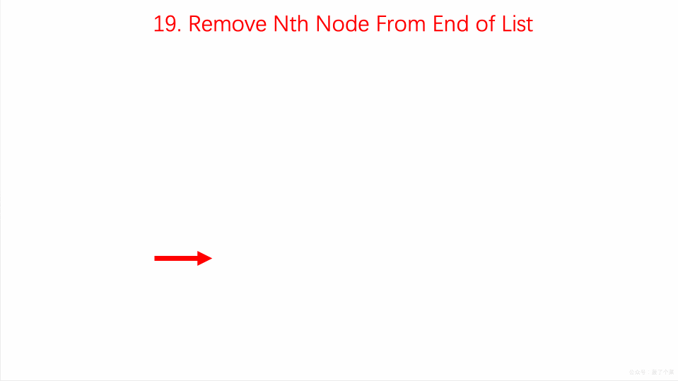

> 原文链接: https://leetcode-cn.com/problems/remove-nth-node-from-end-of-list


## 英文原文
<div><p>Given the <code>head</code> of a linked list, remove the <code>n<sup>th</sup></code> node from the end of the list and return its head.</p>

<p>&nbsp;</p>
<p><strong>Example 1:</strong></p>

<pre>
<strong>Input:</strong> head = [1,2,3,4,5], n = 2
<strong>Output:</strong> [1,2,3,5]
</pre>

<p><strong>Example 2:</strong></p>

<pre>
<strong>Input:</strong> head = [1], n = 1
<strong>Output:</strong> []
</pre>

<p><strong>Example 3:</strong></p>

<pre>
<strong>Input:</strong> head = [1,2], n = 1
<strong>Output:</strong> [1]
</pre>

<p>&nbsp;</p>
<p><strong>Constraints:</strong></p>

<ul>
	<li>The number of nodes in the list is <code>sz</code>.</li>
	<li><code>1 &lt;= sz &lt;= 30</code></li>
	<li><code>0 &lt;= Node.val &lt;= 100</code></li>
	<li><code>1 &lt;= n &lt;= sz</code></li>
</ul>

<p>&nbsp;</p>
<p><strong>Follow up:</strong> Could you do this in one pass?</p>
</div>

## 中文题目
<div><p>给你一个链表，删除链表的倒数第&nbsp;<code>n</code><em>&nbsp;</em>个结点，并且返回链表的头结点。</p>

<p>&nbsp;</p>

<p><strong>示例 1：</strong></p>

<pre>
<strong>输入：</strong>head = [1,2,3,4,5], n = 2
<strong>输出：</strong>[1,2,3,5]
</pre>

<p><strong>示例 2：</strong></p>

<pre>
<strong>输入：</strong>head = [1], n = 1
<strong>输出：</strong>[]
</pre>

<p><strong>示例 3：</strong></p>

<pre>
<strong>输入：</strong>head = [1,2], n = 1
<strong>输出：</strong>[1]
</pre>

<p>&nbsp;</p>

<p><strong>提示：</strong></p>

<ul>
	<li>链表中结点的数目为 <code>sz</code></li>
	<li><code>1 &lt;= sz &lt;= 30</code></li>
	<li><code>0 &lt;= Node.val &lt;= 100</code></li>
	<li><code>1 &lt;= n &lt;= sz</code></li>
</ul>

<p>&nbsp;</p>

<p><strong>进阶：</strong>你能尝试使用一趟扫描实现吗？</p>
</div>

## 通过代码
<RecoDemo>
</RecoDemo>


## 高赞题解
### 题目解析

采取双重遍历肯定是可以解决问题的，但题目要求我们一次遍历解决问题，那我们的思路得发散一下。

我们可以设想假设设定了双指针 `p` 和 `q` 的话，当 `q` 指向末尾的 `NULL`，`p` 与 `q` 之间相隔的元素个数为 `n` 时，那么删除掉 `p` 的下一个指针就完成了要求。

- 设置虚拟节点 `dummyHead` 指向 `head`
- 设定双指针 `p` 和 `q`，初始都指向虚拟节点 `dummyHead`
- 移动 `q`，直到 `p` 与 `q` 之间相隔的元素个数为 `n`
- 同时移动 `p` 与 `q`，直到 `q` 指向的为 `NULL`
- 将 `p` 的下一个节点指向下下个节点

### 动画描述

{:width="400"}
{:align="center"}

### 代码实现

```C++ []
class Solution {
public:
    ListNode* removeNthFromEnd(ListNode* head, int n) {
     ListNode* dummyHead = new ListNode(0);
        dummyHead->next = head;

        ListNode* p = dummyHead;
        ListNode* q = dummyHead;
        for( int i = 0 ; i < n + 1 ; i ++ ){
            q = q->next;
        }

        while(q){
            p = p->next;
            q = q->next;
        }

        ListNode* delNode = p->next;
        p->next = delNode->next;
        delete delNode;

        ListNode* retNode = dummyHead->next;
        delete dummyHead;

        return retNode;
        
    }
};
```


## 统计信息
| 通过次数 | 提交次数 | AC比率 |
| :------: | :------: | :------: |
|    578191    |    1339458    |   43.2%   |

## 提交历史
| 提交时间 | 提交结果 | 执行时间 |  内存消耗  | 语言 |
| :------: | :------: | :------: | :--------: | :--------: |
