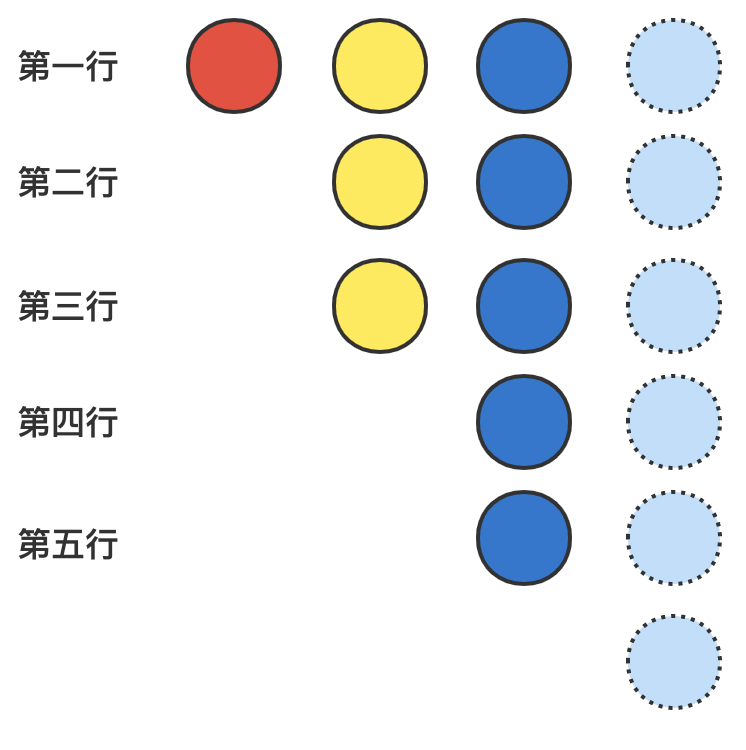
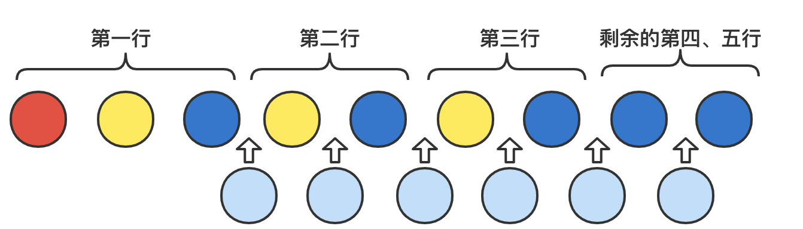

> 原文链接: https://leetcode-cn.com/problems/maximum-number-of-weeks-for-which-you-can-work


## 英文原文
<div><p>There are <code>n</code> projects numbered from <code>0</code> to <code>n - 1</code>. You are given an integer array <code>milestones</code> where each <code>milestones[i]</code> denotes the number of milestones the <code>i<sup>th</sup></code> project has.</p>

<p>You can work on the projects following these two rules:</p>

<ul>
	<li>Every week, you will finish <strong>exactly one</strong> milestone of <strong>one</strong> project. You&nbsp;<strong>must</strong>&nbsp;work every week.</li>
	<li>You <strong>cannot</strong> work on two milestones from the same project for two <strong>consecutive</strong> weeks.</li>
</ul>

<p>Once all the milestones of all the projects are finished, or if the only milestones that you can work on will cause you to violate the above rules, you will <strong>stop working</strong>. Note that you may not be able to finish every project&#39;s milestones due to these constraints.</p>

<p>Return <em>the <strong>maximum</strong> number of weeks you would be able to work on the projects without violating the rules mentioned above</em>.</p>

<p>&nbsp;</p>
<p><strong>Example 1:</strong></p>

<pre>
<strong>Input:</strong> milestones = [1,2,3]
<strong>Output:</strong> 6
<strong>Explanation:</strong> One possible scenario is:
​​​​- During the 1<sup>st</sup> week, you will work on a milestone of project 0.
- During the 2<sup>nd</sup> week, you will work on a milestone of project 2.
- During the 3<sup>rd</sup> week, you will work on a milestone of project 1.
- During the 4<sup>th</sup> week, you will work on a milestone of project 2.
- During the 5<sup>th</sup> week, you will work on a milestone of project 1.
- During the 6<sup>th</sup> week, you will work on a milestone of project 2.
The total number of weeks is 6.
</pre>

<p><strong>Example 2:</strong></p>

<pre>
<strong>Input:</strong> milestones = [5,2,1]
<strong>Output:</strong> 7
<strong>Explanation:</strong> One possible scenario is:
- During the 1<sup>st</sup> week, you will work on a milestone of project 0.
- During the 2<sup>nd</sup> week, you will work on a milestone of project 1.
- During the 3<sup>rd</sup> week, you will work on a milestone of project 0.
- During the 4<sup>th</sup> week, you will work on a milestone of project 1.
- During the 5<sup>th</sup> week, you will work on a milestone of project 0.
- During the 6<sup>th</sup> week, you will work on a milestone of project 2.
- During the 7<sup>th</sup> week, you will work on a milestone of project 0.
The total number of weeks is 7.
Note that you cannot work on the last milestone of project 0 on 8<sup>th</sup> week because it would violate the rules.
Thus, one milestone in project 0 will remain unfinished.
</pre>

<p>&nbsp;</p>
<p><strong>Constraints:</strong></p>

<ul>
	<li><code>n == milestones.length</code></li>
	<li><code>1 &lt;= n &lt;= 10<sup>5</sup></code></li>
	<li><code>1 &lt;= milestones[i] &lt;= 10<sup>9</sup></code></li>
</ul>
</div>

## 中文题目
<div><p>给你&nbsp;<code>n</code> 个项目，编号从 <code>0</code> 到 <code>n - 1</code> 。同时给你一个整数数组 <code>milestones</code> ，其中每个 <code>milestones[i]</code> 表示第 <code>i</code> 个项目中的阶段任务数量。</p>

<p>你可以按下面两个规则参与项目中的工作：</p>

<ul>
	<li>每周，你将会完成 <strong>某一个</strong> 项目中的 <strong>恰好一个</strong>&nbsp;阶段任务。你每周都 <strong>必须</strong> 工作。</li>
	<li>在 <strong>连续的</strong> 两周中，你 <strong>不能</strong> 参与并完成同一个项目中的两个阶段任务。</li>
</ul>

<p>一旦所有项目中的全部阶段任务都完成，或者仅剩余一个阶段任务都会导致你违反上面的规则，那么你将&nbsp;<strong>停止工作</strong> 。注意，由于这些条件的限制，你可能无法完成所有阶段任务。</p>

<p>返回在不违反上面规则的情况下你&nbsp;<strong>最多</strong>&nbsp;能工作多少周。</p>

<p>&nbsp;</p>

<p><strong>示例 1：</strong></p>

<pre>
<strong>输入：</strong>milestones = [1,2,3]
<strong>输出：</strong>6
<strong>解释：</strong>一种可能的情形是：
​​​​- 第 1 周，你参与并完成项目 0 中的一个阶段任务。
- 第 2 周，你参与并完成项目 2 中的一个阶段任务。
- 第 3 周，你参与并完成项目 1 中的一个阶段任务。
- 第 4 周，你参与并完成项目 2 中的一个阶段任务。
- 第 5 周，你参与并完成项目 1 中的一个阶段任务。
- 第 6 周，你参与并完成项目 2 中的一个阶段任务。
总周数是 6 。
</pre>

<p><strong>示例 2：</strong></p>

<pre>
<strong>输入：</strong>milestones = [5,2,1]
<strong>输出：</strong>7
<strong>解释：</strong>一种可能的情形是：
- 第 1 周，你参与并完成项目 0 中的一个阶段任务。
- 第 2 周，你参与并完成项目 1 中的一个阶段任务。
- 第 3 周，你参与并完成项目 0 中的一个阶段任务。
- 第 4 周，你参与并完成项目 1 中的一个阶段任务。
- 第 5 周，你参与并完成项目 0 中的一个阶段任务。
- 第 6 周，你参与并完成项目 2 中的一个阶段任务。
- 第 7 周，你参与并完成项目 0 中的一个阶段任务。
总周数是 7 。
注意，你不能在第 8 周参与完成项目 0 中的最后一个阶段任务，因为这会违反规则。
因此，项目 0 中会有一个阶段任务维持未完成状态。</pre>

<p>&nbsp;</p>

<p><strong>提示：</strong></p>

<ul>
	<li><code>n == milestones.length</code></li>
	<li><code>1 &lt;= n &lt;= 10<sup>5</sup></code></li>
	<li><code>1 &lt;= milestones[i] &lt;= 10<sup>9</sup></code></li>
</ul>
</div>

## 通过代码
<RecoDemo>
</RecoDemo>


## 高赞题解
# 5831. 你可以工作的最大周数
思路：分类讨论
​
时间复杂度：$O(n)$
​
这题可以抽象为有 $n$ 种颜色的球，每种小球有 $C_i$ 个。现取出 $m$ 个小球，将其排成一排，并满足相邻小球颜色不同。问 $m$ 的最大值。
​
一种比较直观的思路是，先把最多的颜色拿出来排成一排，然后将其他颜色插入。
​
接下来尝试用人话证明一下这个思路。先假设 $C$ 是一个升序序列，即
$$C_1 \le C_2\le ...\le C_n$$
​
则其中的最大值为 $C_n$。
​
另外设 $sum = C_1+...+C_{n-1}$。
​
当 $C_n = sum$ 或 $C_n=sum+1$ 或 $C_n=sum-1$ 时，答案为 $sum + C_n$。这几种情况比较好想，就不赘述了。
​
当 $C_n < sum-1$ 时，答案也为 $C_n + sum$，下面来证明下这种情况。
​
​
{:style="width:400px"}
​
假设除掉最大的 $C_n$ 之后，剩余三种颜色小球，分别有 1, 3, 5个。我们按行来取，每次取一行，排成下面这样。
​
{:style="width:400px"}
​
这种放置方法，必导致末尾有 $C_{n-1}-C_{n-2}$ 个不合规的小球。解决方案如下：
​
{:style="width:400px"}
​
但因为 $C_n \ge C_{n-1}-C_{n-2}$，所以可用 $C_{n-1}-C_{n-2}$ 个第 $n$ 种颜色的小球将其隔开。
​
又因为 $sum-1 \gt C_n$，因此还有足够的位置插入剩余的小球。
​
​
最后一种情况，$C_n \gt sum+1$ 时，第 $n$ 种颜色的球，最多只能选 $sum+1$ 个，然后用其他颜色的 $sum$ 个球将其隔开，所以此时答案为 $sum*2+1$。
​
综上所述：
* $C_n \gt sum+1$ 时，答案为 $sum*2+1$
* 其他情况，为 $C_n + sum$
​
```cpp
class Solution {
public:
    long long numberOfWeeks(vector<int>& ml) {
        int64_t sum = 0, max = 0;
        for (auto d : ml) {
            sum += d;
            max = (max > d ? max : d);
        }
        sum -= max;
        if (sum+1 >= max) {
            return sum + max;
        }
        return sum*2+1;
    }
};
```


## 统计信息
| 通过次数 | 提交次数 | AC比率 |
| :------: | :------: | :------: |
|    4480    |    13492    |   33.2%   |

## 提交历史
| 提交时间 | 提交结果 | 执行时间 |  内存消耗  | 语言 |
| :------: | :------: | :------: | :--------: | :--------: |
