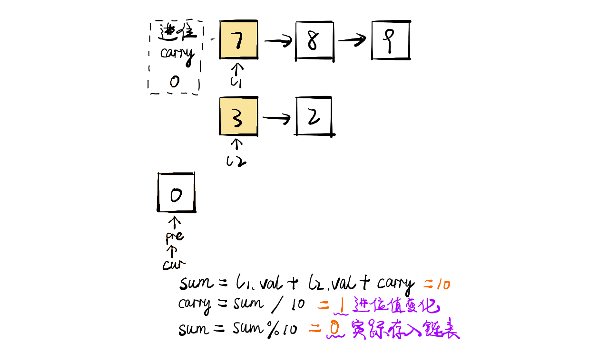
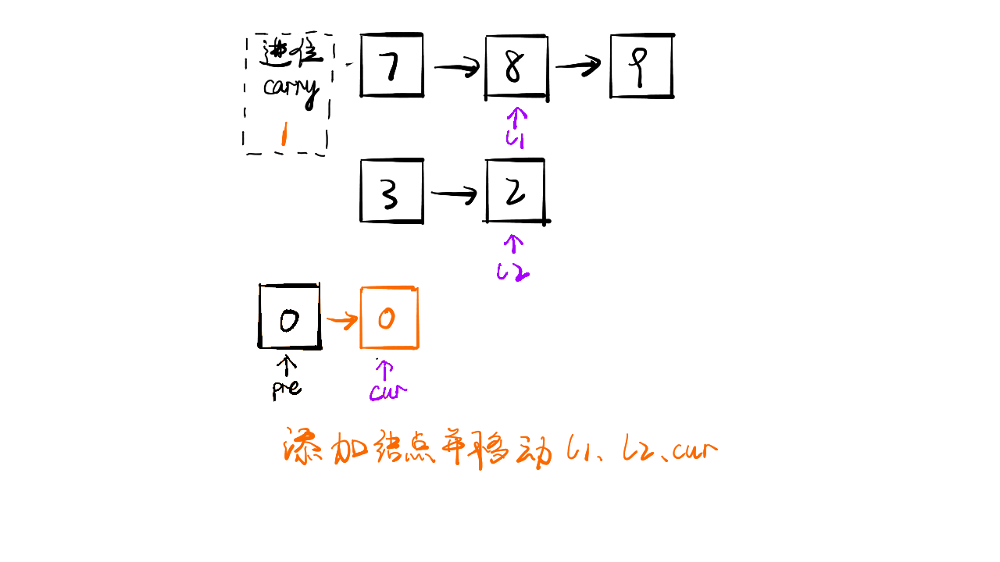
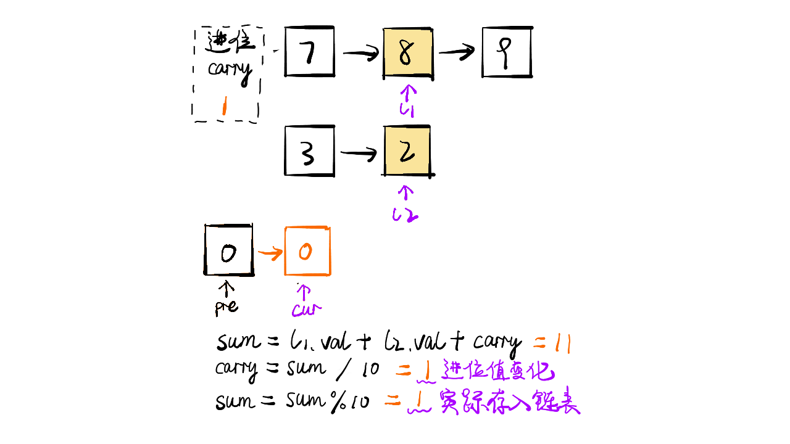
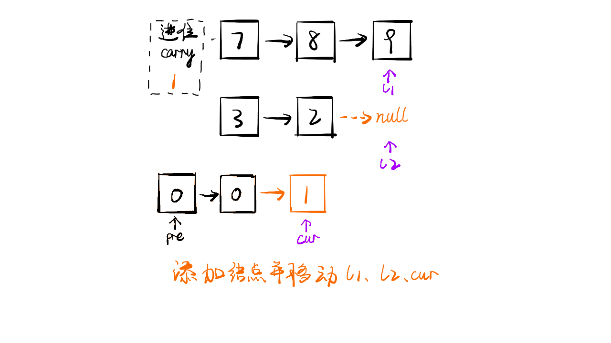
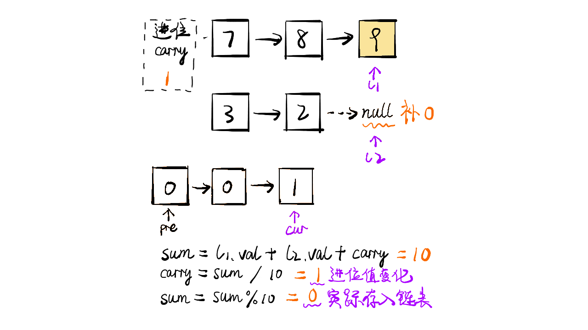
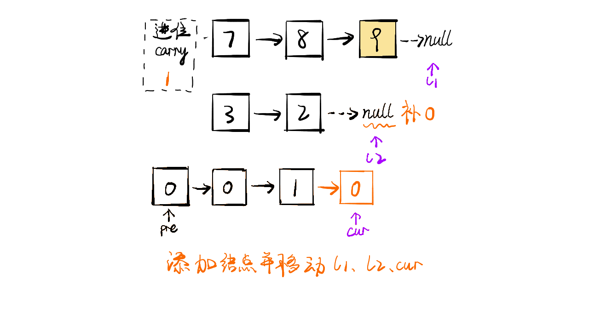
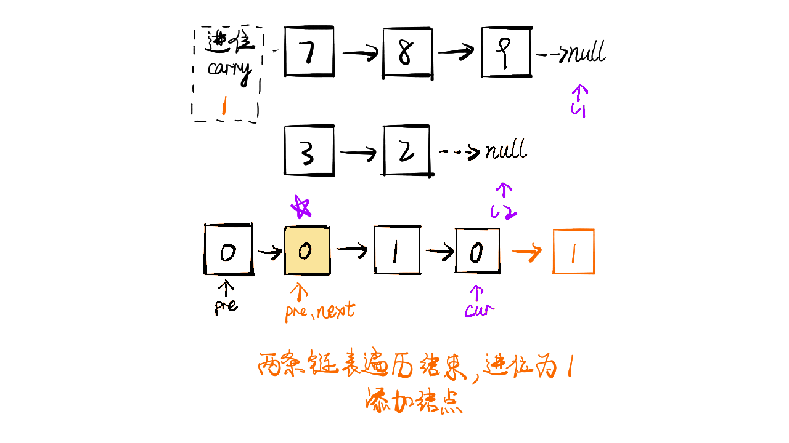

> 原文链接: https://leetcode-cn.com/problems/add-two-numbers


## 英文原文
<div><p>You are given two <strong>non-empty</strong> linked lists representing two non-negative integers. The digits are stored in <strong>reverse order</strong>, and each of their nodes contains a single digit. Add the two numbers and return the sum&nbsp;as a linked list.</p>

<p>You may assume the two numbers do not contain any leading zero, except the number 0 itself.</p>

<p>&nbsp;</p>
<p><strong>Example 1:</strong></p>

<pre>
<strong>Input:</strong> l1 = [2,4,3], l2 = [5,6,4]
<strong>Output:</strong> [7,0,8]
<strong>Explanation:</strong> 342 + 465 = 807.
</pre>

<p><strong>Example 2:</strong></p>

<pre>
<strong>Input:</strong> l1 = [0], l2 = [0]
<strong>Output:</strong> [0]
</pre>

<p><strong>Example 3:</strong></p>

<pre>
<strong>Input:</strong> l1 = [9,9,9,9,9,9,9], l2 = [9,9,9,9]
<strong>Output:</strong> [8,9,9,9,0,0,0,1]
</pre>

<p>&nbsp;</p>
<p><strong>Constraints:</strong></p>

<ul>
	<li>The number of nodes in each linked list is in the range <code>[1, 100]</code>.</li>
	<li><code>0 &lt;= Node.val &lt;= 9</code></li>
	<li>It is guaranteed that the list represents a number that does not have leading zeros.</li>
</ul>
</div>

## 中文题目
<div><p>给你两个 <strong>非空</strong> 的链表，表示两个非负的整数。它们每位数字都是按照 <strong>逆序</strong> 的方式存储的，并且每个节点只能存储 <strong>一位</strong> 数字。</p>

<p>请你将两个数相加，并以相同形式返回一个表示和的链表。</p>

<p>你可以假设除了数字 0 之外，这两个数都不会以 0 开头。</p>

<p> </p>

<p><strong>示例 1：</strong></p>

<pre>
<strong>输入：</strong>l1 = [2,4,3], l2 = [5,6,4]
<strong>输出：</strong>[7,0,8]
<strong>解释：</strong>342 + 465 = 807.
</pre>

<p><strong>示例 2：</strong></p>

<pre>
<strong>输入：</strong>l1 = [0], l2 = [0]
<strong>输出：</strong>[0]
</pre>

<p><strong>示例 3：</strong></p>

<pre>
<strong>输入：</strong>l1 = [9,9,9,9,9,9,9], l2 = [9,9,9,9]
<strong>输出：</strong>[8,9,9,9,0,0,0,1]
</pre>

<p> </p>

<p><strong>提示：</strong></p>

<ul>
	<li>每个链表中的节点数在范围 <code>[1, 100]</code> 内</li>
	<li><code>0 <= Node.val <= 9</code></li>
	<li>题目数据保证列表表示的数字不含前导零</li>
</ul>
</div>

## 通过代码
<RecoDemo>
</RecoDemo>


## 高赞题解
### 思路

- 标签：链表
- 将两个链表看成是相同长度的进行遍历，如果一个链表较短则在前面补 $0$，比如 `987 + 23 = 987 + 023 = 1010`
- 每一位计算的同时需要考虑上一位的进位问题，而当前位计算结束后同样需要更新进位值
- 如果两个链表全部遍历完毕后，进位值为 $1$，则在新链表最前方添加节点 $1$
- 小技巧：对于链表问题，返回结果为头结点时，通常需要先初始化一个预先指针 pre，该指针的下一个节点指向真正的头结点head。**使用预先指针的目的在于链表初始化时无可用节点值，而且链表构造过程需要指针移动，进而会导致头指针丢失，无法返回结果。**


### 代码

```Java []
/**
 * Definition for singly-linked list.
 * public class ListNode {
 *     int val;
 *     ListNode next;
 *     ListNode(int x) { val = x; }
 * }
 */
class Solution {
    public ListNode addTwoNumbers(ListNode l1, ListNode l2) {
        ListNode pre = new ListNode(0);
        ListNode cur = pre;
        int carry = 0;
        while(l1 != null || l2 != null) {
            int x = l1 == null ? 0 : l1.val;
            int y = l2 == null ? 0 : l2.val;
            int sum = x + y + carry;
            
            carry = sum / 10;
            sum = sum % 10;
            cur.next = new ListNode(sum);

            cur = cur.next;
            if(l1 != null)
                l1 = l1.next;
            if(l2 != null)
                l2 = l2.next;
        }
        if(carry == 1) {
            cur.next = new ListNode(carry);
        }
        return pre.next;
    }
}
```

### 画解

<,,,,,,,,>

想看大鹏画解更多高频面试题，欢迎阅读大鹏的 LeetBook：[《画解剑指 Offer 》](https://leetcode-cn.com/leetbook/detail/illustrate-lcof/)，O(∩_∩)O

## 统计信息
| 通过次数 | 提交次数 | AC比率 |
| :------: | :------: | :------: |
|    1083177    |    2638107    |   41.1%   |

## 提交历史
| 提交时间 | 提交结果 | 执行时间 |  内存消耗  | 语言 |
| :------: | :------: | :------: | :--------: | :--------: |


## 相似题目
|                             题目                             | 难度 |
| :----------------------------------------------------------: | :---------: |
| [字符串相乘](https://leetcode-cn.com/problems/multiply-strings/) | 中等|
| [二进制求和](https://leetcode-cn.com/problems/add-binary/) | 简单|
| [两整数之和](https://leetcode-cn.com/problems/sum-of-two-integers/) | 中等|
| [字符串相加](https://leetcode-cn.com/problems/add-strings/) | 简单|
| [两数相加 II](https://leetcode-cn.com/problems/add-two-numbers-ii/) | 中等|
| [数组形式的整数加法](https://leetcode-cn.com/problems/add-to-array-form-of-integer/) | 简单|
