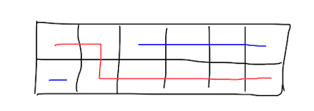

> 原文链接: https://leetcode-cn.com/problems/grid-game


## 英文原文
<div><p>You are given a <strong>0-indexed</strong> 2D array <code>grid</code> of size <code>2 x n</code>, where <code>grid[r][c]</code> represents the number of points at position <code>(r, c)</code> on the matrix. Two robots are playing a game on this matrix.</p>

<p>Both robots initially start at <code>(0, 0)</code> and want to reach <code>(1, n-1)</code>. Each robot may only move to the <strong>right</strong> (<code>(r, c)</code> to <code>(r, c + 1)</code>) or <strong>down </strong>(<code>(r, c)</code> to <code>(r + 1, c)</code>).</p>

<p>At the start of the game, the <strong>first</strong> robot moves from <code>(0, 0)</code> to <code>(1, n-1)</code>, collecting all the points from the cells on its path. For all cells <code>(r, c)</code> traversed on the path, <code>grid[r][c]</code> is set to <code>0</code>. Then, the <strong>second</strong> robot moves from <code>(0, 0)</code> to <code>(1, n-1)</code>, collecting the points on its path. Note that their paths may intersect with one another.</p>

<p>The <strong>first</strong> robot wants to <strong>minimize</strong> the number of points collected by the <strong>second</strong> robot. In contrast, the <strong>second </strong>robot wants to <strong>maximize</strong> the number of points it collects. If both robots play <strong>optimally</strong>, return <em>the <b>number of points</b> collected by the <strong>second</strong> robot.</em></p>

<p>&nbsp;</p>
<p><strong>Example 1:</strong></p>

<pre>
<strong>Input:</strong> grid = [[2,5,4],[1,5,1]]
<strong>Output:</strong> 4
<strong>Explanation:</strong> The optimal path taken by the first robot is shown in red, and the optimal path taken by the second robot is shown in blue.
The cells visited by the first robot are set to 0.
The second robot will collect 0 + 0 + 4 + 0 = 4 points.
</pre>

<p><strong>Example 2:</strong></p>

<pre>
<strong>Input:</strong> grid = [[3,3,1],[8,5,2]]
<strong>Output:</strong> 4
<strong>Explanation:</strong> The optimal path taken by the first robot is shown in red, and the optimal path taken by the second robot is shown in blue.
The cells visited by the first robot are set to 0.
The second robot will collect 0 + 3 + 1 + 0 = 4 points.
</pre>

<p><strong>Example 3:</strong></p>

<pre>
<strong>Input:</strong> grid = [[1,3,1,15],[1,3,3,1]]
<strong>Output:</strong> 7
<strong>Explanation: </strong>The optimal path taken by the first robot is shown in red, and the optimal path taken by the second robot is shown in blue.
The cells visited by the first robot are set to 0.
The second robot will collect 0 + 1 + 3 + 3 + 0 = 7 points.
</pre>

<p>&nbsp;</p>
<p><strong>Constraints:</strong></p>

<ul>
	<li><code>grid.length == 2</code></li>
	<li><code>n == grid[r].length</code></li>
	<li><code>1 &lt;= n &lt;= 5 * 10<sup>4</sup></code></li>
	<li><code>1 &lt;= grid[r][c] &lt;= 10<sup>5</sup></code></li>
</ul>
</div>

## 中文题目
<div><p>给你一个下标从 <strong>0</strong> 开始的二维数组 <code>grid</code> ，数组大小为 <code>2 x n</code> ，其中 <code>grid[r][c]</code> 表示矩阵中 <code>(r, c)</code> 位置上的点数。现在有两个机器人正在矩阵上参与一场游戏。</p>

<p>两个机器人初始位置都是 <code>(0, 0)</code> ，目标位置是 <code>(1, n-1)</code> 。每个机器人只会 <strong>向右</strong> (<code>(r, c)</code> 到 <code>(r, c + 1)</code>) 或 <strong>向下 </strong>(<code>(r, c)</code> 到 <code>(r + 1, c)</code>) 。</p>

<p>游戏开始，<strong>第一个</strong> 机器人从 <code>(0, 0)</code> 移动到 <code>(1, n-1)</code> ，并收集路径上单元格的全部点数。对于路径上所有单元格 <code>(r, c)</code> ，途经后 <code>grid[r][c]</code> 会重置为 <code>0</code> 。然后，<strong>第二个</strong> 机器人从 <code>(0, 0)</code> 移动到 <code>(1, n-1)</code> ，同样收集路径上单元的全部点数。注意，它们的路径可能会存在相交的部分。</p>

<p><strong>第一个</strong> 机器人想要打击竞争对手，使 <strong>第二个</strong> 机器人收集到的点数 <strong>最小化</strong> 。与此相对，<strong>第二个</strong> 机器人想要 <strong>最大化</strong> 自己收集到的点数。两个机器人都发挥出自己的 <strong>最佳水平</strong>&nbsp;的前提下，返回 <strong>第二个</strong> 机器人收集到的 <strong>点数</strong> <em>。</em></p>

<p>&nbsp;</p>

<p><strong>示例 1：</strong></p>

<p></p>

<pre>
<strong>输入：</strong>grid = [[2,5,4],[1,5,1]]
<strong>输出：</strong>4
<strong>解释：</strong>第一个机器人的最佳路径如红色所示，第二个机器人的最佳路径如蓝色所示。
第一个机器人访问过的单元格将会重置为 0 。
第二个机器人将会收集到 0 + 0 + 4 + 0 = 4 个点。
</pre>

<p><strong>示例 2：</strong></p>

<pre>
<strong>输入：</strong>grid = [[3,3,1],[8,5,2]]
<strong>输出：</strong>4
<strong>解释：</strong>第一个机器人的最佳路径如红色所示，第二个机器人的最佳路径如蓝色所示。 
第一个机器人访问过的单元格将会重置为 0 。
第二个机器人将会收集到 0 + 3 + 1 + 0 = 4 个点。
</pre>

<p><strong>示例 3：</strong></p>

<pre>
<strong>输入：</strong>grid = [[1,3,1,15],[1,3,3,1]]
<strong>输出：</strong>7
<strong>解释：</strong>第一个机器人的最佳路径如红色所示，第二个机器人的最佳路径如蓝色所示。
第一个机器人访问过的单元格将会重置为 0 。
第二个机器人将会收集到 0 + 1 + 3 + 3 + 0 = 7 个点。
</pre>

<p>&nbsp;</p>

<p><strong>提示：</strong></p>

<ul>
	<li><code>grid.length == 2</code></li>
	<li><code>n == grid[r].length</code></li>
	<li><code>1 &lt;= n &lt;= 5 * 10<sup>4</sup></code></li>
	<li><code>1 &lt;= grid[r][c] &lt;= 10<sup>5</sup></code></li>
</ul>
</div>

## 通过代码
<RecoDemo>
</RecoDemo>


## 高赞题解
### 解题思路

如图所示，假设第一个机器人走红色的线路，那么第二个机器人最多只能拿到最多第一行蓝线的和或者第二行蓝线的和。
所以第一个机器人的任务就是使两条蓝线和的最大值最小。
可以使用前缀和来快速计算蓝线的和，枚举即可。
时间复杂度：$O(N)$

### 代码

```java
class Solution {
    public long gridGame(int[][] grid) {
        int n = grid[0].length;
        long[][] p = new long[2][n + 1];
        for(int i = 1; i <= n; i++) {
            p[0][i] = p[0][i - 1] + grid[0][i - 1];
            p[1][i] = p[1][i - 1] + grid[1][i - 1];
        }
        long ans = Long.MAX_VALUE;
        for(int i = 1; i <= n; i++) {
            ans = Math.min(ans, Math.max(p[0][n] - p[0][i], p[1][i - 1]));
        }
        return ans;
    }
}
```

## 统计信息
| 通过次数 | 提交次数 | AC比率 |
| :------: | :------: | :------: |
|    3851    |    10871    |   35.4%   |

## 提交历史
| 提交时间 | 提交结果 | 执行时间 |  内存消耗  | 语言 |
| :------: | :------: | :------: | :--------: | :--------: |
