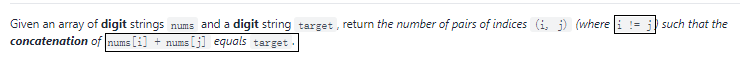

> 原文链接: https://leetcode-cn.com/problems/number-of-pairs-of-strings-with-concatenation-equal-to-target


## 英文原文
<div><p>Given an array of <strong>digit</strong> strings <code>nums</code> and a <strong>digit</strong> string <code>target</code>, return <em>the number of pairs of indices </em><code>(i, j)</code><em> (where </em><code>i != j</code><em>) such that the <strong>concatenation</strong> of </em><code>nums[i] + nums[j]</code><em> equals </em><code>target</code>.</p>

<p>&nbsp;</p>
<p><strong>Example 1:</strong></p>

<pre>
<strong>Input:</strong> nums = [&quot;777&quot;,&quot;7&quot;,&quot;77&quot;,&quot;77&quot;], target = &quot;7777&quot;
<strong>Output:</strong> 4
<strong>Explanation:</strong> Valid pairs are:
- (0, 1): &quot;777&quot; + &quot;7&quot;
- (1, 0): &quot;7&quot; + &quot;777&quot;
- (2, 3): &quot;77&quot; + &quot;77&quot;
- (3, 2): &quot;77&quot; + &quot;77&quot;
</pre>

<p><strong>Example 2:</strong></p>

<pre>
<strong>Input:</strong> nums = [&quot;123&quot;,&quot;4&quot;,&quot;12&quot;,&quot;34&quot;], target = &quot;1234&quot;
<strong>Output:</strong> 2
<strong>Explanation:</strong> Valid pairs are:
- (0, 1): &quot;123&quot; + &quot;4&quot;
- (2, 3): &quot;12&quot; + &quot;34&quot;
</pre>

<p><strong>Example 3:</strong></p>

<pre>
<strong>Input:</strong> nums = [&quot;1&quot;,&quot;1&quot;,&quot;1&quot;], target = &quot;11&quot;
<strong>Output:</strong> 6
<strong>Explanation:</strong> Valid pairs are:
- (0, 1): &quot;1&quot; + &quot;1&quot;
- (1, 0): &quot;1&quot; + &quot;1&quot;
- (0, 2): &quot;1&quot; + &quot;1&quot;
- (2, 0): &quot;1&quot; + &quot;1&quot;
- (1, 2): &quot;1&quot; + &quot;1&quot;
- (2, 1): &quot;1&quot; + &quot;1&quot;
</pre>

<p>&nbsp;</p>
<p><strong>Constraints:</strong></p>

<ul>
	<li><code>2 &lt;= nums.length &lt;= 100</code></li>
	<li><code>1 &lt;= nums[i].length &lt;= 100</code></li>
	<li><code>2 &lt;= target.length &lt;= 100</code></li>
	<li><code>nums[i]</code> and <code>target</code> consist of digits.</li>
	<li><code>nums[i]</code> and <code>target</code> do not have leading zeros.</li>
</ul>
</div>

## 中文题目
<div><p>给你一个 <strong>数字</strong>&nbsp;字符串数组 <code>nums</code>&nbsp;和一个 <strong>数字</strong>&nbsp;字符串 <code>target</code>&nbsp;，请你返回 <code>nums[i] + nums[j]</code>&nbsp;（两个字符串连接）结果等于 <code>target</code>&nbsp;的下标 <code>(i, j)</code>&nbsp;（需满足 <code>i != j</code>）的数目。</p>

<p>&nbsp;</p>

<p><strong>示例 1：</strong></p>

<pre><b>输入：</b>nums = ["777","7","77","77"], target = "7777"
<b>输出：</b>4
<b>解释：</b>符合要求的下标对包括：
- (0, 1)："777" + "7"
- (1, 0)："7" + "777"
- (2, 3)："77" + "77"
- (3, 2)："77" + "77"
</pre>

<p><strong>示例 2：</strong></p>

<pre><b>输入：</b>nums = ["123","4","12","34"], target = "1234"
<b>输出：</b>2
<b>解释：</b>符合要求的下标对包括
- (0, 1)："123" + "4"
- (2, 3)："12" + "34"
</pre>

<p><strong>示例 3：</strong></p>

<pre><b>输入：</b>nums = ["1","1","1"], target = "11"
<b>输出：</b>6
<b>解释：</b>符合要求的下标对包括
- (0, 1)："1" + "1"
- (1, 0)："1" + "1"
- (0, 2)："1" + "1"
- (2, 0)："1" + "1"
- (1, 2)："1" + "1"
- (2, 1)："1" + "1"
</pre>

<p>&nbsp;</p>

<p><strong>提示：</strong></p>

<ul>
	<li><code>2 &lt;= nums.length &lt;= 100</code></li>
	<li><code>1 &lt;= nums[i].length &lt;= 100</code></li>
	<li><code>2 &lt;= target.length &lt;= 100</code></li>
	<li><code>nums[i]</code>&nbsp;和&nbsp;<code>target</code>&nbsp;只包含数字。</li>
	<li><code>nums[i]</code>&nbsp;和&nbsp;<code>target</code>&nbsp;不含有任何前导 0 。</li>
</ul>
</div>

## 通过代码
<RecoDemo>
</RecoDemo>


## 高赞题解


 # 就按照题目描述来写



1.  i != j
2.  nums [ i ]  + nums [ j ] = target ( 必须满足条件一 )

 ### 然后我就想两个for循环暴力过去，代码如下：

```
class Solution:
    def numOfPairs(self, nums: List[str], target: str) -> int:
        n = len ( nums )
        res = 0
        for i in range ( n ) :
            for j in range ( n ) :
                if i != j :
                    if nums [ i ] + nums [ j ] == target :
                        res += 1
        return res
```

 ### 跑起来的结果是我没有想到的(可以算是混过去了？)


 #### 题解要是有哪些地方不对的，各位大佬可以提出来；若是有不同解法，也欢迎提出来


 ##### 题外话 ：我要被自己蠢哭了，呜呜呜，Markdown语法好难


## 统计信息
| 通过次数 | 提交次数 | AC比率 |
| :------: | :------: | :------: |
|    3122    |    4167    |   74.9%   |

## 提交历史
| 提交时间 | 提交结果 | 执行时间 |  内存消耗  | 语言 |
| :------: | :------: | :------: | :--------: | :--------: |
