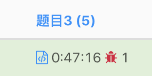

> 原文链接: https://leetcode-cn.com/problems/stock-price-fluctuation


## 英文原文
<div><p>You are given a stream of <strong>records</strong> about a particular stock. Each record contains a <strong>timestamp</strong> and the corresponding <strong>price</strong> of the stock at that timestamp.</p>

<p>Unfortunately due to the volatile nature of the stock market, the records do not come in order. Even worse, some records may be incorrect. Another record with the same timestamp may appear later in the stream <strong>correcting</strong> the price of the previous wrong record.</p>

<p>Design an algorithm that:</p>

<ul>
	<li><strong>Updates</strong> the price of the stock at a particular timestamp, <strong>correcting</strong> the price from any previous records at the timestamp.</li>
	<li>Finds the <strong>latest price</strong> of the stock based on the current records. The <strong>latest price</strong> is the price at the latest timestamp recorded.</li>
	<li>Finds the <strong>maximum price</strong> the stock has been based on the current records.</li>
	<li>Finds the <strong>minimum price</strong> the stock has been based on the current records.</li>
</ul>

<p>Implement the <code>StockPrice</code> class:</p>

<ul>
	<li><code>StockPrice()</code> Initializes the object with no price records.</li>
	<li><code>void update(int timestamp, int price)</code> Updates the <code>price</code> of the stock at the given <code>timestamp</code>.</li>
	<li><code>int current()</code> Returns the <strong>latest price</strong> of the stock.</li>
	<li><code>int maximum()</code> Returns the <strong>maximum price</strong> of the stock.</li>
	<li><code>int minimum()</code> Returns the <strong>minimum price</strong> of the stock.</li>
</ul>

<p>&nbsp;</p>
<p><strong>Example 1:</strong></p>

<pre>
<strong>Input</strong>
[&quot;StockPrice&quot;, &quot;update&quot;, &quot;update&quot;, &quot;current&quot;, &quot;maximum&quot;, &quot;update&quot;, &quot;maximum&quot;, &quot;update&quot;, &quot;minimum&quot;]
[[], [1, 10], [2, 5], [], [], [1, 3], [], [4, 2], []]
<strong>Output</strong>
[null, null, null, 5, 10, null, 5, null, 2]

<strong>Explanation</strong>
StockPrice stockPrice = new StockPrice();
stockPrice.update(1, 10); // Timestamps are [1] with corresponding prices [10].
stockPrice.update(2, 5);  // Timestamps are [1,2] with corresponding prices [10,5].
stockPrice.current();     // return 5, the latest timestamp is 2 with the price being 5.
stockPrice.maximum();     // return 10, the maximum price is 10 at timestamp 1.
stockPrice.update(1, 3);  // The previous timestamp 1 had the wrong price, so it is updated to 3.
                          // Timestamps are [1,2] with corresponding prices [3,5].
stockPrice.maximum();     // return 5, the maximum price is 5 after the correction.
stockPrice.update(4, 2);  // Timestamps are [1,2,4] with corresponding prices [3,5,2].
stockPrice.minimum();     // return 2, the minimum price is 2 at timestamp 4.
</pre>

<p>&nbsp;</p>
<p><strong>Constraints:</strong></p>

<ul>
	<li><code>1 &lt;= timestamp, price &lt;= 10<sup>9</sup></code></li>
	<li>At most <code>10<sup>5</sup></code> calls will be made <strong>in total</strong> to <code>update</code>, <code>current</code>, <code>maximum</code>, and <code>minimum</code>.</li>
	<li><code>current</code>, <code>maximum</code>, and <code>minimum</code> will be called <strong>only after</strong> <code>update</code> has been called <strong>at least once</strong>.</li>
</ul>
</div>

## 中文题目
<div><p>给你一支股票价格的数据流。数据流中每一条记录包含一个 <strong>时间戳</strong>&nbsp;和该时间点股票对应的 <strong>价格</strong>&nbsp;。</p>

<p>不巧的是，由于股票市场内在的波动性，股票价格记录可能不是按时间顺序到来的。某些情况下，有的记录可能是错的。如果两个有相同时间戳的记录出现在数据流中，前一条记录视为错误记录，后出现的记录 <b>更正</b>&nbsp;前一条错误的记录。</p>

<p>请你设计一个算法，实现：</p>

<ul>
	<li><strong>更新 </strong>股票在某一时间戳的股票价格，如果有之前同一时间戳的价格，这一操作将&nbsp;<strong>更正</strong>&nbsp;之前的错误价格。</li>
	<li>找到当前记录里 <b>最新股票价格</b>&nbsp;。<strong>最新股票价格</strong>&nbsp;定义为时间戳最晚的股票价格。</li>
	<li>找到当前记录里股票的 <strong>最高价格</strong>&nbsp;。</li>
	<li>找到当前记录里股票的 <strong>最低价格</strong>&nbsp;。</li>
</ul>

<p>请你实现&nbsp;<code>StockPrice</code>&nbsp;类：</p>

<ul>
	<li><code>StockPrice()</code>&nbsp;初始化对象，当前无股票价格记录。</li>
	<li><code>void update(int timestamp, int price)</code>&nbsp;在时间点 <code>timestamp</code>&nbsp;更新股票价格为 <code>price</code>&nbsp;。</li>
	<li><code>int current()</code>&nbsp;返回股票 <strong>最新价格</strong>&nbsp;。</li>
	<li><code>int maximum()</code>&nbsp;返回股票 <strong>最高价格</strong>&nbsp;。</li>
	<li><code>int minimum()</code>&nbsp;返回股票 <strong>最低价格</strong>&nbsp;。</li>
</ul>

<p>&nbsp;</p>

<p><strong>示例 1：</strong></p>

<pre><strong>输入：</strong>
["StockPrice", "update", "update", "current", "maximum", "update", "maximum", "update", "minimum"]
[[], [1, 10], [2, 5], [], [], [1, 3], [], [4, 2], []]
<strong>输出：</strong>
[null, null, null, 5, 10, null, 5, null, 2]

<strong>解释：</strong>
StockPrice stockPrice = new StockPrice();
stockPrice.update(1, 10); // 时间戳为 [1] ，对应的股票价格为 [10] 。
stockPrice.update(2, 5);  // 时间戳为 [1,2] ，对应的股票价格为 [10,5] 。
stockPrice.current();     // 返回 5 ，最新时间戳为 2 ，对应价格为 5 。
stockPrice.maximum();     // 返回 10 ，最高价格的时间戳为 1 ，价格为 10 。
stockPrice.update(1, 3);  // 之前时间戳为 1 的价格错误，价格更新为 3 。
                          // 时间戳为 [1,2] ，对应股票价格为 [3,5] 。
stockPrice.maximum();     // 返回 5 ，更正后最高价格为 5 。
stockPrice.update(4, 2);  // 时间戳为 [1,2,4] ，对应价格为 [3,5,2] 。
stockPrice.minimum();     // 返回 2 ，最低价格时间戳为 4 ，价格为 2 。
</pre>

<p>&nbsp;</p>

<p><strong>提示：</strong></p>

<ul>
	<li><code>1 &lt;= timestamp, price &lt;= 10<sup>9</sup></code></li>
	<li><code>update</code>，<code>current</code>，<code>maximum</code>&nbsp;和&nbsp;<code>minimum</code>&nbsp;<strong>总</strong> 调用次数不超过&nbsp;<code>10<sup>5</sup></code>&nbsp;。</li>
	<li><code>current</code>，<code>maximum</code>&nbsp;和&nbsp;<code>minimum</code>&nbsp;被调用时，<code>update</code>&nbsp;操作 <strong>至少</strong>&nbsp;已经被调用过 <strong>一次</strong>&nbsp;。</li>
</ul>
</div>

## 通过代码
<RecoDemo>
</RecoDemo>


## 高赞题解
最新价格从《时间-价格表》HashMap中取
最大最小值从 《价格-数量表》TreeMap中取


```
    class StockPrice {
        HashMap<Integer, Integer> tsMap;
        TreeMap<Integer, Integer> priceMap;
        int currentTs;

        public StockPrice() {
            tsMap = new HashMap<>();
            priceMap = new TreeMap<>();
            currentTs = 0;
        }

        public void update(int timestamp, int price) {
            if (tsMap.containsKey(timestamp)) {
                int oldPrice = tsMap.get(timestamp);
                priceMap.put(oldPrice, priceMap.get(oldPrice) - 1);
                if (priceMap.get(oldPrice) == 0) {
                    priceMap.remove(oldPrice);
                }
            }
            priceMap.put(price, priceMap.getOrDefault(price, 0) + 1);
            tsMap.put(timestamp, price);
            currentTs = Math.max(currentTs, timestamp);
        }

        public int current() {
            return tsMap.get(currentTs);
        }

        public int maximum() {
            return priceMap.lastKey();
        }

        public int minimum() {
            return priceMap.firstKey();
        }
    }
```


## 统计信息
| 通过次数 | 提交次数 | AC比率 |
| :------: | :------: | :------: |
|    3341    |    11019    |   30.3%   |

## 提交历史
| 提交时间 | 提交结果 | 执行时间 |  内存消耗  | 语言 |
| :------: | :------: | :------: | :--------: | :--------: |
