> 原文链接: https://leetcode-cn.com/problems/count-primes


## 英文原文
<div><p>Given an integer <code>n</code>, return <em>the number of prime numbers that are strictly less than</em> <code>n</code>.</p>

<p>&nbsp;</p>
<p><strong>Example 1:</strong></p>

<pre>
<strong>Input:</strong> n = 10
<strong>Output:</strong> 4
<strong>Explanation:</strong> There are 4 prime numbers less than 10, they are 2, 3, 5, 7.
</pre>

<p><strong>Example 2:</strong></p>

<pre>
<strong>Input:</strong> n = 0
<strong>Output:</strong> 0
</pre>

<p><strong>Example 3:</strong></p>

<pre>
<strong>Input:</strong> n = 1
<strong>Output:</strong> 0
</pre>

<p>&nbsp;</p>
<p><strong>Constraints:</strong></p>

<ul>
	<li><code>0 &lt;= n &lt;= 5 * 10<sup>6</sup></code></li>
</ul>
</div>

## 中文题目
<div><p>统计所有小于非负整数&nbsp;<em><code>n</code>&nbsp;</em>的质数的数量。</p>

<p>&nbsp;</p>

<p><strong>示例 1：</strong></p>

<pre><strong>输入：</strong>n = 10
<strong>输出：</strong>4
<strong>解释：</strong>小于 10 的质数一共有 4 个, 它们是 2, 3, 5, 7 。
</pre>

<p><strong>示例 2：</strong></p>

<pre><strong>输入：</strong>n = 0
<strong>输出：</strong>0
</pre>

<p><strong>示例 3：</strong></p>

<pre><strong>输入：</strong>n = 1
<strong>输出</strong>：0
</pre>

<p>&nbsp;</p>

<p><strong>提示：</strong></p>

<ul>
	<li><code>0 &lt;= n &lt;= 5 * 10<sup>6</sup></code></li>
</ul>
</div>

## 通过代码
<RecoDemo>
</RecoDemo>


## 高赞题解
### 总括：


此篇题解将共讲述暴力算法、优化暴力算法、厄拉多塞（话说这位老哥第一个量了地球周长）所创造的厄拉多塞筛法、及运用厄拉多塞筛法时于内存上的优化方法。在解释思路时，将尽量一步步地进行详细解读。


希望对大家能有所帮助！


***


### 解决方案:


**一、暴力法（计算超时）：**


验证一个数是否为质数（素数）有很多方法。但最容易想到的莫非用暴力计算的方式一步步碾压过去的方法。虽然这种方法不是最优的，但是其对于我们了解素数仍是有所帮助的。


思路：验证某个数是否为质数时，将其对每一个比其小的数进行取余运算，并对取余为零的情况进行计数。由于质数是指在大于 1 的自然数中，除了 1 和它本身以外不再有其他因数的自然数。所以，当计数结果为 1 时，该数为质数。


在实际操作中，由于 1 和任意一个数必然取余为零，所以可以直接排除。并当没有取余为零的情况时，其才为质数。


得代码如下：


```Csharp []

public int CountPrimes(int n) 

{

    int count = 0;

    for (int i = 2; i < n; i++)

    {

        bool sign = true;

        for (int j = 2; j < i; j++)

        {

            if (i % j == 0)

            {

                sign = false;

                break;

            }

        }

        if (sign)

            count++; ;

    }

    return count;

}

```

```C++ []

int countPrimes(int n) {

    int count = 0;

    for (int i = 2; i < n; i++){

        bool sign = true;

        for (int j = 2; j < i; j++){

            if (i % j == 0)

            {

                sign = false;

                break;

            }

        }

        if (sign)

            count++; ;

    }

    return count;

}

```


**二、优化暴力算法：**


细究暴力计算的方法，我们可以发现，假如一个数为 9 ，那么其二分之一（4.5）后的数都可以不用进行计算，因为肯定是有余的 。事实上情况会比这更好一些：对正整数 n ，如果用 2 到 √n 之间(包含边界)的所有整数去除，均无法整除，则 n 为质数。


并且，我们可以发现，一切非 2 偶数一定不可能为质数。所以，我们可以在此处进行另一步的优化。


有个这些令人庆幸的发现，我们的代码也将如虎添翼：


```Csharp []

public int CountPrimes(int n)

{

    if(n < 3)

        return 0;;

    //从3开始验算，所以初始值为1（2为质数）。

    int count = 1;

    for (int i = 3; i < n; i++)

    {

        //当某个数为 2 的 n 次方时（n为自然数），其 & (n - 1) 所得值将等价于取余运算所得值

        //*如果 x = 2^n ，则 x & (n - 1) == x % n

        //if(i % 2 == 0)

        if ((i & 1) == 0)

            continue; ;

        bool sign = true;

        //用 j * j <= i 代替 j <= √i 会更好。

        //因为我们已经排除了所有偶数，所以每次循环加二将规避偶数会减少循环次数

        for (int j = 3; j * j <=i; j+=2)

        {

            if (i % j == 0)

            {

                sign = false;

                break;

            }

        }

        if (sign)

            count++; ;

    }

    return count;

}

```

```C++ []

int countPrimes(int n) {

    if(n < 3)

        return 0;;

    //从3开始验算，所以初始值为1（2为质数）。

    int count = 1;

    for (int i = 3; i < n; i++){

        //当某个数为 2 的 n 次方时（n为自然数），其 & (n - 1) 所得值将等价于取余运算所得值

        //*如果 x = 2^n ，则 x & (n - 1) == x % n

        //if(i % 2 == 0)

        if ((i & 1) == 0)

            continue; ;

        bool sign = true;

        //用 j * j <= i 代替 j <= √i 会更好。

        //因为我们已经排除了所有偶数，所以每次循环加二将规避偶数会减少循环次数

        for (int j = 3; j * j <=i; j+=2){

            if (i % j == 0){

                sign = false;

                break;

            }

        }

        if (sign)

            count++; ;

    }

    return count;

}

```


(暴力法系列的 C# 和 C++ 的代码几乎相同。)


经过对暴力算法的此番优化，我们的代码初步达到了应用的最低门槛，但显然还是不大理想，好似总感觉存在不必要的操作。但我们经过以上的研究（可以早一步排除偶数），再结合质数的性质，可以推想出：如果我们在进行顺序遍历时，每取得一个数（排除0、1），如果将它所有的倍数（排除0、1、本身）都清除，那么，剩下的数是不是必为素数？


没错，这个有趣且实用的方法便是著名的**厄拉多塞筛法**！


**三、厄拉多塞筛法：**


使用厄拉多塞筛法进行 1 到 64 的质数查找的过程如下：


<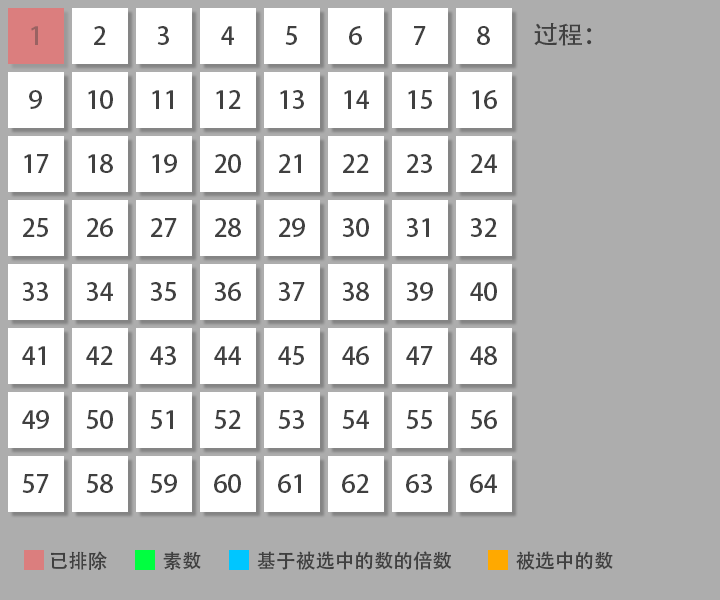,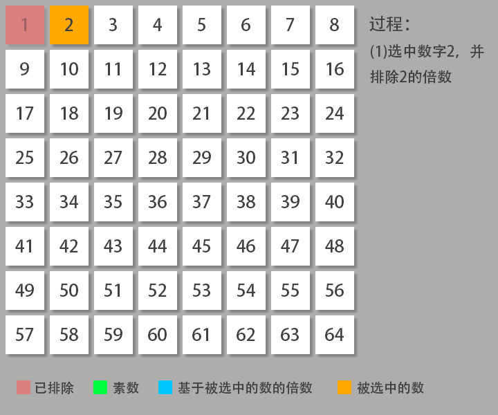,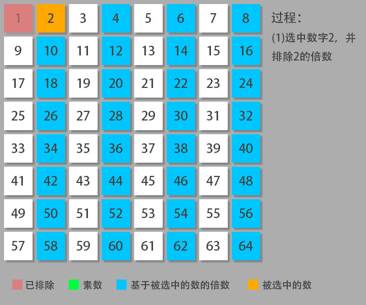,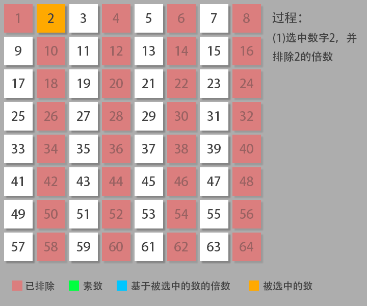,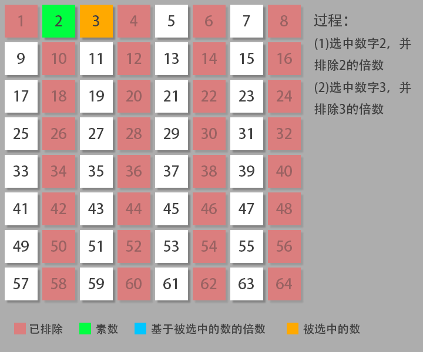,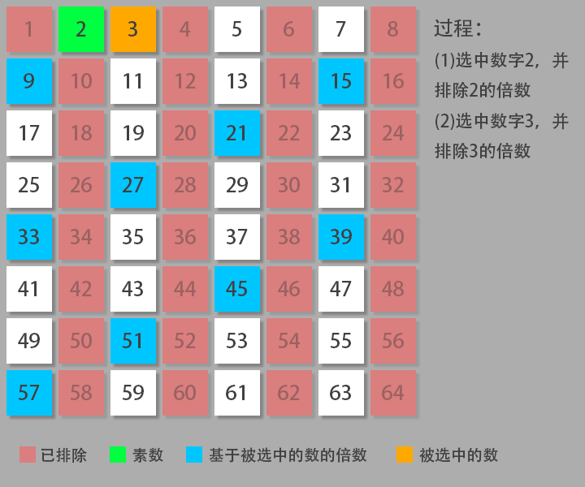,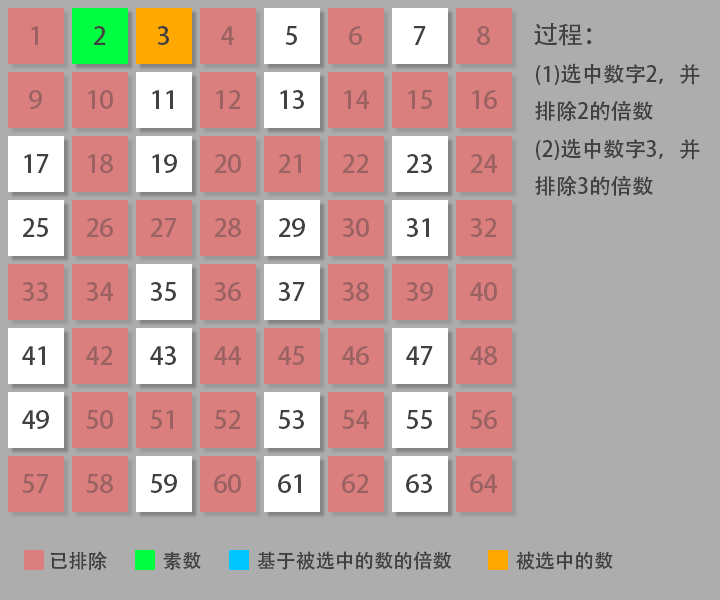,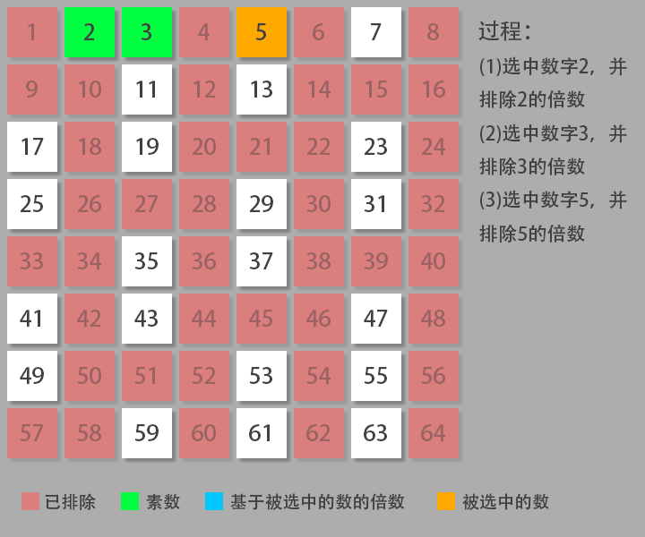,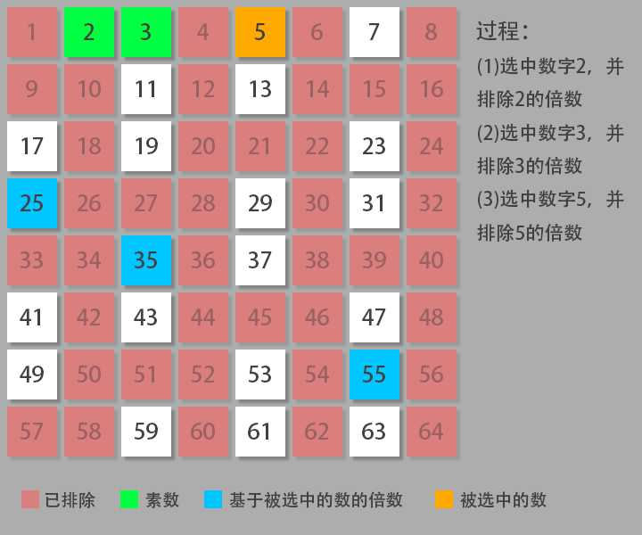,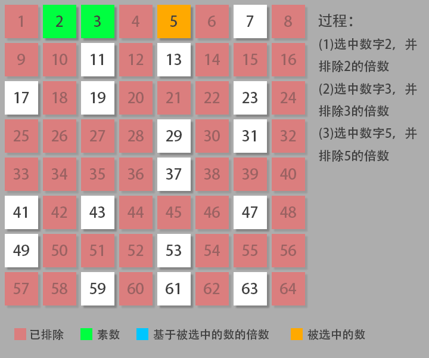,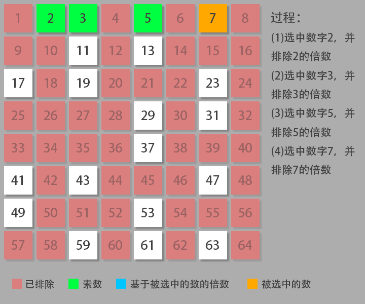,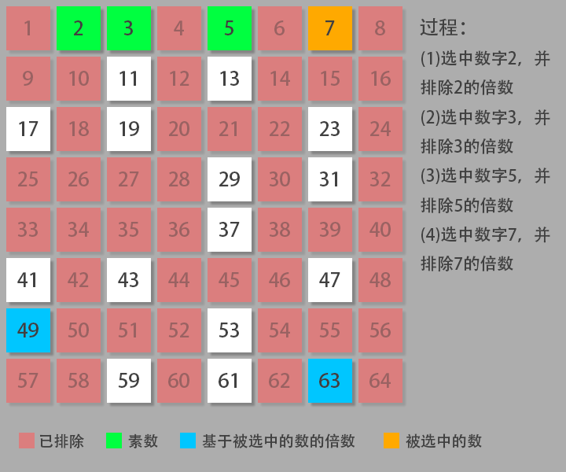,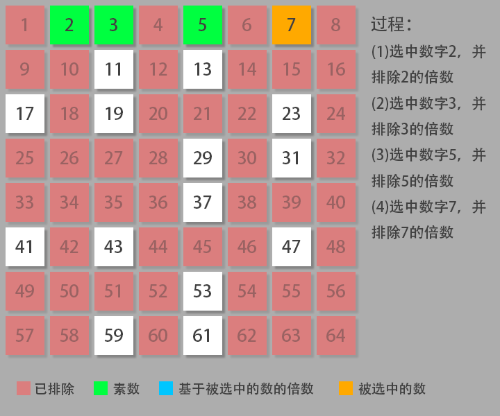,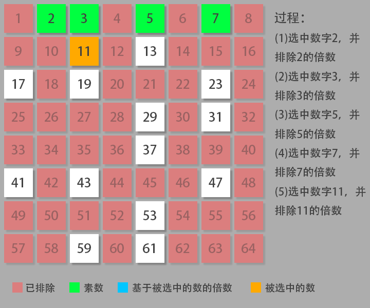,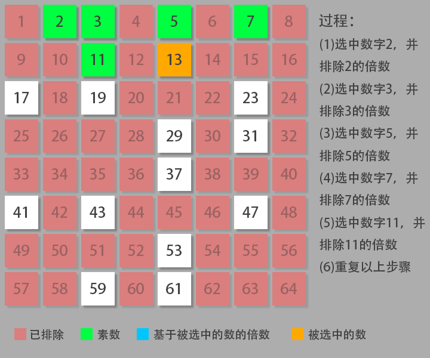,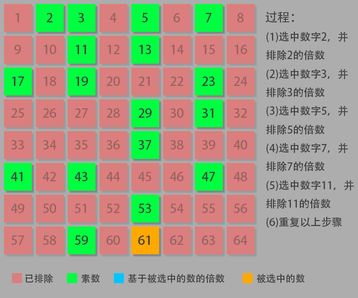,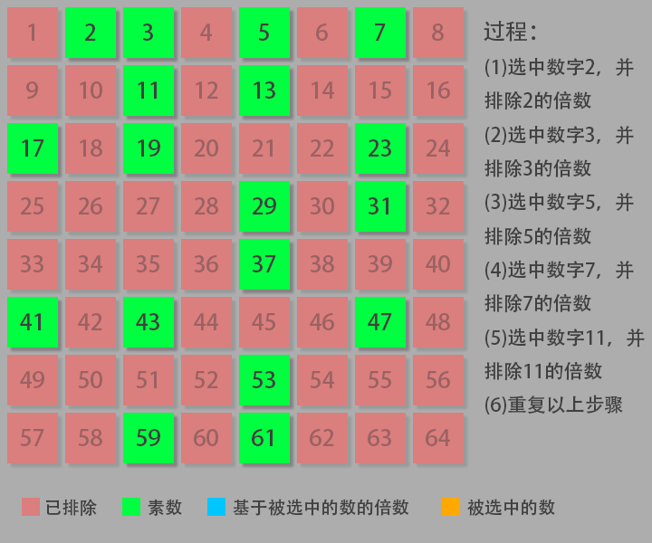>


（做图片的时候把质数弄成了素数……）


对此，我们可以声明一个长度为最大限制数的布尔数组。用布尔值来区别筛选出的数和质数。


运用厄拉多塞筛法得代码如下：


```Csharp []

public int CountPrimes(int n)

{

    int count = 0;

    bool[] signs = new bool[n];

    for (int i = 2; i < n; i++)

    {

        //因为在 C# 中，布尔类型的默认值为 假。所以在此处用了逻辑非（！）操作符。

        if (!signs[i])

        {

            count++;

            for (int j = i + i; j < n; j += i)

            {

                //排除不是质数的数

                signs[j] = true;

            }

        }

    }

    return count;

}

```

```C++ []

int countPrimes(int n) {

    int count = 0;

    //初始默认所有数为质数

    vector<bool> signs(n, true);

    for (int i = 2; i < n; i++) {

        if (signs[i]) {

            count++;

            for (int j = i + i; j < n; j += i) {

                //排除不是质数的数

                signs[j] = false;

            }

        }

    }

    return count;

}

```


**四、运用比特表（Bitmap）算法对筛法进行内存优化：**


上面运用厄拉多塞筛法求一定范围内的质数已经十分高效了。然而，我们使用布尔数组标记一个数是否为质数时，每个值都占用了一个字节（Byte）。但是，我们仅需要两个不同的值来表示是否为质数即可。即一个比特（bit）来表示即可（0、1）。如果这样的话，我们便最优可节省八分之七的空间（然而，还得结合代码和实际情况，并不是用了就一定有效果）。


- 关于比特表算法在此便简要概述以下（可略过）：


假如有从 1 至 8 总共八个数。现有一个字节大小的内存空间可供使用（仅供参考，不考虑实际用途及比特算法的最佳用处）。如何将每个数登记下来，并可以随时检查一个数是否存在呢？


如果用一个数组表示，即使不考虑数组的内存开销，哪怕用一个 byte 类型的变量记录每一数也将超出内存可使用范围。但是由于每个字节共有八个比特位，则可以用每个比特位来表示每个数字则恰好可以登记完所有的数字。


示例：


1. 登记数字 1 ：0 0 0 0 0 0 0 1

2. 登记数字 1、3：0 0 0 0 0 1 0 1

3. 登记数字 1、2、3、4、5 ：0 0 0 1 1 1 1 1


得代码如下：


```Csharp []

public int CountPrimes(int n) 

{

    int count = 0;

    //一个 int 变量占用 32 字节

    //在C#中，提供了点阵列（BitArray）数组，用这玩意可读性一定会好于我写的代码。

    int[] signs = new int[n / 32 + 1];

    for (int i = 2; i < n; i++)

    {

        //将元素和需确定得数字经行按位或运算，如果值改变，说明不存在该数字（未登记该数字），则其为质数。

        //(当某个数为 2 的 n 次方时（n为自然数），其 & (n - 1) 所得值将等价于取余运算所得值)

        //*如果 x = 2^n ，则 x & (n - 1) == x % n

        //下面判断可以写成

        //if ((signs[i / size] & (1 << (i % 32))) == 0)

        if ((signs[i / 32] & (1 << (i & 31))) == 0)

        {

            count++;

            for (int j = i + i; j < n; j += i)

            {

                //登记该数字

                signs[j / 32] |= 1 << (j & 31);

            }

        }

    }

    return count;

}

```

```C++ []

int countPrimes(int n) {

    int count = 0;

    //一个 int 变量不知道占多少字节（但请注意，这里采用了常量）

    const int size = sizeof(int) * 8;

    vector<int> signs(n / size + 1,0);

    for (int i = 2; i < n; i++){

        //将元素和需确定得数字经行按位或运算，如果值改变，说明不存在该数字（未登记该数字），则其为质数。

        //在C++中，其提供了 bitset 来操作位，在此便不做介绍了。如果用了，可读性肯定会更好。

        //(当某个数为 2 的 n 次方时（n为自然数），其 & (n - 1) 所得值将等价于取余运算所得值)

        //*如果 x = 2^n ，则 x & (n - 1) == x % n

        //下面判断可以写成

        //if ((signs[i / size] & (1 << (i % 32))) == 0)

        if ((signs[i / size] & (1 << (i & (size - 1)))) == 0){

            count++;

            for (int j = i + i; j < n; j += i){

                //登记该数字

            	signs[j / size] |= 1 << (j & (size - 1));

            }

        }

    }

    return count;

}

```


经测试，C# 内存优化效果较为明显，但 C++ 效果不大明显。但这种方法显然是为了特殊情况而准备（比如一亿个数）。不过也可能是我写的不好。仅作参考，如果有所错误恳请您斧正。


（其实有时候代码的可读性要胜于代码改动所带来的一点的性能上的提升。）


## 统计信息
| 通过次数 | 提交次数 | AC比率 |
| :------: | :------: | :------: |
|    176499    |    467952    |   37.7%   |

## 提交历史
| 提交时间 | 提交结果 | 执行时间 |  内存消耗  | 语言 |
| :------: | :------: | :------: | :--------: | :--------: |


## 相似题目
|                             题目                             | 难度 |
| :----------------------------------------------------------: | :---------: |
| [丑数](https://leetcode-cn.com/problems/ugly-number/) | 简单|
| [丑数 II](https://leetcode-cn.com/problems/ugly-number-ii/) | 中等|
| [完全平方数](https://leetcode-cn.com/problems/perfect-squares/) | 中等|
