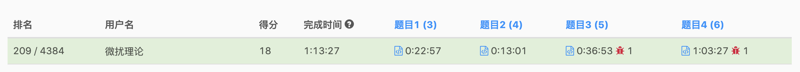

> 原文链接: https://leetcode-cn.com/problems/minimized-maximum-of-products-distributed-to-any-store


## 英文原文
<div><p>You are given an integer <code>n</code> indicating there are <code>n</code> specialty retail stores. There are <code>m</code> product types of varying amounts, which are given as a <strong>0-indexed</strong> integer array <code>quantities</code>, where <code>quantities[i]</code> represents the number of products of the <code>i<sup>th</sup></code> product type.</p>

<p>You need to distribute <strong>all products</strong> to the retail stores following these rules:</p>

<ul>
	<li>A store can only be given <strong>at most one product type</strong> but can be given <strong>any</strong> amount of it.</li>
	<li>After distribution, each store will have been given some number of products (possibly <code>0</code>). Let <code>x</code> represent the maximum number of products given to any store. You want <code>x</code> to be as small as possible, i.e., you want to <strong>minimize</strong> the <strong>maximum</strong> number of products that are given to any store.</li>
</ul>

<p>Return <em>the minimum possible</em> <code>x</code>.</p>

<p>&nbsp;</p>
<p><strong>Example 1:</strong></p>

<pre>
<strong>Input:</strong> n = 6, quantities = [11,6]
<strong>Output:</strong> 3
<strong>Explanation:</strong> One optimal way is:
- The 11 products of type 0 are distributed to the first four stores in these amounts: 2, 3, 3, 3
- The 6 products of type 1 are distributed to the other two stores in these amounts: 3, 3
The maximum number of products given to any store is max(2, 3, 3, 3, 3, 3) = 3.
</pre>

<p><strong>Example 2:</strong></p>

<pre>
<strong>Input:</strong> n = 7, quantities = [15,10,10]
<strong>Output:</strong> 5
<strong>Explanation:</strong> One optimal way is:
- The 15 products of type 0 are distributed to the first three stores in these amounts: 5, 5, 5
- The 10 products of type 1 are distributed to the next two stores in these amounts: 5, 5
- The 10 products of type 2 are distributed to the last two stores in these amounts: 5, 5
The maximum number of products given to any store is max(5, 5, 5, 5, 5, 5, 5) = 5.
</pre>

<p><strong>Example 3:</strong></p>

<pre>
<strong>Input:</strong> n = 1, quantities = [100000]
<strong>Output:</strong> 100000
<strong>Explanation:</strong> The only optimal way is:
- The 100000 products of type 0 are distributed to the only store.
The maximum number of products given to any store is max(100000) = 100000.
</pre>

<p>&nbsp;</p>
<p><strong>Constraints:</strong></p>

<ul>
	<li><code>m == quantities.length</code></li>
	<li><code>1 &lt;= m &lt;= n &lt;= 10<sup>5</sup></code></li>
	<li><code>1 &lt;= quantities[i] &lt;= 10<sup>5</sup></code></li>
</ul>
</div>

## 中文题目
<div><p>给你一个整数&nbsp;<code>n</code>&nbsp;，表示有&nbsp;<code>n</code>&nbsp;间零售商店。总共有&nbsp;<code>m</code>&nbsp;种产品，每种产品的数目用一个下标从 <strong>0</strong>&nbsp;开始的整数数组&nbsp;<code>quantities</code>&nbsp;表示，其中&nbsp;<code>quantities[i]</code>&nbsp;表示第&nbsp;<code>i</code>&nbsp;种商品的数目。</p>

<p>你需要将 <strong>所有商品</strong>&nbsp;分配到零售商店，并遵守这些规则：</p>

<ul>
	<li>一间商店 <strong>至多</strong>&nbsp;只能有 <strong>一种商品</strong> ，但一间商店拥有的商品数目可以为&nbsp;<strong>任意</strong>&nbsp;件。</li>
	<li>分配后，每间商店都会被分配一定数目的商品（可能为 <code>0</code>&nbsp;件）。用&nbsp;<code>x</code>&nbsp;表示所有商店中分配商品数目的最大值，你希望 <code>x</code>&nbsp;越小越好。也就是说，你想 <strong>最小化</strong>&nbsp;分配给任意商店商品数目的 <strong>最大值</strong>&nbsp;。</li>
</ul>

<p>请你返回最小的可能的&nbsp;<code>x</code>&nbsp;。</p>

<p>&nbsp;</p>

<p><strong>示例 1：</strong></p>

<pre>
<b>输入：</b>n = 6, quantities = [11,6]
<b>输出：</b>3
<strong>解释： </strong>一种最优方案为：
- 11 件种类为 0 的商品被分配到前 4 间商店，分配数目分别为：2，3，3，3 。
- 6 件种类为 1 的商品被分配到另外 2 间商店，分配数目分别为：3，3 。
分配给所有商店的最大商品数目为 max(2, 3, 3, 3, 3, 3) = 3 。
</pre>

<p><strong>示例 2：</strong></p>

<pre>
<b>输入：</b>n = 7, quantities = [15,10,10]
<b>输出：</b>5
<b>解释：</b>一种最优方案为：
- 15 件种类为 0 的商品被分配到前 3 间商店，分配数目为：5，5，5 。
- 10 件种类为 1 的商品被分配到接下来 2 间商店，数目为：5，5 。
- 10 件种类为 2 的商品被分配到最后 2 间商店，数目为：5，5 。
分配给所有商店的最大商品数目为 max(5, 5, 5, 5, 5, 5, 5) = 5 。
</pre>

<p><strong>示例 3：</strong></p>

<pre>
<b>输入：</b>n = 1, quantities = [100000]
<b>输出：</b>100000
<b>解释：</b>唯一一种最优方案为：
- 所有 100000 件商品 0 都分配到唯一的商店中。
分配给所有商店的最大商品数目为 max(100000) = 100000 。
</pre>

<p>&nbsp;</p>

<p><strong>提示：</strong></p>

<ul>
	<li><code>m == quantities.length</code></li>
	<li><code>1 &lt;= m &lt;= n &lt;= 10<sup>5</sup></code></li>
	<li><code>1 &lt;= quantities[i] &lt;= 10<sup>5</sup></code></li>
</ul>
</div>

## 通过代码
<RecoDemo>
</RecoDemo>


## 高赞题解
### 解题思路


今天立冬，北京初雪，微扰酱也拿到了AK。

这是一类常见的二分搜索的类型题，「微扰酱」称之为假设检验型二分搜索。
如果一个目标是x能满足某种条件，x+1一定能满足某种条件；且检验条件的复杂度不高。 我们就可以考虑二分搜索的这种方式。

在这道题中，check的过程就是采用贪心法，假设x可以满足条件，每个店都分配最大的商品（假设值），这样分配的店数一定是最少的。
由于同一个店只能持有一种商品，所以某个商品需要的店数一定为 `商品总数 除以 最大分配数` 向上取整。
我们基于贪心的策略，去看分配的店数量是否满足条件即可；然后在进一步缩小搜索空间，直到找到最小的最大值。

### 代码

```cpp
class Solution {
public:
    bool check(vector<int>& q, int n, long long x) {
        int nn = 0;
        for (auto cnt: q) {
            nn += cnt / x;
            if (cnt % x != 0) nn++;
        }
        if (nn > n) return false;
        return true;
    }
    
    int minimizedMaximum(int n, vector<int>& quantities) {
        long long sum = 0;
        for (auto q: quantities) {
            sum += q;
        }
        long long l = 0;
        long long r = sum;
        
        while(l < r) {
            long long mid = (l + r)  / 2;
            if (mid == 0) return 1;
            if (check(quantities, n, mid)) {
                r = mid;
            } else {
                l = mid + 1;
            }
        }
        
        return l;
    }
};
```

### 关于我
大家好，我是微扰酱。现在是五道口【悖论13】剧本杀的股东之一，点评搜索即可，欢迎大家来探店。
微扰酱18年毕业于上海交通大学，是一个在阿里、字节、腾讯都工作过的工程师，有丰富的面试经验。从 2021.4 开始在emqx从事存储研发，希望在今年多多输出。

最后，如果对你有帮助，**可以点个赞支持一下我哦** 也欢迎在leetcode上[关注我](https://leetcode-cn.com/u/wfnuser/)。

欢迎留言预定配图！ 今天是**言叶之庭**，每一帧都是明信片～


## 统计信息
| 通过次数 | 提交次数 | AC比率 |
| :------: | :------: | :------: |
|    3149    |    7636    |   41.2%   |

## 提交历史
| 提交时间 | 提交结果 | 执行时间 |  内存消耗  | 语言 |
| :------: | :------: | :------: | :--------: | :--------: |
