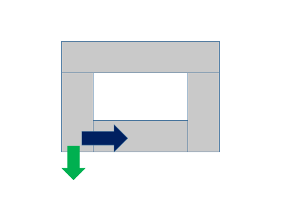

> 原文链接: https://leetcode-cn.com/problems/walking-robot-simulation-ii


## 英文原文
<div><p>A <code>width x height</code> grid is on an XY-plane with the <strong>bottom-left</strong> cell at <code>(0, 0)</code> and the <strong>top-right</strong> cell at <code>(width - 1, height - 1)</code>. The grid is aligned with the four cardinal directions (<code>&quot;North&quot;</code>, <code>&quot;East&quot;</code>, <code>&quot;South&quot;</code>, and <code>&quot;West&quot;</code>). A robot is <strong>initially</strong> at cell <code>(0, 0)</code> facing direction <code>&quot;East&quot;</code>.</p>

<p>The robot can be instructed to move for a specific number of <strong>steps</strong>. For each step, it does the following.</p>

<ol>
	<li>Attempts to move <strong>forward one</strong> cell in the direction it is facing.</li>
	<li>If the cell the robot is <strong>moving to</strong> is <strong>out of bounds</strong>, the robot instead <strong>turns</strong> 90 degrees <strong>counterclockwise</strong> and retries the step.</li>
</ol>

<p>After the robot finishes moving the number of steps required, it stops and awaits the next instruction.</p>

<p>Implement the <code>Robot</code> class:</p>

<ul>
	<li><code>Robot(int width, int height)</code> Initializes the <code>width x height</code> grid with the robot at <code>(0, 0)</code> facing <code>&quot;East&quot;</code>.</li>
	<li><code>void step(int num)</code> Instructs the robot to move forward <code>num</code> steps.</li>
	<li><code>int[] getPos()</code> Returns the current cell the robot is at, as an array of length 2, <code>[x, y]</code>.</li>
	<li><code>String getDir()</code> Returns the current direction of the robot, <code>&quot;North&quot;</code>, <code>&quot;East&quot;</code>, <code>&quot;South&quot;</code>, or <code>&quot;West&quot;</code>.</li>
</ul>

<p>&nbsp;</p>
<p><strong>Example 1:</strong></p>

<pre>
<strong>Input</strong>
[&quot;Robot&quot;, &quot;move&quot;, &quot;move&quot;, &quot;getPos&quot;, &quot;getDir&quot;, &quot;move&quot;, &quot;move&quot;, &quot;move&quot;, &quot;getPos&quot;, &quot;getDir&quot;]
[[6, 3], [2], [2], [], [], [2], [1], [4], [], []]
<strong>Output</strong>
[null, null, null, [4, 0], &quot;East&quot;, null, null, null, [1, 2], &quot;West&quot;]

<strong>Explanation</strong>
Robot robot = new Robot(6, 3); // Initialize the grid and the robot at (0, 0) facing East.
robot.move(2);  // It moves two steps East to (2, 0), and faces East.
robot.move(2);  // It moves two steps East to (4, 0), and faces East.
robot.getPos(); // return [4, 0]
robot.getDir(); // return &quot;East&quot;
robot.move(2);  // It moves one step East to (5, 0), and faces East.
                // Moving the next step East would be out of bounds, so it turns and faces North.
                // Then, it moves one step North to (5, 1), and faces North.
robot.move(1);  // It moves one step North to (5, 2), and faces <strong>North</strong> (not West).
robot.move(4);  // Moving the next step North would be out of bounds, so it turns and faces West.
                // Then, it moves four steps West to (1, 2), and faces West.
robot.getPos(); // return [1, 2]
robot.getDir(); // return &quot;West&quot;

</pre>

<p>&nbsp;</p>
<p><strong>Constraints:</strong></p>

<ul>
	<li><code>2 &lt;= width, height &lt;= 100</code></li>
	<li><code>1 &lt;= num &lt;= 10<sup>5</sup></code></li>
	<li>At most <code>10<sup>4</sup></code> calls <strong>in total</strong> will be made to <code>step</code>, <code>getPos</code>, and <code>getDir</code>.</li>
</ul>
</div>

## 中文题目
<div><p>给你一个在 XY 平面上的&nbsp;<code>width x height</code>&nbsp;的网格图，<strong>左下角</strong>&nbsp;的格子为&nbsp;<code>(0, 0)</code>&nbsp;，<strong>右上角</strong>&nbsp;的格子为&nbsp;<code>(width - 1, height - 1)</code>&nbsp;。网格图中相邻格子为四个基本方向之一（<code>"North"</code>，<code>"East"</code>，<code>"South"</code>&nbsp;和&nbsp;<code>"West"</code>）。一个机器人 <strong>初始</strong>&nbsp;在格子&nbsp;<code>(0, 0)</code>&nbsp;，方向为&nbsp;<code>"East"</code>&nbsp;。</p>

<p>机器人可以根据指令移动指定的 <strong>步数</strong>&nbsp;。每一步，它可以执行以下操作。</p>

<ol>
	<li>沿着当前方向尝试 <strong>往前一步</strong>&nbsp;。</li>
	<li>如果机器人下一步将到达的格子 <strong>超出了边界</strong>&nbsp;，机器人会 <strong>逆时针</strong>&nbsp;转 90 度，然后再尝试往前一步。</li>
</ol>

<p>如果机器人完成了指令要求的移动步数，它将停止移动并等待下一个指令。</p>

<p>请你实现&nbsp;<code>Robot</code>&nbsp;类：</p>

<ul>
	<li><code>Robot(int width, int height)</code>&nbsp;初始化一个&nbsp;<code>width x height</code>&nbsp;的网格图，机器人初始在&nbsp;<code>(0, 0)</code>&nbsp;，方向朝&nbsp;<code>"East"</code>&nbsp;。</li>
	<li><code>void move(int num)</code>&nbsp;给机器人下达前进&nbsp;<code>num</code>&nbsp;步的指令。</li>
	<li><code>int[] getPos()</code>&nbsp;返回机器人当前所处的格子位置，用一个长度为 2 的数组&nbsp;<code>[x, y]</code>&nbsp;表示。</li>
	<li><code>String getDir()</code>&nbsp;返回当前机器人的朝向，为&nbsp;<code>"North"</code>&nbsp;，<code>"East"</code>&nbsp;，<code>"South"</code>&nbsp;或者&nbsp;<code>"West"</code>&nbsp;。</li>
</ul>

<p>&nbsp;</p>

<p><strong>示例 1：</strong></p>

<p></p>

<pre><strong>输入：</strong>
["Robot", "move", "move", "getPos", "getDir", "move", "move", "move", "getPos", "getDir"]
[[6, 3], [2], [2], [], [], [2], [1], [4], [], []]
<strong>输出：</strong>
[null, null, null, [4, 0], "East", null, null, null, [1, 2], "West"]

<strong>解释：</strong>
Robot robot = new Robot(6, 3); // 初始化网格图，机器人在 (0, 0) ，朝东。
robot.move(2);  // 机器人朝东移动 2 步，到达 (2, 0) ，并朝东。
robot.move(2);  // 机器人朝东移动 2 步，到达 (4, 0) ，并朝东。
robot.getPos(); // 返回 [4, 0]
robot.getDir(); // 返回 "East"
robot.move(2);  // 朝东移动 1 步到达 (5, 0) ，并朝东。
                // 下一步继续往东移动将出界，所以逆时针转变方向朝北。
                // 然后，往北移动 1 步到达 (5, 1) ，并朝北。
robot.move(1);  // 朝北移动 1 步到达 (5, 2) ，并朝 <strong>北</strong> （不是朝西）。
robot.move(4);  // 下一步继续往北移动将出界，所以逆时针转变方向朝西。
                // 然后，移动 4 步到 (1, 2) ，并朝西。
robot.getPos(); // 返回 [1, 2]
robot.getDir(); // 返回 "West"

</pre>

<p>&nbsp;</p>

<p><strong>提示：</strong></p>

<ul>
	<li><code>2 &lt;= width, height &lt;= 100</code></li>
	<li><code>1 &lt;= num &lt;= 10<sup>5</sup></code></li>
	<li><code>move</code>&nbsp;，<code>getPos</code>&nbsp;和&nbsp;<code>getDir</code>&nbsp;<strong>总共&nbsp;</strong>调用次数不超过&nbsp;<code>10<sup>4</sup></code>&nbsp;次。</li>
</ul>
</div>

## 通过代码
<RecoDemo>
</RecoDemo>


## 高赞题解
## 分析
- **题目：**
    - [5911. 模拟行走机器人 II](https://leetcode-cn.com/problems/walking-robot-simulation-ii/)
- **思路：**
    - 直接按照题意模拟一遍。
    - 我们发现机器人只会绕着网格图的外圈走，因此可以先将多余的圈数去掉，直接取余。
    - 140/142测试点过不去，**有两类错误**：
        - 第一种，没有考虑到余数为0的时候，方向可能没有转过来，还是之前的方向。比如饶了一圈回到(0,0)，最开始是向右，但是此时正确答案应该向下。
        - 第二种，考虑了余数为0，但是直接对方向回退。在有的数据上，并不能直接回退方向，这个方向是固定的，可以写死。
        

## 代码

```
class Robot {
public:
    int w, h;
    int x, y, d;
    string dir[4] = {"East", "North", "West", "South"};
    int dx[4]={1, 0, -1, 0};
    int dy[4]={0, 1, 0, -1};
    Robot(int width, int height) {
        w = width;
        h = height;
        x = 0, y = 0, d = 0;
    }
    
    void move(int num) {
        // 外一圈的步数，这里不等于周长，而是长宽减一后的周长，最好手动模拟走一下。
        // 也可以这样写 int cc = 2*(w-1 + h-1);
        int cc = 2*w + 2*h - 4;
        num %= cc;
        // 140/142没考虑到的测试点 num == 0
        if(!num && !x && !y) d = 3;
        while(num--) {
            int nx = dx[d] + x, ny = dy[d] + y;
            if(nx < 0 || nx >= w || ny < 0 || ny >= h) {
                // 如果越界了，就逆时针转90度，换到下一个方向继续走
                d++, d %= 4;
                nx = dx[d] + x, ny = dy[d] + y;
            }
            x = nx, y = ny;
        }
    }
    
    vector<int> getPos() {
        return  {x, y};
    }
    
    string getDir() {
        return dir[d];
    }
};

/**
 * Your Robot object will be instantiated and called as such:
 * Robot* obj = new Robot(width, height);
 * obj->move(num);
 * vector<int> param_2 = obj->getPos();
 * string param_3 = obj->getDir();
 */
```


## 统计信息
| 通过次数 | 提交次数 | AC比率 |
| :------: | :------: | :------: |
|    2213    |    11908    |   18.6%   |

## 提交历史
| 提交时间 | 提交结果 | 执行时间 |  内存消耗  | 语言 |
| :------: | :------: | :------: | :--------: | :--------: |
