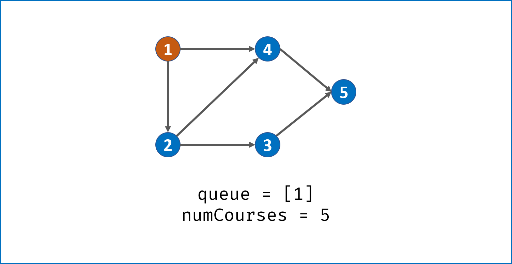
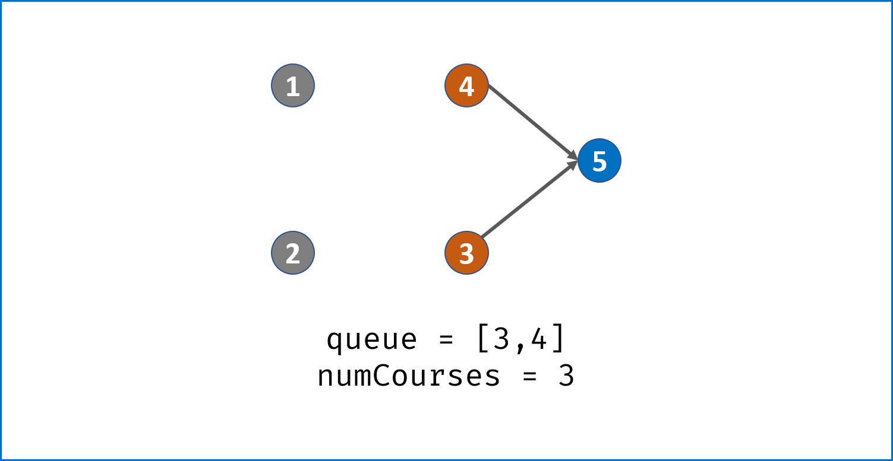
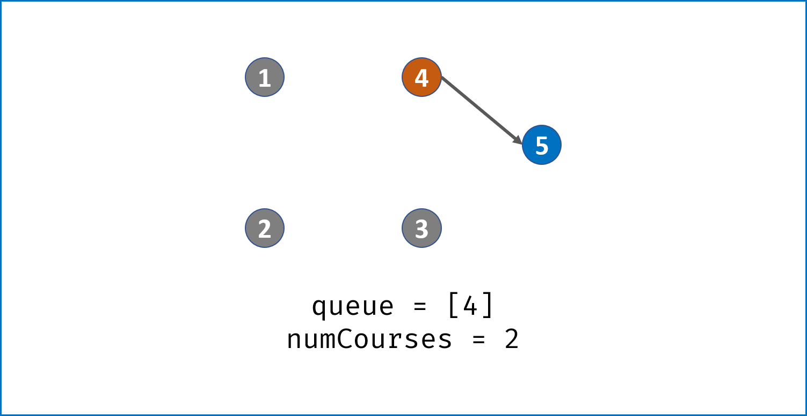
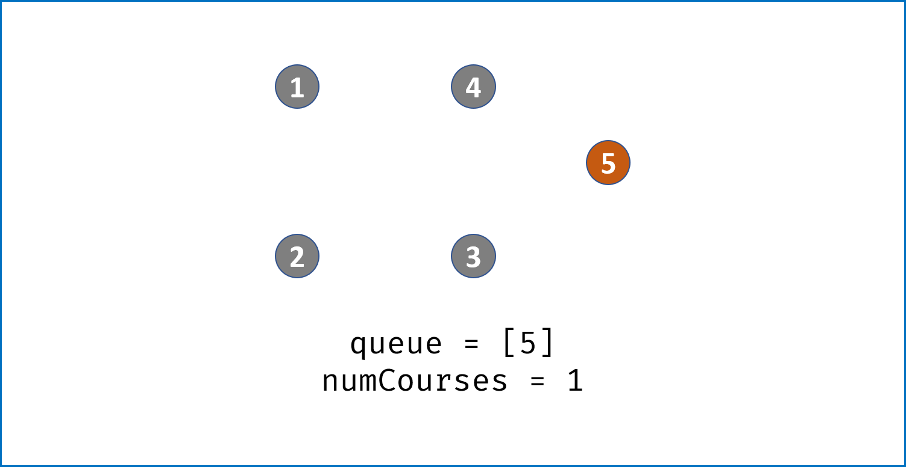
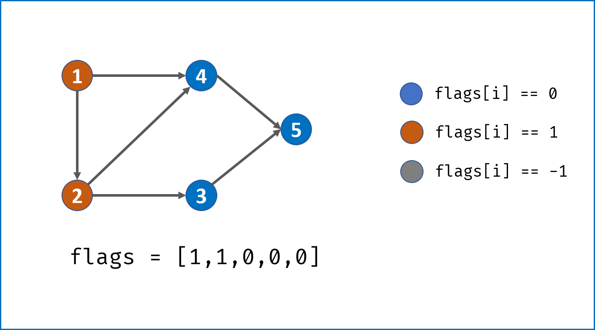
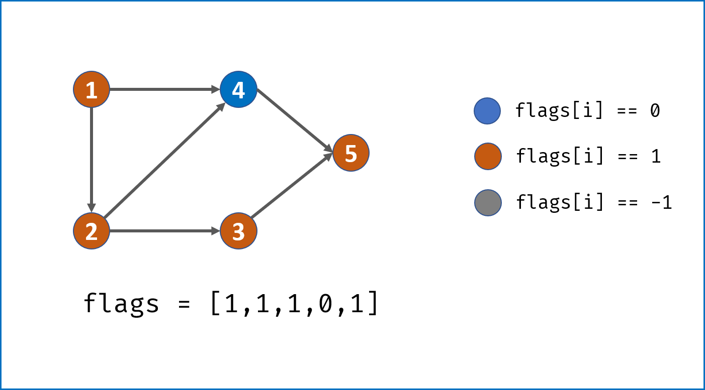
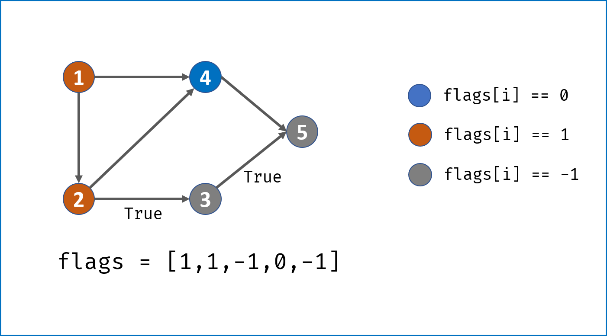
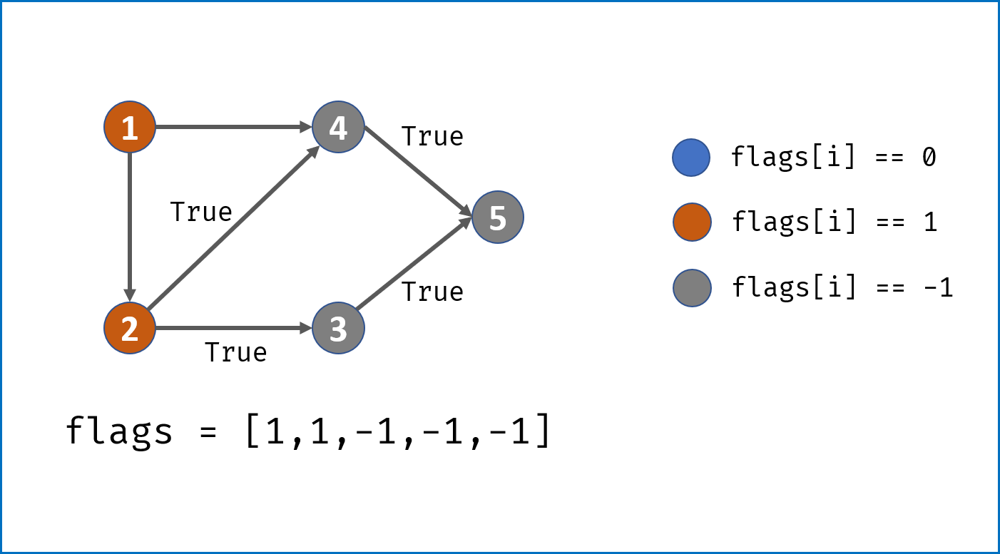

> 原文链接: https://leetcode-cn.com/problems/course-schedule


## 英文原文
<div><p>There are a total of <code>numCourses</code> courses you have to take, labeled from <code>0</code> to <code>numCourses - 1</code>. You are given an array <code>prerequisites</code> where <code>prerequisites[i] = [a<sub>i</sub>, b<sub>i</sub>]</code> indicates that you <strong>must</strong> take course <code>b<sub>i</sub></code> first if you want to take course <code>a<sub>i</sub></code>.</p>

<ul>
	<li>For example, the pair <code>[0, 1]</code>, indicates that to take course <code>0</code> you have to first take course <code>1</code>.</li>
</ul>

<p>Return <code>true</code> if you can finish all courses. Otherwise, return <code>false</code>.</p>

<p>&nbsp;</p>
<p><strong>Example 1:</strong></p>

<pre>
<strong>Input:</strong> numCourses = 2, prerequisites = [[1,0]]
<strong>Output:</strong> true
<strong>Explanation:</strong> There are a total of 2 courses to take. 
To take course 1 you should have finished course 0. So it is possible.
</pre>

<p><strong>Example 2:</strong></p>

<pre>
<strong>Input:</strong> numCourses = 2, prerequisites = [[1,0],[0,1]]
<strong>Output:</strong> false
<strong>Explanation:</strong> There are a total of 2 courses to take. 
To take course 1 you should have finished course 0, and to take course 0 you should also have finished course 1. So it is impossible.
</pre>

<p>&nbsp;</p>
<p><strong>Constraints:</strong></p>

<ul>
	<li><code>1 &lt;= numCourses &lt;= 10<sup>5</sup></code></li>
	<li><code>0 &lt;= prerequisites.length &lt;= 5000</code></li>
	<li><code>prerequisites[i].length == 2</code></li>
	<li><code>0 &lt;= a<sub>i</sub>, b<sub>i</sub> &lt; numCourses</code></li>
	<li>All the pairs prerequisites[i] are <strong>unique</strong>.</li>
</ul>
</div>

## 中文题目
<div><p>你这个学期必须选修 <code>numCourses</code> 门课程，记为 <code>0</code> 到 <code>numCourses - 1</code> 。</p>

<p>在选修某些课程之前需要一些先修课程。 先修课程按数组 <code>prerequisites</code> 给出，其中 <code>prerequisites[i] = [a<sub>i</sub>, b<sub>i</sub>]</code> ，表示如果要学习课程 <code>a<sub>i</sub></code> 则 <strong>必须</strong> 先学习课程  <code>b<sub>i</sub></code><sub> </sub>。</p>

<ul>
	<li>例如，先修课程对 <code>[0, 1]</code> 表示：想要学习课程 <code>0</code> ，你需要先完成课程 <code>1</code> 。</li>
</ul>

<p>请你判断是否可能完成所有课程的学习？如果可以，返回 <code>true</code> ；否则，返回 <code>false</code> 。</p>

<p> </p>

<p><strong>示例 1：</strong></p>

<pre>
<strong>输入：</strong>numCourses = 2, prerequisites = [[1,0]]
<strong>输出：</strong>true
<strong>解释：</strong>总共有 2 门课程。学习课程 1 之前，你需要完成课程 0 。这是可能的。</pre>

<p><strong>示例 2：</strong></p>

<pre>
<strong>输入：</strong>numCourses = 2, prerequisites = [[1,0],[0,1]]
<strong>输出：</strong>false
<strong>解释：</strong>总共有 2 门课程。学习课程 1 之前，你需要先完成​课程 0 ；并且学习课程 0 之前，你还应先完成课程 1 。这是不可能的。</pre>

<p> </p>

<p><strong>提示：</strong></p>

<ul>
	<li><code>1 <= numCourses <= 10<sup>5</sup></code></li>
	<li><code>0 <= prerequisites.length <= 5000</code></li>
	<li><code>prerequisites[i].length == 2</code></li>
	<li><code>0 <= a<sub>i</sub>, b<sub>i</sub> < numCourses</code></li>
	<li><code>prerequisites[i]</code> 中的所有课程对 <strong>互不相同</strong></li>
</ul>
</div>

## 通过代码
<RecoDemo>
</RecoDemo>


## 高赞题解
#### 解题思路：


- **本题可约化为：** 课程安排图是否是 **有向无环图(DAG)**。即课程间规定了前置条件，但不能构成任何环路，否则课程前置条件将不成立。

- 思路是通过 **拓扑排序** 判断此课程安排图是否是 **有向无环图(DAG)** 。 **拓扑排序原理：** 对 DAG 的顶点进行排序，使得对每一条有向边 $(u, v)$，均有 $u$（在排序记录中）比 $v$ 先出现。亦可理解为对某点 $v$ 而言，只有当 $v$ 的所有源点均出现了，$v$ 才能出现。

- 通过课程前置条件列表 `prerequisites` 可以得到课程安排图的 **邻接表** `adjacency`，以降低算法时间复杂度，以下两种方法都会用到邻接表。


#### 方法一：入度表（广度优先遍历）


##### 算法流程：


1. 统计课程安排图中每个节点的入度，生成 **入度表** `indegrees`。

2. 借助一个队列 `queue`，将所有入度为 $0$ 的节点入队。

3. 当 `queue` 非空时，依次将队首节点出队，在课程安排图中删除此节点 `pre`：

   - 并不是真正从邻接表中删除此节点 `pre`，而是将此节点对应所有邻接节点 `cur` 的入度 $-1$，即 `indegrees[cur] -= 1`。

   - 当入度 $-1$后邻接节点 `cur` 的入度为 $0$，说明 `cur` 所有的前驱节点已经被 “删除”，此时将 `cur` 入队。

4. 在每次 `pre` 出队时，执行 `numCourses--`；

   - 若整个课程安排图是有向无环图（即可以安排），则所有节点一定都入队并出队过，即完成拓扑排序。换个角度说，若课程安排图中存在环，一定有节点的入度始终不为 $0$。

   - 因此，拓扑排序出队次数等于课程个数，返回 `numCourses == 0` 判断课程是否可以成功安排。


##### 复杂度分析：


- **时间复杂度 $O(N + M)$：** 遍历一个图需要访问所有节点和所有临边，$N$ 和 $M$ 分别为节点数量和临边数量；

- **空间复杂度 $O(N + M)$：** 为建立邻接表所需额外空间，`adjacency` 长度为 $N$ ，并存储 $M$ 条临边的数据。


<,,,,,>


#### 代码：


```python []

from collections import deque


class Solution:

    def canFinish(self, numCourses: int, prerequisites: List[List[int]]) -> bool:

        indegrees = [0 for _ in range(numCourses)]

        adjacency = [[] for _ in range(numCourses)]

        queue = deque()

        # Get the indegree and adjacency of every course.

        for cur, pre in prerequisites:

            indegrees[cur] += 1

            adjacency[pre].append(cur)

        # Get all the courses with the indegree of 0.

        for i in range(len(indegrees)):

            if not indegrees[i]: queue.append(i)

        # BFS TopSort.

        while queue:

            pre = queue.popleft()

            numCourses -= 1

            for cur in adjacency[pre]:

                indegrees[cur] -= 1

                if not indegrees[cur]: queue.append(cur)

        return not numCourses

```


```java []

class Solution {

    public boolean canFinish(int numCourses, int[][] prerequisites) {

        int[] indegrees = new int[numCourses];

        List<List<Integer>> adjacency = new ArrayList<>();

        Queue<Integer> queue = new LinkedList<>();

        for(int i = 0; i < numCourses; i++)

            adjacency.add(new ArrayList<>());

        // Get the indegree and adjacency of every course.

        for(int[] cp : prerequisites) {

            indegrees[cp[0]]++;

            adjacency.get(cp[1]).add(cp[0]);

        }

        // Get all the courses with the indegree of 0.

        for(int i = 0; i < numCourses; i++)

            if(indegrees[i] == 0) queue.add(i);

        // BFS TopSort.

        while(!queue.isEmpty()) {

            int pre = queue.poll();

            numCourses--;

            for(int cur : adjacency.get(pre))

                if(--indegrees[cur] == 0) queue.add(cur);

        }

        return numCourses == 0;

    }

}

```


---


#### 方法二：深度优先遍历


原理是通过 DFS 判断图中是否有环。


##### 算法流程：


1. 借助一个标志列表 `flags`，用于判断每个节点 `i` （课程）的状态：

   1. 未被 DFS 访问：`i == 0`；

   2. 已被**其他节点启动**的 DFS 访问：`i == -1`；

   3. 已被**当前节点启动**的 DFS 访问：`i == 1`。

2. 对 `numCourses` 个节点依次执行 DFS，判断每个节点起步 DFS 是否存在环，若存在环直接返回 $False$。DFS 流程；

   1. 终止条件：

      - 当 `flag[i] == -1`，说明当前访问节点已被其他节点启动的 DFS 访问，无需再重复搜索，直接返回 $True$。

      - 当 `flag[i] == 1`，说明在本轮 DFS 搜索中节点 `i` 被第 $2$ 次访问，即 **课程安排图有环** ，直接返回 $False$。

   2. 将当前访问节点 `i` 对应 `flag[i]` 置 $1$，即标记其被本轮 DFS 访问过；

   3. 递归访问当前节点 `i` 的所有邻接节点 `j`，当发现环直接返回 $False$；

   4. 当前节点所有邻接节点已被遍历，并没有发现环，则将当前节点 `flag` 置为 $-1$ 并返回 $True$。

3. 若整个图 DFS 结束并未发现环，返回 $True$。


##### 复杂度分析：


- **时间复杂度 $O(N + M)$：** 遍历一个图需要访问所有节点和所有临边，$N$ 和 $M$ 分别为节点数量和临边数量；

- **空间复杂度 $O(N + M)$：** 为建立邻接表所需额外空间，`adjacency` 长度为 $N$ ，并存储 $M$ 条临边的数据。


<,,,,,,,,,>


#### 代码：


```python []

class Solution:

    def canFinish(self, numCourses: int, prerequisites: List[List[int]]) -> bool:

        def dfs(i, adjacency, flags):

            if flags[i] == -1: return True

            if flags[i] == 1: return False

            flags[i] = 1

            for j in adjacency[i]:

                if not dfs(j, adjacency, flags): return False

            flags[i] = -1

            return True


        adjacency = [[] for _ in range(numCourses)]

        flags = [0 for _ in range(numCourses)]

        for cur, pre in prerequisites:

            adjacency[pre].append(cur)

        for i in range(numCourses):

            if not dfs(i, adjacency, flags): return False

        return True

```


```java []

class Solution {

    public boolean canFinish(int numCourses, int[][] prerequisites) {

        List<List<Integer>> adjacency = new ArrayList<>();

        for(int i = 0; i < numCourses; i++)

            adjacency.add(new ArrayList<>());

        int[] flags = new int[numCourses];

        for(int[] cp : prerequisites)

            adjacency.get(cp[1]).add(cp[0]);

        for(int i = 0; i < numCourses; i++)

            if(!dfs(adjacency, flags, i)) return false;

        return true;

    }

    private boolean dfs(List<List<Integer>> adjacency, int[] flags, int i) {

        if(flags[i] == 1) return false;

        if(flags[i] == -1) return true;

        flags[i] = 1;

        for(Integer j : adjacency.get(i))

            if(!dfs(adjacency, flags, j)) return false;

        flags[i] = -1;

        return true;

    }

}

```


> 感谢评论区各位大佬 @马嘉利  @GSbeegnnord  @mountaincode @kin @131xxxx8381 @dddong @chuwenli @JiangJian @番茄大大 @zjma 勘误。

> 本篇初稿错误频出，实属汗颜 Orz ，现已一一修正。再次感谢！

## 统计信息
| 通过次数 | 提交次数 | AC比率 |
| :------: | :------: | :------: |
|    154052    |    284716    |   54.1%   |

## 提交历史
| 提交时间 | 提交结果 | 执行时间 |  内存消耗  | 语言 |
| :------: | :------: | :------: | :--------: | :--------: |


## 相似题目
|                             题目                             | 难度 |
| :----------------------------------------------------------: | :---------: |
| [课程表 II](https://leetcode-cn.com/problems/course-schedule-ii/) | 中等|
| [以图判树](https://leetcode-cn.com/problems/graph-valid-tree/) | 中等|
| [最小高度树](https://leetcode-cn.com/problems/minimum-height-trees/) | 中等|
| [课程表 III](https://leetcode-cn.com/problems/course-schedule-iii/) | 困难|
