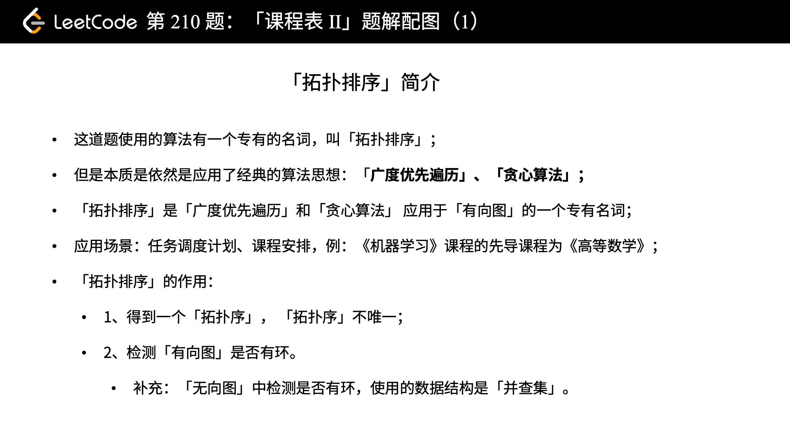
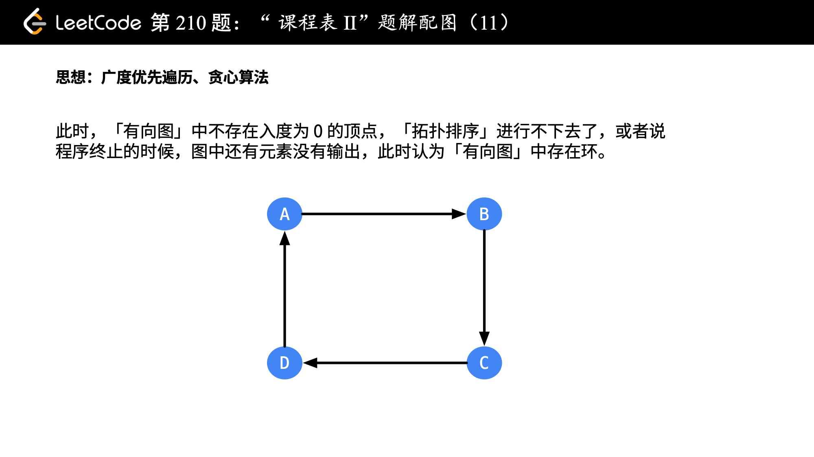

> 原文链接: https://leetcode-cn.com/problems/course-schedule-ii


## 英文原文
<div><p>There are a total of <code>numCourses</code> courses you have to take, labeled from <code>0</code> to <code>numCourses - 1</code>. You are given an array <code>prerequisites</code> where <code>prerequisites[i] = [a<sub>i</sub>, b<sub>i</sub>]</code> indicates that you <strong>must</strong> take course <code>b<sub>i</sub></code> first if you want to take course <code>a<sub>i</sub></code>.</p>

<ul>
	<li>For example, the pair <code>[0, 1]</code>, indicates that to take course <code>0</code> you have to first take course <code>1</code>.</li>
</ul>

<p>Return <em>the ordering of courses you should take to finish all courses</em>. If there are many valid answers, return <strong>any</strong> of them. If it is impossible to finish all courses, return <strong>an empty array</strong>.</p>

<p>&nbsp;</p>
<p><strong>Example 1:</strong></p>

<pre>
<strong>Input:</strong> numCourses = 2, prerequisites = [[1,0]]
<strong>Output:</strong> [0,1]
<strong>Explanation:</strong> There are a total of 2 courses to take. To take course 1 you should have finished course 0. So the correct course order is [0,1].
</pre>

<p><strong>Example 2:</strong></p>

<pre>
<strong>Input:</strong> numCourses = 4, prerequisites = [[1,0],[2,0],[3,1],[3,2]]
<strong>Output:</strong> [0,2,1,3]
<strong>Explanation:</strong> There are a total of 4 courses to take. To take course 3 you should have finished both courses 1 and 2. Both courses 1 and 2 should be taken after you finished course 0.
So one correct course order is [0,1,2,3]. Another correct ordering is [0,2,1,3].
</pre>

<p><strong>Example 3:</strong></p>

<pre>
<strong>Input:</strong> numCourses = 1, prerequisites = []
<strong>Output:</strong> [0]
</pre>

<p>&nbsp;</p>
<p><strong>Constraints:</strong></p>

<ul>
	<li><code>1 &lt;= numCourses &lt;= 2000</code></li>
	<li><code>0 &lt;= prerequisites.length &lt;= numCourses * (numCourses - 1)</code></li>
	<li><code>prerequisites[i].length == 2</code></li>
	<li><code>0 &lt;= a<sub>i</sub>, b<sub>i</sub> &lt; numCourses</code></li>
	<li><code>a<sub>i</sub> != b<sub>i</sub></code></li>
	<li>All the pairs <code>[a<sub>i</sub>, b<sub>i</sub>]</code> are <strong>distinct</strong>.</li>
</ul>
</div>

## 中文题目
<div><p>现在你总共有 <code>numCourses</code> 门课需要选，记为&nbsp;<code>0</code>&nbsp;到&nbsp;<code>numCourses - 1</code>。给你一个数组&nbsp;<code>prerequisites</code> ，其中 <code>prerequisites[i] = [a<sub>i</sub>, b<sub>i</sub>]</code> ，表示在选修课程 <code>a<sub>i</sub></code> 前 <strong>必须</strong> 先选修&nbsp;<code>b<sub>i</sub></code> 。</p>

<ul>
	<li>例如，想要学习课程 <code>0</code> ，你需要先完成课程&nbsp;<code>1</code> ，我们用一个匹配来表示：<code>[0,1]</code> 。</li>
</ul>

<p>返回你为了学完所有课程所安排的学习顺序。可能会有多个正确的顺序，你只要返回 <strong>任意一种</strong> 就可以了。如果不可能完成所有课程，返回 <strong>一个空数组</strong> 。</p>

<p>&nbsp;</p>

<p><strong>示例 1：</strong></p>

<pre>
<strong>输入：</strong>numCourses = 2, prerequisites = [[1,0]]
<strong>输出：</strong>[0,1]
<strong>解释：</strong>总共有 2 门课程。要学习课程 1，你需要先完成课程 0。因此，正确的课程顺序为 <code>[0,1] 。</code>
</pre>

<p><strong>示例 2：</strong></p>

<pre>
<strong>输入：</strong>numCourses = 4, prerequisites = [[1,0],[2,0],[3,1],[3,2]]
<strong>输出：</strong>[0,2,1,3]
<strong>解释：</strong>总共有 4 门课程。要学习课程 3，你应该先完成课程 1 和课程 2。并且课程 1 和课程 2 都应该排在课程 0 之后。
因此，一个正确的课程顺序是&nbsp;<code>[0,1,2,3]</code> 。另一个正确的排序是&nbsp;<code>[0,2,1,3]</code> 。</pre>

<p><strong>示例 3：</strong></p>

<pre>
<strong>输入：</strong>numCourses = 1, prerequisites = []
<strong>输出：</strong>[0]
</pre>

<p>&nbsp;</p>
<strong>提示：</strong>

<ul>
	<li><code>1 &lt;= numCourses &lt;= 2000</code></li>
	<li><code>0 &lt;= prerequisites.length &lt;= numCourses * (numCourses - 1)</code></li>
	<li><code>prerequisites[i].length == 2</code></li>
	<li><code>0 &lt;= a<sub>i</sub>, b<sub>i</sub> &lt; numCourses</code></li>
	<li><code>a<sub>i</sub> != b<sub>i</sub></code></li>
	<li>所有<code>[a<sub>i</sub>, b<sub>i</sub>]</code> 匹配 <strong>互不相同</strong></li>
</ul>

<p>&nbsp;</p>

<p><strong>拓展：</strong></p>

<ul>
	<li>这个问题相当于查找一个循环是否存在于有向图中。如果存在循环，则不存在拓扑排序，因此不可能选取所有课程进行学习。</li>
	<li><a href="https://www.coursera.org/specializations/algorithms" target="_blank">通过 DFS 进行拓扑排序</a> - 一个关于Coursera的精彩视频教程（21分钟），介绍拓扑排序的基本概念。</li>
	<li>
	<p>拓扑排序也可以通过&nbsp;<a href="https://baike.baidu.com/item/%E5%AE%BD%E5%BA%A6%E4%BC%98%E5%85%88%E6%90%9C%E7%B4%A2/5224802?fr=aladdin&amp;fromid=2148012&amp;fromtitle=%E5%B9%BF%E5%BA%A6%E4%BC%98%E5%85%88%E6%90%9C%E7%B4%A2" target="_blank">BFS</a>&nbsp;完成。</p>
	</li>
</ul>
</div>

## 通过代码
<RecoDemo>
</RecoDemo>


## 高赞题解
先说最重要的部分：

+ 「拓扑排序」是专门应用于有向图的算法；
+ 这道题用 BFS 和 DFS 都可以完成，只需要掌握 BFS 的写法就可以了，BFS 的写法很经典；
+ BFS 的写法就叫「拓扑排序」，这里还用到了贪心算法的思想，贪的点是：当前让入度为 0 的那些结点入队；
+ 「拓扑排序」的结果不唯一；
+ 删除结点的操作，通过「入度数组」体现，这个技巧要掌握；
+ 「拓扑排序」的一个附加效果是：**能够顺带检测有向图中是否存在环**，这个知识点非常重要，如果在面试的过程中遇到这个问题，要把这一点说出来。
  + 具有类似附加功能的算法还有：Bellman-Ford 算法附加的作用是可以用于检测是否有负权环（在这里不展开了，我也不太熟）。


#### 方法一：拓扑排序（Kahn 算法、类似广度优先遍历的思路）




如果优先图中，存在环，拓扑排序不能继续得到入度值为 0 的节点，退出循环，此时图中存在没有遍历到的节点，说明图中存在环。

此时说明课程设计不合理，有循环依赖。




拓扑排序实际上应用的是贪心算法，贪心算法简而言之：每一步最优，则全局最优。

具体到拓扑排序，每一次都从图中删除没有前驱的顶点，这里并不需要真正的做删除操作，我们可以设置一个入度数组，每一轮都输出入度为 $0$ 的结点，并移除它、修改它指向的结点的入度（$-1$即可），依次得到的结点序列就是拓扑排序的结点序列。如果图中还有结点没有被移除，则说明“不能完成所有课程的学习”。

拓扑排序保证了每个活动（在这题中是“课程”）的所有前驱活动都排在该活动的前面，并且可以完成所有活动。拓扑排序的结果不唯一。拓扑排序还可以用于检测一个有向图是否有环。相关的概念还有 AOV 网，这里就不展开了。

**算法流程**：

1、在开始排序前，扫描对应的存储空间（使用邻接表），将入度为 $0$ 的结点放入队列。

2、只要队列非空，就从队首取出入度为 $0$ 的结点，将这个结点输出到结果集中，并且将这个结点的所有邻接结点（它指向的结点）的入度减 $1$，在减 $1$ 以后，如果这个被减 $1$ 的结点的入度为  $0$ ，就继续入队。

3、当队列为空的时候，检查结果集中的顶点个数是否和课程数相等即可。

（思考这里为什么要使用队列？如果不用队列，还可以怎么做，会比用队列的效果差还是更好？）

在代码具体实现的时候，除了保存入度为 $0$ 的队列，我们还需要两个辅助的数据结构：

1、邻接表：通过结点的索引，我们能够得到这个结点的后继结点；

2、入度数组：通过结点的索引，我们能够得到指向这个结点的结点个数。

这个两个数据结构在遍历题目给出的邻边以后就可以很方便地得到。

**参考代码 1**：


```Java []
class Solution {
    public int[] findOrder(int numCourses, int[][] prerequisites) {
        if (numCourses <= 0) {
            return new int[0];
        }

        HashSet<Integer>[] adj = new HashSet[numCourses];
        for (int i = 0; i < numCourses; i++) {
            adj[i] = new HashSet<>();
        }

        // [1,0] 0 -> 1
        int[] inDegree = new int[numCourses];
        for (int[] p : prerequisites) {
            adj[p[1]].add(p[0]);
            inDegree[p[0]]++;
        }

        Queue<Integer> queue = new LinkedList<>();
        for (int i = 0; i < numCourses; i++) {
            if (inDegree[i] == 0) {
                queue.offer(i);
            }
        }

        int[] res = new int[numCourses];
        // 当前结果集列表里的元素个数，正好可以作为下标
        int count = 0;

        while (!queue.isEmpty()) {
            // 当前入度为 0 的结点
            Integer head = queue.poll();
            res[count] = head;
            count++;

            Set<Integer> successors = adj[head];
            for (Integer nextCourse : successors) {
                inDegree[nextCourse]--;
                // 马上检测该结点的入度是否为 0，如果为 0，马上加入队列
                if (inDegree[nextCourse] == 0) {
                    queue.offer(nextCourse);
                }
            }
        }
        
        // 如果结果集中的数量不等于结点的数量，就不能完成课程任务，这一点是拓扑排序的结论
        if (count == numCourses) {
            return res;
        }
        return new int[0];
    }
}
```
```Python []
class Solution(object):
    def findOrder(self, numCourses, prerequisites):
        """
        :type numCourses: int 课程门数
        :type prerequisites: List[List[int]] 课程与课程之间的关系
        :rtype: bool
        """
        # 课程的长度
        clen = len(prerequisites)
        if clen == 0:
            # 没有课程，当然可以完成课程的学习
            return [i for i in range(numCourses)]
        # 入度数组，一开始全部为 0
        in_degrees = [0 for _ in range(numCourses)]
        # 邻接表
        adj = [set() for _ in range(numCourses)]
        # 想要学习课程 0 ，你需要先完成课程 1 ，我们用一个匹配来表示他们: [0,1]
        # 1 -> 0，这里要注意：不要弄反了
        for second, first in prerequisites:
            in_degrees[second] += 1
            adj[first].add(second)

        # print("in_degrees", in_degrees)
        # 首先遍历一遍，把所有入度为 0 的结点加入队列
        res = []
        queue = []
        for i in range(numCourses):
            if in_degrees[i] == 0:
                queue.append(i)

        while queue:
            top = queue.pop(0)
            res.append(top)

            for successor in adj[top]:
                in_degrees[successor] -= 1
                if in_degrees[successor] == 0:
                    queue.append(successor)
        if len(res) != numCourses:
            return []
        return res
```

**复杂度分析：**

+ 时间复杂度：$O(E + V)$。这里 $E$ 表示邻边的条数，$V$ 表示结点的个数。初始化入度为 $0$ 的集合需要遍历整张图，具体做法是检查每个结点和每条边，因此复杂度为 $O(E+V)$，然后对该集合进行操作，又需要遍历整张图中的每个结点和每条边，复杂度也为 $O(E+V)$；
+ 空间复杂度：$O(V)$：入度数组、邻接表的长度都是结点的个数 $V$，即使使用队列，队列最长的时候也不会超过 $V$，因此空间复杂度是 $O(V)$。

#### 方法二：深度优先遍历（不用掌握，因为要检测环，代码中会做一些处理，代码没有参考价值）

这里要使用逆邻接表。其实就是检测这个有向图中有没有环，只要存在环，这些课程就不能按要求学完。

**算法流程**：

第 1 步：构建逆邻接表；

第 2 步：递归处理每一个还没有被访问的结点，具体做法很简单：对于一个结点来说，**先输出指向它的所有顶点，再输出自己**。

第 3 步：如果这个顶点还没有被遍历过，就递归遍历它，把所有指向它的结点都输出了，再输出自己。注意：**当访问一个结点的时候，应当先递归访问它的前驱结点，直至前驱结点没有前驱结点为止**。

**参考代码 2**：


```Java []
import java.util.HashSet;
import java.util.Stack;

/**
 * @author liwei
 * @date 18/6/24 下午4:10
 */
public class Solution3 {

    /**
     * @param numCourses
     * @param prerequisites
     * @return
     */
    public int[] findOrder(int numCourses, int[][] prerequisites) {
        if (numCourses <= 0) {
            // 连课程数目都没有，就根本没有办法完成练习了，根据题意应该返回空数组
            return new int[0];
        }
        int plen = prerequisites.length;
        if (plen == 0) {
            // 没有有向边，则表示不存在课程依赖，任务一定可以完成
            int[] ret = new int[numCourses];
            for (int i = 0; i < numCourses; i++) {
                ret[i] = i;
            }
            return ret;
        }
        int[] marked = new int[numCourses];
        // 初始化有向图 begin
        HashSet<Integer>[] graph = new HashSet[numCourses];
        for (int i = 0; i < numCourses; i++) {
            graph[i] = new HashSet<>();
        }
        // 初始化有向图 end
        // 有向图的 key 是前驱结点，value 是后继结点的集合
        for (int[] p : prerequisites) {
            graph[p[1]].add(p[0]);
        }
        // 使用 Stack 或者 List 记录递归的顺序，这里使用 Stack
        Stack<Integer> stack = new Stack<>();
        for (int i = 0; i < numCourses; i++) {
            if (dfs(i, graph, marked, stack)) {
                // 注意方法的语义，如果图中存在环，表示课程任务不能完成，应该返回空数组
                return new int[0];
            }
        }
        // 在遍历的过程中，一直 dfs 都没有遇到已经重复访问的结点，就表示有向图中没有环
        // 所有课程任务可以完成，应该返回 true
        // 下面这个断言一定成立，这是拓扑排序告诉我们的结论
        assert stack.size() == numCourses;
        int[] ret = new int[numCourses];
        // 想想要怎么得到结论，我们的 dfs 是一致将后继结点进行 dfs 的
        // 所以压在栈底的元素，一定是那个没有后继课程的结点
        // 那个没有前驱的课程，一定在栈顶，所以课程学习的顺序就应该是从栈顶到栈底
        // 依次出栈就好了
        for (int i = 0; i < numCourses; i++) {
            ret[i] = stack.pop();
        }
        return ret;
    }

    /**
     * 注意这个 dfs 方法的语义
     *
     * @param i      当前访问的课程结点
     * @param graph
     * @param marked 如果 == 1 表示正在访问中，如果 == 2 表示已经访问完了
     * @return true 表示图中存在环，false 表示访问过了，不用再访问了
     */
    private boolean dfs(int i,
                        HashSet<Integer>[] graph,
                        int[] marked,
                        Stack<Integer> stack) {
        // 如果访问过了，就不用再访问了
        if (marked[i] == 1) {
            // 从正在访问中，到正在访问中，表示遇到了环
            return true;
        }
        if (marked[i] == 2) {
            // 表示在访问的过程中没有遇到环，这个节点访问过了
            return false;
        }
        // 走到这里，是因为初始化呢，此时 marked[i] == 0
        // 表示正在访问中
        marked[i] = 1;
        // 后继结点的集合
        HashSet<Integer> successorNodes = graph[i];
        for (Integer successor : successorNodes) {
            if (dfs(successor, graph, marked, stack)) {
                // 层层递归返回 true ，表示图中存在环
                return true;
            }
        }
        // i 的所有后继结点都访问完了，都没有存在环，则这个结点就可以被标记为已经访问结束
        // 状态设置为 2
        marked[i] = 2;
        stack.add(i);
        // false 表示图中不存在环
        return false;
    }
}
```
```Python []
class Solution(object):

    def findOrder(self, numCourses, prerequisites):
        """
        :type numCourses: int 课程门数
        :type prerequisites: List[List[int]] 课程与课程之间的关系
        :rtype: bool
        """
        # 课程的长度
        clen = len(prerequisites)
        if clen == 0:
            # 没有课程，当然可以完成课程的学习
            return [i for i in range(numCourses)]

        # 逆邻接表
        inverse_adj = [set() for _ in range(numCourses)]
        # 想要学习课程 0 ，你需要先完成课程 1 ，我们用一个匹配来表示他们: [0,1]
        # 1 -> 0，这里要注意：不要弄反了
        for second, first in prerequisites:
            inverse_adj[second].add(first)

        visited = [0 for _ in range(numCourses)]
        # print("in_degrees", in_degrees)
        # 首先遍历一遍，把所有入度为 0 的结点加入队列

        res = []
        for i in range(numCourses):
            if self.__dfs(i,inverse_adj, visited, res):
                return []
        return res

    def __dfs(self, vertex, inverse_adj, visited, res):
        """
        注意：这个递归方法的返回值是返回是否有环
        :param vertex: 结点的索引
        :param inverse_adj: 逆邻接表，记录的是当前结点的前驱结点的集合
        :param visited: 记录了结点是否被访问过，2 表示当前正在 DFS 这个结点
        :return: 是否有环
        """
        # 2 表示这个结点正在访问
        if visited[vertex] == 2:
            # DFS 的时候如果遇到一样的结点，就表示图中有环，课程任务便不能完成
            return True
        if visited[vertex] == 1:
            return False
        # 表示正在访问这个结点
        visited[vertex] = 2
        # 递归访问前驱结点
        for precursor in inverse_adj[vertex]:
            # 如果没有环，就返回 False，
            # 执行以后，逆拓扑序列就存在 res 中
            if self.__dfs(precursor, inverse_adj, visited, res):
                return True

        # 能走到这里，说明所有的前驱结点都访问完了，所以可以输出了
        # 并且将这个结点状态置为 1
        visited[vertex] = 1

        # 先把 vertex 这个结点的所有前驱结点都输出之后，再输出自己
        res.append(vertex)
        # 最后不要忘记返回 False 表示无环
        return False
```

**复杂度分析：**

- 时间复杂度：$O(E + V)$；
- 空间复杂度：$O(V)$。

## 统计信息
| 通过次数 | 提交次数 | AC比率 |
| :------: | :------: | :------: |
|    97053    |    178003    |   54.5%   |

## 提交历史
| 提交时间 | 提交结果 | 执行时间 |  内存消耗  | 语言 |
| :------: | :------: | :------: | :--------: | :--------: |


## 相似题目
|                             题目                             | 难度 |
| :----------------------------------------------------------: | :---------: |
| [课程表](https://leetcode-cn.com/problems/course-schedule/) | 中等|
| [火星词典](https://leetcode-cn.com/problems/alien-dictionary/) | 困难|
| [最小高度树](https://leetcode-cn.com/problems/minimum-height-trees/) | 中等|
| [序列重建](https://leetcode-cn.com/problems/sequence-reconstruction/) | 中等|
| [课程表 III](https://leetcode-cn.com/problems/course-schedule-iii/) | 困难|
