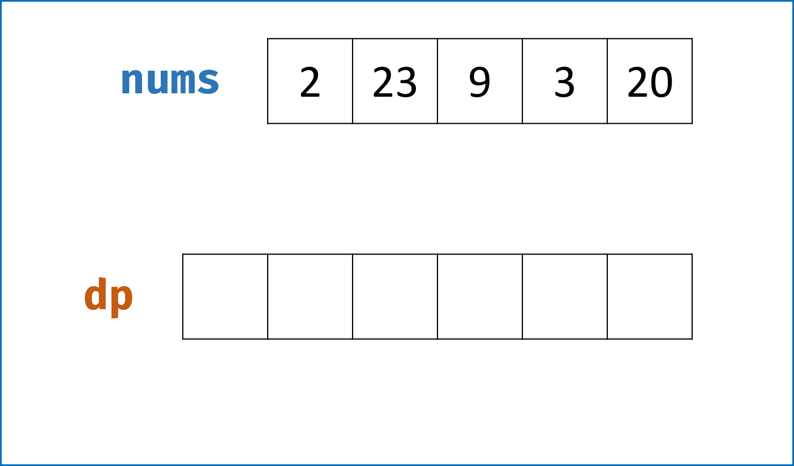
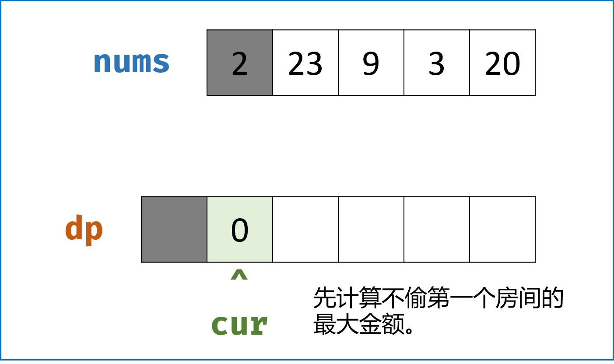
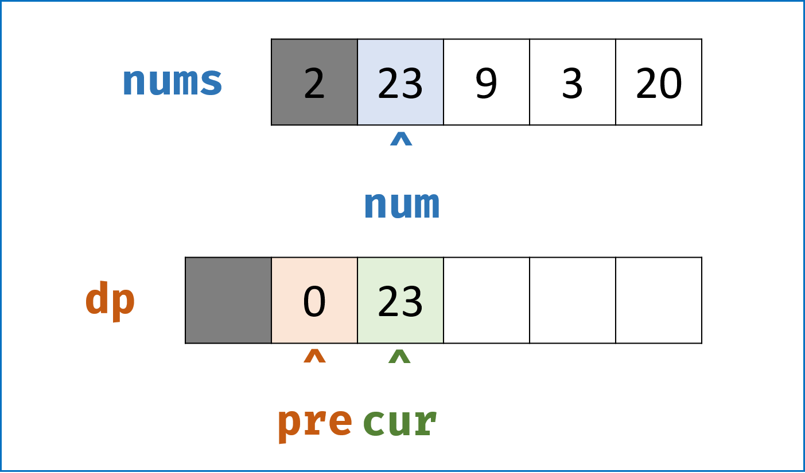
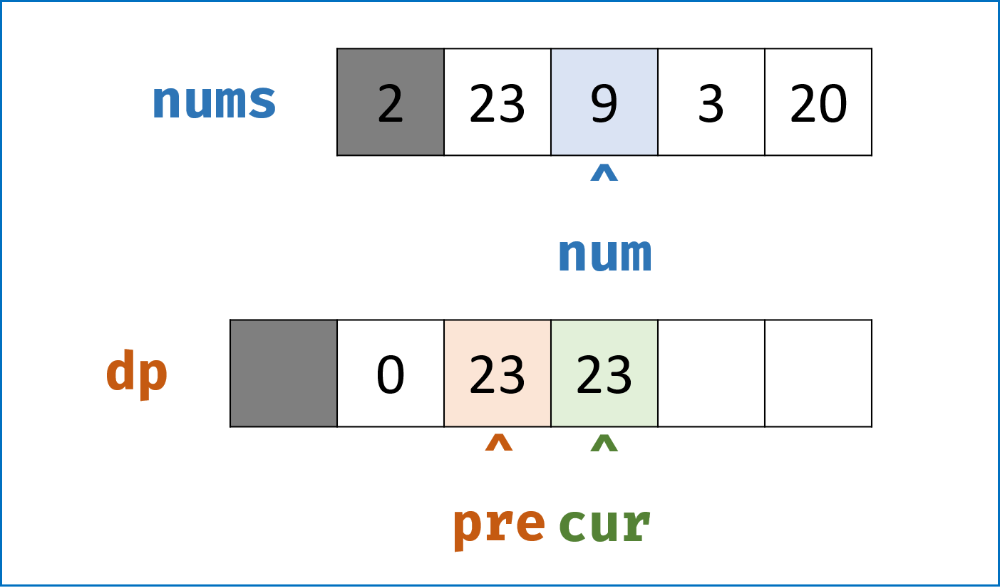
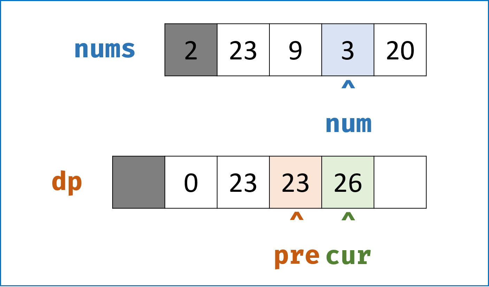
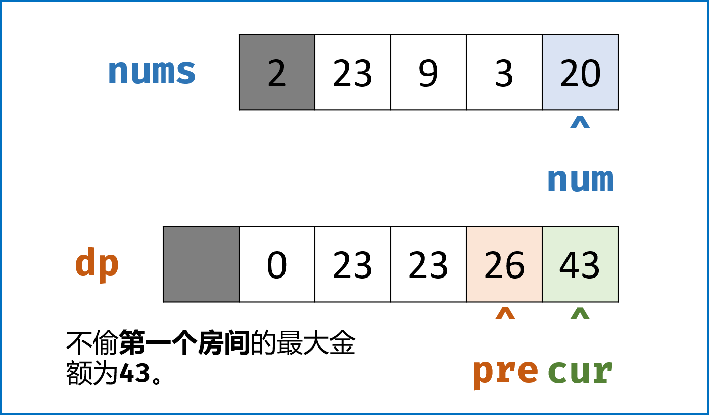
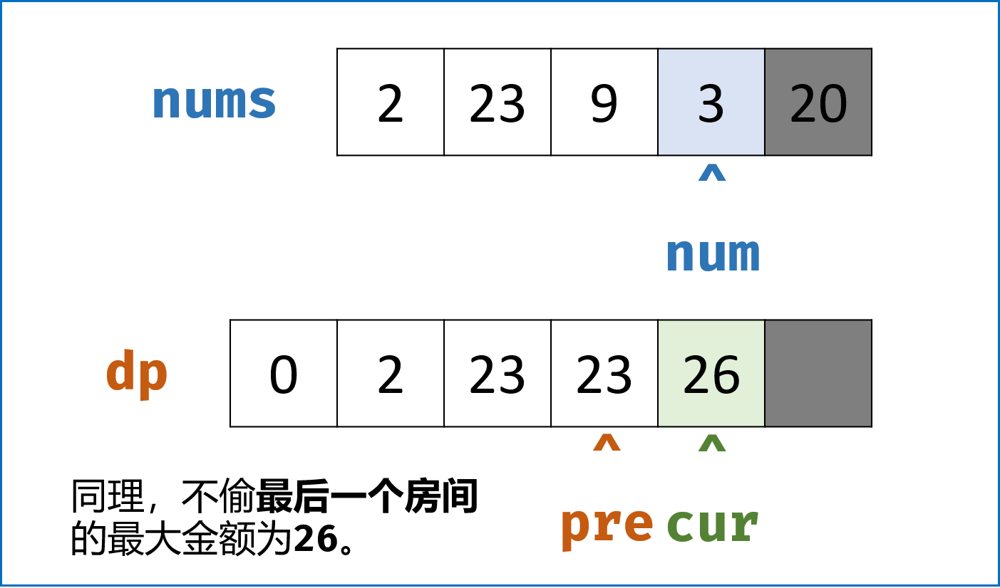
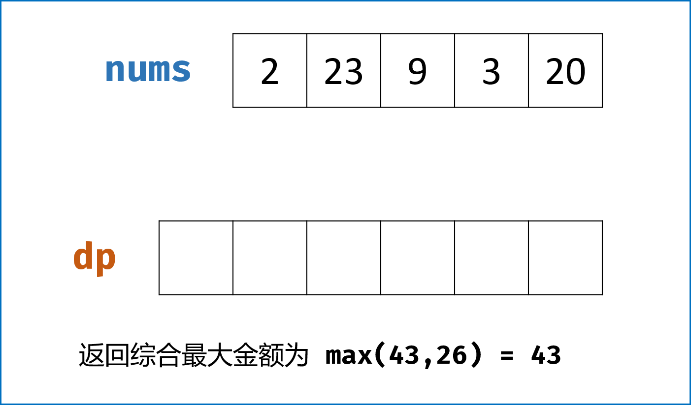

> 原文链接: https://leetcode-cn.com/problems/house-robber-ii


## 英文原文
<div><p>You are a professional robber planning to rob houses along a street. Each house has a certain amount of money stashed. All houses at this place are <strong>arranged in a circle.</strong> That means the first house is the neighbor of the last one. Meanwhile, adjacent houses have a security system connected, and&nbsp;<b>it will automatically contact the police if two adjacent houses were broken into on the same night</b>.</p>

<p>Given an integer array <code>nums</code> representing the amount of money of each house, return <em>the maximum amount of money you can rob tonight <strong>without alerting the police</strong></em>.</p>

<p>&nbsp;</p>
<p><strong>Example 1:</strong></p>

<pre>
<strong>Input:</strong> nums = [2,3,2]
<strong>Output:</strong> 3
<strong>Explanation:</strong> You cannot rob house 1 (money = 2) and then rob house 3 (money = 2), because they are adjacent houses.
</pre>

<p><strong>Example 2:</strong></p>

<pre>
<strong>Input:</strong> nums = [1,2,3,1]
<strong>Output:</strong> 4
<strong>Explanation:</strong> Rob house 1 (money = 1) and then rob house 3 (money = 3).
Total amount you can rob = 1 + 3 = 4.
</pre>

<p><strong>Example 3:</strong></p>

<pre>
<strong>Input:</strong> nums = [1,2,3]
<strong>Output:</strong> 3
</pre>

<p>&nbsp;</p>
<p><strong>Constraints:</strong></p>

<ul>
	<li><code>1 &lt;= nums.length &lt;= 100</code></li>
	<li><code>0 &lt;= nums[i] &lt;= 1000</code></li>
</ul>
</div>

## 中文题目
<div><p>你是一个专业的小偷，计划偷窃沿街的房屋，每间房内都藏有一定的现金。这个地方所有的房屋都 <strong>围成一圈</strong> ，这意味着第一个房屋和最后一个房屋是紧挨着的。同时，相邻的房屋装有相互连通的防盗系统，<strong>如果两间相邻的房屋在同一晚上被小偷闯入，系统会自动报警</strong> 。</p>

<p>给定一个代表每个房屋存放金额的非负整数数组，计算你 <strong>在不触动警报装置的情况下</strong> ，今晚能够偷窃到的最高金额。</p>

<p> </p>

<p><strong>示例 1：</strong></p>

<pre>
<strong>输入：</strong>nums = [2,3,2]
<strong>输出：</strong>3
<strong>解释：</strong>你不能先偷窃 1 号房屋（金额 = 2），然后偷窃 3 号房屋（金额 = 2）, 因为他们是相邻的。
</pre>

<p><strong>示例 2：</strong></p>

<pre>
<strong>输入：</strong>nums = [1,2,3,1]
<strong>输出：</strong>4
<strong>解释：</strong>你可以先偷窃 1 号房屋（金额 = 1），然后偷窃 3 号房屋（金额 = 3）。
     偷窃到的最高金额 = 1 + 3 = 4 。</pre>

<p><strong>示例 3：</strong></p>

<pre>
<strong>输入：</strong>nums = [0]
<strong>输出：</strong>0
</pre>

<p> </p>

<p><strong>提示：</strong></p>

<ul>
	<li><code>1 <= nums.length <= 100</code></li>
	<li><code>0 <= nums[i] <= 1000</code></li>
</ul>
</div>

## 通过代码
<RecoDemo>
</RecoDemo>


## 高赞题解
### 解题思路：


#### 总体思路：


- **此题是 [198. 打家劫舍](https://leetcode-cn.com/problems/house-robber/solution/da-jia-jie-she-dong-tai-gui-hua-jie-gou-hua-si-lu-/) 的拓展版：** 唯一的区别是此题中的房间是**环状排列**的（即首尾相接），而 $198.$ 题中的房间是**单排排列**的；而这也是此题的难点。


- **环状排列**意味着第一个房子和最后一个房子中**只能选择一个偷窃**，因此可以把此**环状排列房间**问题约化为两个**单排排列房间**子问题：


  1. 在不偷窃第一个房子的情况下（即 $nums[1:]$），最大金额是 $p_1$ ；

  2. 在不偷窃最后一个房子的情况下（即 $nums[:n-1]$），最大金额是 $p_2$ 。


  - **综合偷窃最大金额：** 为以上两种情况的较大值，即 $max(p1,p2)$ 。


- 下面的任务则是解决 **单排排列房间（即 [198. 打家劫舍](https://leetcode-cn.com/problems/house-robber/solution/da-jia-jie-she-dong-tai-gui-hua-jie-gou-hua-si-lu-/)）** 问题。推荐可以先把 $198.$ 做完再做这道题。


#### 198. 解题思路：


典型的动态规划，以下按照标准流程解题。


- **状态定义：**

  - 设动态规划列表 $dp$ ，$dp[i]$ 代表前 $i$ 个房子在满足条件下的能偷窃到的最高金额。

- **转移方程：**

  - **设：** 有 $n$ 个房子，前 $n$ 间能偷窃到的最高金额是 $dp[n]$ ，前 $n-1$ 间能偷窃到的最高金额是 $dp[n-1]$ ，此时向这些房子后加一间房，此房间价值为 $num$ ；

  - **加一间房间后：** 由于不能抢相邻的房子，意味着抢第 $n+1$ 间就不能抢第 $n$ 间；那么前 $n+1$ 间房能偷取到的最高金额 $dp[n+1]$ 一定是以下两种情况的 **较大值** ：

    1. 不抢第 $n+1$ 个房间，因此等于前 $n$ 个房子的最高金额，即 $dp[n+1] = dp[n]$ ；

    2. 抢第 $n+1$ 个房间，此时不能抢第 $n$ 个房间；因此等于前 $n-1$ 个房子的最高金额加上当前房间价值，即 $dp[n+1] = dp[n-1] + num$ ；

  - **细心的我们发现：** 难道在前 $n$ 间的最高金额 $dp[n]$ 情况下，第 $n$ 间一定被偷了吗？假设没有被偷，那 $n+1$ 间的最大值应该也可能是  $dp[n+1] = dp[n] + num$ 吧？其实这种假设的情况可以被省略，这是因为：

    1. 假设第 $n$ 间没有被偷，那么此时 $dp[n] = dp[n-1]$ ，此时 $dp[n+1] = dp[n] + num = dp[n-1] + num$ ，即可以将 **两种情况合并为一种情况** 考虑；

    2. 假设第 $n$ 间被偷，那么此时 $dp[n+1] = dp[n] + num$ **不可取** ，因为偷了第 $n$ 间就不能偷第 $n+1$ 间。

  - **最终的转移方程：** $dp[n+1] = max(dp[n],dp[n-1]+num)$

- **初始状态：**

  - 前 $0$ 间房子的最大偷窃价值为 $0$ ，即 $dp[0] = 0$ 。

- **返回值：**

  - 返回 $dp$ 列表最后一个元素值，即所有房间的最大偷窃价值。

- **简化空间复杂度：**

  - 我们发现 $dp[n]$ 只与 $dp[n-1]$ 和 $dp[n-2]$ 有关系，因此我们可以设两个变量 `cur`和 `pre` 交替记录，将空间复杂度降到 $O(1)$ 。


### 复杂度分析：


- **时间复杂度 $O(N)$ ：** 两次遍历 `nums` 需要线性时间；

- **空间复杂度 $O(1)$ ：** `cur`和 `pre` 使用常数大小的额外空间。


<,,,,,,,>


### 代码：


```python []

class Solution:

    def rob(self, nums: [int]) -> int:

        def my_rob(nums):

            cur, pre = 0, 0

            for num in nums:

                cur, pre = max(pre + num, cur), cur

            return cur

        return max(my_rob(nums[:-1]),my_rob(nums[1:])) if len(nums) != 1 else nums[0]

```


```java []

class Solution {

    public int rob(int[] nums) {

        if(nums.length == 0) return 0;

        if(nums.length == 1) return nums[0];

        return Math.max(myRob(Arrays.copyOfRange(nums, 0, nums.length - 1)), 

                        myRob(Arrays.copyOfRange(nums, 1, nums.length)));

    }

    private int myRob(int[] nums) {

        int pre = 0, cur = 0, tmp;

        for(int num : nums) {

            tmp = cur;

            cur = Math.max(pre + num, cur);

            pre = tmp;

        }

        return cur;

    }

}

```

## 统计信息
| 通过次数 | 提交次数 | AC比率 |
| :------: | :------: | :------: |
|    184010    |    423827    |   43.4%   |

## 提交历史
| 提交时间 | 提交结果 | 执行时间 |  内存消耗  | 语言 |
| :------: | :------: | :------: | :--------: | :--------: |


## 相似题目
|                             题目                             | 难度 |
| :----------------------------------------------------------: | :---------: |
| [打家劫舍](https://leetcode-cn.com/problems/house-robber/) | 中等|
| [粉刷房子](https://leetcode-cn.com/problems/paint-house/) | 中等|
| [栅栏涂色](https://leetcode-cn.com/problems/paint-fence/) | 中等|
| [打家劫舍 III](https://leetcode-cn.com/problems/house-robber-iii/) | 中等|
| [不含连续1的非负整数](https://leetcode-cn.com/problems/non-negative-integers-without-consecutive-ones/) | 困难|
| [金币路径](https://leetcode-cn.com/problems/coin-path/) | 困难|
