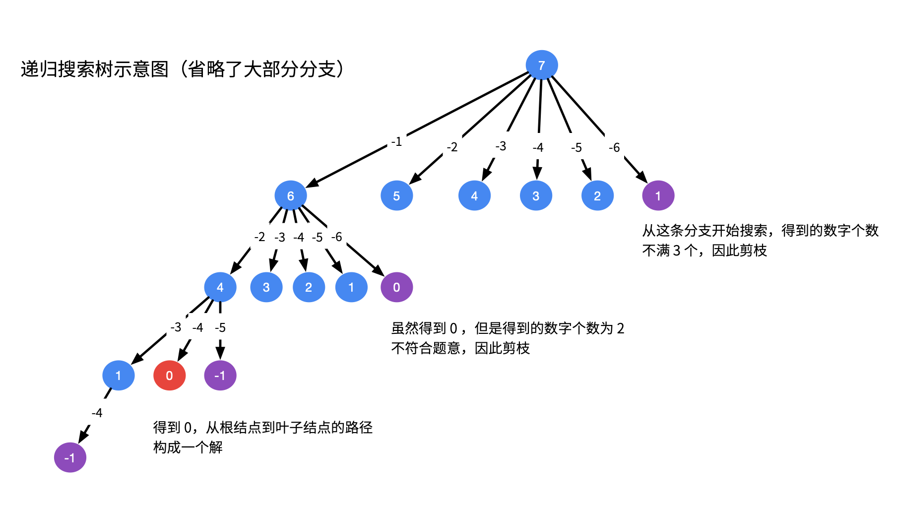
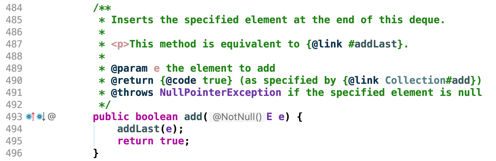
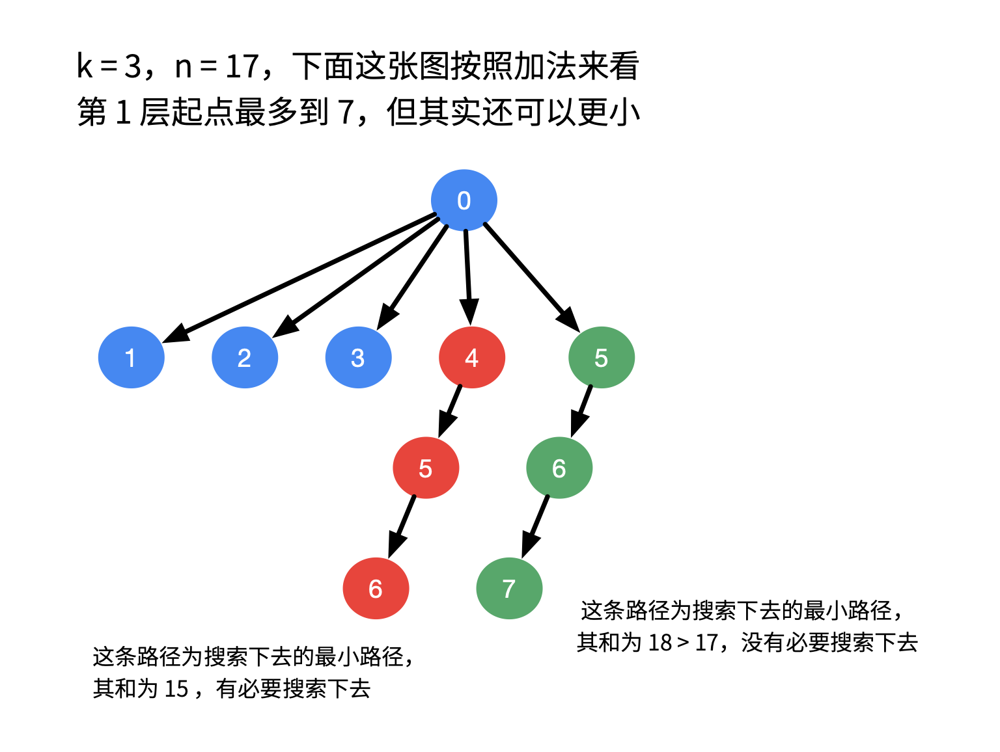

> 原文链接: https://leetcode-cn.com/problems/combination-sum-iii


## 英文原文
<div><p>Find all valid combinations of <code>k</code> numbers that sum up to <code>n</code> such that the following conditions are true:</p>

<ul>
	<li>Only numbers <code>1</code> through <code>9</code> are used.</li>
	<li>Each number is used <strong>at most once</strong>.</li>
</ul>

<p>Return <em>a list of all possible valid combinations</em>. The list must not contain the same combination twice, and the combinations may be returned in any order.</p>

<p>&nbsp;</p>
<p><strong>Example 1:</strong></p>

<pre>
<strong>Input:</strong> k = 3, n = 7
<strong>Output:</strong> [[1,2,4]]
<strong>Explanation:</strong>
1 + 2 + 4 = 7
There are no other valid combinations.</pre>

<p><strong>Example 2:</strong></p>

<pre>
<strong>Input:</strong> k = 3, n = 9
<strong>Output:</strong> [[1,2,6],[1,3,5],[2,3,4]]
<strong>Explanation:</strong>
1 + 2 + 6 = 9
1 + 3 + 5 = 9
2 + 3 + 4 = 9
There are no other valid combinations.
</pre>

<p><strong>Example 3:</strong></p>

<pre>
<strong>Input:</strong> k = 4, n = 1
<strong>Output:</strong> []
<strong>Explanation:</strong> There are no valid combinations.
Using 4 different numbers in the range [1,9], the smallest sum we can get is 1+2+3+4 = 10 and since 10 &gt; 1, there are no valid combination.
</pre>

<p><strong>Example 4:</strong></p>

<pre>
<strong>Input:</strong> k = 3, n = 2
<strong>Output:</strong> []
<strong>Explanation:</strong> There are no valid combinations.
</pre>

<p><strong>Example 5:</strong></p>

<pre>
<strong>Input:</strong> k = 9, n = 45
<strong>Output:</strong> [[1,2,3,4,5,6,7,8,9]]
<strong>Explanation:</strong>
1 + 2 + 3 + 4 + 5 + 6 + 7 + 8 + 9 = 45
There are no other valid combinations.
</pre>

<p>&nbsp;</p>
<p><strong>Constraints:</strong></p>

<ul>
	<li><code>2 &lt;= k &lt;= 9</code></li>
	<li><code>1 &lt;= n &lt;= 60</code></li>
</ul>
</div>

## 中文题目
<div><p>找出所有相加之和为&nbsp;<em><strong>n</strong> </em>的&nbsp;<strong><em>k&nbsp;</em></strong>个数的组合<strong><em>。</em></strong>组合中只允许含有 1 -&nbsp;9 的正整数，并且每种组合中不存在重复的数字。</p>

<p><strong>说明：</strong></p>

<ul>
	<li>所有数字都是正整数。</li>
	<li>解集不能包含重复的组合。&nbsp;</li>
</ul>

<p><strong>示例 1:</strong></p>

<pre><strong>输入:</strong> <em><strong>k</strong></em> = 3, <em><strong>n</strong></em> = 7
<strong>输出:</strong> [[1,2,4]]
</pre>

<p><strong>示例 2:</strong></p>

<pre><strong>输入:</strong> <em><strong>k</strong></em> = 3, <em><strong>n</strong></em> = 9
<strong>输出:</strong> [[1,2,6], [1,3,5], [2,3,4]]
</pre>
</div>

## 通过代码
<RecoDemo>
</RecoDemo>


## 高赞题解
### 解题思路：
回溯问题，细节很多，但是也有一点套路：

+ 先画出递归树，帮助分析；
+ 代码实现，即使用 **深度优先遍历**，搜索 **所有** 可能的解（因为是遍历，所以可以得到所有的解）；
+ 注意 **状态重置**（恢复现场，以免出错）和 **剪枝**（避免不必要的搜索消耗时间），这一步没有技巧，根据一些特殊用例， **画图帮助分析，看清剪枝和结算的条件** 。


**说明**：
+ 以下给出的解答仅供参考，建议大家看懂了一点点思路和剪枝的方法以后，自己尝试实现。因为这个问题涉及到的只是一些计算，没有太多技巧；
+ 剪枝在这道问题里是可以做得比较多的，但是本身这道问题数据量小，因此剪枝不是很有必要。

---

以示例为例：



我只画了一部分，全部画出来会占用很多版面。不过大致能够帮助我们分析出代码需要怎样写。


+ 尝试做减法，减到 $0$ 就说明可能找到了一个符合题意的组合，但是题目对组合里元素的个数有限制，因此还需要对元素个数做判断；
+ 如果减到负数，没有必要继续搜索下去；
+ 由于结果集里的元素互不相同，因此**下一层搜索的起点应该是上一层搜索的起点值 + 1**；
+ **根据画出的递归树设计递归方法的参数**。

编写代码就是要在这棵递归树上搜索所有符合条件的解，使用的是深度优先遍历。需要设计递归方法，参数有：

+ 剩下的数的和是多少，这里命名为 `residue` ，一维剩余元素之和，初始的时候传入 `n` ；
+ 因为题目规定，需要 `k` 个数，每递归一层，需要找的数就减去 $1$，因此需要一个变量表示还需要搜索多少个数，我们仍然用 `k` 表示，到 `0` 的时候搜索结束；
+ 搜索的起点，最小是 $1$，最大是 $9$，**事实上，这个最大值有一个上界**。我们暂时忽略对它的讨论；
+ 需要一个变量 `path` 表示从根结点到叶子结点的路径，因为我们的操作总是在末尾进行，**栈** 是最符合当前语义的数据结构；

> **注意**：以下 3 点针对 Java 语言，其它类型的语言请大家区别对待。

+ 对象类型的状态变量（这里是 `path`），在方法传递中是引用传递，在结算的时候要做一个拷贝；
+ 对象类型的状态变量（这里是 `path`），在方法传递中是引用传递，在回溯的时候，需要重置现场，这就是在 `dfs` 前后，代码是对称的原因；
+ 基本类型的状态变量值（这里是 `k`、`start`、`residue`），在方法传递中是值传递，每一次都用一个新的，因此无需状态重置（恢复现场）。

这里感谢 [@wardseptember](/u/wardseptember/) 这位朋友提供的建议。由于历史问题，Java 官方的 `Stack` 类已经不建议使用，建议使用 `Deque<Integer> stack = new ArrayDeque<Integer>();`，注意只使用这个类里关于栈的相关接口。

+ 栈使用：`addLast()`，不建议使用 `add()`，因为 `add()` 依然是调用 `addLast()`，使用 `addLast()` 语义更清晰；



+ 出栈使用：`removeLast()` 或者 `pollLast()`，`removeLast()` 里面依然是调用 `pollLast()`，注意：不要使用 `poll()`，因为 `poll()` 调用 `pollFirst()`，不符合栈的语义。

保存结果集的变量。这些参数可以在编写代码的过程中去思考，缺啥补啥。

**参考代码 1**：

```Java []
import java.util.ArrayDeque;
import java.util.ArrayList;
import java.util.Deque;
import java.util.List;

public class Solution {

    public List<List<Integer>> combinationSum3(int k, int n) {
        List<List<Integer>> res = new ArrayList<>();

        // 根据官方对 Stack 的使用建议，这里将 Deque 对象当做 stack 使用
        // 注意只使用关于栈的接口
        Deque<Integer> path = new ArrayDeque<>();
        dfs(k, n, 1, path, res);
        return res;
    }

    /**
     * @param k       剩下要找 k 个数
     * @param residue 剩余多少
     * @param start   下一轮搜索的起始元素是多少
     * @param path    深度优先遍历的路径参数（状态变量）
     * @param res     保存结果集的列表
     */
    private void dfs(int k, int residue, int start, Deque<Integer> path, List<List<Integer>> res) {
        // 这一步判断可以放到上一层，减少递归深度
        if (residue < 0) {
            return;
        }

        if (k == 0) {
            if (residue == 0) {
                res.add(new ArrayList<>(path));
                return;
            }
            return;
        }

        for (int i = start; i <= 9; i++) {
            path.addLast(i);
            dfs(k - 1, residue - i, i + 1, path, res);
            path.removeLast();
        }
    }
}
```

这一版代码提交以后，成绩还可以，我个人感觉是因为题目限制了数字的范围，所以搜索起来即使不剪枝，很快也会结束。

下面考虑剪枝，在这题中不是必须，仅供参考。

+ 首先是对输入的特殊判断：

```
if (k <= 0 || n <= 0 || k > n) {
    return res;
}
```

说明：这里感谢 [@RexLiu](/u/rexliu/) 朋友的更正（[来源](https://leetcode-cn.com/problems/combination-sum-iii/solution/hui-su-jian-zhi-by-liweiwei1419/632729/)）。


+ `n` 其实是有上限的，考虑最大的 `k` 个数字：`[9, 8, ... , (9 - k + 1)]`，他们的和为 `(19 - k) * k / 2`，如果比这个数还大，就不用搜索下去了。

+ 每一轮搜索的起点值也有一个上限，起点值最多到 `9`，我们找一下规律：

起点值列表： `[..., 7, 8, 9]`

+ 找 $3$ 个数，起点最多到 $7$；
+ 找 $2$ 个数，起点最多到 $8$。

因此一般规律是：`起点上界 + k = 10`，故 `起点上界 = 10 - k`。事实上，还可以计算得到一个更小的上界，但是在这题里没有必要了，每次去计算也要消耗时间。



**参考代码 2**：

```Java []
import java.util.ArrayDeque;
import java.util.ArrayList;
import java.util.Deque;
import java.util.List;

public class Solution {

    public List<List<Integer>> combinationSum3(int k, int n) {
        List<List<Integer>> res = new ArrayList<>();

        // 一开始做一些特殊判断
        if (k <= 0 || n <= 0 || k > n) {
            return res;
        }

        // 寻找 n 的上限：[9, 8, ... , (9 - k + 1)]，它们的和为 (19 - k) * k / 2
        // 比上限还大，就不用搜索了：
        if (n > (19 - k) * k / 2) {
            return res;
        }

        // 根据官方对 Stack 的使用建议，这里将 Deque 对象当做 stack 使用
        // 注意只使用关于栈的接口
        Deque<Integer> path = new ArrayDeque<>();
        dfs(k, n, 1, path, res);
        return res;
    }

    /**
     * @param k       剩下要找 k 个数
     * @param residue 剩余多少
     * @param start   下一轮搜索的起始元素是多少
     * @param path    深度优先遍历的路径参数（状态变量）
     * @param res     保存结果集的列表
     */
    private void dfs(int k, int residue, int start, Deque<Integer> path, List<List<Integer>> res) {
        // 剪枝：[start, 9] 这个区间里的数都不够 k 个，不用继续往下搜索
        if (10 - start < k) {
            return;
        }
        if (k == 0) {
            if (residue == 0) {
                res.add(new ArrayList<>(path));
                return;
            }
        }

        // 枚举起点值 [..., 7, 8, 9]
        // 找 3 个数，起点最多到 7
        // 找 2 个数，起点最多到 8
        // 规律是，起点上界 + k = 10，故起点上界 = 10 - k
        for (int i = start; i <= 10 - k; i++) {

//            if ((2 * i + k - 1) * k / 2 > residue) {
//                break;
//            }

            // 剪枝
            if (residue - i < 0) {
                break;
            }
            path.addLast(i);
            dfs(k - 1, residue - i, i + 1, path, res);
            path.removeLast();
        }
    }
}
```


## 统计信息
| 通过次数 | 提交次数 | AC比率 |
| :------: | :------: | :------: |
|    109620    |    148923    |   73.6%   |

## 提交历史
| 提交时间 | 提交结果 | 执行时间 |  内存消耗  | 语言 |
| :------: | :------: | :------: | :--------: | :--------: |


## 相似题目
|                             题目                             | 难度 |
| :----------------------------------------------------------: | :---------: |
| [组合总和](https://leetcode-cn.com/problems/combination-sum/) | 中等|
