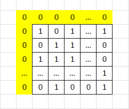

> 原文链接: https://leetcode-cn.com/problems/maximal-square


## 英文原文
<div><p>Given an <code>m x n</code> binary <code>matrix</code> filled with <code>0</code>&#39;s and <code>1</code>&#39;s, <em>find the largest square containing only</em> <code>1</code>&#39;s <em>and return its area</em>.</p>

<p>&nbsp;</p>
<p><strong>Example 1:</strong></p>

<pre>
<strong>Input:</strong> matrix = [[&quot;1&quot;,&quot;0&quot;,&quot;1&quot;,&quot;0&quot;,&quot;0&quot;],[&quot;1&quot;,&quot;0&quot;,&quot;1&quot;,&quot;1&quot;,&quot;1&quot;],[&quot;1&quot;,&quot;1&quot;,&quot;1&quot;,&quot;1&quot;,&quot;1&quot;],[&quot;1&quot;,&quot;0&quot;,&quot;0&quot;,&quot;1&quot;,&quot;0&quot;]]
<strong>Output:</strong> 4
</pre>

<p><strong>Example 2:</strong></p>

<pre>
<strong>Input:</strong> matrix = [[&quot;0&quot;,&quot;1&quot;],[&quot;1&quot;,&quot;0&quot;]]
<strong>Output:</strong> 1
</pre>

<p><strong>Example 3:</strong></p>

<pre>
<strong>Input:</strong> matrix = [[&quot;0&quot;]]
<strong>Output:</strong> 0
</pre>

<p>&nbsp;</p>
<p><strong>Constraints:</strong></p>

<ul>
	<li><code>m == matrix.length</code></li>
	<li><code>n == matrix[i].length</code></li>
	<li><code>1 &lt;= m, n &lt;= 300</code></li>
	<li><code>matrix[i][j]</code> is <code>&#39;0&#39;</code> or <code>&#39;1&#39;</code>.</li>
</ul>
</div>

## 中文题目
<div><p>在一个由 <code>'0'</code> 和 <code>'1'</code> 组成的二维矩阵内，找到只包含 <code>'1'</code> 的最大正方形，并返回其面积。</p>

<p> </p>

<p><strong>示例 1：</strong></p>

<pre>
<strong>输入：</strong>matrix = [["1","0","1","0","0"],["1","0","1","1","1"],["1","1","1","1","1"],["1","0","0","1","0"]]
<strong>输出：</strong>4
</pre>

<p><strong>示例 2：</strong></p>

<pre>
<strong>输入：</strong>matrix = [["0","1"],["1","0"]]
<strong>输出：</strong>1
</pre>

<p><strong>示例 3：</strong></p>

<pre>
<strong>输入：</strong>matrix = [["0"]]
<strong>输出：</strong>0
</pre>

<p> </p>

<p><strong>提示：</strong></p>

<ul>
	<li><code>m == matrix.length</code></li>
	<li><code>n == matrix[i].length</code></li>
	<li><code>1 <= m, n <= 300</code></li>
	<li><code>matrix[i][j]</code> 为 <code>'0'</code> 或 <code>'1'</code></li>
</ul>
</div>

## 通过代码
<RecoDemo>
</RecoDemo>


## 高赞题解
#### 理解 min(上, 左, 左上) + 1


如题，在其他动态规划方法的题解中，大都会涉及到下列形式的代码：

```Java []

// 伪代码

if (matrix(i - 1, j - 1) == '1') {

    dp(i, j) = min(dp(i - 1, j), dp(i, j - 1), dp(i - 1, j - 1)) + 1;

}

```

其中，`dp(i, j)` 是以 `matrix(i - 1, j - 1)` 为 **右下角** 的正方形的最大边长。(感谢 [@liweiwei1419](/u/liweiwei1419/) 提出补充)  

等同于：`dp(i + 1, j + 1)` 是以 `matrix(i, j)` 为右下角的正方形的最大边长


翻译成中文

> 若某格子值为 `1`，则以此为**右下角**的正方形的、最大边长为：上面的正方形、左面的正方形或左上的正方形中，最小的那个，再加上此格。


先来阐述简单共识

- 若形成正方形（非单 `1`），以当前为右下角的视角看，则需要：当前格、上、左、左上都是 `1`

- 可以换个角度：当前格、上、左、左上都不能受 `0` 的限制，才能成为正方形


上面详解了 三者取最小 的含义：

- 图 1：受限于左上的 0

- 图 2：受限于上边的 0

- 图 3：受限于左边的 0

- 数字表示：以此为正方形右下角的最大边长

- 黄色表示：格子 `?` 作为右下角的正方形区域


就像 **[木桶的短板理论](https://baike.baidu.com/item/%E7%9F%AD%E6%9D%BF%E7%90%86%E8%AE%BA)** 那样——附近的最小边长，才与 `?` 的最长边长有关。

此时已可得到递推公式

```Java []

// 伪代码

if (grid[i - 1][j - 1] == '1') {

    dp[i][j] = min(dp[i - 1][j - 1], dp[i - 1][j], dp[i][j - 1]) + 1;

}

```


#### 从感性理解，到代码实现


- 从上述图解中，我们似乎得到的只是「动态规划 **推进** 的过程」，即「如何从前面的 `dp` 推出后面的 `dp`」，甚至还只是感性理解

- 距离代码我们还缺：`dp` 具体定义如何，数组多大，初值如何，如何与题目要求的面积相关

- `dp` 具体定义：`dp[i + 1][j + 1]` 表示 「以第 `i` 行、第 `j` 列为右下角的正方形的最大边长」

  - 为何不是 `dp[i][j]`

  - 回到图解中，任何一个正方形，我们都「依赖」**当前格** 左、上、左上三个方格的情况

  - 但第一行的上层已经没有格子，第一列左边已经没有格子，需要做特殊 `if` 判断来处理

  - 为了代码简洁，我们 **假设补充** 了多一行全 `'0'`、多一列全 `'0'`

  - 

- 此时 `dp` 数组的大小也明确为 `new dp[height + 1][width + 1]`

- 初始值就是将第一列 `dp[row][0]` 、第一行 `dp[0][col]` 都赋为 `0`，相当于已经计算了所有的第一行、第一列的 `dp` 值

- 题目要求面积。根据 「面积 = 边长 x 边长」可知，我们只需求出 **最大边长** 即可

  - 定义 `maxSide` 表示最长边长，每次得出一个 `dp`，就 `maxSide = max(maxSide, dp);`

  - 最终返回 `return maxSide * maxSide;`


#### 参考代码


- 时间复杂度 $O(height * width)$

- 空间复杂度 $O(height * width)$


```Java []

public int maximalSquare(char[][] matrix) {

    // base condition

    if (matrix == null || matrix.length < 1 || matrix[0].length < 1) return 0;


    int height = matrix.length;

    int width = matrix[0].length;

    int maxSide = 0;


    // 相当于已经预处理新增第一行、第一列均为0

    int[][] dp = new int[height + 1][width + 1];


    for (int row = 0; row < height; row++) {

        for (int col = 0; col < width; col++) {

            if (matrix[row][col] == '1') {

                dp[row + 1][col + 1] = Math.min(Math.min(dp[row + 1][col], dp[row][col + 1]), dp[row][col]) + 1;

                maxSide = Math.max(maxSide, dp[row + 1][col + 1]);

            }

        }

    }

    return maxSide * maxSide;

}

```


#### 优化空间


- 为了避免到边的判断处理，在最左侧加上一列 `dp[i][0] = 0` ，在左上边加上一行 `dp[0][j] = 0` ，这才有了官方题解中所谓的 `matrix[i - 1][j - 1] == '1'` 与 `dp[i][j]` ，其实都是指可对应上的"当前格子"

- 其实只需关注"当前格子的周边"，故可二维降一维优化

  - 增加 `northwest` 西北角解决"左上角"的问题，感谢 [@less](https://leetcode-cn.com/u/less-9/) 指出之前缺漏的 遍历每行时，还原回辅助的原值0 的问题 `northwest = 0;` 

- 时间复杂度 $O(height * width)$

- 空间复杂度 $O(width)$


```Java []

// 含优化过程的代码（隔壁有终版代码）

public int maximalSquare(char[][] matrix) {

    // base condition

    if (matrix == null || matrix.length < 1 || matrix[0].length < 1) return 0;


    int height = matrix.length;

    int width = matrix[0].length;

    int maxSide = 0;


    // 相当于已经预处理新增第一行、第一列均为0

//  int[][] dp = new int[height + 1][width + 1];

    int[] dp = new int[width + 1];

    int northwest = 0; // 西北角、左上角


//  for (int row = 0; row < height; row++) {

    for (char[] chars : matrix) {

        northwest = 0; // 遍历每行时，还原回辅助的原值0

        for (int col = 0; col < width; col++) {

            int nextNorthwest = dp[col + 1];

            if (chars[col] == '1') {

//              dp[row + 1][col + 1] = Math.min(Math.min(dp[row + 1][col], dp[row][col + 1]), dp[row][col]) + 1;

                dp[col + 1] = Math.min(Math.min(dp[col], dp[col + 1]), northwest) + 1;


//              maxSide = Math.max(maxSide, dp[row + 1][col + 1]);

                maxSide = Math.max(maxSide, dp[col + 1]);

            } else {

                dp[col + 1] = 0;

            }

            northwest = nextNorthwest;

        }

    }

    return maxSide * maxSide;

}

```


```Java []

// 终版代码

public int maximalSquare(char[][] matrix) {

    if (matrix == null || matrix.length < 1 || matrix[0].length < 1) return 0;


    int height = matrix.length;

    int width = matrix[0].length;

    int maxSide = 0;


    int[] dp = new int[width + 1];


    for (char[] chars : matrix) {

        int northwest = 0; // 个人建议放在这里声明，而非循环体外

        for (int col = 0; col < width; col++) {

            int nextNorthwest = dp[col + 1];

            if (chars[col] == '1') {

                dp[col + 1] = Math.min(Math.min(dp[col], dp[col + 1]), northwest) + 1;

                maxSide = Math.max(maxSide, dp[col + 1]);

            } else dp[col + 1] = 0;

            northwest = nextNorthwest;

        }

    }

    return maxSide * maxSide;

}

```


#### 后记感悟


- 这是刚入门算法时写的第四篇题解，最初有诸多错误与不明确之处，侥幸倚一图解作为亮点而获赞，实不敢当。

- 今逢官方每日一题引流无数，受宠若惊之余更多是担心错误误导。承蒙厚爱，评论区的伙伴们都细心提出修正之处，再次感谢海涵与斧正！

- 实话说，此题笔者首次也没做出来，看了当时的多篇题解之后仍不得要领，难受至极，如鲠在喉。换个心情，别死磕，动手画一画，才发觉脑中缺一幅「三个正方形相互关系」的图，才有了文中图解。

- 最近更新

  - 标注了标题以区分段落、复杂度表示

  - 增加了段落「从感性理解，到代码实现」

  - 修改了诸多 `f` 与 `dp`、`i` 与 `i-1` 等不对应之处

- 再次感谢各位，当您遇到任何细微的难以理解的地方，极有可能是作者的错误之处，也会有许多小伙伴一样不好理解。让我们一起完善他吧！

- Enjoy Coding!

## 统计信息
| 通过次数 | 提交次数 | AC比率 |
| :------: | :------: | :------: |
|    149998    |    312247    |   48.0%   |

## 提交历史
| 提交时间 | 提交结果 | 执行时间 |  内存消耗  | 语言 |
| :------: | :------: | :------: | :--------: | :--------: |


## 相似题目
|                             题目                             | 难度 |
| :----------------------------------------------------------: | :---------: |
| [最大矩形](https://leetcode-cn.com/problems/maximal-rectangle/) | 困难|
| [最大加号标志](https://leetcode-cn.com/problems/largest-plus-sign/) | 中等|
