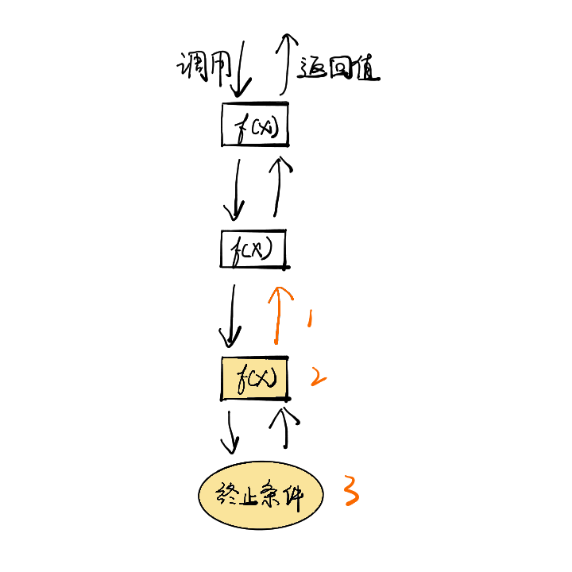
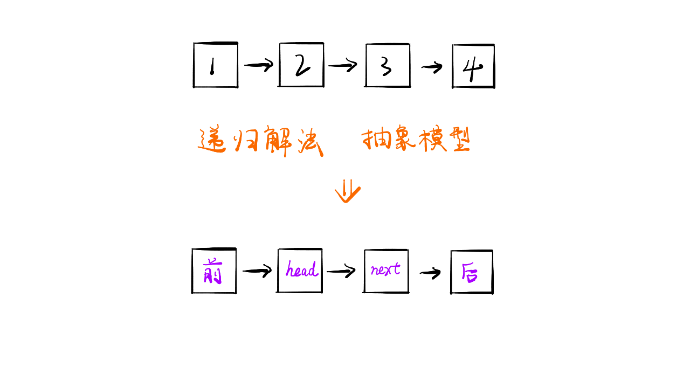
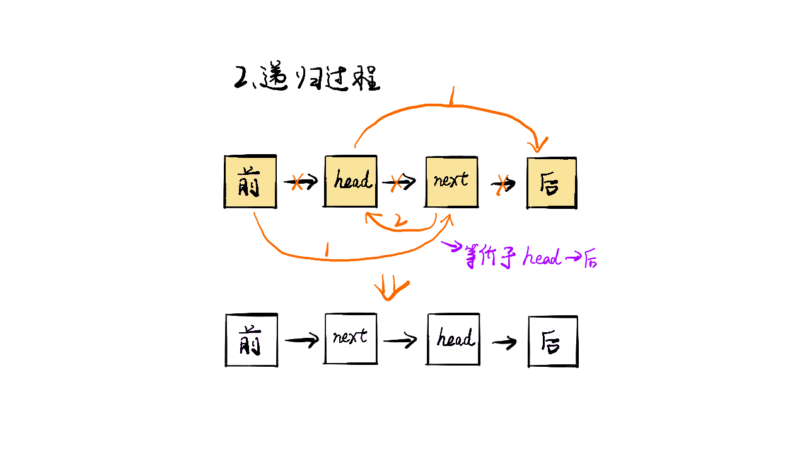
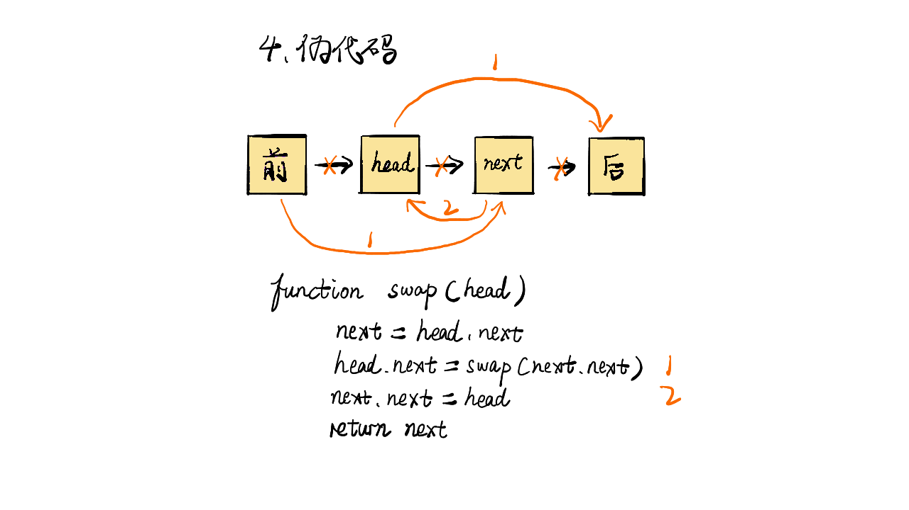

> 原文链接: https://leetcode-cn.com/problems/swap-nodes-in-pairs


## 英文原文
<div><p>Given a&nbsp;linked list, swap every two adjacent nodes and return its head. You must solve the problem without&nbsp;modifying the values in the list&#39;s nodes (i.e., only nodes themselves may be changed.)</p>

<p>&nbsp;</p>
<p><strong>Example 1:</strong></p>

<pre>
<strong>Input:</strong> head = [1,2,3,4]
<strong>Output:</strong> [2,1,4,3]
</pre>

<p><strong>Example 2:</strong></p>

<pre>
<strong>Input:</strong> head = []
<strong>Output:</strong> []
</pre>

<p><strong>Example 3:</strong></p>

<pre>
<strong>Input:</strong> head = [1]
<strong>Output:</strong> [1]
</pre>

<p>&nbsp;</p>
<p><strong>Constraints:</strong></p>

<ul>
	<li>The number of nodes in the&nbsp;list&nbsp;is in the range <code>[0, 100]</code>.</li>
	<li><code>0 &lt;= Node.val &lt;= 100</code></li>
</ul>
</div>

## 中文题目
<div><p>给你一个链表，两两交换其中相邻的节点，并返回交换后链表的头节点。你必须在不修改节点内部的值的情况下完成本题（即，只能进行节点交换）。</p>

<p>&nbsp;</p>

<p><strong>示例 1：</strong></p>

<pre>
<strong>输入：</strong>head = [1,2,3,4]
<strong>输出：</strong>[2,1,4,3]
</pre>

<p><strong>示例 2：</strong></p>

<pre>
<strong>输入：</strong>head = []
<strong>输出：</strong>[]
</pre>

<p><strong>示例 3：</strong></p>

<pre>
<strong>输入：</strong>head = [1]
<strong>输出：</strong>[1]
</pre>

<p>&nbsp;</p>

<p><strong>提示：</strong></p>

<ul>
	<li>链表中节点的数目在范围 <code>[0, 100]</code> 内</li>
	<li><code>0 &lt;= Node.val &lt;= 100</code></li>
</ul>
</div>

## 通过代码
<RecoDemo>
</RecoDemo>


## 高赞题解
### 解题思路

- 标签：链表
- 本题的递归和非递归解法其实原理类似，都是更新每两个点的链表形态完成整个链表的调整
- 其中递归解法可以作为典型的递归解决思路进行讲解

递归写法要观察本级递归的解决过程，形成抽象模型，因为递归本质就是不断重复相同的事情。而不是去思考完整的调用栈，一级又一级，无从下手。如图所示，我们应该关注一级调用小单元的情况，也就是单个f(x)。

{:width="300px"}
{:align="center"}


其中我们应该关心的主要有三点：

1. 返回值
2. 调用单元做了什么
3. 终止条件

在本题中：

1. 返回值：交换完成的子链表
2. 调用单元：设需要交换的两个点为 head 和 next，head 连接后面交换完成的子链表，next 连接 head，完成交换
3. 终止条件：head 为空指针或者 next 为空指针，也就是当前无节点或者只有一个节点，无法进行交换


### 代码

递归解法

```java
class Solution {
    public ListNode swapPairs(ListNode head) {
        if(head == null || head.next == null){
            return head;
        }
        ListNode next = head.next;
        head.next = swapPairs(next.next);
        next.next = head;
        return next;
    }
}
```

非递归解法

```java
class Solution {
    public ListNode swapPairs(ListNode head) {
        ListNode pre = new ListNode(0);
        pre.next = head;
        ListNode temp = pre;
        while(temp.next != null && temp.next.next != null) {
            ListNode start = temp.next;
            ListNode end = temp.next.next;
            temp.next = end;
            start.next = end.next;
            end.next = start;
            temp = start;
        }
        return pre.next;
    }
}
```

### 画解

<,,,,,>

想看大鹏画解更多高频面试题，欢迎阅读大鹏的 LeetBook：[《画解剑指 Offer 》](https://leetcode-cn.com/leetbook/detail/illustrate-lcof/)，O(∩_∩)O

## 统计信息
| 通过次数 | 提交次数 | AC比率 |
| :------: | :------: | :------: |
|    343885    |    488314    |   70.4%   |

## 提交历史
| 提交时间 | 提交结果 | 执行时间 |  内存消耗  | 语言 |
| :------: | :------: | :------: | :--------: | :--------: |


## 相似题目
|                             题目                             | 难度 |
| :----------------------------------------------------------: | :---------: |
| [K 个一组翻转链表](https://leetcode-cn.com/problems/reverse-nodes-in-k-group/) | 困难|
