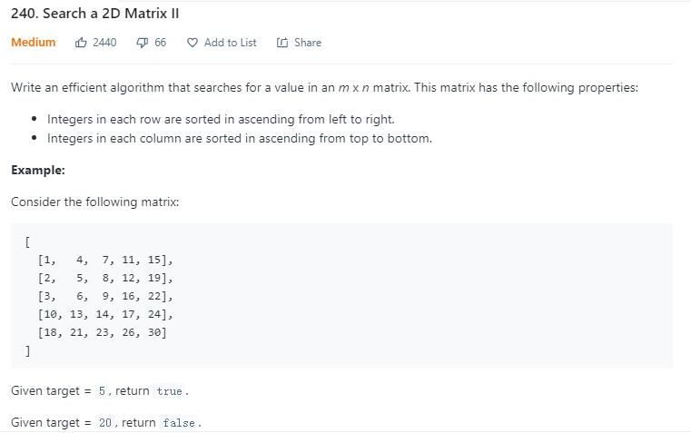
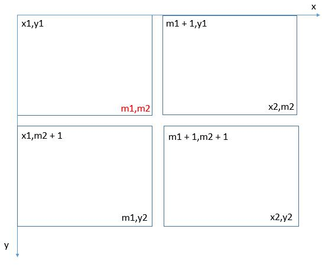

> 原文链接: https://leetcode-cn.com/problems/search-a-2d-matrix-ii


## 英文原文
<div><p>Write an efficient algorithm that searches for a <code>target</code> value in an <code>m x n</code> integer <code>matrix</code>. The <code>matrix</code> has the following properties:</p>

<ul>
	<li>Integers in each row are sorted in ascending from left to right.</li>
	<li>Integers in each column are sorted in ascending from top to bottom.</li>
</ul>

<p>&nbsp;</p>
<p><strong>Example 1:</strong></p>

<pre>
<strong>Input:</strong> matrix = [[1,4,7,11,15],[2,5,8,12,19],[3,6,9,16,22],[10,13,14,17,24],[18,21,23,26,30]], target = 5
<strong>Output:</strong> true
</pre>

<p><strong>Example 2:</strong></p>

<pre>
<strong>Input:</strong> matrix = [[1,4,7,11,15],[2,5,8,12,19],[3,6,9,16,22],[10,13,14,17,24],[18,21,23,26,30]], target = 20
<strong>Output:</strong> false
</pre>

<p>&nbsp;</p>
<p><strong>Constraints:</strong></p>

<ul>
	<li><code>m == matrix.length</code></li>
	<li><code>n == matrix[i].length</code></li>
	<li><code>1 &lt;= n, m &lt;= 300</code></li>
	<li><code>-10<sup>9</sup> &lt;= matrix[i][j] &lt;= 10<sup>9</sup></code></li>
	<li>All the integers in each row are <strong>sorted</strong> in ascending order.</li>
	<li>All the integers in each column are <strong>sorted</strong> in ascending order.</li>
	<li><code>-10<sup>9</sup> &lt;= target &lt;= 10<sup>9</sup></code></li>
</ul>
</div>

## 中文题目
<div><p>编写一个高效的算法来搜索&nbsp;<code><em>m</em>&nbsp;x&nbsp;<em>n</em></code>&nbsp;矩阵 <code>matrix</code> 中的一个目标值 <code>target</code> 。该矩阵具有以下特性：</p>

<ul>
	<li>每行的元素从左到右升序排列。</li>
	<li>每列的元素从上到下升序排列。</li>
</ul>

<p>&nbsp;</p>

<p><b>示例 1：</b></p>

<pre>
<b>输入：</b>matrix = [[1,4,7,11,15],[2,5,8,12,19],[3,6,9,16,22],[10,13,14,17,24],[18,21,23,26,30]], target = 5
<b>输出：</b>true
</pre>

<p><b>示例 2：</b></p>

<pre>
<b>输入：</b>matrix = [[1,4,7,11,15],[2,5,8,12,19],[3,6,9,16,22],[10,13,14,17,24],[18,21,23,26,30]], target = 20
<b>输出：</b>false
</pre>

<p>&nbsp;</p>

<p><strong>提示：</strong></p>

<ul>
	<li><code>m == matrix.length</code></li>
	<li><code>n == matrix[i].length</code></li>
	<li><code>1 &lt;= n, m &lt;= 300</code></li>
	<li><code>-10<sup>9</sup>&nbsp;&lt;= matrix[i][j] &lt;= 10<sup>9</sup></code></li>
	<li>每行的所有元素从左到右升序排列</li>
	<li>每列的所有元素从上到下升序排列</li>
	<li><code>-10<sup>9</sup>&nbsp;&lt;= target &lt;= 10<sup>9</sup></code></li>
</ul>
</div>

## 通过代码
<RecoDemo>
</RecoDemo>


## 高赞题解
# 题目描述（中等难度）





矩阵的每行从左到右是升序， 每列从上到下也是升序，在矩阵中查找某个数。


# 解法一


看到有序，第一反应就是二分查找。最直接的做法，一行一行的进行二分查找即可。


此外，结合有序的性质，一些情况可以提前结束。


比如某一行的第一个元素大于了 `target` ，当前行和后边的所有行都不用考虑了，直接返回 `false`。


某一行的最后一个元素小于了 `target` ，当前行就不用考虑了，换下一行。


```java

public boolean searchMatrix(int[][] matrix, int target) {

    if (matrix.length == 0 || matrix[0].length == 0) {

        return false;

    }

    for (int i = 0; i < matrix.length; i++) {

        if (matrix[i][0] > target) {

            break;

        }

        if(matrix[i][matrix[i].length - 1] < target){

            continue;

        } 

        int col = binarySearch(matrix[i], target);

        if (col != -1) {

            return true;

        }

    }

    return false;

}


//二分查找

private int binarySearch(int[] nums, int target) {

    int start = 0;

    int end = nums.length - 1;

    while (start <= end) {

        int mid = (start + end) >>> 1;

        if (nums[mid] == target) {

            return mid;

        } else if (nums[mid] < target) {

            start = mid + 1;

        } else {

            end = mid - 1;

        }

    }

    return -1;

}

```


时间复杂度的话，如果是 `m` 行 `n` 列，就是 `O(mlog(n))`。


# 解法二


参考 [这里](https://leetcode.com/problems/search-a-2d-matrix-ii/discuss/66140/My-concise-O(m%2Bn)-Java-solution)，需要很敏锐的观察力了。


数组从左到右和从上到下都是升序的，如果从右上角出发开始遍历呢？


会发现每次都是向左数字会变小，向下数字会变大，有点和二分查找树相似。二分查找树的话，是向左数字变小，向右数字变大。


所以我们可以把 `target` 和当前值比较。


* 如果 `target` 的值大于当前值，那么就向下走。

* 如果 `target` 的值小于当前值，那么就向左走。

* 如果相等的话，直接返回 `true` 。


也可以换个角度思考。


如果 `target` 的值小于当前值，也就意味着当前值所在的列肯定不会存在 `target` 了，可以把当前列去掉，从新的右上角的值开始遍历。


同理，如果 `target` 的值大于当前值，也就意味着当前值所在的行肯定不会存在 `target` 了，可以把当前行去掉，从新的右上角的值开始遍历。


看下边的例子。


```java

[1,   4,  7, 11, 15],

[2,   5,  8, 12, 19],

[3,   6,  9, 16, 22],

[10, 13, 14, 17, 24],

[18, 21, 23, 26, 30]


如果 target  = 9，如果我们从 15 开始遍历, cur = 15

    

target < 15, 去掉当前列, cur = 11

[1,   4,  7, 11],

[2,   5,  8, 12],

[3,   6,  9, 16],

[10, 13, 14, 17],

[18, 21, 23, 26]    

    

target < 11, 去掉当前列, cur = 7  

[1,   4,  7],

[2,   5,  8],

[3,   6,  9],

[10, 13, 14],

[18, 21, 23]     


target > 7, 去掉当前行, cur = 8   

[2,   5,  8],

[3,   6,  9],

[10, 13, 14],

[18, 21, 23]       


target > 8, 去掉当前行, cur = 9, 遍历结束    

[3,   6,  9],

[10, 13, 14],

[18, 21, 23]   

```


不管从哪种角度考虑，代码的话都是一样的。


```java

public boolean searchMatrix(int[][] matrix, int target) {

    if (matrix.length == 0 || matrix[0].length == 0) {

        return false;

    }

    int row = 0;

    int col = matrix[0].length - 1;

    while (row < matrix.length && col >= 0) {

        if (target > matrix[row][col]) {

            row++;

        } else if (target < matrix[row][col]) {

            col--;

        } else {

            return true;

        }

    }

    return false;

}

```


时间复杂度就是每个节点最多遍历一遍了，`O(m + n)`。


# 解法三


参考 [这里](https://leetcode.com/problems/search-a-2d-matrix-ii/discuss/66147/*Java*-an-easy-to-understand-divide-and-conquer-method) ，还有一种解法。


我的理解的话，算是一种变形的二分法。


二分法的思想就是，目标值和中点值进行比较，然后可以丢弃一半的元素。


这道题的话是矩阵，如果我们找到矩阵的中心，然后和目标值比较看能不能丢弃一些元素。


```java

如下图，中心位置是 9

[1,   4,  7, 11, 15],

[2,   5,  8, 12, 19],

[3,   6, /9/,16, 22],

[10, 13, 14, 17, 24],

[18, 21, 23, 26, 30]


通过中心位置, 我们可以把原矩形分成四个矩形, 左上, 右上, 左下, 右下

[1,   4,  7   [11, 15  

 2,   5,  8    12, 19  

 3,   6, /9/]  16, 22] 

 

[10, 13, 14   [17, 24

[18, 21, 23]   26, 30]


如果 target = 10,

此时中心值小于目标值，左上角矩形中所有的数都小于目标值，我们可以丢弃左上角的矩形，继续从剩下三个矩形中寻找


如果 target = 5,

此时中心值大于目标值，右下角矩形中所有的数都大于目标值，那么我们可以丢弃右下角的矩形，继续从剩下三个矩形中寻找 

```


我们找到了丢弃元素的原则，可以写代码了。


这里的话，矩形我们用左上角和右下角坐标的形式表示，下图是分割后矩形的坐标情况。





我们可以用递归的形式去写，递归出口的话，当矩阵中只有一个元素，直接判断当前元素是不是目标值即可。


还有就是分割的时候可能越界，比如原矩阵只有一行，左下角和右下角的矩阵其实是不存在的，按照上边的坐标公式计算出来后，我们要判断一下是否越界。


```java

public boolean searchMatrix(int[][] matrix, int target) {

    if (matrix.length == 0 || matrix[0].length == 0) {

        return false;

    }

    return searchMatrixHelper(matrix, 0, 0, matrix[0].length - 1, matrix.length - 1, matrix[0].length - 1, matrix.length - 1, target);

}


private boolean searchMatrixHelper(int[][] matrix, int x1, int y1, int x2, int y2, int xMax, int yMax, int target) {

    //只需要判断左上角坐标即可

    if (x1 > xMax || y1 > yMax) {

        return false;

    }

    

    //x 轴代表的是列，y 轴代表的是行

    if(x1 == x2 && y1 == y2){

        return matrix[y1][x1] == target;

    }

    int m1 = (x1 + x2) >>> 1;

    int m2 = (y1 + y2) >>> 1;

    if (matrix[m2][m1] == target) {

        return true;

    }

    if (matrix[m2][m1] < target) {

        // 右上矩阵

        return searchMatrixHelper(matrix, m1 + 1, y1, x2, m2, x2, y2, target) ||

            // 左下矩阵

            searchMatrixHelper(matrix, x1, m2 + 1, m1, y2, x2, y2, target) ||

            // 右下矩阵

            searchMatrixHelper(matrix, m1 + 1, m2 + 1, x2, y2, x2, y2, target);


    } else {

        // 右上矩阵

        return searchMatrixHelper(matrix, m1 + 1, y1, x2, m2, x2, y2, target) ||

            // 左下矩阵

            searchMatrixHelper(matrix, x1, m2 + 1, m1, y2, x2, y2, target) ||

            // 左上矩阵

            searchMatrixHelper(matrix, x1, y1, m1, m2, x2, y2, target);

    }

}

```


# 总


看到有序数组第一反应就是二分了，也就是解法一。


解法二的话，从右上角开始遍历的想法很妙。


解法三的话思想很简单，就是变形的二分法，每次抛弃一部分元素，但代码的话其实写出来不是很容易，相对于解法一和解法二来说是有些复杂度的。


之前自己在博客总结的，更多题解可以在原地址 [https://leetcode.wang](https://leetcode.wang)。

## 统计信息
| 通过次数 | 提交次数 | AC比率 |
| :------: | :------: | :------: |
|    214965    |    433157    |   49.6%   |

## 提交历史
| 提交时间 | 提交结果 | 执行时间 |  内存消耗  | 语言 |
| :------: | :------: | :------: | :--------: | :--------: |


## 相似题目
|                             题目                             | 难度 |
| :----------------------------------------------------------: | :---------: |
| [搜索二维矩阵](https://leetcode-cn.com/problems/search-a-2d-matrix/) | 中等|
