> 原文链接: https://leetcode-cn.com/problems/perfect-squares


## 英文原文
<div><p>Given an integer <code>n</code>, return <em>the least number of perfect square numbers that sum to</em> <code>n</code>.</p>

<p>A <strong>perfect square</strong> is an integer that is the square of an integer; in other words, it is the product of some integer with itself. For example, <code>1</code>, <code>4</code>, <code>9</code>, and <code>16</code> are perfect squares while <code>3</code> and <code>11</code> are not.</p>

<p>&nbsp;</p>
<p><strong>Example 1:</strong></p>

<pre>
<strong>Input:</strong> n = 12
<strong>Output:</strong> 3
<strong>Explanation:</strong> 12 = 4 + 4 + 4.
</pre>

<p><strong>Example 2:</strong></p>

<pre>
<strong>Input:</strong> n = 13
<strong>Output:</strong> 2
<strong>Explanation:</strong> 13 = 4 + 9.
</pre>

<p>&nbsp;</p>
<p><strong>Constraints:</strong></p>

<ul>
	<li><code>1 &lt;= n &lt;= 10<sup>4</sup></code></li>
</ul>
</div>

## 中文题目
<div><p>给定正整数 <em>n</em>，找到若干个完全平方数（比如 <code>1, 4, 9, 16, ...</code>）使得它们的和等于<em> n</em>。你需要让组成和的完全平方数的个数最少。</p>

<p>给你一个整数 <code>n</code> ，返回和为 <code>n</code> 的完全平方数的 <strong>最少数量</strong> 。</p>

<p><strong>完全平方数</strong> 是一个整数，其值等于另一个整数的平方；换句话说，其值等于一个整数自乘的积。例如，<code>1</code>、<code>4</code>、<code>9</code> 和 <code>16</code> 都是完全平方数，而 <code>3</code> 和 <code>11</code> 不是。</p>

<p> </p>

<p><strong>示例 1：</strong></p>

<pre>
<strong>输入：</strong>n = <code>12</code>
<strong>输出：</strong>3 
<strong>解释：</strong><code>12 = 4 + 4 + 4</code></pre>

<p><strong>示例 2：</strong></p>

<pre>
<strong>输入：</strong>n = <code>13</code>
<strong>输出：</strong>2
<strong>解释：</strong><code>13 = 4 + 9</code></pre>
 

<p><strong>提示：</strong></p>

<ul>
	<li><code>1 <= n <= 10<sup>4</sup></code></li>
</ul>
</div>

## 通过代码
<RecoDemo>
</RecoDemo>


## 高赞题解
### 解题方案

#### 思路：

- 标签：动态规划
- 首先初始化长度为 `n+1` 的数组 `dp`，每个位置都为 `0`
- 如果 `n` 为 `0`，则结果为 `0`
- 对数组进行遍历，下标为 `i`，每次都将当前数字先更新为最大的结果，即 `dp[i]=i`，比如 `i=4`，最坏结果为 `4=1+1+1+1` 即为 `4` 个数字
- 动态转移方程为：`dp[i] = MIN(dp[i], dp[i - j * j] + 1)`，`i` 表示当前数字，`j*j` 表示平方数
- 时间复杂度：$O(n*sqrt(n))$，sqrt 为平方根

<br>
```Java []
class Solution {
    public int numSquares(int n) {
        int[] dp = new int[n + 1]; // 默认初始化值都为0
        for (int i = 1; i <= n; i++) {
            dp[i] = i; // 最坏的情况就是每次+1
            for (int j = 1; i - j * j >= 0; j++) { 
                dp[i] = Math.min(dp[i], dp[i - j * j] + 1); // 动态转移方程
            }
        }
        return dp[n];
    }
}
```

```JavaScript []
/**
 * @param {number} n
 * @return {number}
 */
var numSquares = function(n) {
    const dp = [...Array(n+1)].map(_=>0); // 数组长度为n+1，值均为0
    for (let i = 1; i <= n; i++) {
        dp[i] = i; // 最坏的情况就是每次+1
        for (let j = 1; i - j * j >= 0; j++) { 
            dp[i] = Math.min(dp[i], dp[i - j * j] + 1); // 动态转移方程
        }
    }
    return dp[n];
};
```


### 画解：

<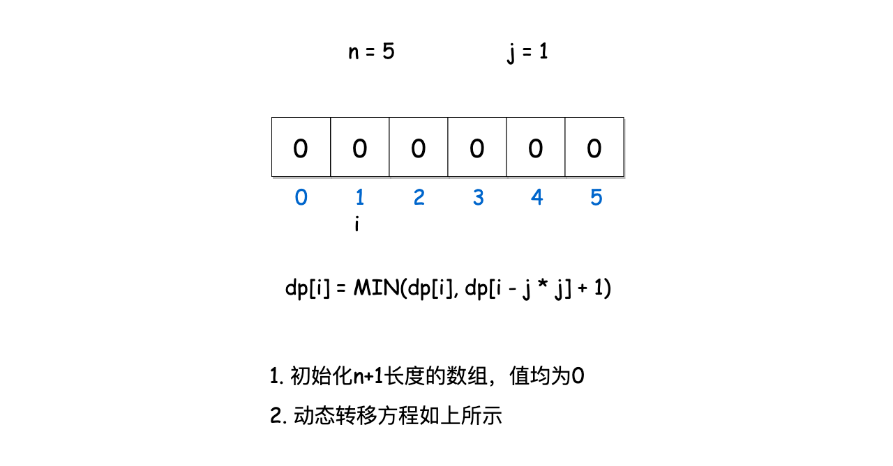,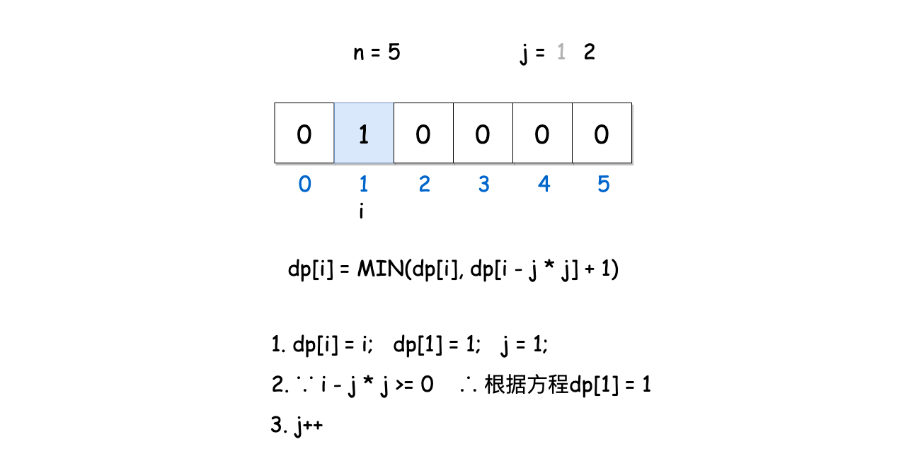,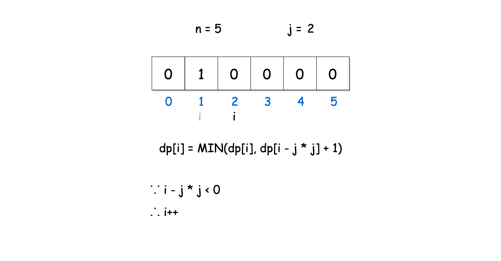,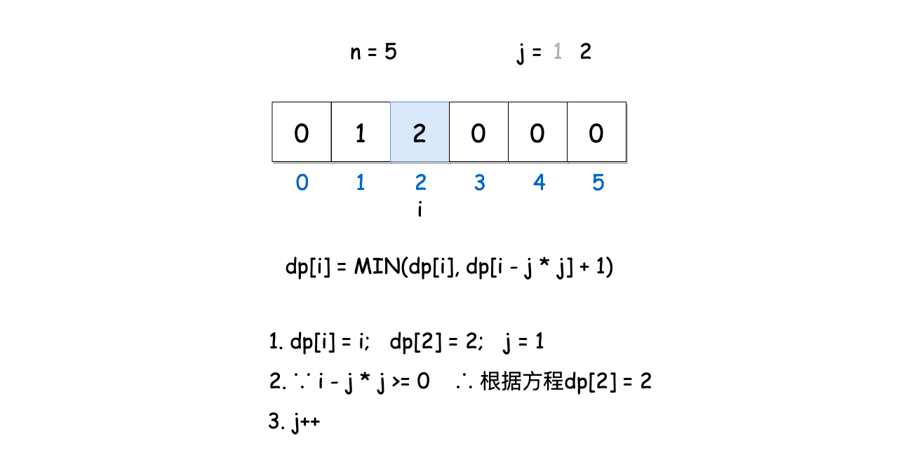,,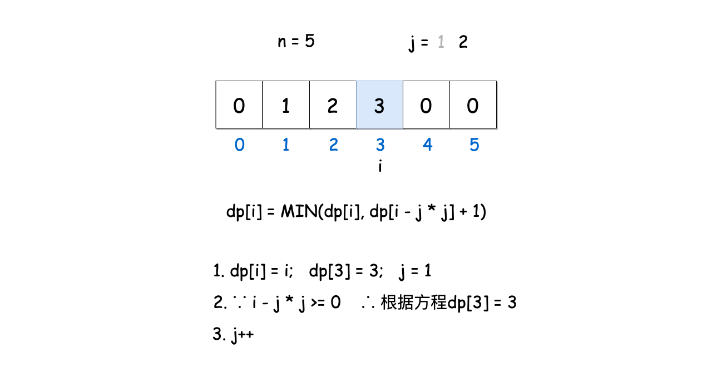,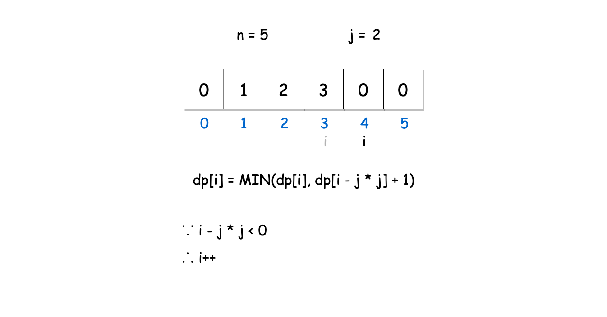,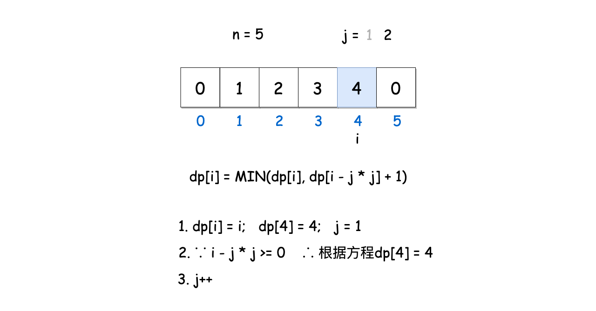,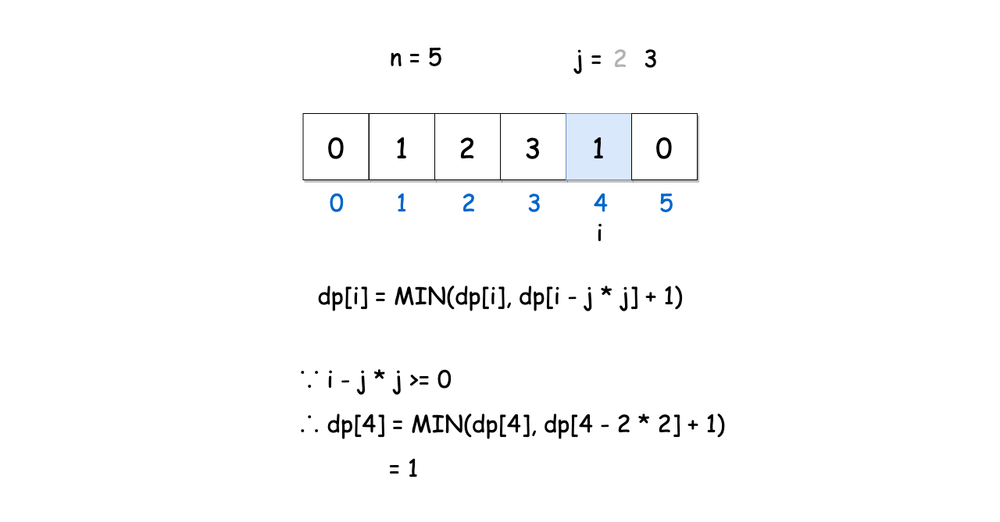,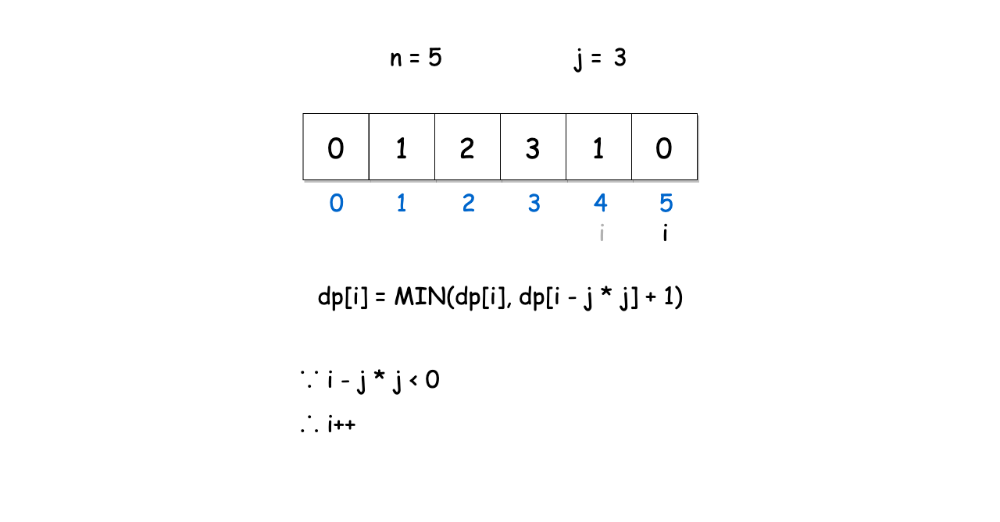,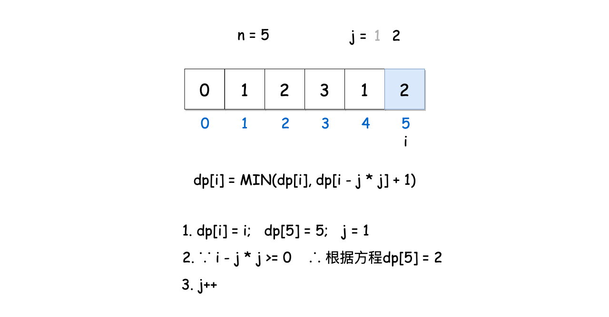,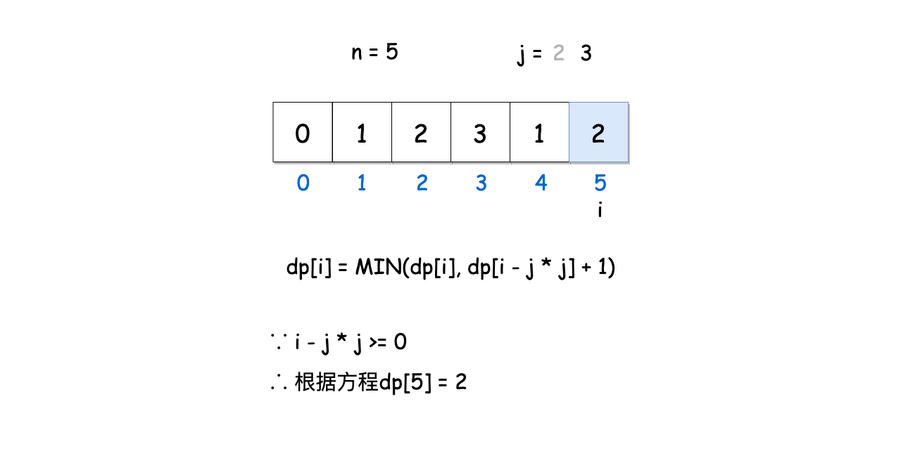,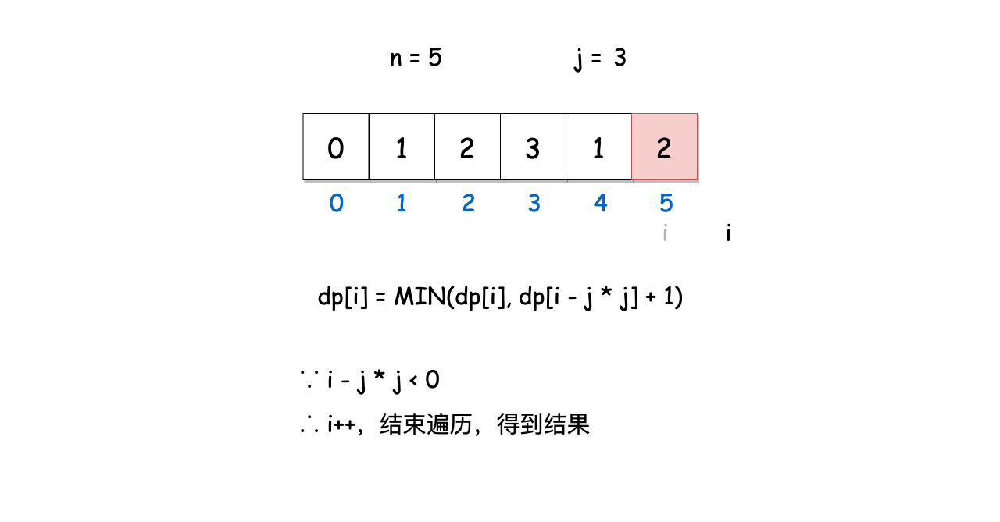>

想看大鹏画解更多高频面试题，欢迎阅读大鹏的 LeetBook：[《画解剑指 Offer 》](https://leetcode-cn.com/leetbook/detail/illustrate-lcof/)，O(∩_∩)O

## 统计信息
| 通过次数 | 提交次数 | AC比率 |
| :------: | :------: | :------: |
|    218369    |    344028    |   63.5%   |

## 提交历史
| 提交时间 | 提交结果 | 执行时间 |  内存消耗  | 语言 |
| :------: | :------: | :------: | :--------: | :--------: |


## 相似题目
|                             题目                             | 难度 |
| :----------------------------------------------------------: | :---------: |
| [计数质数](https://leetcode-cn.com/problems/count-primes/) | 中等|
| [丑数 II](https://leetcode-cn.com/problems/ugly-number-ii/) | 中等|
