> 原文链接: https://leetcode-cn.com/problems/longest-increasing-subsequence


## 英文原文
<div><p>Given an integer array <code>nums</code>, return the length of the longest strictly increasing subsequence.</p>

<p>A <strong>subsequence</strong> is a sequence that can be derived from an array by deleting some or no elements without changing the order of the remaining elements. For example, <code>[3,6,2,7]</code> is a subsequence of the array <code>[0,3,1,6,2,2,7]</code>.</p>

<p>&nbsp;</p>
<p><strong>Example 1:</strong></p>

<pre>
<strong>Input:</strong> nums = [10,9,2,5,3,7,101,18]
<strong>Output:</strong> 4
<strong>Explanation:</strong> The longest increasing subsequence is [2,3,7,101], therefore the length is 4.
</pre>

<p><strong>Example 2:</strong></p>

<pre>
<strong>Input:</strong> nums = [0,1,0,3,2,3]
<strong>Output:</strong> 4
</pre>

<p><strong>Example 3:</strong></p>

<pre>
<strong>Input:</strong> nums = [7,7,7,7,7,7,7]
<strong>Output:</strong> 1
</pre>

<p>&nbsp;</p>
<p><strong>Constraints:</strong></p>

<ul>
	<li><code>1 &lt;= nums.length &lt;= 2500</code></li>
	<li><code>-10<sup>4</sup> &lt;= nums[i] &lt;= 10<sup>4</sup></code></li>
</ul>

<p>&nbsp;</p>
<p><b>Follow up:</b>&nbsp;Can you come up with an algorithm that runs in&nbsp;<code>O(n log(n))</code> time complexity?</p>
</div>

## 中文题目
<div><p>给你一个整数数组 <code>nums</code> ，找到其中最长严格递增子序列的长度。</p>

<p>子序列是由数组派生而来的序列，删除（或不删除）数组中的元素而不改变其余元素的顺序。例如，<code>[3,6,2,7]</code> 是数组 <code>[0,3,1,6,2,2,7]</code> 的子序列。</p>
 

<p><strong>示例 1：</strong></p>

<pre>
<strong>输入：</strong>nums = [10,9,2,5,3,7,101,18]
<strong>输出：</strong>4
<strong>解释：</strong>最长递增子序列是 [2,3,7,101]，因此长度为 4 。
</pre>

<p><strong>示例 2：</strong></p>

<pre>
<strong>输入：</strong>nums = [0,1,0,3,2,3]
<strong>输出：</strong>4
</pre>

<p><strong>示例 3：</strong></p>

<pre>
<strong>输入：</strong>nums = [7,7,7,7,7,7,7]
<strong>输出：</strong>1
</pre>

<p> </p>

<p><strong>提示：</strong></p>

<ul>
	<li><code>1 <= nums.length <= 2500</code></li>
	<li><code>-10<sup>4</sup> <= nums[i] <= 10<sup>4</sup></code></li>
</ul>

<p> </p>

<p><b>进阶：</b></p>

<ul>
	<li>你可以设计时间复杂度为 <code>O(n<sup>2</sup>)</code> 的解决方案吗？</li>
	<li>你能将算法的时间复杂度降低到 <code>O(n log(n))</code> 吗?</li>
</ul>
</div>

## 通过代码
<RecoDemo>
</RecoDemo>


## 高赞题解


**概述**：

这道题是很经典「动态规划」算法问题。

+ 需要对「子序列」和「子串」这两个概念进行区分；
  + 子序列（subsequence）：子序列并不要求连续，例如：序列 `[4, 6, 5]` 是 `[1, 2, 4, 3, 7, 6, 5]` 的一个子序列；
  + 子串（substring、subarray）：子串一定是原始字符串的连续子串。
+ 题目中的「上升」的意思是「严格上升」。反例： `[1, 2, 2, 3]` 不能算作「上升子序列」；
+ 子序列中元素的 **相对顺序** 很重要，子序列中的元素 **必须保持在原始数组中的相对顺序**。如果把这个限制去掉，将原始数组去重以后，元素的个数即为所求；
+ $O(N \log N)$ 的解法根据了「最长上升子序列」问题的特点，**设计了合适的状态**，使得复杂度从 $O(N^2)$ 降到了 $O(N \log N)$。

---


### 方法一：暴力解法

使用「回溯搜索算法」或者「位运算」的技巧，可以得到输入数组的所有子序列，时间复杂度为 $O(2^N)$。再对这些子串再依次判定是否为「严格上升」，时间复杂度 为$O(N)$，所以总的时间复杂度为：$O(N \cdot 2^N)$。

> 如果题目只问最优解，而没有问具体解，可以考虑使用动态规划，而不应该使用回溯算法（暴力搜索）搜索所有具体解。

---

## 方法二：动态规划

首先考虑题目问什么，就把什么定义成状态。题目问最长上升子序列的长度，其实可以把「子序列的长度」定义成状态，但是发现「状态转移」不好做。

基于「动态规划」的状态设计需要满足「无后效性」的设计思想，可以将状态定义为「以 `nums[i]` 结尾 的「上升子序列」的长度」。

> 「无后效性」的设计思想：让不确定的因素确定下来，以保证求解的过程形成一个逻辑上的有向无环图。这题不确定的因素是某个元素是否被选中，而我们设计状态的时候，让 `nums[i]` 必需被选中，这一点是「让不确定的因素确定下来」，也是我们这样设计状态的原因。


**1. 定义状态**：

`dp[i]` 表示：**以 `nums[i]` 结尾** 的「上升子序列」的长度。注意：这个定义中 **`nums[i]` 必须被选取，且必须是这个子序列的最后一个元素**；

**2. 状态转移方程**：

如果一个较大的数接在较小的数后面，就会形成一个更长的子序列。只要 `nums[i]` 严格大于在它位置之前的某个数，那么 `nums[i]` 就可以接在这个数后面形成一个更长的上升子序列。

$$
dp[i] = \max_{0 \le j < i, nums[j] < nums[i]} {dp[j] + 1}
$$

**3. 初始化**：

`dp[i] = 1`，$1$ 个字符显然是长度为 $1$ 的上升子序列。


**4. 输出**：
不能返回最后一个状态值，最后一个状态值只表示以 `nums[len - 1]` 结尾的「上升子序列」的长度，状态数组 `dp` 的最大值才是题目要求的结果。

$$
\max_{1 \le i \le N} dp[i]
$$

**5. 空间优化**：

遍历到一个新数的时候，之前所有的状态值都得保留，因此无法优化空间。

---

可以看下面的例子理解「动态规划」的执行流程。由于幻灯片上的文字比较多，可以先让幻灯片动起来，从整体把握思想。

<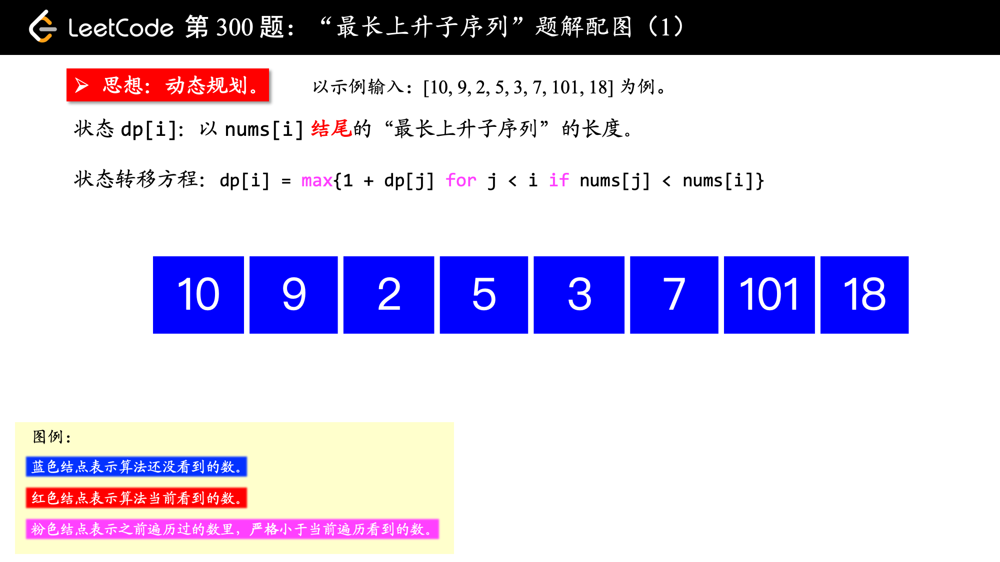,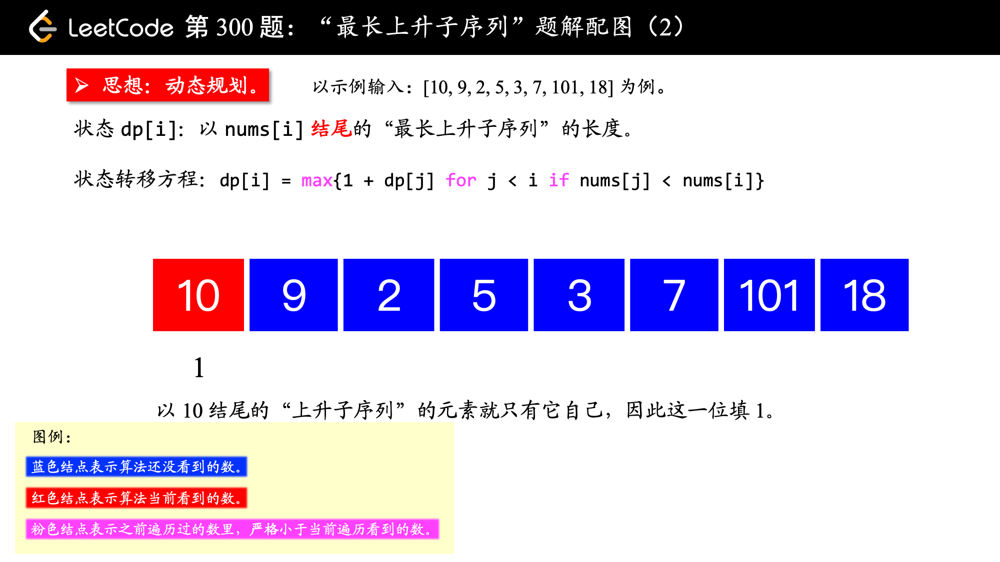,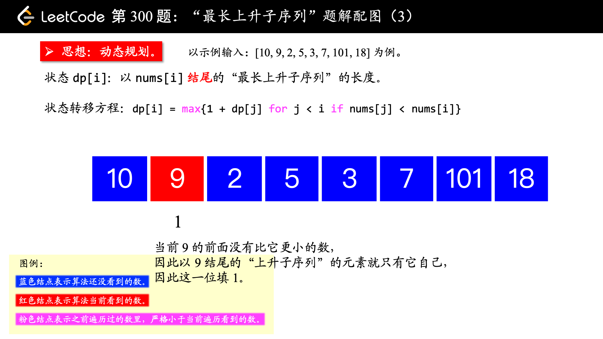,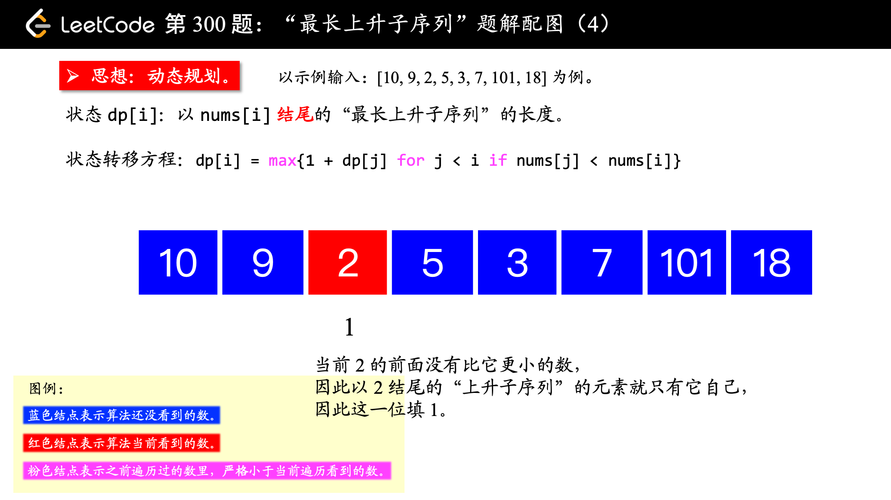,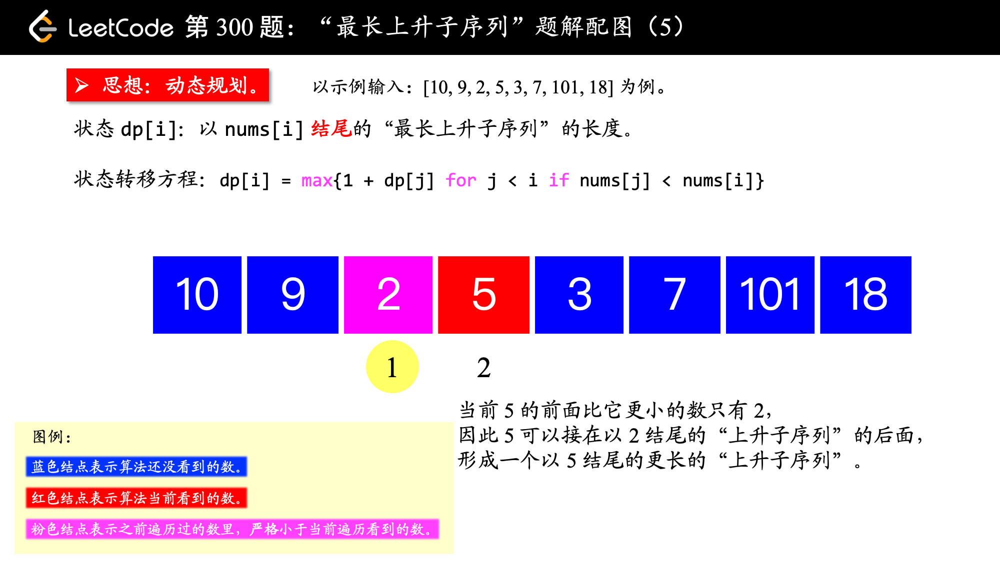,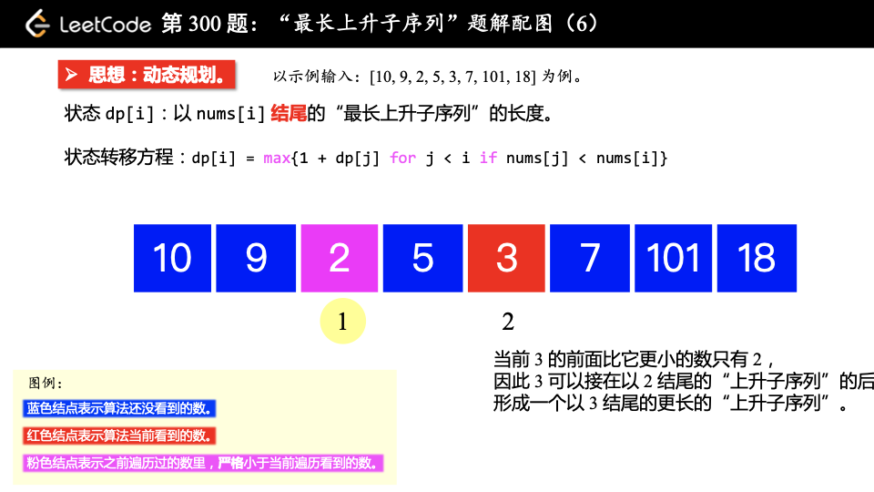,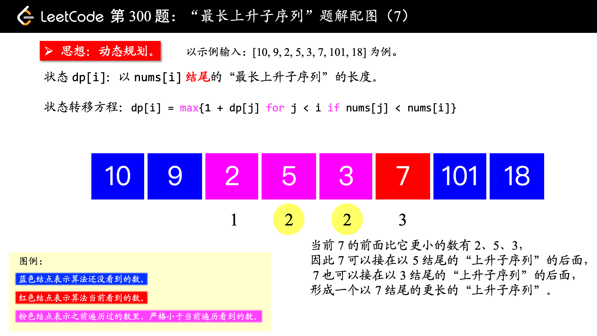,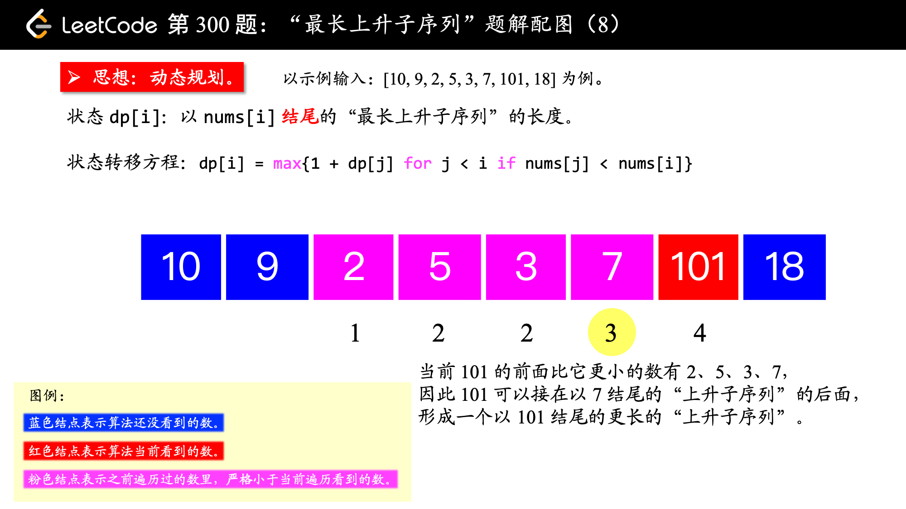,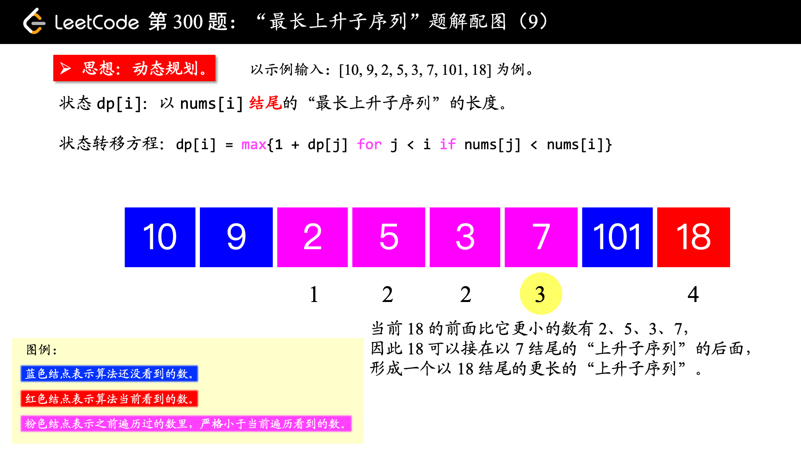,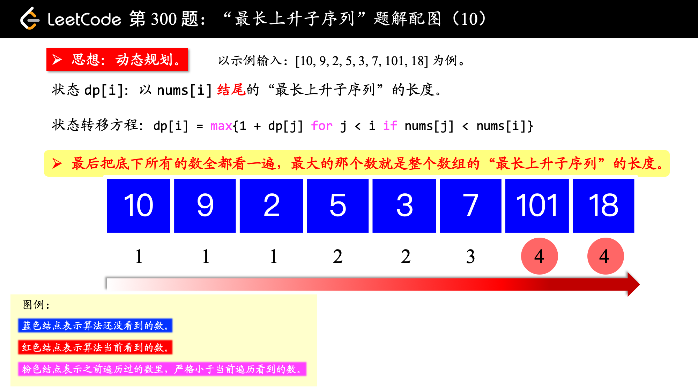>


**参考代码 1**：

```Java []
import java.util.Arrays;

public class Solution {

    public int lengthOfLIS(int[] nums) {
        int len = nums.length;
        if (len < 2) {
            return len;
        }

        int[] dp = new int[len];
        Arrays.fill(dp, 1);

        for (int i = 1; i < len; i++) {
            for (int j = 0; j < i; j++) {
                if (nums[j] < nums[i]) {
                    dp[i] = Math.max(dp[i], dp[j] + 1);
                }
            }
        }

        int res = 0;
        for (int i = 0; i < len; i++) {
            res = Math.max(res, dp[i]);
        }
        return res;
    }
}
```

**复杂度分析：**

+ 时间复杂度：$O(N^2)$，这里 $N$ 是数组的长度，我们写了两个 `for` 循环，每个 `for` 循环的时间复杂度都是线性的；
+ 空间复杂度：$O(N)$，要使用和输入数组长度相等的状态数组，因此空间复杂度是 $O(N)$。

「动态规划」的方法在计算一个新的状态的时候，需要考虑到之前所有小于 `nums[i]` 的那些位置的状态。事实上还有改进的空间：首先修改「状态」的定义。

---

## 方法三：修改状态定义（同时用到了贪心算法、二分查找）

**状态设计思想**：依然着眼于某个上升子序列的 **结尾的元素**，如果 **已经得到的上升子序列的结尾的数越小，那么遍历的时候后面接上一个数，会有更大的可能构成一个长度更长的上升子序列**。既然结尾越小越好，我们可以记录 **在长度固定的情况下，结尾最小的那个元素的数值**，这样定义以后容易得到「状态转移方程」。

为了与「方法二」的状态定义区分，将状态数组命名为 `tail`。


**1 .定义新状态（特别重要）**

`tail[i]` 表示：长度为 `i + 1` 的 **所有** 上升子序列的结尾的最小值。

**说明**：

+ **数组 `tail` 不是问题中的「最长上升子序列」**（下文还会强调），不能命名为 `LIS`。数组 `tail` 只是用于求解 `LIS` 问题的状态数组；
+ `tail[0]` 表示长度为 $1$ 的所有上升子序列中，结尾最小的元素的数值。以题目中的示例为例 `[10, 9, 2, 5, 3, 7, 101, 18]` 中，容易发现长度为 `2` 的**所有**上升子序列中，结尾最小的是子序列 `[2, 3]` ，因此 `tail[1] = 3`；
+ 下标和长度有数值为 `1` 的偏差；

状态定义其实也描述了状态转移方程。

**2. 状态转移方程**：


从直觉上看，数组 `tail` 也是一个严格上升数组。下面是证明。

---

**证明**：即对于任意的下标 `0 <= i < j < len` ，都有 `tail[i] < tail[j]`。

使用反证法：假设对于任意的下标 `i` < `j` ，存在某个 `tail[i] >= tail[j]`。

对于此处的 `tail[i]` 而言，对应一个上升子序列 $[a_0, a_1, ..., a_i]$，依据定义 $tail[i] = a_i$；
对于此处的 `tail[j]` 而言，对应一个上升子序列 $[b_0, b_1, ..., b_i, ... , b_j]$，依据定义 $tail[j] = b_j$；

由于  `tail[i] >= tail[j]`，等价于 $a_i \ge b_j$。而在上升子序列 $[b_0, b_1, ..., b_i, ... , b_j]$ 中，$b_i$ 严格小于 $b_j$，故有 $a_i \ge b_j > b_i$，则上升子序列 $[b_0, b_1, ..., b_i]$ 是一个长度也为 `i + 1` 但是结尾更小的数组，与 $a_i$ 的最小性矛盾。

因此原命题成立。（证完）

---

因为只需要维护状态数组 `tail` 的定义，它的长度就是最长上升子序列的长度。下面说明在遍历中，如何维护状态数组 `tail` 的定义。

1. 在遍历数组 `nums` 的过程中，看到一个新数 `num`，如果这个数 **严格** 大于有序数组 `tail` 的最后一个元素，就把 `num` 放在有序数组 `tail` 的后面，否则进入第 2 点；

> 注意：这里的大于是「严格大于」，不包括等于的情况。

2. 在有序数组 `tail` 中查找第 1 个等于大于 `num` 的那个数，试图让它变小；
  + 如果有序数组 `tail` 中存在 **等于** `num` 的元素，什么都不做，因为以 `num` 结尾的最短的「上升子序列」已经存在；
  + 如果有序数组 `tail` 中存在 **大于** `num` 的元素，找到第 1 个，让它变小，这样我们就找到了一个 **结尾更小**的**相同长度**的上升子序列。

**说明**：
+ 我们再看一下数组 `tail[i]` 的定义：长度为 `i + 1` 的 **所有** 最长上升子序列的结尾的最小值。因此，在遍历的过程中，我们试图让一个大的值变小是合理的；
+ 这一步可以认为是「贪心算法」，总是做出在当前看来最好的选择，当前「最好的选择」是：当前只让让第 $1$ 个严格大于 `nums[i]` 的数变小，变成 `nums[i]`，这一步操作是「无后效性」的；
+ 由于是在有序数组中的操作，因此可以使用「二分查找算法」。

**3. 初始化**：

遍历第 1 个数 `nums[0]`，直接放在有序数组 `tail` 的开头 `tail[0] = nums[0]`。
       
**4. 输出**：

有序数组 `tail` 的长度，就是所求的「最长上升子序列」的长度。

**5. 空间优化**：

无法优化空间。

下图演示了算法在示例上的的执行流程，在示例的数组后面加上了 `4`、`8`、`6`、`12`。依然是先让幻灯片动起来，看思想就好了。

<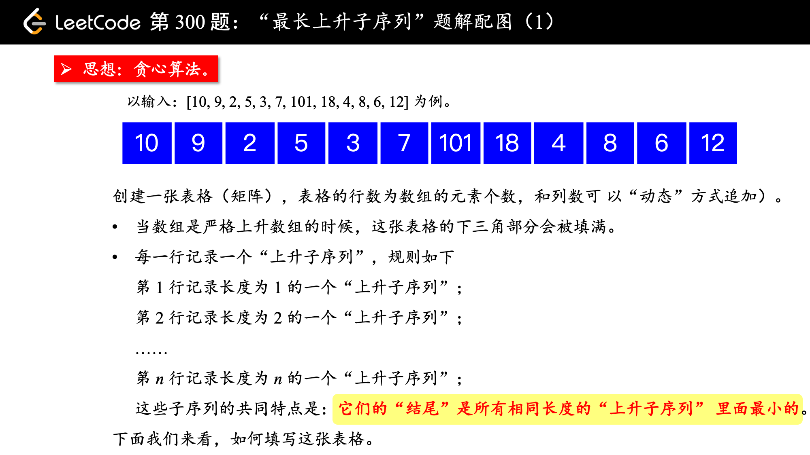,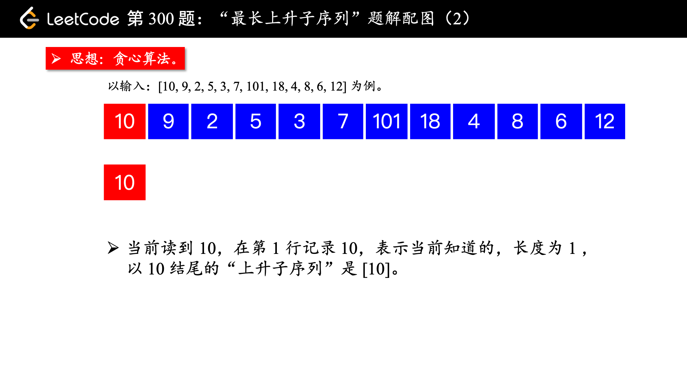,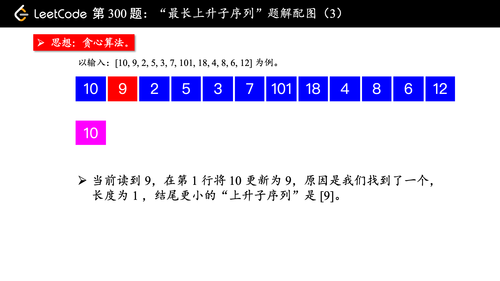,,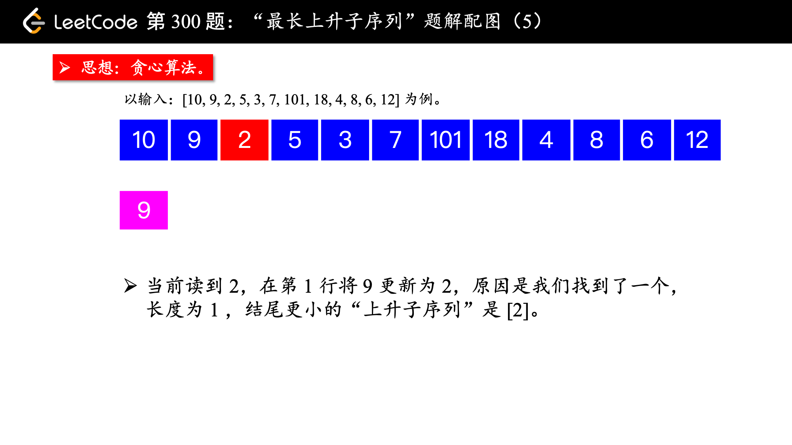,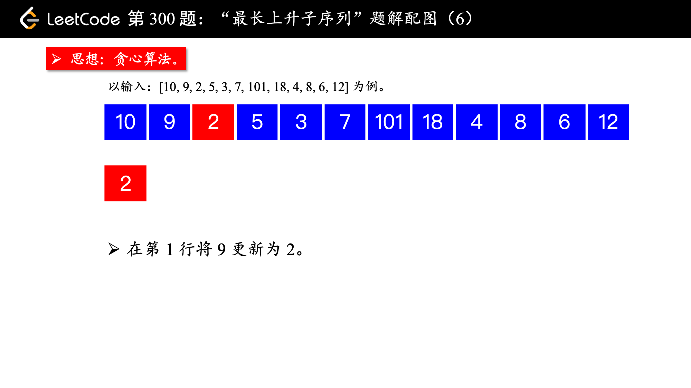,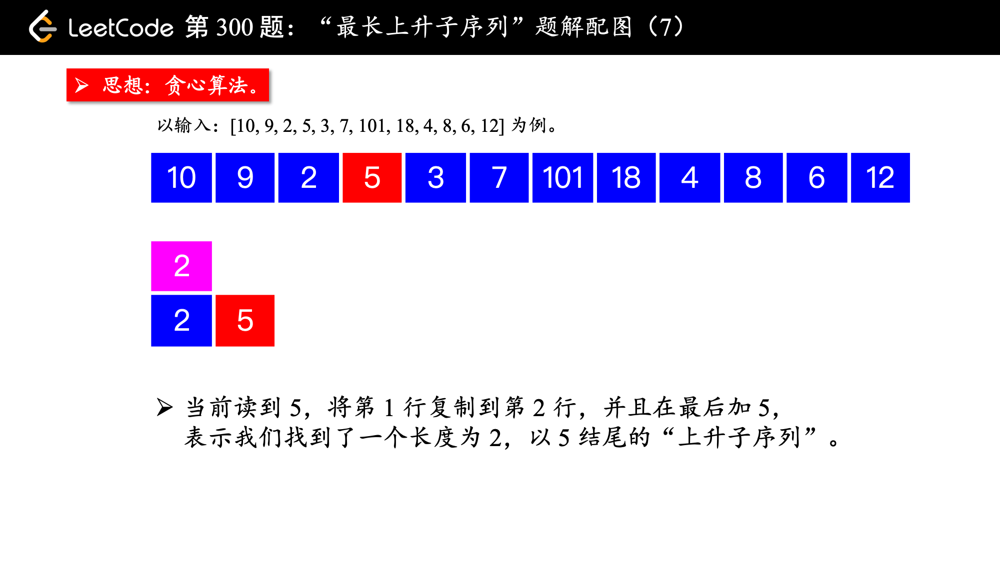,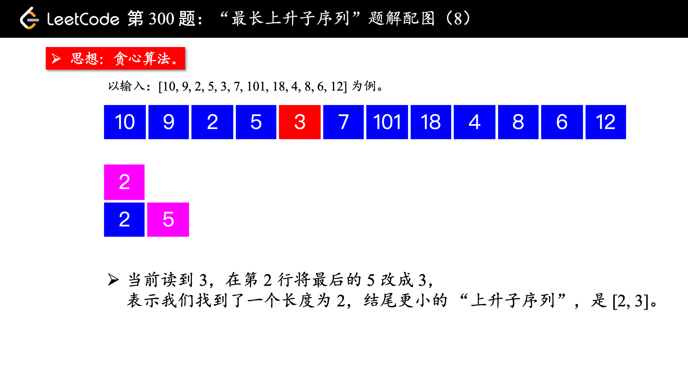,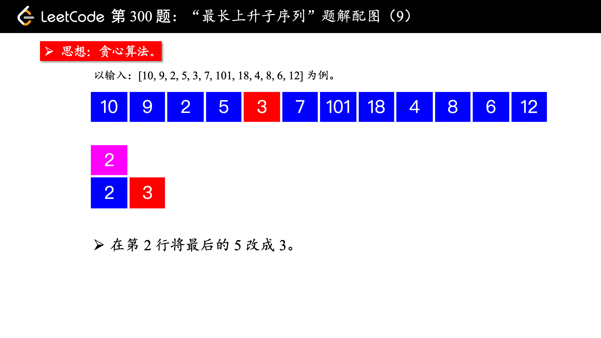,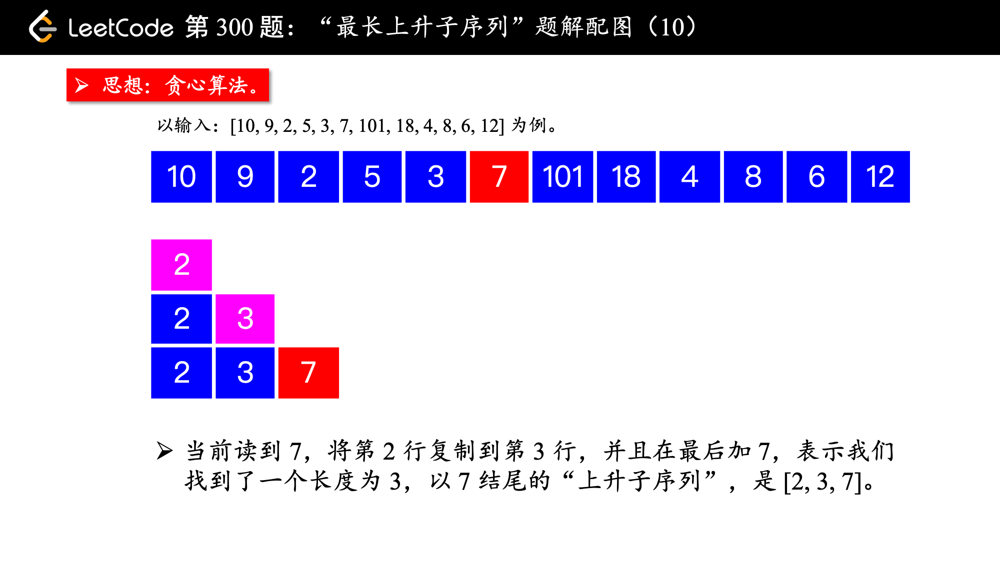,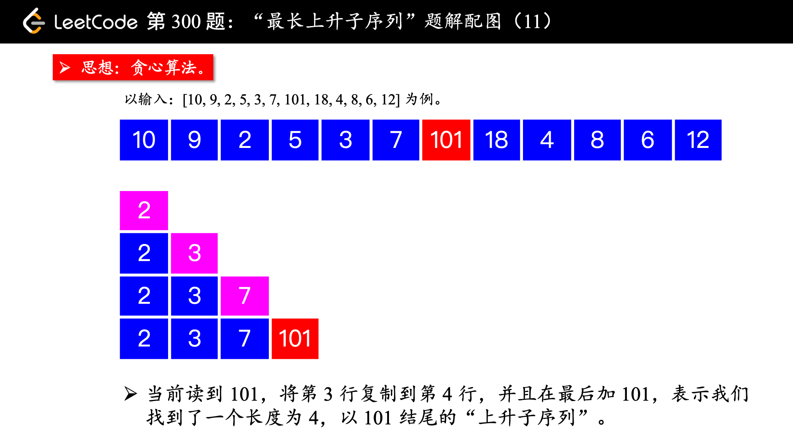,,,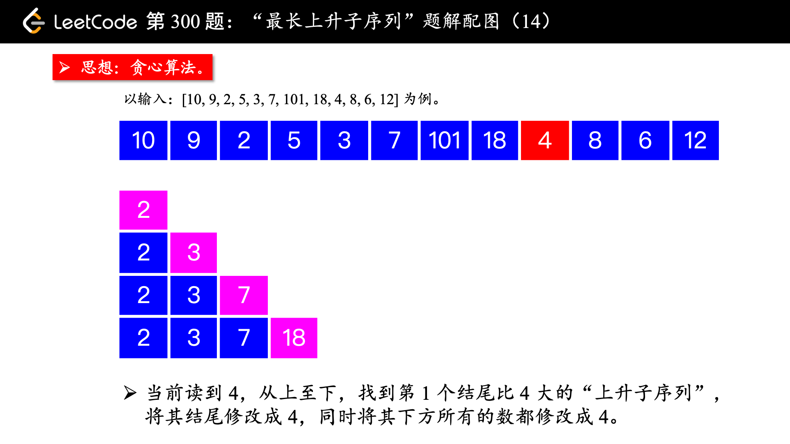,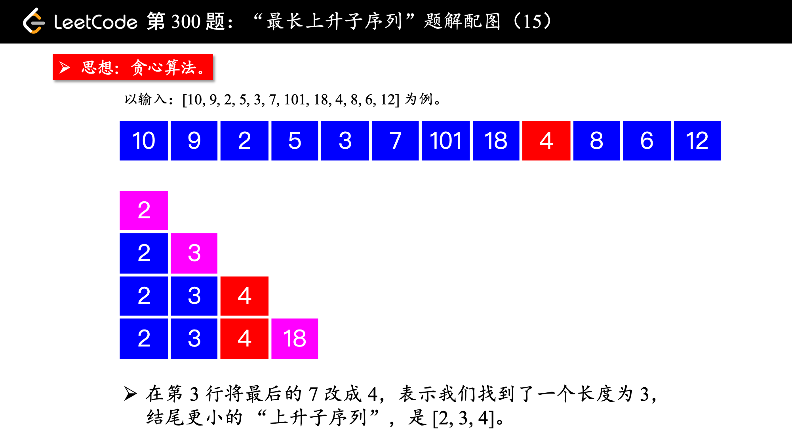,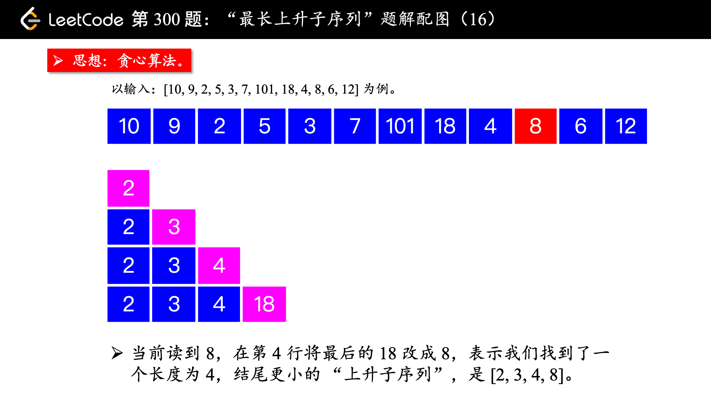,,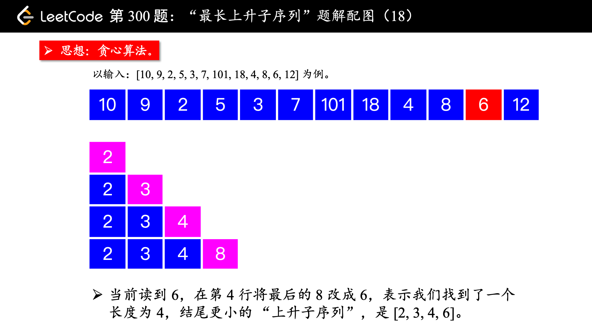,,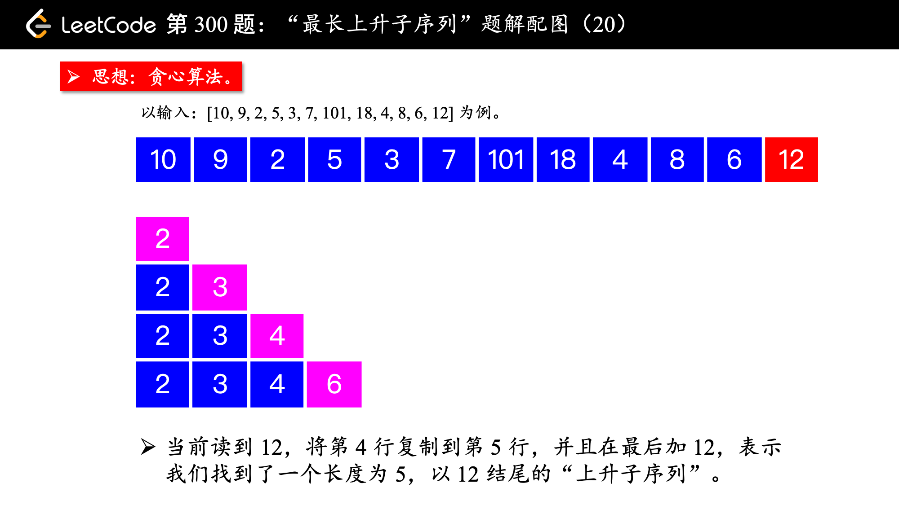,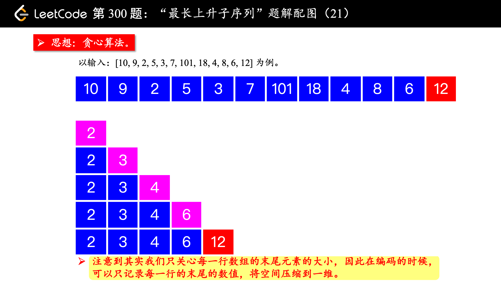>

说明：关于如何使用二分查找法，请参考「力扣」第 35 题：「插入元素的位置」的 [题解](https://leetcode-cn.com/problems/search-insert-position/solution/te-bie-hao-yong-de-er-fen-cha-fa-fa-mo-ban-python-/) 。


**参考代码 3**：严格按照以上算法执行流程写出来的代码

```Java []
public class Solution {
    public int lengthOfLIS(int[] nums) {
        int len = nums.length;
        if (len <= 1) {
            return len;
        }

        // tail 数组的定义：长度为 i + 1 的上升子序列的末尾最小是几
        int[] tail = new int[len];
        // 遍历第 1 个数，直接放在有序数组 tail 的开头
        tail[0] = nums[0];
        // end 表示有序数组 tail 的最后一个已经赋值元素的索引
        int end = 0;

        for (int i = 1; i < len; i++) {
            // 【逻辑 1】比 tail 数组实际有效的末尾的那个元素还大
            if (nums[i] > tail[end]) {
                // 直接添加在那个元素的后面，所以 end 先加 1
                end++;
                tail[end] = nums[i];
            } else {
                // 使用二分查找法，在有序数组 tail 中
                // 找到第 1 个大于等于 nums[i] 的元素，尝试让那个元素更小
                int left = 0;
                int right = end;
                while (left < right) {
                    // 选左中位数不是偶然，而是有原因的，原因请见 LeetCode 第 35 题题解
                    // int mid = left + (right - left) / 2;
                    int mid = left + ((right - left) >>> 1);
                    if (tail[mid] < nums[i]) {
                        // 中位数肯定不是要找的数，把它写在分支的前面
                        left = mid + 1;
                    } else {
                        right = mid;
                    }
                }
                // 走到这里是因为 【逻辑 1】 的反面，因此一定能找到第 1 个大于等于 nums[i] 的元素
                // 因此，无需再单独判断
                tail[left] = nums[i];
            }
            // 调试方法
            // printArray(nums[i], tail);
        }
        // 此时 end 是有序数组 tail 最后一个元素的索引
        // 题目要求返回的是长度，因此 +1 后返回
        end++;
        return end;
    }

    // 调试方法，以观察是否运行正确
    private void printArray(int num, int[] tail) {
        System.out.print("当前数字：" + num);
        System.out.print("\t当前 tail 数组：");
        int len = tail.length;
        for (int i = 0; i < len; i++) {
            if (tail[i] == 0) {
                break;
            }
            System.out.print(tail[i] + ", ");
        }
        System.out.println();
    }

    public static void main(String[] args) {
        int[] nums = new int[]{3, 5, 6, 2, 5, 4, 19, 5, 6, 7, 12};
        Solution solution = new Solution8();
        int lengthOfLIS = solution8.lengthOfLIS(nums);
        System.out.println("最长上升子序列的长度：" + lengthOfLIS);
    }
}
```
```Python []
from typing import List


class Solution:
    def lengthOfLIS(self, nums: List[int]) -> int:
        size = len(nums)
        # 特判
        if size < 2:
            return size

        # 为了防止后序逻辑发生数组索引越界，先把第 1 个数放进去
        tail = [nums[0]]
        for i in range(1, size):
            # 【逻辑 1】比 tail 数组实际有效的末尾的那个元素还大
            # 先尝试是否可以接在末尾
            if nums[i] > tail[-1]:
                tail.append(nums[i])
                continue

            # 使用二分查找法，在有序数组 tail 中
            # 找到第 1 个大于等于 nums[i] 的元素，尝试让那个元素更小
            left = 0
            right = len(tail) - 1
            while left < right:
                # 选左中位数不是偶然，而是有原因的，原因请见 LeetCode 第 35 题题解
                # mid = left + (right - left) // 2
                mid = (left + right) >> 1
                if tail[mid] < nums[i]:
                    # 中位数肯定不是要找的数，把它写在分支的前面
                    left = mid + 1
                else:
                    right = mid
            # 走到这里是因为【逻辑 1】的反面，因此一定能找到第 1 个大于等于 nums[i] 的元素，因此无需再单独判断
            tail[left] = nums[i]
        return len(tail)
```
```C++ []
#include <iostream>
#include <vector>

using namespace std;

class Solution {
public:
    int lengthOfLIS(vector<int> &nums) {
        int len = nums.size();
        if (len < 2) {
            return len;
        }

        vector<int> tail;
        tail.push_back(nums[0]);
        // tail 结尾的那个索引
        int end = 0;

        for (int i = 1; i < len; ++i) {
            if (nums[i] > tail[end]) {
                tail.push_back(nums[i]);
                end++;
            } else {
                int left = 0;
                int right = end;
                while (left < right) {
                    int mid = (left + right) >> 1;
                    if (tail[mid] < nums[i]) {
                        left = mid + 1;
                    } else {
                        right = mid;
                    }
                }
                tail[left] = nums[i];
            }
        }
        return end + 1;
    }
};
```


**复杂度分析**：

+ 时间复杂度：$O(N \log N)$，遍历数组使用了 $O(N)$，二分查找法使用了 $O(\log N)$。
+ 空间复杂度：$O(N)$，开辟有序数组 `tail` 的空间至多和原始数组一样。

**参考代码 4**：与「参考代码 3」等价的代码，区别仅在于「二分查找法」候选区间的选择

```Java []
public class Solution {

    public int lengthOfLIS(int[] nums) {
        int len = nums.length;
        if (len <= 1) {
            return len;
        }

        // tail 数组的定义：长度为 i + 1 的上升子序列的末尾最小是几
        int[] tail = new int[len];
        // 遍历第 1 个数，直接放在有序数组 tail 的开头
        tail[0] = nums[0];

        // end 表示有序数组 tail 的最后一个已经赋值元素的索引
        int end = 0;

        for (int i = 1; i < len; i++) {
            int left = 0;
            // 这里，因为当前遍历的数，有可能比有序数组 tail 数组实际有效的末尾的那个元素还大
            // 【逻辑 1】因此 end + 1 应该落在候选区间里
            int right = end + 1;
            while (left < right) {
                // 选左中位数不是偶然，而是有原因的，原因请见 LeetCode 第 35 题题解
                // int mid = left + (right - left) / 2;
                int mid = (left + right) >>> 1;

                if (tail[mid] < nums[i]) {
                    // 中位数肯定不是要找的数，把它写在分支的前面
                    left = mid + 1;
                } else {
                    right = mid;
                }
            }
            // 因为 【逻辑 1】，因此一定能找到第 1 个大于等于 nums[i] 的元素
            // 因此，无需再单独判断，直接更新即可
            tail[left] = nums[i];

            // 但是 end 的值，需要更新，当前仅当更新位置在当前 end 的下一位
            if (left == end + 1) {
                end++;
            }

        }
        // 调试方法
        // printArray(nums[i], tail);
        // 此时 end 是有序数组 tail 最后一个元素的索引
        // 题目要求返回的是长度，因此 +1 后返回
        end++;
        return end;
    }

    // 调试方法，以观察是否运行正确
    private void printArray(int num, int[] tail) {
        System.out.print("当前数字：" + num);
        System.out.print("\t当前 tail 数组：");
        int len = tail.length;
        for (int i = 0; i < len; i++) {
            if (tail[i] == 0) {
                break;
            }
            System.out.print(tail[i] + ", ");
        }
        System.out.println();
    }

    public static void main(String[] args) {
        int[] nums = new int[]{3, 5, 6, 2, 5, 4, 19, 5, 6, 7, 12};
        Solution solution = new Solution();
        int lengthOfLIS = solution.lengthOfLIS(nums);
        System.out.println("最长上升子序列的长度：" + lengthOfLIS);
    }
}
```
```Python []
from typing import List


class Solution:

    def lengthOfLIS(self, nums: List[int]) -> int:
        size = len(nums)
        # 特判
        if size < 2:
            return size
        # tail 数组的定义：长度为 i + 1 的上升子序列的末尾最小是几
        # 遍历第 1 个数，直接放在有序数组 tail 的开头
        tail = [nums[0]]

        for i in range(1, size):
            # 找到大于等于 num 的第 1 个数，试图让它变小
            left = 0
            # 因为有可能 num 比 tail 数组中的最后一个元素还要大，
            # 【逻辑 1】所以右边界应该设置为 tail 数组的长度
            right = len(tail)
            while left < right:
                # 选左中位数不是偶然，而是有原因的，原因请见 LeetCode 第 35 题题解
                # mid = left + (right - left) // 2
                mid = (left + right) >> 1

                if tail[mid] < nums[i]:
                    # 中位数肯定不是要找的数，把它写在分支的前面
                    left = mid + 1
                else:
                    right = mid
            if left == len(tail):
                tail.append(nums[i])
            else:
                # 因为【逻辑 1】，因此一定能找到第 1 个大于等于 nums[i] 的元素，因此无需再单独判断，直接更新即可
                tail[left] = nums[i]
        return len(tail)
```
```C++ []
#include <iostream>
#include <vector>

using namespace std;

class Solution {
public:
    int lengthOfLIS(vector<int> &nums) {
        int len = nums.size();
        if (len < 2) {
            return len;
        }

        vector<int> tail(len, 0);
        tail[0] = nums[0];
        // tail 结尾的那个索引
        int end = 0;
        for (int i = 1; i < len; ++i) {
            int left = 0;
            int right = end + 1;
            while (left < right) {
                int mid = (left + right) >> 1;
                if (tail[mid] < nums[i]) {
                    left = mid + 1;
                } else {
                    right = mid;
                }
            }
            tail[left] = nums[i];
            if (left == end + 1) {
                end++;
            }
        }
        return end + 1;
    }
};
```

**复杂度分析**：（同上）


## 参考资料

+ liuyubobobo 老师在慕课网上开设的课程《玩转算法面试》[代码仓库](https://github.com/liuyubobobo/Play-with-Algorithm-Interview/blob/master/09-Dynamic-Programming/Course%20Code%20(Java)/08-Longest-Increasing-Subsequence/src/Solution1.java)
+ $O(N \log N)$ 解法最早是看到一个 YouTube 频道主 Edward 的讲解，具体认识到其实是状态定义的变更来自和加拿大 CS 战友微信群里和群友的讨论。

## 统计信息
| 通过次数 | 提交次数 | AC比率 |
| :------: | :------: | :------: |
|    390618    |    750757    |   52.0%   |

## 提交历史
| 提交时间 | 提交结果 | 执行时间 |  内存消耗  | 语言 |
| :------: | :------: | :------: | :--------: | :--------: |


## 相似题目
|                             题目                             | 难度 |
| :----------------------------------------------------------: | :---------: |
| [递增的三元子序列](https://leetcode-cn.com/problems/increasing-triplet-subsequence/) | 中等|
| [俄罗斯套娃信封问题](https://leetcode-cn.com/problems/russian-doll-envelopes/) | 困难|
| [最长数对链](https://leetcode-cn.com/problems/maximum-length-of-pair-chain/) | 中等|
| [最长递增子序列的个数](https://leetcode-cn.com/problems/number-of-longest-increasing-subsequence/) | 中等|
| [两个字符串的最小ASCII删除和](https://leetcode-cn.com/problems/minimum-ascii-delete-sum-for-two-strings/) | 中等|
