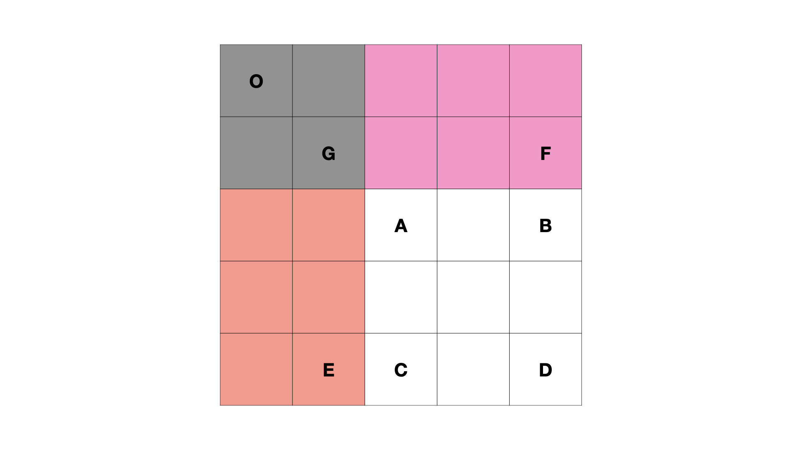

> 原文链接: https://leetcode-cn.com/problems/range-sum-query-2d-immutable


## 英文原文
<div><p>Given a 2D matrix <code>matrix</code>, handle multiple queries of the following type:</p>

<ul>
	<li>Calculate the <strong>sum</strong> of the elements of <code>matrix</code> inside the rectangle defined by its <strong>upper left corner</strong> <code>(row1, col1)</code> and <strong>lower right corner</strong> <code>(row2, col2)</code>.</li>
</ul>

<p>Implement the NumMatrix class:</p>

<ul>
	<li><code>NumMatrix(int[][] matrix)</code> Initializes the object with the integer matrix <code>matrix</code>.</li>
	<li><code>int sumRegion(int row1, int col1, int row2, int col2)</code> Returns the <strong>sum</strong> of the elements of <code>matrix</code> inside the rectangle defined by its <strong>upper left corner</strong> <code>(row1, col1)</code> and <strong>lower right corner</strong> <code>(row2, col2)</code>.</li>
</ul>

<p>&nbsp;</p>
<p><strong>Example 1:</strong></p>

<pre>
<strong>Input</strong>
[&quot;NumMatrix&quot;, &quot;sumRegion&quot;, &quot;sumRegion&quot;, &quot;sumRegion&quot;]
[[[[3, 0, 1, 4, 2], [5, 6, 3, 2, 1], [1, 2, 0, 1, 5], [4, 1, 0, 1, 7], [1, 0, 3, 0, 5]]], [2, 1, 4, 3], [1, 1, 2, 2], [1, 2, 2, 4]]
<strong>Output</strong>
[null, 8, 11, 12]

<strong>Explanation</strong>
NumMatrix numMatrix = new NumMatrix([[3, 0, 1, 4, 2], [5, 6, 3, 2, 1], [1, 2, 0, 1, 5], [4, 1, 0, 1, 7], [1, 0, 3, 0, 5]]);
numMatrix.sumRegion(2, 1, 4, 3); // return 8 (i.e sum of the red rectangle)
numMatrix.sumRegion(1, 1, 2, 2); // return 11 (i.e sum of the green rectangle)
numMatrix.sumRegion(1, 2, 2, 4); // return 12 (i.e sum of the blue rectangle)
</pre>

<p>&nbsp;</p>
<p><strong>Constraints:</strong></p>

<ul>
	<li><code>m == matrix.length</code></li>
	<li><code>n == matrix[i].length</code></li>
	<li><code>1 &lt;= m, n &lt;= 200</code></li>
	<li><code>-10<sup>5</sup> &lt;= matrix[i][j] &lt;= 10<sup>5</sup></code></li>
	<li><code>0 &lt;= row1 &lt;= row2 &lt; m</code></li>
	<li><code>0 &lt;= col1 &lt;= col2 &lt; n</code></li>
	<li>At most <code>10<sup>4</sup></code> calls will be made to <code>sumRegion</code>.</li>
</ul>
</div>

## 中文题目
<div><p><big><small>给定一个二维矩阵 <code>matrix</code>，</small></big>以下类型的多个请求：</p>

<ul>
	<li><big><small>计算其子矩形范围内元素的总和，该子矩阵的 <strong>左上角</strong> 为 <code>(row1,&nbsp;col1)</code> ，<strong>右下角</strong> 为 <code>(row2,&nbsp;col2)</code> 。</small></big></li>
</ul>

<p>实现 <code>NumMatrix</code> 类：</p>

<ul>
	<li><code>NumMatrix(int[][] matrix)</code>&nbsp;给定整数矩阵 <code>matrix</code> 进行初始化</li>
	<li><code>int sumRegion(int row1, int col1, int row2, int col2)</code>&nbsp;返回<big><small> <strong>左上角</strong></small></big><big><small> <code>(row1,&nbsp;col1)</code>&nbsp;、<strong>右下角</strong>&nbsp;<code>(row2,&nbsp;col2)</code></small></big> 所描述的子矩阵的元素 <strong>总和</strong> 。</li>
</ul>

<p>&nbsp;</p>

<p><strong>示例 1：</strong></p>

<p></p>

<pre>
<strong>输入:</strong> 
["NumMatrix","sumRegion","sumRegion","sumRegion"]
[[[[3,0,1,4,2],[5,6,3,2,1],[1,2,0,1,5],[4,1,0,1,7],[1,0,3,0,5]]],[2,1,4,3],[1,1,2,2],[1,2,2,4]]
<strong>输出:</strong> 
[null, 8, 11, 12]

<strong>解释:</strong>
NumMatrix numMatrix = new NumMatrix([[3,0,1,4,2],[5,6,3,2,1],[1,2,0,1,5],[4,1,0,1,7],[1,0,3,0,5]]]);
numMatrix.sumRegion(2, 1, 4, 3); // return 8 (红色矩形框的元素总和)
numMatrix.sumRegion(1, 1, 2, 2); // return 11 (绿色矩形框的元素总和)
numMatrix.sumRegion(1, 2, 2, 4); // return 12 (蓝色矩形框的元素总和)
</pre>

<p>&nbsp;</p>

<p><strong>提示：</strong></p>

<ul>
	<li><code>m == matrix.length</code></li>
	<li><code>n == matrix[i].length</code></li>
	<li><code>1 &lt;= m,&nbsp;n &lt;=&nbsp;200</code><meta charset="UTF-8" /></li>
	<li><code>-10<sup>5</sup>&nbsp;&lt;= matrix[i][j] &lt;= 10<sup>5</sup></code></li>
	<li><code>0 &lt;= row1 &lt;= row2 &lt; m</code></li>
	<li><code>0 &lt;= col1 &lt;= col2 &lt; n</code></li>
	<li><meta charset="UTF-8" />最多调用 <code>10<sup>4</sup></code> 次&nbsp;<code>sumRegion</code> 方法</li>
</ul>
</div>

## 通过代码
<RecoDemo>
</RecoDemo>


## 高赞题解

各位题友大家好！ 今天是 **[@负雪明烛](/u/fuxuemingzhu/)** 坚持日更的第 **37** 天。今天力扣上的每日一题是「[304. 二维区域和检索 - 矩阵不可变](https://leetcode-cn.com/problems/range-sum-query-2d-immutable/)」。

# 解题思路


- **做这种初始化一次、检索多次的题目的秘诀：在初始化的时候做预处理**。

今天的每日一题让求二维数组中某个子矩形区域的和。很容易看出，今天的题目是 [303. 区域和检索 - 数组不可变](https://leetcode-cn.com/problems/range-sum-query-immutable/) 的升级版。


同样地，今天的题目仍然用 preSum（前缀和）求解，包括两个步骤。


## 步骤一：求 preSum

我们先从如何求出二维空间的 preSum[i][j]。


我们定义 $preSum[i][j]$ 表示 从 $[0,0]$ 位置到 $[i,j]$ 位置的子矩形所有元素之和。
可以用下图帮助理解： 

$$S(O, D) = S(O, C) + S(O, B) - S(O, A) + D$$


减去 $S(O, A)$ 的原因是 $S(O, C)$ 和 $S(O, B)$ 中都有 $S(O, A)$，即加了两次 $S(O, A)$，所以需要减去一次 $S(O, A)$。

如果求 $preSum[i][j]$ 表示的话，对应了以下的递推公式：

$$preSum[i][j] = preSum[i - 1][j] + preSum[i][j - 1]  - preSum[i - 1][j - 1] + matrix[i][j]$$


## 步骤二：根据 preSum 求子矩形面积


前面已经求出了数组中从 $[0,0]$ 位置到 $[i,j]$ 位置的 preSum。下面要利用 $preSum[i][j]$ 来快速求出任意子矩形的面积。

同样利用一张图来说明：


$$S(A, D) = S(O, D) - S(O, E) - S(O, F) + S(O, G)$$




加上子矩形 $S(O, G)$ 面积的原因是 $S(O, E)$ 和 $S(O, F)$ 中都有 $S(O, G)$，即减了两次 $S(O, G)$，所以需要加上一次 $S(O, G)$。


如果要求 $[row1, col1]$ 到 $[row2, col2]$ 的子矩形的面积的话，用 preSum 对应了以下的递推公式：


$$preSum[row2][col2] - preSum[row2][col1 - 1] - preSum[row1 - 1][col2] + preSum[row1 - 1][col1 - 1]$$


# 代码


下面代码实现的时候，使用的 preSum 比原矩阵 matrix 多了一行一列，是为了让第 0 行与第 0 列的元素也能使用上面的递推公式。如果 preSum 矩阵大小和 martix 大小相等，则需要对第 0 行与第 0 列特殊判断。


```python
class NumMatrix:

    def __init__(self, matrix: List[List[int]]):
        if not matrix or not matrix[0]:
            M, N = 0, 0
        else:
            M, N = len(matrix), len(matrix[0])
        self.preSum = [[0] * (N + 1) for _ in range(M + 1)]
        for i in range(M):
            for j in range(N):
                self.preSum[i + 1][j + 1] = self.preSum[i][j + 1] + self.preSum[i + 1][j]  - self.preSum[i][j] + matrix[i][j]


    def sumRegion(self, row1: int, col1: int, row2: int, col2: int) -> int:
        return self.preSum[row2 + 1][col2 + 1] - self.preSum[row2 + 1][col1] - self.preSum[row1][col2 + 1] + self.preSum[row1][col1]
```


- 时间复杂度：构造函数的时间复杂度是 $O(M * N)$； `sumRegion` 函数的时间复杂度是 $O(1)$
- 空间复杂度：利用了preSum 矩阵，空间是 $O(M * N)$。


# 刷题心得


一维的 preSum 拓展成二维 preSum 已经学会了，那如果是 N 维的应该怎么处理呢？

-----


OK，以上就是 [@负雪明烛](https://leetcode-cn.com/u/fuxuemingzhu/) 写的今天题解的全部内容了，如果你觉得有帮助的话，**求赞、求关注、求收藏**。如果有疑问的话，请在下面评论，我会及时解答。


**关注我**，你将不会错过我的精彩动画题解、面试题分享、组队刷题活动，进入主页 [@负雪明烛](https://leetcode-cn.com/u/fuxuemingzhu/) 右侧有刷题组织，从此刷题不再孤单。


祝大家牛年大吉！AC 多多，Offer 多多！我们明天再见！

## 统计信息
| 通过次数 | 提交次数 | AC比率 |
| :------: | :------: | :------: |
|    67914    |    122378    |   55.5%   |

## 提交历史
| 提交时间 | 提交结果 | 执行时间 |  内存消耗  | 语言 |
| :------: | :------: | :------: | :--------: | :--------: |


## 相似题目
|                             题目                             | 难度 |
| :----------------------------------------------------------: | :---------: |
| [区域和检索 - 数组不可变](https://leetcode-cn.com/problems/range-sum-query-immutable/) | 简单|
| [二维区域和检索 - 可变](https://leetcode-cn.com/problems/range-sum-query-2d-mutable/) | 困难|
