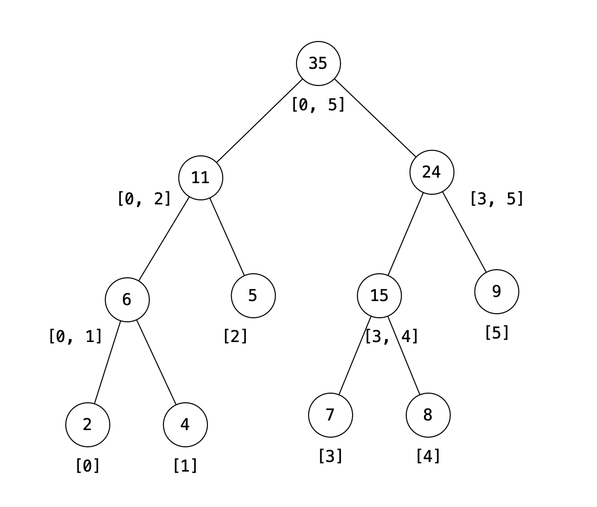

> 原文链接: https://leetcode-cn.com/problems/range-sum-query-mutable


## 英文原文
<div><p>Given an integer array <code>nums</code>, handle multiple queries of the following types:</p>

<ol>
	<li><strong>Update</strong> the value of an element in <code>nums</code>.</li>
	<li>Calculate the <strong>sum</strong> of the elements of <code>nums</code> between indices <code>left</code> and <code>right</code> <strong>inclusive</strong> where <code>left &lt;= right</code>.</li>
</ol>

<p>Implement the <code>NumArray</code> class:</p>

<ul>
	<li><code>NumArray(int[] nums)</code> Initializes the object with the integer array <code>nums</code>.</li>
	<li><code>void update(int index, int val)</code> <strong>Updates</strong> the value of <code>nums[index]</code> to be <code>val</code>.</li>
	<li><code>int sumRange(int left, int right)</code> Returns the <strong>sum</strong> of the elements of <code>nums</code> between indices <code>left</code> and <code>right</code> <strong>inclusive</strong> (i.e. <code>nums[left] + nums[left + 1] + ... + nums[right]</code>).</li>
</ul>

<p>&nbsp;</p>
<p><strong>Example 1:</strong></p>

<pre>
<strong>Input</strong>
[&quot;NumArray&quot;, &quot;sumRange&quot;, &quot;update&quot;, &quot;sumRange&quot;]
[[[1, 3, 5]], [0, 2], [1, 2], [0, 2]]
<strong>Output</strong>
[null, 9, null, 8]

<strong>Explanation</strong>
NumArray numArray = new NumArray([1, 3, 5]);
numArray.sumRange(0, 2); // return 1 + 3 + 5 = 9
numArray.update(1, 2);   // nums = [1, 2, 5]
numArray.sumRange(0, 2); // return 1 + 2 + 5 = 8
</pre>

<p>&nbsp;</p>
<p><strong>Constraints:</strong></p>

<ul>
	<li><code>1 &lt;= nums.length &lt;= 3 * 10<sup>4</sup></code></li>
	<li><code>-100 &lt;= nums[i] &lt;= 100</code></li>
	<li><code>0 &lt;= index &lt; nums.length</code></li>
	<li><code>-100 &lt;= val &lt;= 100</code></li>
	<li><code>0 &lt;= left &lt;= right &lt; nums.length</code></li>
	<li>At most <code>3 * 10<sup>4</sup></code> calls will be made to <code>update</code> and <code>sumRange</code>.</li>
</ul>
</div>

## 中文题目
<div><p>给你一个数组 <code>nums</code> ，请你完成两类查询，其中一类查询要求更新数组下标对应的值，另一类查询要求返回数组中某个范围内元素的总和。</p>

<p>实现 <code>NumArray</code> 类：</p>

<div class="original__bRMd">
<div>
<ul>
	<li><code>NumArray(int[] nums)</code> 用整数数组 <code>nums</code> 初始化对象</li>
	<li><code>void update(int index, int val)</code> 将 <code>nums[index]</code> 的值更新为 <code>val</code></li>
	<li><code>int sumRange(int left, int right)</code> 返回子数组 <code>nums[left, right]</code> 的总和（即，<code>nums[left] + nums[left + 1], ..., nums[right]</code>）</li>
</ul>

<p> </p>

<p><strong>示例：</strong></p>

<pre>
<strong>输入</strong>：
["NumArray", "sumRange", "update", "sumRange"]
[[[1, 3, 5]], [0, 2], [1, 2], [0, 2]]
<strong>输出</strong>：
[null, 9, null, 8]

<strong>解释</strong>：
NumArray numArray = new NumArray([1, 3, 5]);
numArray.sumRange(0, 2); // 返回 9 ，sum([1,3,5]) = 9
numArray.update(1, 2);   // nums = [1,2,5]
numArray.sumRange(0, 2); // 返回 8 ，sum([1,2,5]) = 8
</pre>

<p> </p>

<p><strong>提示：</strong></p>

<ul>
	<li><code>1 <= nums.length <= 3 * 10<sup>4</sup></code></li>
	<li><code>-100 <= nums[i] <= 100</code></li>
	<li><code>0 <= index < nums.length</code></li>
	<li><code>-100 <= val <= 100</code></li>
	<li><code>0 <= left <= right < nums.length</code></li>
	<li>最多调用 <code>3 * 10<sup>4</sup></code> 次 <code>update</code> 和 <code>sumRange</code> 方法</li>
</ul>
</div>
</div>
</div>

## 通过代码
<RecoDemo>
</RecoDemo>


## 官方题解
##  摘要：
本文面向中级读者。它引入了以下概念：区域和检索、sqrt 分解、线段树。 

##  解决方法：
####  方法一：暴力解法（超时）
区域和检索的一个简单的解决方案 - `RSQ(i, j)` 是将数组从索引 $i$ 迭代到 $j$ 并对每个元素求和。 

```Java [ ]
class NumArray {

    private int[] nums;

    public NumArray(int[] nums) {
        this.nums = nums;
    }

    public int sumRange(int i, int j) {
        int sum = 0;
        for (int l = i; l <= j; l++) {
            sum += nums[l];
        }
        return sum;
    }

    public void update(int i, int val) {
        nums[i] = val;
    }
}
```

**复杂度分析**

* 时间复杂度：$O(n)$。区域和检索 $O(1)$ 的更新查询
 对于区域和检索，我们从数组中访问每个元素的时间是固定的，在最坏的情况下，我们访问 $n$ 元素。因此，时间复杂度为 $O(n)$。更新查询的时间复杂度为 $O(1)$。 
* 空间复杂度：$O(1)$


####  方法二：sqrt 分解 
其思想是将数组分割成块，块的长度为 $\sqrt n$。然后我们计算每个块的和，并将其存储在辅助存储器 `b` 中。要查询 `RSQ(i, j)`，我们将添加位于内部的所有块和部分在范围 $[i\ldots j]$ 重叠的块的总和。 

**算法：**

{:width="500"}
{:align=center}

 在上面的示例中，数组 `nums` 的长度为 9，它被拆分为大小为 $\sqrt 9$ 的块。为了得到 `RSQ(1, 7)`，我们添加 `b[1]`。它存储范围 `[3，5]` 的和，以及 `块0` 和 `块2` 的部分和，它们是重叠的边界块。 
 

```Java [ ]
class NumArray {

    private int[] b;
    private int len;
    private int[] nums;

    public NumArray(int[] nums) {
        this.nums = nums;
        double l = Math.sqrt(nums.length);
        len = (int) Math.ceil(nums.length / l);
        b = new int[len];
        for (int i = 0; i < nums.length; i++) {
            b[i / len] += nums[i];
        }
    }

    public int sumRange(int i, int j) {
        int sum = 0;
        int startBlock = i / len;
        int endBlock = j / len;
        if (startBlock == endBlock) {
            for (int k = i; k <= j; k++) {
                sum += nums[k];
            }
        } else {
            for (int k = i; k <= (startBlock + 1) * len - 1; k++) {
                sum += nums[k];
            }
            for (int k = startBlock + 1; k <= endBlock - 1; k++) {
                sum += b[k];
            }
            for (int k = endBlock * len; k <= j; k++) {
                sum += nums[k];
            }
        }
        return sum;
    }

    public void update(int i, int val) {
        int b_l = i / len;
        b[b_l] = b[b_l] - nums[i] + val;
        nums[i] = val;
    }
}
```

**复杂度分析**

* 时间复杂度：$O(n)$ 预处理，$O(\sqrt n)$ 区域和检索，$O(1)$ 更新查询 
* 空间复杂度：$O(\sqrt{n})$，我们需要额外的 $\sqrt {n}$ 内存来存储所有块和。


####  方法三：线段树
**算法：**
线段树是一种非常灵活的数据结构，它可以用于解决多种范围查询问题，比如在对数时间内从数组中找到最小值、最大值、总和、最大公约数、最小公倍数等。

{:width="350"}{:align=center}


数组 $A[0,1,\ldots,n-1]$ 的线段树是一个二叉树，其中每个节点都包含数组的一个子范围 $[i\ldots j]$ 上的**聚合**信息（最小值、最大值、总和等），其左、右子节点分别包含范围 $[i \ldots \frac{i+j}{2}]$ 和 $[\frac{i + j}{2} + 1, j]$ 上的信息。 

线段树既可以用数组也可以用树来实现。对于数组实现，如果索引 $i$ 处的元素不是一个叶节点，那么其左子节点和右子节点分别存储在索引为 $2i$ 和 $2i+1$ 的元素处。 

在上图所给出的示例中，每个叶节点都包含初始的数组元素 `{2,4,5,7,8,9}`。内部节点包含范围内相应元素的总和 -  `(11)` 是从索引 0 到索引 2 的元素之和。而根节点 `(35)` 是它的两个子节点 `(6)` 和 `(29)` 的和,也是整个数组的和。

线段树可以分为以下三个步骤： 
 1. 从给定数组构建线段树的预处理步骤。
 2. 修改元素时更新线段树。
 3. 使用线段树进行区域和检索。


**构建线段树 :**
我们将使用一种非常有效的自下而上的方法来构建线段树。从上面我们已经知道，如果某个节点 $p$ 包含范围 $[i\ldots j]$ 的和，那么其左、右子节点分别包含范围 $[i \ldots \frac{i + j}{2}]$ 和 $[\frac{i + j}{2} + 1, j]$ 上的和。 

因此，为了找到节点 $p$ 的和，我们需要提前计算其左、右子节点的和。 

我们从叶节点开始，用输入数组的元素 $a[0,1,\ldots,n-1]$ 初始化它们。然后我们逐步向上移动到更高一层来计算父节点的和，直到最后到达线段树的根节点。

```Java [ ]
int[] tree;
int n;
public NumArray(int[] nums) {
    if (nums.length > 0) {
        n = nums.length;
        tree = new int[n * 2];
        buildTree(nums);
    }
}
private void buildTree(int[] nums) {
    for (int i = n, j = 0;  i < 2 * n; i++,  j++)
        tree[i] = nums[j];
    for (int i = n - 1; i > 0; --i)
        tree[i] = tree[i * 2] + tree[i * 2 + 1];
}
```

**复杂度分析**

* 时间复杂度：$O(n)$。
 1. 因为我们在 `for` 循环的每次迭代中计算一个节点的和。而一个线段树中大约有 $2n$ 个节点。 
 2. 这可以通过以下方式证明：具有 $n$ 个元素的数组线段树有 $n$ 个叶节点（数组元素本身）。每一层中的节点数是下面一层中节点数的一半。 
 3. 因此，如果我们按层对节点数求和，我们将得到：
$$
n + n/2  + n/4 + n/8 + \ldots + 1 \approx 2n
$$
* 空间复杂度：$O(n)$，我们用了 $2n$ 的额外空间来存储整个线段树。

**更新线段树 :**
当我们更新数组中某个索引 $i$ 处的元素时，我们需要重建线段树，因为一些树节点上的和值也会随之产生变化。我们将再次使用自下而上的方法。首先更新存储 $a[i]$ 元素的叶节点。从那里我们将一路向上，直到根节点，并用其子节点值的总和来更新每个父节点的值。 

```Java [ ]
void update(int pos, int val) {
    pos += n;
    tree[pos] = val;
    while (pos > 0) {
        int left = pos;
        int right = pos;
        if (pos % 2 == 0) {
            right = pos + 1;
        } else {
            left = pos - 1;
        }
        // parent is updated after child is updated
        tree[pos / 2] = tree[left] + tree[right];
        pos /= 2;
    }
}
```

**复杂度分析**

* 时间复杂度：$O(\log n)$。算法的时间复杂度为 $O(\log n)$，因为有几个树节点的范围包括第 $i$ 个数组元素，每个层上都有一个。共有 $\log(n)$ 层。 
* 空间复杂度：$O(1)$。

**区域和检索：**

我们可以通过以下方式使用线段树进行区域和检索 $[L, R]$：算法保持循环不变：$l \le r$ 以及已经算出 $[L \ldots l]$ 和 $[r \ldots R]$ 的总和，其中 $l$ 和 $r$ 分别是计算总和时的左边界和右边界。每次迭代的范围 $[l,r]$ 都会缩小，直到在算法的大约 $log n$ 次迭代后两个边界相遇为止。 

```Java [ ]
public int sumRange(int l, int r) {
    // get leaf with value 'l'
    l += n;
    // get leaf with value 'r'
    r += n;
    int sum = 0;
    while (l <= r) {
        if ((l % 2) == 1) {
           sum += tree[l];
           l++;
        }
        if ((r % 2) == 0) {
           sum += tree[r];
           r--;
        }
        l /= 2;
        r /= 2;
    }
    return sum;
}
```

**复杂度分析**

* 时间复杂度：$O(\log n)$。因为在算法的每次迭代中，我们会向上移动一层，要么移动到当前节点的父节点，要么移动到父节点的左侧或者右侧的兄弟节点，直到两个边界相交为止。在最坏的情况下，这种情况会在算法进行 $\log n$ 次迭代后发生在根节点。 
* 空间复杂度：$O(1)$。

## 统计信息
| 通过次数 | 提交次数 | AC比率 |
| :------: | :------: | :------: |
|    25360    |    47589    |   53.3%   |

## 提交历史
| 提交时间 | 提交结果 | 执行时间 |  内存消耗  | 语言 |
| :------: | :------: | :------: | :--------: | :--------: |


## 相似题目
|                             题目                             | 难度 |
| :----------------------------------------------------------: | :---------: |
| [区域和检索 - 数组不可变](https://leetcode-cn.com/problems/range-sum-query-immutable/) | 简单|
| [二维区域和检索 - 可变](https://leetcode-cn.com/problems/range-sum-query-2d-mutable/) | 困难|
