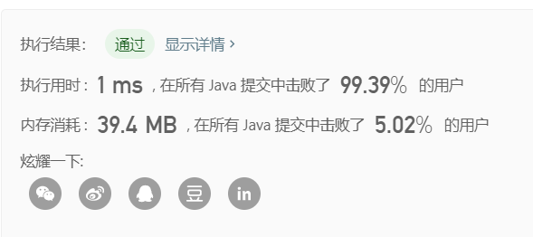

> 原文链接: https://leetcode-cn.com/problems/best-time-to-buy-and-sell-stock-with-cooldown


## 英文原文
<div><p>You are given an array <code>prices</code> where <code>prices[i]</code> is the price of a given stock on the <code>i<sup>th</sup></code> day.</p>

<p>Find the maximum profit you can achieve. You may complete as many transactions as you like (i.e., buy one and sell one share of the stock multiple times) with the following restrictions:</p>

<ul>
	<li>After you sell your stock, you cannot buy stock on the next day (i.e., cooldown one day).</li>
</ul>

<p><strong>Note:</strong> You may not engage in multiple transactions simultaneously (i.e., you must sell the stock before you buy again).</p>

<p>&nbsp;</p>
<p><strong>Example 1:</strong></p>

<pre>
<strong>Input:</strong> prices = [1,2,3,0,2]
<strong>Output:</strong> 3
<strong>Explanation:</strong> transactions = [buy, sell, cooldown, buy, sell]
</pre>

<p><strong>Example 2:</strong></p>

<pre>
<strong>Input:</strong> prices = [1]
<strong>Output:</strong> 0
</pre>

<p>&nbsp;</p>
<p><strong>Constraints:</strong></p>

<ul>
	<li><code>1 &lt;= prices.length &lt;= 5000</code></li>
	<li><code>0 &lt;= prices[i] &lt;= 1000</code></li>
</ul>
</div>

## 中文题目
<div><p>给定一个整数数组，其中第<em>&nbsp;i</em>&nbsp;个元素代表了第&nbsp;<em>i</em>&nbsp;天的股票价格 。​</p>

<p>设计一个算法计算出最大利润。在满足以下约束条件下，你可以尽可能地完成更多的交易（多次买卖一支股票）:</p>

<ul>
	<li>你不能同时参与多笔交易（你必须在再次购买前出售掉之前的股票）。</li>
	<li>卖出股票后，你无法在第二天买入股票 (即冷冻期为 1 天)。</li>
</ul>

<p><strong>示例:</strong></p>

<pre><strong>输入:</strong> [1,2,3,0,2]
<strong>输出: </strong>3 
<strong>解释:</strong> 对应的交易状态为: [买入, 卖出, 冷冻期, 买入, 卖出]</pre>
</div>

## 通过代码
<RecoDemo>
</RecoDemo>


## 高赞题解
### 解题思路


前言：*不要关注冷冻期！不要关注冷冻期！不要关注冷冻期！*
      *只关注卖出的那一天！只关注卖出的那一天！只关注卖出的那一天！*
题目中定义的“冷冻期”=卖出的那一天的后一天，题目设置冷冻期的意思是，如果昨天卖出了，今天不可买入，那么关键在于哪一天卖出，**只要在今天想买入的时候判断一下前一天是不是刚卖出，即可**，所以关键的一天其实是卖出的那一天，而不是卖出的后一天

正文：
因为当天卖出股票实际上也是属于“不持有”的状态，那么第i天如果不持有，那**这个“不持有”就有了两种状态**：1.**本来就不持有**，指不是因为当天卖出了才不持有的；2.第i天**因为卖出了股票才变得不持有**

而持有股票依旧只有一种状态

所以对于每一天i，都有可能是三种状态：
0.**不持股且当天没卖出**,定义其最大收益dp[i][0];
1.持股,定义其最大收益dp[i][1]；
2.**不持股且当天卖出了**，定义其最大收益dp[i][2]；

初始化：
dp[0][0]=0;//本来就不持有，啥也没干
dp[0][1]=-1*prices[0];//第0天只买入
dp[0][2]=0;//可以理解成第0天买入又卖出，那么第0天就是“不持股且当天卖出了”这个状态了，其收益为0，所以初始化为0是合理的

重头戏：

一、第i天不持股且没卖出的状态dp[i][0]，也就是我没有股票，而且还不是因为我卖了它才没有的，那换句话说是从i-1天到第i天转移时，它压根就没给我股票！所以**i-1天一定也是不持有**，那就是不持有的两种可能：i-1天不持股且当天没有卖出dp[i-1][0]；i-1天不持股但是当天卖出去了dp[i-1][2]；
        所以： dp[i][0]=max(dp[i-1][0],dp[i-1][2])
       
二、第i天持股dp[i][1]，今天我持股，来自两种可能：
        1、要么是昨天我就持股，今天继承昨天的，也就是dp[i-1][1]，这种可能很好理解；
        2、要么：是昨天我不持股，今天我买入的，但前提是昨天我一定没卖！因为如果昨天我卖了，那么今天我不能交易！也就是题目中所谓“冷冻期”的含义，只有昨天是“**不持股且当天没卖出**”这个状态，我今天才能买入！所以是dp[i-1][0]-p[i]
        所以： dp[i][1]=max(dp[i-1][1],dp[i-1][0]-p[i])
        
三、i天不持股且当天卖出了，这种就简单了，那就是说昨天我一定是持股的，要不然我今天拿什么卖啊，而持股只有一种状态，昨天持股的收益加上今天卖出得到的新收益，就是dp[i-1][1]+p[i]啦
        所以：dp[i][2]=dp[i-1][1]+p[i]
        
总结：最后一天的最大收益有两种可能，而且一定是“不持有”状态下的两种可能，把这两种“不持有”比较一下大小，返回即可


如果帮到你了求个赞
### 代码

```java
class Solution {
    public int maxProfit(int[] prices) {
        int n=prices.length;
        if(n<=1) return 0;


        //，
        //
        //
        //
        //
        //
        int [][] dp=new int[n][3];
        dp[0][0]=0;
        dp[0][1]=-1*prices[0];
        dp[0][2]=0;

       

        for(int i=1;i<n;i++){//从[1]...[n-1]
          dp[i][0]=Math.max(dp[i-1][0],dp[i-1][2]);
            dp[i][1]=Math.max(dp[i-1][1],dp[i-1][0]-prices[i]);
            dp[i][2]=dp[i-1][1]+prices[i];

        }


        return Math.max(dp[n-1][0],dp[n-1][2]);

       
       

    }
}
```

## 统计信息
| 通过次数 | 提交次数 | AC比率 |
| :------: | :------: | :------: |
|    128925    |    209633    |   61.5%   |

## 提交历史
| 提交时间 | 提交结果 | 执行时间 |  内存消耗  | 语言 |
| :------: | :------: | :------: | :--------: | :--------: |


## 相似题目
|                             题目                             | 难度 |
| :----------------------------------------------------------: | :---------: |
| [买卖股票的最佳时机](https://leetcode-cn.com/problems/best-time-to-buy-and-sell-stock/) | 简单|
| [买卖股票的最佳时机 II](https://leetcode-cn.com/problems/best-time-to-buy-and-sell-stock-ii/) | 中等|
