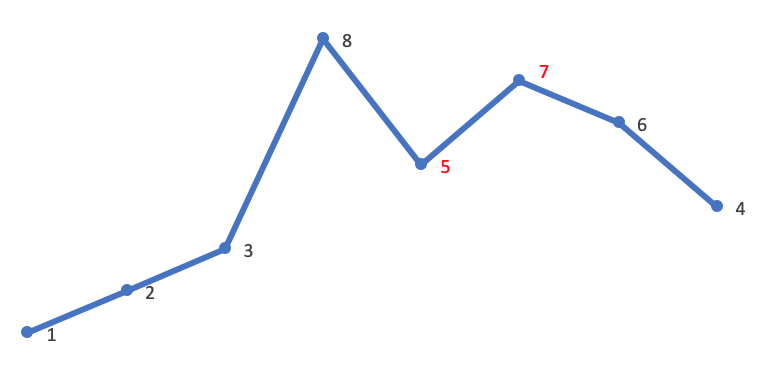

> 原文链接: https://leetcode-cn.com/problems/next-permutation


## 英文原文
<div><p>Implement <strong>next permutation</strong>, which rearranges numbers into the lexicographically next greater permutation of numbers.</p>

<p>If such an arrangement is not possible, it must rearrange it as the lowest possible order (i.e., sorted in ascending order).</p>

<p>The replacement must be <strong><a href="http://en.wikipedia.org/wiki/In-place_algorithm" target="_blank">in place</a></strong> and use only constant&nbsp;extra memory.</p>

<p>&nbsp;</p>
<p><strong>Example 1:</strong></p>
<pre><strong>Input:</strong> nums = [1,2,3]
<strong>Output:</strong> [1,3,2]
</pre><p><strong>Example 2:</strong></p>
<pre><strong>Input:</strong> nums = [3,2,1]
<strong>Output:</strong> [1,2,3]
</pre><p><strong>Example 3:</strong></p>
<pre><strong>Input:</strong> nums = [1,1,5]
<strong>Output:</strong> [1,5,1]
</pre><p><strong>Example 4:</strong></p>
<pre><strong>Input:</strong> nums = [1]
<strong>Output:</strong> [1]
</pre>
<p>&nbsp;</p>
<p><strong>Constraints:</strong></p>

<ul>
	<li><code>1 &lt;= nums.length &lt;= 100</code></li>
	<li><code>0 &lt;= nums[i] &lt;= 100</code></li>
</ul>
</div>

## 中文题目
<div><p>实现获取 <strong>下一个排列</strong> 的函数，算法需要将给定数字序列重新排列成字典序中下一个更大的排列（即，组合出下一个更大的整数）。</p>

<p>如果不存在下一个更大的排列，则将数字重新排列成最小的排列（即升序排列）。</p>

<p>必须<strong><a href="https://baike.baidu.com/item/%E5%8E%9F%E5%9C%B0%E7%AE%97%E6%B3%95" target="_blank"> 原地 </a></strong>修改，只允许使用额外常数空间。</p>

<p>&nbsp;</p>

<p><strong>示例 1：</strong></p>

<pre>
<strong>输入：</strong>nums = [1,2,3]
<strong>输出：</strong>[1,3,2]
</pre>

<p><strong>示例 2：</strong></p>

<pre>
<strong>输入：</strong>nums = [3,2,1]
<strong>输出：</strong>[1,2,3]
</pre>

<p><strong>示例 3：</strong></p>

<pre>
<strong>输入：</strong>nums = [1,1,5]
<strong>输出：</strong>[1,5,1]
</pre>

<p><strong>示例 4：</strong></p>

<pre>
<strong>输入：</strong>nums = [1]
<strong>输出：</strong>[1]
</pre>

<p>&nbsp;</p>

<p><strong>提示：</strong></p>

<ul>
	<li><code>1 &lt;= nums.length &lt;= 100</code></li>
	<li><code>0 &lt;= nums[i] &lt;= 100</code></li>
</ul>
</div>

## 通过代码
<RecoDemo>
</RecoDemo>


## 高赞题解
## 下一个排列

### 问题描述
这道题是 [LeetCode 31题](https://leetcode-cn.com/problems/next-permutation/)。

“下一个排列”的定义是：给定数字序列的字典序中下一个更大的排列。如果不存在下一个更大的排列，则将数字重新排列成最小的排列（即升序排列）。

我们可以将该问题形式化地描述为：给定若干个数字，将其组合为一个整数。如何将这些数字重新排列，以得到下一个更大的整数。如 `123` 下一个更大的数为 `132`。如果没有更大的整数，则输出最小的整数。

以 `1,2,3,4,5,6` 为例，其排列依次为：
```
123456
123465
123546
...
654321
```

可以看到有这样的关系：`123456 < 123465 < 123546 < ... < 654321`。

### 算法推导
如何得到这样的排列顺序？这是本文的重点。我们可以这样来分析：
1. 我们希望下一个数**比当前数大**，这样才满足“下一个排列”的定义。因此只需要**将后面的「大数」与前面的「小数」交换**，就能得到一个更大的数。比如 `123456`，将 `5` 和 `6` 交换就能得到一个更大的数 `123465`。
2. 我们还希望下一个数**增加的幅度尽可能的小**，这样才满足“下一个排列与当前排列紧邻“的要求。为了满足这个要求，我们需要：
    1. 在**尽可能靠右的低位**进行交换，需要**从后向前**查找
    2. 将一个 **尽可能小的「大数」** 与前面的「小数」交换。比如 `123465`，下一个排列应该把 `5` 和 `4` 交换而不是把 `6` 和 `4` 交换
    3. 将「大数」换到前面后，需要将「大数」后面的所有数**重置为升序**，**升序排列就是最小的排列**。以 `123465` 为例：首先按照上一步，交换 `5` 和 `4`，得到 `123564`；然后需要将 `5` 之后的数重置为升序，得到 `123546`。显然 `123546` 比 `123564` 更小，`123546` 就是 `123465` 的下一个排列

以上就是求“下一个排列”的分析过程。

### 算法过程
标准的“下一个排列”算法可以描述为：
1. **从后向前**查找第一个**相邻升序**的元素对 `(i,j)`，满足 `A[i] < A[j]`。此时 `[j,end)` 必然是降序
2. 在 `[j,end)` **从后向前**查找第一个满足 `A[i] < A[k]` 的 `k`。`A[i]`、`A[k]` 分别就是上文所说的「小数」、「大数」
3. 将 `A[i]` 与 `A[k]` 交换
4. 可以断定这时 `[j,end)` 必然是降序，逆置 `[j,end)`，使其升序
5. 如果在步骤 1 找不到符合的相邻元素对，说明当前 `[begin,end)` 为一个降序顺序，则直接跳到步骤 4

该方法支持数据重复，且在 C++ STL 中被采用。

### 代码
```go
func nextPermutation(nums []int) {
	if len(nums) <= 1 {
		return
	}

	i, j, k := len(nums)-2, len(nums)-1, len(nums)-1

	// find: A[i]<A[j]
	for i >= 0 && nums[i] >= nums[j] {
		i--
		j--
	}

	if i >= 0 { // 不是最后一个排列
		// find: A[i]<A[k]
		for nums[i] >= nums[k] {
			k--
		}
		// swap A[i], A[k]
		nums[i], nums[k] = nums[k], nums[i]
	}

	// reverse A[j:end]
	for i, j := j, len(nums)-1; i < j; i, j = i+1, j-1 {
		nums[i], nums[j] = nums[j], nums[i]
	}
}
```


### 可视化
以求 `12385764` 的下一个排列为例：


首先从后向前查找第一个相邻升序的元素对 `(i,j)`。这里 `i=4`，`j=5`，对应的值为 `5`，`7`：



然后在 `[j,end)` 从后向前查找第一个大于 `A[i]` 的值 `A[k]`。这里 `A[i]` 是 `5`，故 `A[k]` 是 `6`：


将 `A[i]` 与 `A[k]` 交换。这里交换 `5`、`6`：


这时 `[j,end)` 必然是降序，逆置 `[j,end)`，使其升序。这里逆置 `[7,5,4]`：


因此，`12385764` 的下一个排列就是 `12386457`。

最后再可视化地对比一下这两个相邻的排列（橙色是蓝色的下一个排列）：


## 统计信息
| 通过次数 | 提交次数 | AC比率 |
| :------: | :------: | :------: |
|    234651    |    629784    |   37.3%   |

## 提交历史
| 提交时间 | 提交结果 | 执行时间 |  内存消耗  | 语言 |
| :------: | :------: | :------: | :--------: | :--------: |


## 相似题目
|                             题目                             | 难度 |
| :----------------------------------------------------------: | :---------: |
| [全排列](https://leetcode-cn.com/problems/permutations/) | 中等|
| [全排列 II](https://leetcode-cn.com/problems/permutations-ii/) | 中等|
| [排列序列](https://leetcode-cn.com/problems/permutation-sequence/) | 困难|
| [回文排列 II](https://leetcode-cn.com/problems/palindrome-permutation-ii/) | 中等|
