> 原文链接: https://leetcode-cn.com/problems/verify-preorder-serialization-of-a-binary-tree


## 英文原文
<div><p>One way to serialize a binary tree is to use <strong>preorder traversal</strong>. When we encounter a non-null node, we record the node&#39;s value. If it is a null node, we record using a sentinel value such as <code>&#39;#&#39;</code>.</p>

<p>For example, the above binary tree can be serialized to the string <code>&quot;9,3,4,#,#,1,#,#,2,#,6,#,#&quot;</code>, where <code>&#39;#&#39;</code> represents a null node.</p>

<p>Given a string of comma-separated values <code>preorder</code>, return <code>true</code> if it is a correct preorder traversal serialization of a binary tree.</p>

<p>It is <strong>guaranteed</strong> that each comma-separated value in the string must be either an integer or a character <code>&#39;#&#39;</code> representing null pointer.</p>

<p>You may assume that the input format is always valid.</p>

<ul>
	<li>For example, it could never contain two consecutive commas, such as <code>&quot;1,,3&quot;</code>.</li>
</ul>

<p><strong>Note:&nbsp;</strong>You are not allowed to reconstruct the tree.</p>

<p>&nbsp;</p>
<p><strong>Example 1:</strong></p>
<pre><strong>Input:</strong> preorder = "9,3,4,#,#,1,#,#,2,#,6,#,#"
<strong>Output:</strong> true
</pre><p><strong>Example 2:</strong></p>
<pre><strong>Input:</strong> preorder = "1,#"
<strong>Output:</strong> false
</pre><p><strong>Example 3:</strong></p>
<pre><strong>Input:</strong> preorder = "9,#,#,1"
<strong>Output:</strong> false
</pre>
<p>&nbsp;</p>
<p><strong>Constraints:</strong></p>

<ul>
	<li><code>1 &lt;= preorder.length &lt;= 10<sup>4</sup></code></li>
	<li><code>preorder</code> consist of integers in the range <code>[0, 100]</code> and <code>&#39;#&#39;</code> separated by commas <code>&#39;,&#39;</code>.</li>
</ul>
</div>

## 中文题目
<div><p>序列化二叉树的一种方法是使用前序遍历。当我们遇到一个非空节点时，我们可以记录下这个节点的值。如果它是一个空节点，我们可以使用一个标记值记录，例如 <code>#</code>。</p>

<pre>     _9_
    /   \
   3     2
  / \   / \
 4   1  #  6
/ \ / \   / \
# # # #   # #
</pre>

<p>例如，上面的二叉树可以被序列化为字符串 <code>&quot;9,3,4,#,#,1,#,#,2,#,6,#,#&quot;</code>，其中 <code>#</code> 代表一个空节点。</p>

<p>给定一串以逗号分隔的序列，验证它是否是正确的二叉树的前序序列化。编写一个在不重构树的条件下的可行算法。</p>

<p>每个以逗号分隔的字符或为一个整数或为一个表示 <code>null</code> 指针的 <code>&#39;#&#39;</code> 。</p>

<p>你可以认为输入格式总是有效的，例如它永远不会包含两个连续的逗号，比如&nbsp;<code>&quot;1,,3&quot;</code> 。</p>

<p><strong>示例 1:</strong></p>

<pre><strong>输入: </strong><code>&quot;9,3,4,#,#,1,#,#,2,#,6,#,#&quot;</code>
<strong>输出: </strong><code>true</code></pre>

<p><strong>示例&nbsp;2:</strong></p>

<pre><strong>输入: </strong><code>&quot;1,#&quot;</code>
<strong>输出: </strong><code>false</code>
</pre>

<p><strong>示例 3:</strong></p>

<pre><strong>输入: </strong><code>&quot;9,#,#,1&quot;</code>
<strong>输出: </strong><code>false</code></pre>
</div>

## 通过代码
<RecoDemo>
</RecoDemo>


## 高赞题解
各位题友大家好！ 今天是 **[@负雪明烛](/u/fuxuemingzhu/)** 坚持日更的第 **47** 天。今天力扣上的每日一题是「[331. 验证二叉树的前序序列化](https://leetcode-cn.com/problems/verify-preorder-serialization-of-a-binary-tree/)」。

# 解题思路

今天题目要我们验证输入字符串是否是有效的二叉树的前序序列化，力扣的二叉树题目的输入都是这种格式的。

本文使用两种方法解决：


1. 栈
2. 计算入度出度


## 方法一：栈


栈的思路是「自底向上」的想法。下面要结合本题是「**前序遍历**」这个重要特点。


我们知道「前序遍历」是按照「**根节点-左子树-右子树**」的顺序遍历的，只有当根节点的所有左子树遍历完成之后，才会遍历右子树。对于本题的输入，我们可以先判断「**左子树**」是否有效的，然后再判断「**右子树**」是否有效的，最后判断「**根节点-左子树-右子树**」是否为有效的。这个思路类似于递归，而把递归改写成循环时，就会使用「栈」，这就是本题使用「栈」的原因。


下面的重点是如何判断一棵子树是否有效？首先考虑最简单情况：怎么判断一个节点是叶子节点？很明显，当一个节点的两个孩子都是 `"#"`（空）的时候，该节点就是叶子节点。


当一个节点不是叶子节点的时候，那么它必定至少有一个孩子非空！有两种情况：

- 两个孩子都非`"#"`（空）；
- 一个孩子为`"#"`（空），另一个孩子非`"#"`（空）；


为了兼容这两个情况，我们想出了本题的一个重磅级的技巧：**把有效的叶子节点使用 `"#"` 代替。** 比如把 `4##` 替换成 `#` 。此时，**叶子节点会变成空节点**！


具体操作流程示例如下：


如输入： `"9,3,4,#,#,1,#,#,2,#,6,#,#"` ，当遇到 `x,#,#` 的时候，就把它变为 `#`。


模拟一遍过程：


1. `[9,3,4,#,#] => [9,3,#]`，继续
2. `[9,3,#,1,#,#] => [9,3,#,#] => [9,#]` ，继续
3. `[9,#2,#,6,#,#] => [9,#,2,#,#] => [9,#,#] => [#]`，结束


下面的动画模拟了`"9,3,4,#,#,1,#,#,#"`的操作过程：


PPT 如下，可以逐步点击观看：


 
<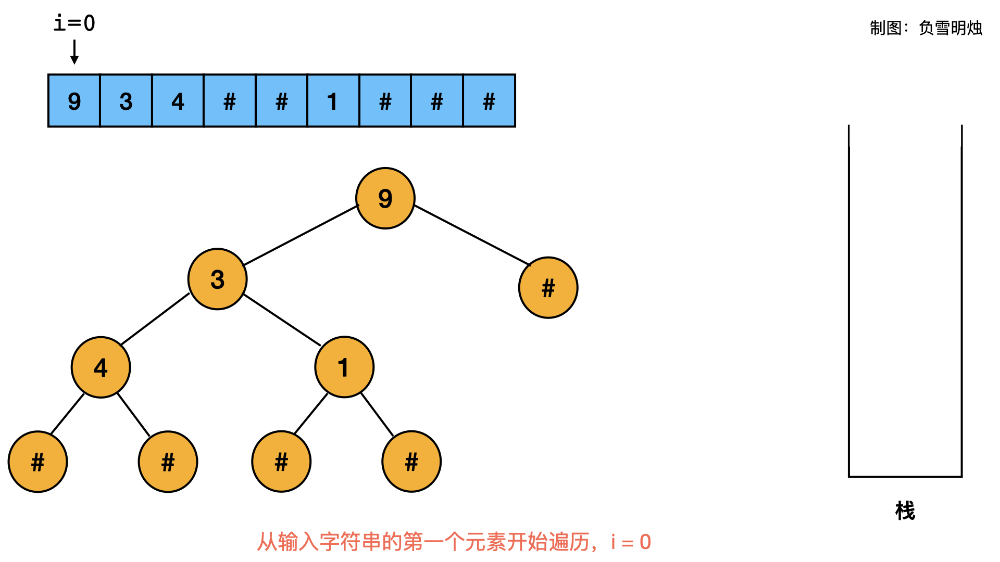,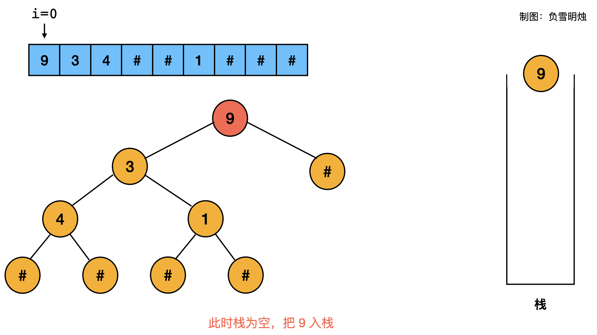,,,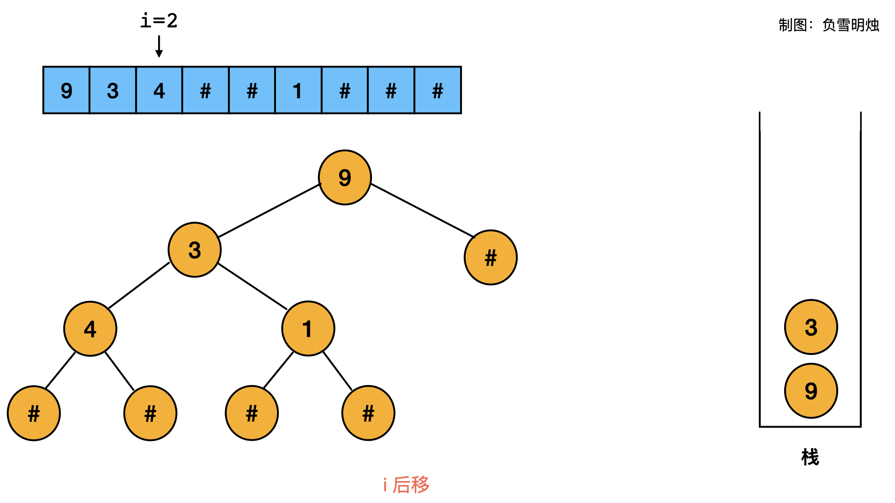,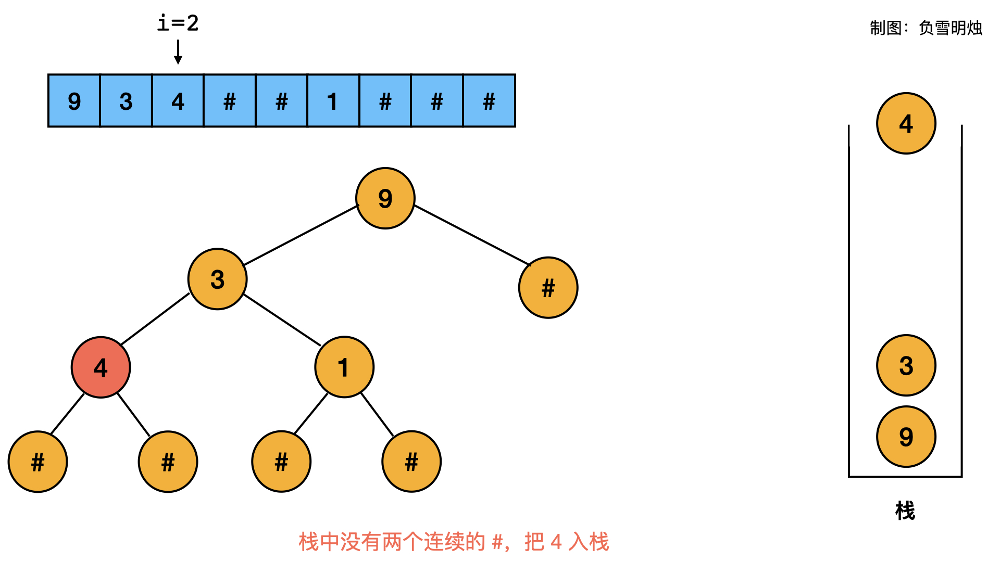,,,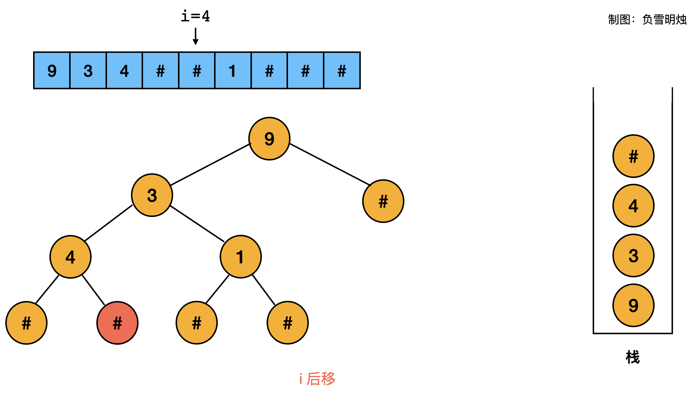,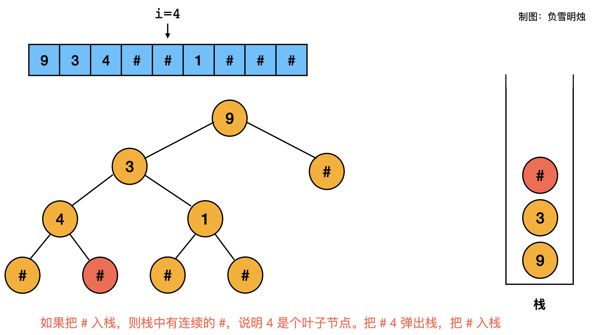,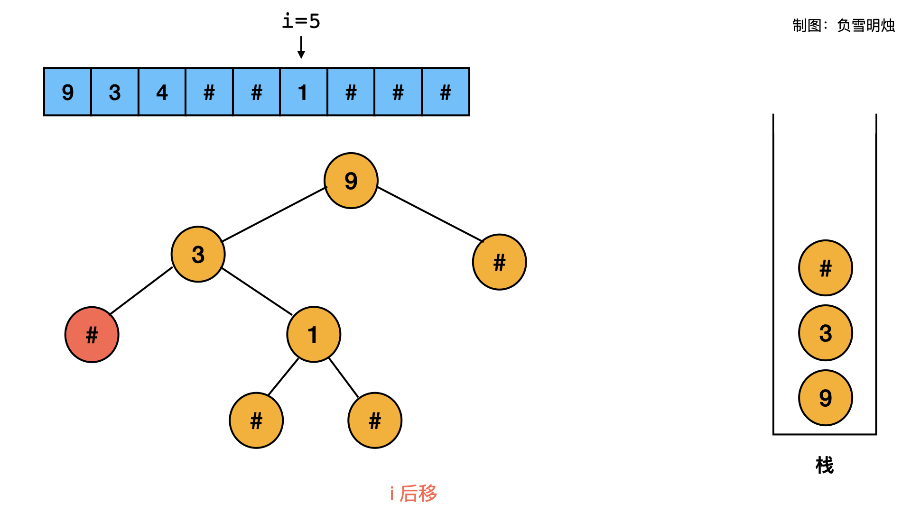,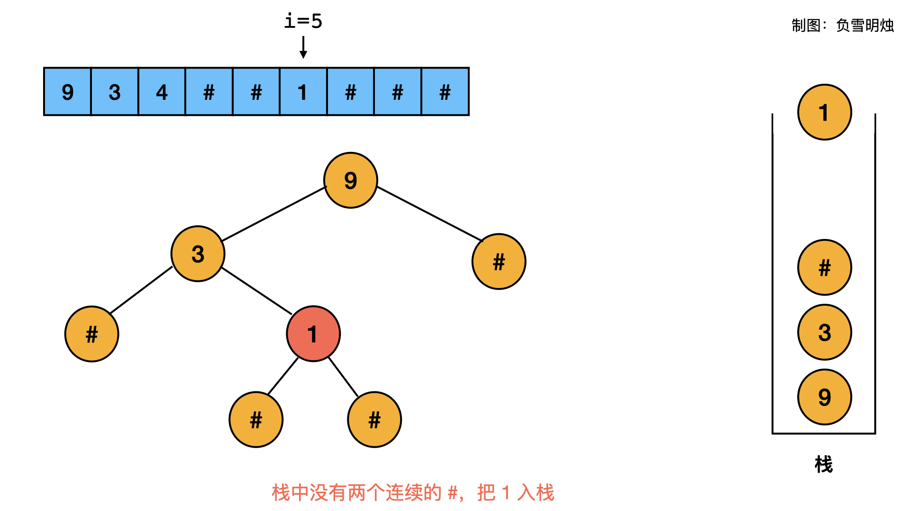,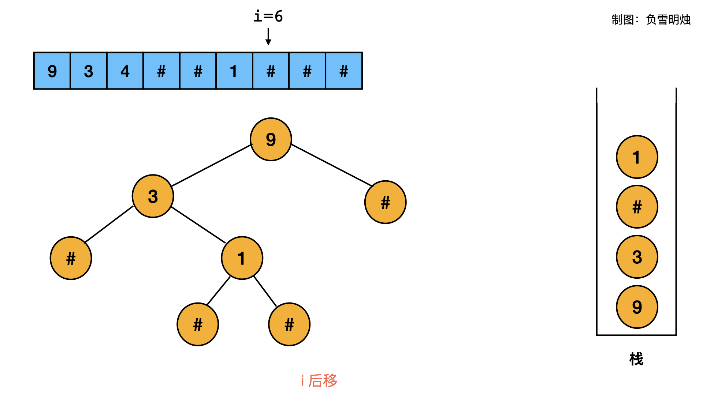,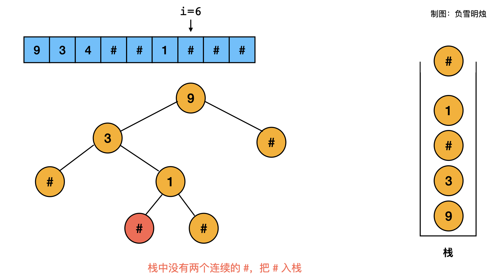,,,,,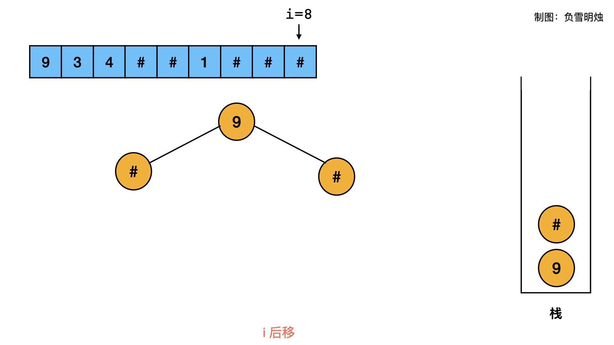,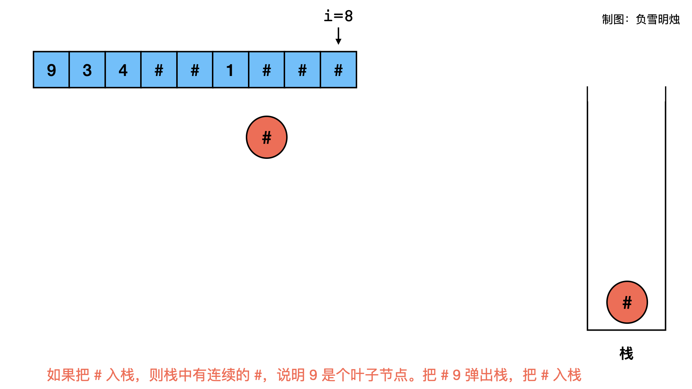,,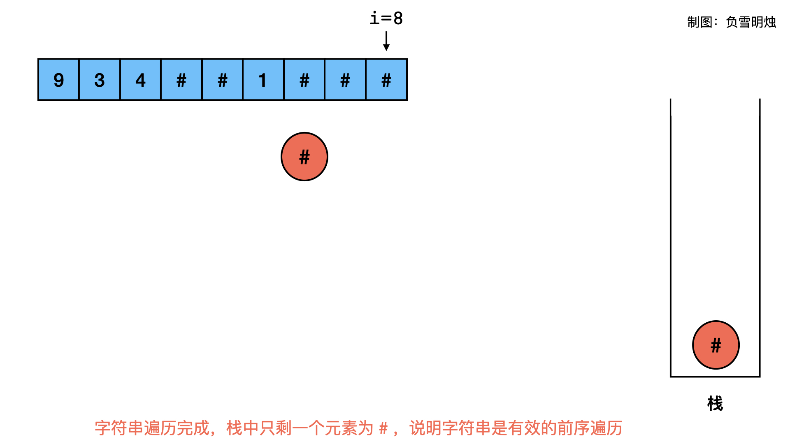>


这个操作流程完美结合了「**栈**」和「**前序遍历**」的特性，完美！代码如下：


```Python []
class Solution(object):
    def isValidSerialization(self, preorder):
        stack = []
        for node in preorder.split(','):
            stack.append(node)
            while len(stack) >= 3 and stack[-1] == stack[-2] == '#' and stack[-3] != '#':
                stack.pop(), stack.pop(), stack.pop()
                stack.append('#')
        return len(stack) == 1 and stack.pop() == '#'
```


- 时间复杂度：$O(N)$
- 空间复杂度：$O(N)$


## 方法二：计算入度出度

背景知识：

- **入度**：有多少个节点指向它；
- **出度**：它指向多少个节点。

我们知道在树（甚至图）中，**所有节点的入度之和等于出度之和**。可以根据这个特点判断输入序列是否为有效的！


在一棵二叉树中：


- 每个空节点（ `"#"` ）会提供 0 个出度和 1 个入度。
- 每个非空节点会提供 2 个出度和 1 个入度（根节点的入度是 0）。


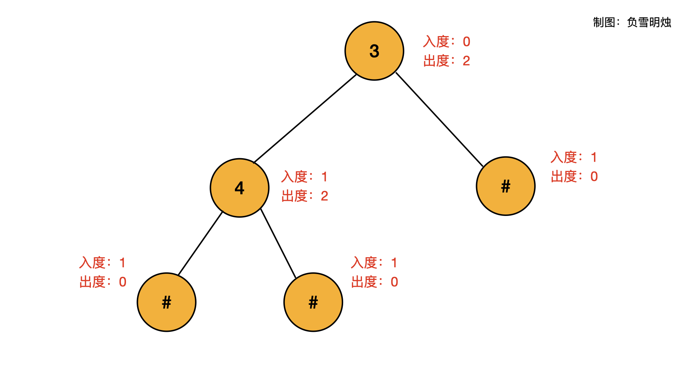


我们只要把字符串遍历一次，每个节点都累加 `diff = 出度 - 入度` 。在遍历到任何一个节点的时候，要求`diff >= 0`，原因是还没遍历到该节点的子节点，所以此时的出度应该大于等于入度。当所有节点遍历完成之后，整棵树的 `diff == 0` 。 

这里解释一下为什么下面的代码中 diff 的初始化为 1。因为，我们加入一个非空节点时，都会对 diff 先减去 1（入度），再加上 2（出度）。但是由于根节点没有父节点，所以其入度为 0，出度为 2。因此 diff 初始化为 1，是为了在加入根节点的时候，diff 先减去 1（入度），再加上 2（出度），此时 diff 正好应该是2.

```Python []
class Solution(object):
    def isValidSerialization(self, preorder):
        nodes = preorder.split(',')
        diff = 1
        for node in nodes:
            diff -= 1
            if diff < 0:
                return False
            if node != '#':
                diff += 2
        return diff == 0
```

- 时间复杂度：$O(N)$
- 空间复杂度：$O(1)$


# 刷题心得


这个题是真的不错，特别是把二叉树的题目和「栈」的应用完美结合，给我很大启发。


参考资料：[细语呢喃](https://www.hrwhisper.me/leetcode-verify-preorder-serialization-of-a-binary-tree/)


-----


OK，以上就是 [@负雪明烛](https://leetcode-cn.com/u/fuxuemingzhu/) 写的今天题解的全部内容了，如果你觉得有帮助的话，**求赞、求关注、求收藏**。如果有疑问的话，请在下面评论，我会及时解答。


**关注我**，你将不会错过我的精彩动画题解、面试题分享、组队刷题活动，进入主页 [@负雪明烛](https://leetcode-cn.com/u/fuxuemingzhu/) 右侧有刷题组织，从此刷题不再孤单。


祝大家 AC 多多，Offer 多多！我们明天再见！

## 统计信息
| 通过次数 | 提交次数 | AC比率 |
| :------: | :------: | :------: |
|    46373    |    96800    |   47.9%   |

## 提交历史
| 提交时间 | 提交结果 | 执行时间 |  内存消耗  | 语言 |
| :------: | :------: | :------: | :--------: | :--------: |
