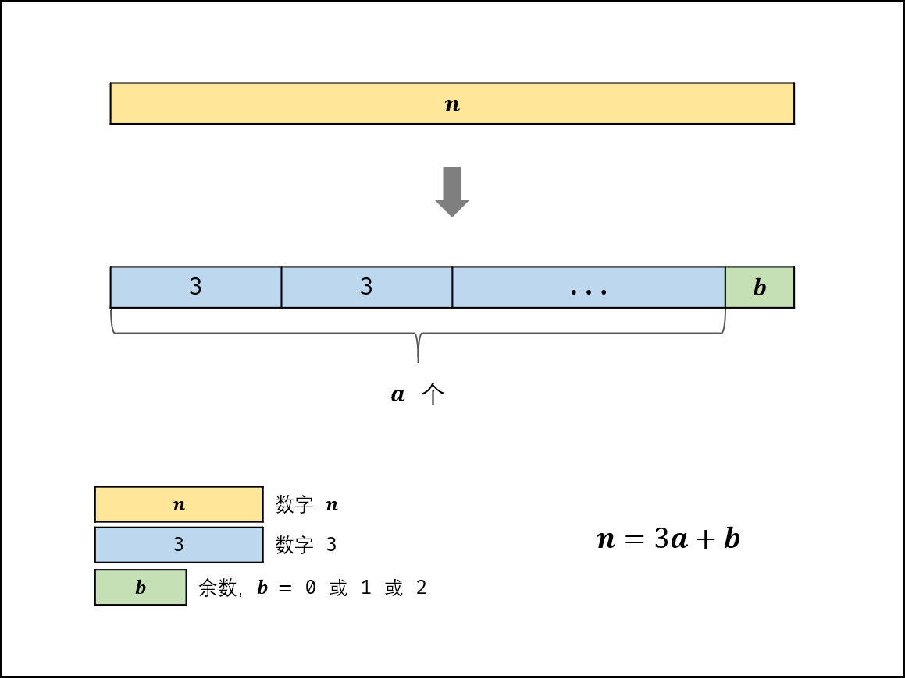

> 原文链接: https://leetcode-cn.com/problems/integer-break


## 英文原文
<div><p>Given an integer <code>n</code>, break it into the sum of <code>k</code> <strong>positive integers</strong>, where <code>k &gt;= 2</code>, and maximize the product of those integers.</p>

<p>Return <em>the maximum product you can get</em>.</p>

<p>&nbsp;</p>
<p><strong>Example 1:</strong></p>

<pre>
<strong>Input:</strong> n = 2
<strong>Output:</strong> 1
<strong>Explanation:</strong> 2 = 1 + 1, 1 &times; 1 = 1.
</pre>

<p><strong>Example 2:</strong></p>

<pre>
<strong>Input:</strong> n = 10
<strong>Output:</strong> 36
<strong>Explanation:</strong> 10 = 3 + 3 + 4, 3 &times; 3 &times; 4 = 36.
</pre>

<p>&nbsp;</p>
<p><strong>Constraints:</strong></p>

<ul>
	<li><code>2 &lt;= n &lt;= 58</code></li>
</ul>
</div>

## 中文题目
<div><p>给定一个正整数&nbsp;<em>n</em>，将其拆分为<strong>至少</strong>两个正整数的和，并使这些整数的乘积最大化。 返回你可以获得的最大乘积。</p>

<p><strong>示例 1:</strong></p>

<pre><strong>输入: </strong>2
<strong>输出: </strong>1
<strong>解释: </strong>2 = 1 + 1, 1 &times; 1 = 1。</pre>

<p><strong>示例&nbsp;2:</strong></p>

<pre><strong>输入: </strong>10
<strong>输出: </strong>36
<strong>解释: </strong>10 = 3 + 3 + 4, 3 &times;&nbsp;3 &times;&nbsp;4 = 36。</pre>

<p><strong>说明: </strong>你可以假设&nbsp;<em>n&nbsp;</em>不小于 2 且不大于 58。</p>
</div>

## 通过代码
<RecoDemo>
</RecoDemo>


## 高赞题解
#### 解题思路：

- 设将整数 $n$ 拆分为 $a$ 个小数字：

$$
n = n_1 + n_2 + ... + n_a
$$

- 本题等价于求解：

$$
\max(n_1 \times n_2 \times ... \times n_a)
$$

> 以下数学推导总体分为两步：① 当所有拆分出的数字相等时，乘积最大。② 最优拆分数字为 $3$ 。

##### 数学推导：

- 以下公式为“算术几何均值不等式” ，等号当且仅当 $n_1 = n_2 = ... = n_a$ 时成立。

$$
\frac{n_1 + n_2 + ... + n_a}{a} \geq \sqrt[a]{n_1 n_2 ... n_a}
$$

> **推论一：** 若拆分的数量 $a$ 确定， 则 **各拆分数字相等时** ，乘积最大。

- 设将数字以因子 $x$ 等分为 $a$ 个，即 $n = ax$ ，则乘积为 $x^a$ 。观察以下公式，由于 $n$ 为常数，因此当 $x^{\frac{1}{x}}$ 取最大值时， 乘积达到最大值。

$$
x^a = x^{\frac{n}{x}} = (x^{\frac{1}{x}})^n
$$

- 根据分析，可将问题转化为求 $y = x^{\frac{1}{x}}$ 的极大值，因此对 $x$ 求导数。

$$
\begin{aligned} \ln y & = \frac{1}{x} \ln x & \text{取对数} \\ \frac{1}{y} \dot {y} & = \frac{1}{x^2} - \frac{1}{x^2} \ln x & \text{对 $x$ 求导} \\ & = \frac{1 - \ln x}{x^2} \\ \dot {y} & = \frac{1 - \ln x}{x^2} x^{\frac{1}{x}} & \text{整理得}\end{aligned}
$$

- 令 $\dot {y} = 0$ ，则 $1 - \ln x = 0$ ，易得驻点为 $x_0 = e \approx 2.7$ ；根据以下公式，可知 $x_0$ 为极大值点。

$$
\dot {y}\begin{cases} > 0 & , x \in [- \infty, e) \\ < 0 & , x \in (e, \infty] \\\end{cases}
$$

- 由于因子 $x$ 必须为整数，最接近 $e$ 的整数为 $2$ 或 $3$ 。如下式所示，代入 $x = 2$ 和 $x = 3$ ，得出 $x = 3$ 时，乘积达到最大。

$$
y(3) = 3^{1/3} \approx 1.44 \\
y(2) = 2^{1/2} \approx 1.41
$$

- 口算对比方法：给两数字同时取 $6$ 次方，再对比。

$$
[y(3)]^6 = (3^{1/3})^6 = 9 \\
[y(2)]^6 = (2^{1/2})^6 = 8
$$

> **推论二：** 将数字 $n$ 尽可能以因子 $3$ 等分时，乘积最大。

##### 拆分规则：

1. **最优：** $3$ 。把数字 $n$ 可能拆为多个因子 $3$ ，余数可能为 $0,1,2$ 三种情况。
2. **次优：** $2$ 。若余数为 $2$ ；则保留，不再拆为 $1+1$ 。
3. **最差：** $1$ 。若余数为 $1$ ；则应把一份 $3 + 1$ 替换为 $2 + 2$，因为 $2 \times 2 > 3 \times 1$。

##### 算法流程：

1. 当 $n \leq 3$ 时，按照规则应不拆分，但由于题目要求必须拆分，因此必须拆出一个因子 $1$ ，即返回 $n - 1$ 。
2. 当 $n>3$ 时，求 $n$ 除以 $3$ 的 整数部分 $a$ 和 余数部分 $b$ （即 $n = 3a + b$ ），并分为以下三种情况：
   - 当 $b = 0$ 时，直接返回 $3^a$；
   - 当 $b = 1$ 时，要将一个 $1 + 3$ 转换为 $2+2$，因此返回 $3^{a-1} \times 4$；
   - 当 $b = 2$ 时，返回 $3^a \times 2$。

{:width=600}

##### 复杂度分析：

- **时间复杂度 $O(1)$ ：** 仅有求整、求余、次方运算。
  - [求整和求余运算](https://stackoverflow.com/questions/35189851/time-complexity-of-modulo-operator-in-python)：查阅资料，提到不超过机器数的整数可以看作是 $O(1)$ ；
  - [幂运算](https://stackoverflow.com/questions/32418731/java-math-powa-b-time-complexity)：查阅资料，提到浮点取幂为 $O(1)$ 。
- **空间复杂度 $O(1)$ ：** `a` 和 `b` 使用常数大小额外空间。

#### 代码：

> Python 中常见有三种幂计算函数： **`*`** 和 **`pow()`** 的时间复杂度均为 $O(\log a)$ ；而 **`math.pow()`** 始终调用 C 库的 `pow()` 函数，其执行浮点取幂，时间复杂度为 $O(1)$ 。

```python []
class Solution:
    def integerBreak(self, n: int) -> int:
        if n <= 3: return n - 1
        a, b = n // 3, n % 3
        if b == 0: return int(math.pow(3, a))
        if b == 1: return int(math.pow(3, a - 1) * 4)
        return int(math.pow(3, a) * 2)
```

```java []
class Solution {
    public int integerBreak(int n) {
        if(n <= 3) return n - 1;
        int a = n / 3, b = n % 3;
        if(b == 0) return (int)Math.pow(3, a);
        if(b == 1) return (int)Math.pow(3, a - 1) * 4;
        return (int)Math.pow(3, a) * 2;
    }
}
```

## 统计信息
| 通过次数 | 提交次数 | AC比率 |
| :------: | :------: | :------: |
|    119953    |    197032    |   60.9%   |

## 提交历史
| 提交时间 | 提交结果 | 执行时间 |  内存消耗  | 语言 |
| :------: | :------: | :------: | :--------: | :--------: |
