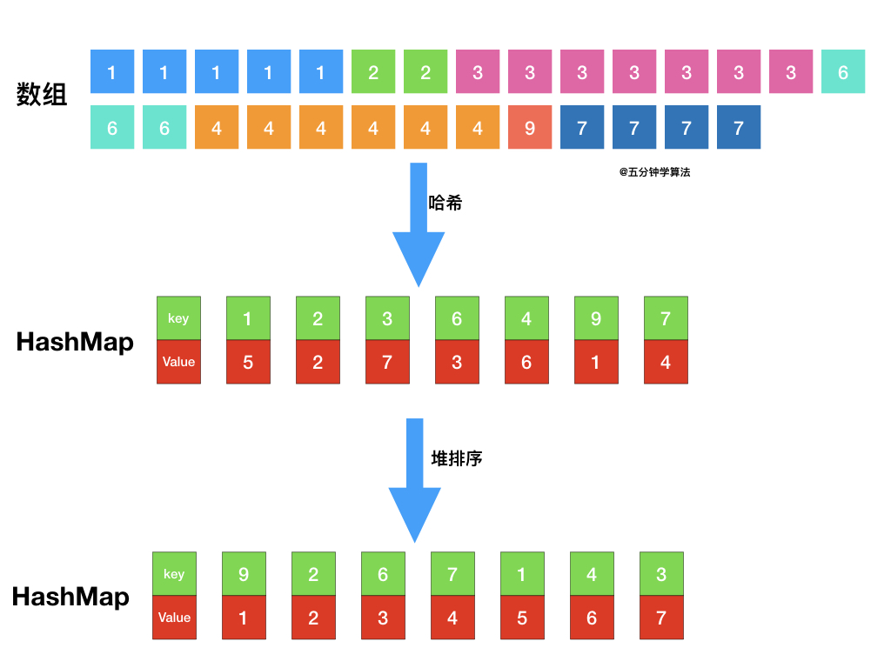

> 原文链接: https://leetcode-cn.com/problems/top-k-frequent-elements


## 英文原文
<div><p>Given an integer array <code>nums</code> and an integer <code>k</code>, return <em>the</em> <code>k</code> <em>most frequent elements</em>. You may return the answer in <strong>any order</strong>.</p>

<p>&nbsp;</p>
<p><strong>Example 1:</strong></p>
<pre><strong>Input:</strong> nums = [1,1,1,2,2,3], k = 2
<strong>Output:</strong> [1,2]
</pre><p><strong>Example 2:</strong></p>
<pre><strong>Input:</strong> nums = [1], k = 1
<strong>Output:</strong> [1]
</pre>
<p>&nbsp;</p>
<p><strong>Constraints:</strong></p>

<ul>
	<li><code>1 &lt;= nums.length &lt;= 10<sup>5</sup></code></li>
	<li><code>k</code> is in the range <code>[1, the number of unique elements in the array]</code>.</li>
	<li>It is <strong>guaranteed</strong> that the answer is <strong>unique</strong>.</li>
</ul>

<p>&nbsp;</p>
<p><strong>Follow up:</strong> Your algorithm&#39;s time complexity must be better than <code>O(n log n)</code>, where n is the array&#39;s size.</p>
</div>

## 中文题目
<div><p>给你一个整数数组 <code>nums</code> 和一个整数 <code>k</code> ，请你返回其中出现频率前 <code>k</code> 高的元素。你可以按 <strong>任意顺序</strong> 返回答案。</p>

<p> </p>

<p><strong>示例 1:</strong></p>

<pre>
<strong>输入: </strong>nums = [1,1,1,2,2,3], k = 2
<strong>输出: </strong>[1,2]
</pre>

<p><strong>示例 2:</strong></p>

<pre>
<strong>输入: </strong>nums = [1], k = 1
<strong>输出: </strong>[1]</pre>

<p> </p>

<p><strong>提示：</strong></p>

<ul>
	<li><code>1 <= nums.length <= 10<sup>5</sup></code></li>
	<li><code>k</code> 的取值范围是 <code>[1, 数组中不相同的元素的个数]</code></li>
	<li>题目数据保证答案唯一，换句话说，数组中前 <code>k</code> 个高频元素的集合是唯一的</li>
</ul>

<p> </p>

<p><strong>进阶：</strong>你所设计算法的时间复杂度 <strong>必须</strong> 优于 <code>O(n log n)</code> ，其中 <code>n</code><em> </em>是数组大小。</p>
</div>

## 通过代码
<RecoDemo>
</RecoDemo>


## 高赞题解

### 解法一：粗暴排序法

最简单粗暴的思路就是 **使用排序算法对元素按照频率由高到低进行排序**，然后再取前 $k$ 个元素。

以下十种排序算法，任你挑选！

{:width=550}
{:align=center}


可以发现，使用常规的诸如 冒泡、选择、甚至快速排序都是不满足题目要求，它们的时间复杂度都是大于或者等于 $O(n log⁡n)$，而题目要求算法的时间复杂度必须优于 $O(n log n)$。

#### 复杂度分析

- **时间复杂度**：$O(nlogn)$，$n$ 表示数组长度。首先，遍历一遍数组统计元素的频率，这一系列操作的时间复杂度是 $O(n)$；接着，排序算法时间复杂度为 $O(nlogn)$；因此整体时间复杂度为 $O(nlogn)$。
- **空间复杂度**：$O(n)$，最极端的情况下（每个元素都不同），用于存储元素及其频率的 Map 需要存储 $n$ 个键值对。

### 解法二：最小堆

题目最终需要返回的是前 $k$ 个频率最大的元素，可以想到借助堆这种数据结构，对于 $k$ 频率之后的元素不用再去处理，进一步优化时间复杂度。

{:width=550}
{:align=center}

具体操作为：

- 借助 **哈希表** 来建立数字和其出现次数的映射，遍历一遍数组统计元素的频率
- 维护一个元素数目为 $k$ 的最小堆
- 每次都将新的元素与堆顶元素（堆中频率最小的元素）进行比较
- 如果新的元素的频率比堆顶端的元素大，则弹出堆顶端的元素，将新的元素添加进堆中
- 最终，堆中的 $k$ 个元素即为前 $k$ 个高频元素


{:width=550}
{:align=center}

代码如下：

```java [-Java]
class Solution {
    public List<Integer> topKFrequent(int[] nums, int k) {
        // 使用字典，统计每个元素出现的次数，元素为键，元素出现的次数为值
        HashMap<Integer,Integer> map = new HashMap();
        for(int num : nums){
            if (map.containsKey(num)) {
               map.put(num, map.get(num) + 1);
             } else {
                map.put(num, 1);
             }
        }
        // 遍历map，用最小堆保存频率最大的k个元素
        PriorityQueue<Integer> pq = new PriorityQueue<>(new Comparator<Integer>() {
            @Override
            public int compare(Integer a, Integer b) {
                return map.get(a) - map.get(b);
            }
        });
        for (Integer key : map.keySet()) {
            if (pq.size() < k) {
                pq.add(key);
            } else if (map.get(key) > map.get(pq.peek())) {
                pq.remove();
                pq.add(key);
            }
        }
        // 取出最小堆中的元素
        List<Integer> res = new ArrayList<>();
        while (!pq.isEmpty()) {
            res.add(pq.remove());
        }
        return res;
    }
}

```

#### 复杂度分析

- **时间复杂度**：$O(nlogk)$，$n$ 表示数组的长度。首先，遍历一遍数组统计元素的频率，这一系列操作的时间复杂度是 $O(n)$；接着，遍历用于存储元素频率的 map，如果元素的频率大于最小堆中顶部的元素，则将顶部的元素删除并将该元素加入堆中，**这里维护堆的数目是 $k$**，所以这一系列操作的时间复杂度是 $O(nlogk)$ 的；因此，总的时间复杂度是 $O(nlog⁡k)$。
- **空间复杂度**：$O(n)$，最坏情况下（每个元素都不同），map 需要存储 $n$ 个键值对，优先队列需要存储 $k$ 个元素，因此，空间复杂度是 $O(n)$。


### 解法三：桶排序法

首先依旧使用哈希表统计频率，统计完成后，创建一个数组，将频率作为数组下标，对于出现频率不同的数字集合，存入对应的数组下标即可。

{:width=550}
{:align=center}

代码实现如下：

```java [-Java]
//基于桶排序求解「前 K 个高频元素」
class Solution {
    public List<Integer> topKFrequent(int[] nums, int k) {
        List<Integer> res = new ArrayList();
        // 使用字典，统计每个元素出现的次数，元素为键，元素出现的次数为值
        HashMap<Integer,Integer> map = new HashMap();
        for(int num : nums){
            if (map.containsKey(num)) {
               map.put(num, map.get(num) + 1);
             } else {
                map.put(num, 1);
             }
        }
        
        //桶排序
        //将频率作为数组下标，对于出现频率不同的数字集合，存入对应的数组下标
        List<Integer>[] list = new List[nums.length+1];
        for(int key : map.keySet()){
            // 获取出现的次数作为下标
            int i = map.get(key);
            if(list[i] == null){
               list[i] = new ArrayList();
            } 
            list[i].add(key);
        }
        
        // 倒序遍历数组获取出现顺序从大到小的排列
        for(int i = list.length - 1;i >= 0 && res.size() < k;i--){
            if(list[i] == null) continue;
            res.addAll(list[i]);
        }
        return res;
    }
}
```

#### 复杂度分析

- **时间复杂度**：$O(n)$，$n$ 表示数组的长度。首先，遍历一遍数组统计元素的频率，这一系列操作的时间复杂度是 $O(n)$；桶的数量为 $n + 1$，所以桶排序的时间复杂度为 $O(n)$；因此，总的时间复杂度是 $O(n)$。 
- **空间复杂度**：很明显为 $O(n)$


## 统计信息
| 通过次数 | 提交次数 | AC比率 |
| :------: | :------: | :------: |
|    218739    |    350938    |   62.3%   |

## 提交历史
| 提交时间 | 提交结果 | 执行时间 |  内存消耗  | 语言 |
| :------: | :------: | :------: | :--------: | :--------: |


## 相似题目
|                             题目                             | 难度 |
| :----------------------------------------------------------: | :---------: |
| [统计词频](https://leetcode-cn.com/problems/word-frequency/) | 中等|
| [数组中的第K个最大元素](https://leetcode-cn.com/problems/kth-largest-element-in-an-array/) | 中等|
| [根据字符出现频率排序](https://leetcode-cn.com/problems/sort-characters-by-frequency/) | 中等|
| [分割数组为连续子序列](https://leetcode-cn.com/problems/split-array-into-consecutive-subsequences/) | 中等|
| [前K个高频单词](https://leetcode-cn.com/problems/top-k-frequent-words/) | 中等|
| [最接近原点的 K 个点](https://leetcode-cn.com/problems/k-closest-points-to-origin/) | 中等|
